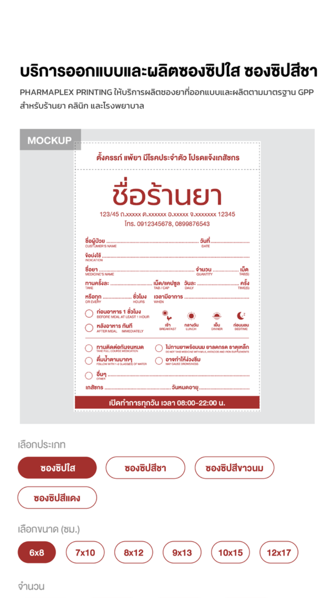
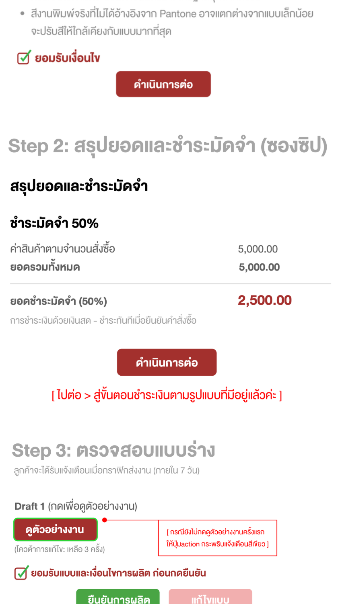
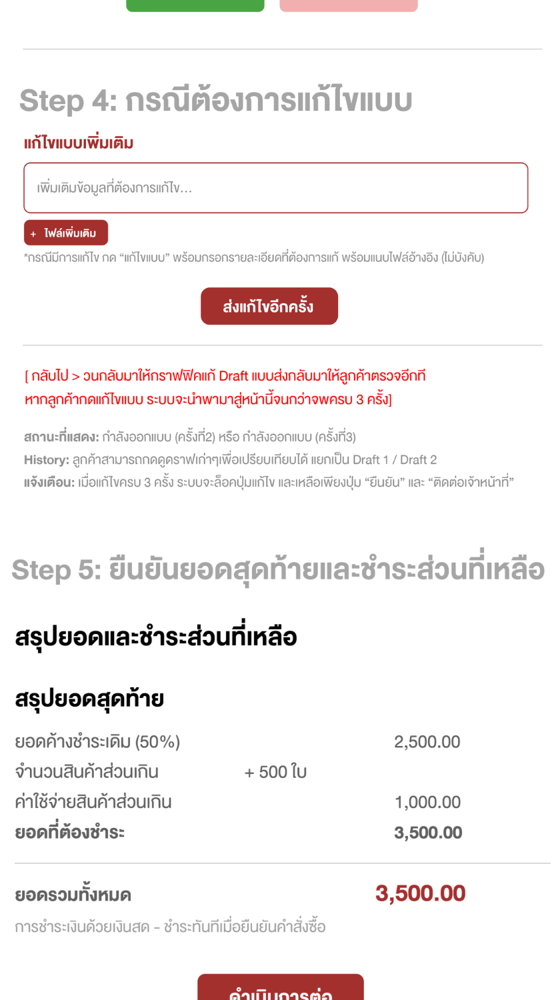
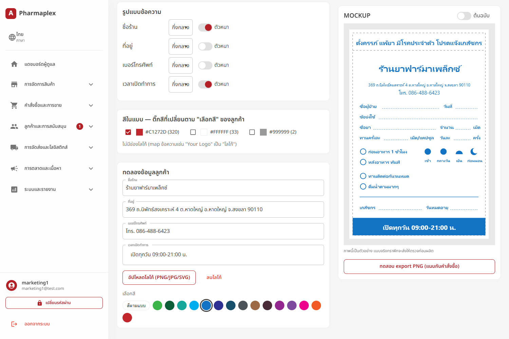
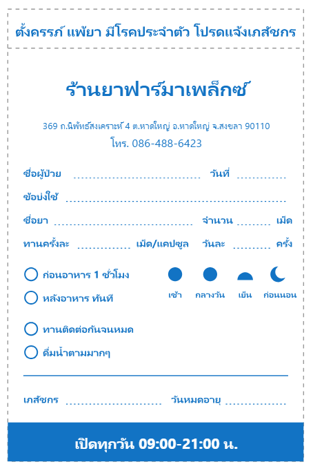

# ข้อกำหนดความต้องการทางเทคนิคและสถาปัตยกรรมระบบ (Master Technical Specification)
## แพลตฟอร์มอีคอมเมิร์ซ Pharmaplex (Pharmaplex E-Commerce System)

ฉบับ: v2.1 · วันที่ปรับปรุง: 2026-10-06 · สถานะ: ฉบับร่างเพื่อตรวจทาน
อ้างอิงการพัฒนาจริง: repo `pmpc` (ไฟล์ `docs/custom-service-preorder-spec.md`) ณ branch `feat/other-services`

---

## 0. บันทึกการปรับปรุงจากฉบับ v2

| ส่วน | สิ่งที่เปลี่ยน | เหตุผล |
|---|---|---|
| 2 (บริการสั่งทำพิเศษ) | เขียนใหม่ทั้งหมดตามที่พัฒนาจริงแล้ว: สถานะ 15 ตัว, โมเดลสินค้าหลายแกนตัวเลือก, ราคาแบบต่อหน่วย/ต่อ ตร.ม., ค่าบล็อค, ช่องข้อมูลร้านที่แอดมินกำหนดเอง, Mockup จากไฟล์ .ai | ฉบับเดิมเป็นแบบร่างก่อนพัฒนา ตอนนี้มีการตัดสินใจเพิ่มเติมแล้ว |
| 2 การแจ้งเตือนทีมงาน | เปลี่ยนจาก Line API เป็น **Discord webhook** สำหรับทีมงานภายใน (Decision 18) | เลือกใช้ Discord ในเฟสแรก Line API ยังเป็นตัวเลือกในอนาคต |
| 2 การแจ้งเตือนลูกค้า | **ไม่แจ้งลูกค้าผ่าน Line/อีเมล** ลูกค้าเปิดดูสถานะในเว็บเท่านั้น | ตามการตัดสินใจของผู้ใช้ (Decision 18) |
| 2 ข้อมูลร้าน | ไม่ได้กรอกเป็นฟิลด์ตายตัว แต่เป็นช่องที่แอดมินกำหนดต่อสินค้า (`infoFields`) และ prefill จาก POS ของลูกค้า | Decision 7 |
| 2 รอบแก้แบบ | แก้ได้สูงสุด **3 ครั้ง** (Draft สูงสุด 4 ฉบับ) | ตามตัวอย่าง UX (Decision 4) |
| 2 ผลิตเกิน/ขาด | จ่ายเกินคืนเป็น **Credit Note** ไม่คืนเงินสด | Decision 12 |
| 2 ค่าจัดส่ง | คิดตอนรอบ 2 ไม่อยู่ในฐานมัดจำ | Decision 15 |
| 7.1 ตาราง `custom_service_orders` | ถูกแทนด้วย entity ชุด `ServiceProduct*` และ `ServiceOrder*` (ดูหัวข้อ 7.1) | ฉบับเดิมเป็นร่างแรกที่ยังไม่ได้แยกสินค้าออกจากคำสั่งซื้อ |
| ทั่วไป | สูตรเป็นตัวอักษรธรรมดา และมีภาพตัวอย่างจากหน้าจอจริง (ดูภาคผนวก ก.) | ใช้เป็นเอกสารนำเสนอลูกค้าได้ |

---

## 1. ภาพรวมสถาปัตยกรรมระบบ (System Architecture & Overview)

ระบบอีคอมเมิร์ซ Pharmaplex เป็นแพลตฟอร์มการซื้อขายยาสินค้าการแพทย์และเวชภัณฑ์ทั้งในรูปแบบขายส่ง (B2B) และขายปลีก (B2C) ที่เชื่อมโยงหน้าร้านออนไลน์ ระบบบริหารจัดการหลังบ้าน (Admin Portal) ระบบขายหน้าร้าน (POS) และระบบแจ้งเตือนทีมงาน เอกสารฉบับนี้กำหนดข้อกำหนดทางเทคนิค ตรรกะทางธุรกิจ เวิร์กโฟลว์ และสถาปัตยกรรมฐานข้อมูลอย่างละเอียดใน 5 โมดูลหลัก ได้แก่:

1. **โมดูลบริการสั่งทำพิเศษและสั่งซื้อล่วงหน้า** (Custom Print & Pre-order Services Module - บริการอื่นๆ)
2. **โมดูลโปรโมชั่นและการรวมของแถมขั้นบันได** (Promotion & Tiered Gift Engine Module)
3. **โมดูลคูปองและส่วนลดขั้นสูง** (Advanced Coupon Engine Module)
4. **โมดูลแคมเปญและระบบพอยท์สะสมรายสินค้า** (Campaign & Item-Level Loyalty Engine Module)
5. **โมดูลเซตร้านยาเปิดใหม่** (Pharmacy Starter Kit Engine Module)

> ลำดับหัวข้อในเอกสารนี้ยังคงอิงลำดับ 2–6 ของฉบับ v2 เพื่อให้อ้างอิงง่าย โดยหัวข้อ 2 คือโมดูลบริการสั่งทำพิเศษซึ่งมีการพัฒนาแล้วและละเอียดที่สุด

### 1.1 ผู้ใช้งานที่เกี่ยวข้อง (Actors)

| ผู้ใช้งาน | บทบาท |
|---|---|
| ลูกค้า (สมาชิก / ร้านค้า) | สั่งซื้อ ชำระเงิน ตรวจแบบ อนุมัติ/ขอแก้ไข ติดตามสถานะในเว็บ |
| แอดมิน (ROLE_MARKETING / ROLE_ACCOUNTING / ROLE_FINANCE) | ตรวจสลิป ตีราคา อนุมัติออเดอร์ ปรับจำนวนจริง เปิดบิล ยกเลิก |
| ทีมกราฟิก | จัดทำ Mockup อัปโหลด Draft ถอน Draft ที่ส่งผิด (ใช้ ROLE_MARKETING ไปก่อน) |
| ฝ่ายจัดซื้อ / โรงงาน | รับเรื่องผลิต ส่งสินค้าเข้าคลัง |
| ระบบ POS | รับออเดอร์เพื่อเปิดบิลและพิมพ์ใบกำกับภาษี |
| ระบบ Discord (ทีมงานภายใน) | รับแจ้งเตือนเหตุการณ์สำคัญของออเดอร์ |
| Beam (ชำระเงิน QR PromptPay) | รับยอดชำระ QR และแจ้งผลผ่าน webhook |

### 1.2 ภาพรวมการทำงานของระบบ (System Context)

```
   ลูกค้า (เว็บ) ──► Frontend (cln-pmpc) ──► Backend API (srv-pmpc) ──► PostgreSQL
                                              │        │
   แอดมิน / กราฟิก ──► Admin Portal ──────────┘        ├──► Beam (QR PromptPay) ──webhook──┐
                                                       ├──► Discord webhook (ทีมงานภายใน)   │
                                                       └──► ระบบ POS (เปิดบิล/ใบกำกับภาษี)  │
                                                                                            ▼
                                                               (ยืนยันยอดชำระกลับเข้า backend)
```

---

## 2. โมดูลบริการสั่งทำพิเศษและสั่งซื้อล่วงหน้า (Custom Print & Pre-order Services Module)

### 2.1 บริบทการทำงานทางธุรกิจ (Operational Context)

โมดูลบริการสั่งทำพิเศษใช้สำหรับจัดการสินค้ากลุ่ม **"บริการอื่นๆ"** เช่น ซองยาพิมพ์ชื่อร้าน ซองซิป ถุงหูหิ้วพิมพ์โลโก้ ม่านบังยา และสติ๊กเกอร์ติดขวด สินค้ากลุ่มนี้ไม่มีสต็อกพร้อมส่ง ต้องผลิตตามสั่ง ใช้เวลาผลิตประมาณ 2–4 สัปดาห์ และต้องการข้อมูลเฉพาะของลูกค้าเพื่อนำไปพิมพ์ลงบรรจุภัณฑ์

สิ่งที่โมดูลนี้ต้องรองรับ:

- การเลือกตัวเลือกสินค้าหลายแกน (ประเภท × ขนาด × รูปแบบ × สี ฯลฯ) และคิดราคาตามตัวเลือกที่เลือก
- การชำระมัดจำเงินสด 50% ก่อนเข้าคิวงาน (ไม่รองรับเครดิตร้านค้า)
- การให้แอดมินตรวจสลิปและอนุมัติ (Admin Gatekeeper) ก่อนเริ่มออกแบบ
- ลูปการจัดทำและอนุมัติแบบกราฟิก สูงสุดการแก้ไข 3 ครั้ง บนหน้าเว็บของลูกค้า
- การปรับจำนวนสินค้าหลังผลิตจริง (Over/Under-Production Handling) และคิดเงินรอบที่ 2 หรือออก Credit Note

### 2.2 ความต่างระหว่าง Pre-order ปกติกับบริการสั่งทำพิเศษ

| หัวข้อ | Pre-order ปกติ | บริการสั่งทำพิเศษ |
|---|---|---|
| ลำดับการทำงาน | สั่งซื้อ → รอของเข้าสต็อก POS → คิว FIFO อัตโนมัติ → เปิดบิลเต็มจำนวน | สั่งซื้อ → มัดจำ 50% → แอดมินอนุมัติ → ออกแบบ → อนุมัติแบบ → ผลิต → ปรับจำนวน → รอบ 2 → เปิดบิล |
| การชำระเงิน | ชำระเต็มจำนวนครั้งเดียว | มัดจำ 50% ก่อน และชำระส่วนที่เหลือ (รวมส่วนเกิน/ค่าส่ง) รอบที่ 2 |
| การซิงก์ POS | อัตโนมัติ | ไม่ซิงก์อัตโนมัติ เจ้าหน้าที่เปิดบิลและกรอกเลขเอกสารเอง (ยังไม่ทำอัตโนมัติ) |
| การตรวจสอบ | ไม่มี | แอดมินตรวจสลิปและอนุมัติเพื่อเริ่มออกแบบ |
| การอนุมัติแบบ | ไม่มี | ลูกค้าอนุมัติหรือขอแก้ไขได้สูงสุด 3 ครั้ง (ควบคุมด้วย Draft สูงสุด 4) |
| จำนวนสินค้า | ตามสต็อก | จำนวนจริงอาจขาดหรือเกินได้ ±15–20% ตามที่โรงงานผลิต |

### 2.3 เวิร์กโฟลว์แบบ End-to-End (9 ขั้นตอน)

```
[1. เลือกตัวเลือก & กรอกข้อมูลร้าน] ──► [2. สรุปยอด & ชำระมัดจำ 50%] ──► [3. แอดมินตรวจสลิป & อนุมัติ (Gatekeeper)]
                                                                                    │
                                                                                    ▼
[6. ส่งโรงงานผลิต] ◄── [5. อนุมัติแบบ Final] ◄── [4. กราฟิกส่ง Draft / ลูกค้าขอแก้ (≤ 3 ครั้ง)]
        │
        ▼
[7. รับสินค้าเข้า & ปรับจำนวนจริง] ──► [8. คิดเงินรอบ 2 / Credit Note] ──► [9. เปิดบิล POS & จัดส่ง/รับที่ร้าน]
```

#### ขั้นที่ 1: การเลือกตัวเลือกและกรอกข้อมูลสั่งทำ (Order Placement)

- ลูกค้าเลือกสินค้าและตัวเลือกตามที่แอดมินตั้งค่าไว้ เช่น ประเภท ขนาด จำนวน รูปแบบ และสี
- กรอกข้อมูลที่ต้องพิมพ์ลงบรรจุภัณฑ์ตามช่องที่แอดมินกำหนดให้สินค้านั้น (`infoFields`) เช่น ชื่อร้าน ที่อยู่ เบอร์โทรศัพท์ เวลาเปิดทำการ
- อัปโหลดไฟล์โลโก้หรือไฟล์ตัวอย่างงาน (ไฟล์ที่กราฟิกทำงานต่อได้ เช่น AI, EPS, PDF, SVG ที่แนะนำ และ PNG โปร่งใส / JPG ความละเอียดสูง ขนาดไม่เกิน 20 MB)
- ลูกค้าเห็นภาพ Mockup ที่เปลี่ยนตามตัวเลือกและข้อมูลที่กรอก (ดูหัวข้อ 2.6)
- ต้องติ๊กยอมรับเงื่อนไขของสินค้านั้นก่อนดำเนินการต่อ (`ServiceProduct.terms`)
- ข้อจำกัดการชำระเงิน: **เงินสด/PromptPay เท่านั้น** ไม่รองรับเครดิตร้านค้า และไม่รับ Credit Note เป็นวิธีชำระ



#### ขั้นที่ 2: สรุปยอดและชำระมัดจำ 50% (Mandatory 50% Deposit)

- ระบบคำนวณยอดรวมจากจำนวนสั่งซื้อ ค่าบล็อค (ถ้าลูกค้าติ๊กว่าเป็นการสั่งครั้งแรก) และส่วนลด (ถ้ามี) ฝั่งเซิร์ฟเวอร์ ไม่เชื่อราคาจากหน้าจอ
- ระบบคำนวณยอดมัดจำ 50% ของยอดตั้งต้น และแสดงให้ลูกค้าเห็นก่อนชำระ
- วิธีรับสินค้า (มารับที่ร้าน / จัดส่งภายในพื้นที่ / จัดส่งนอกพื้นที่) และที่อยู่เลือกได้ในขั้นนี้ แต่ **ล็อคหลังจ่ายมัดจำ**
- ค่าจัดส่งยังไม่คิดในขั้นนี้ (คิดตอนรอบ 2)
- ออเดอร์อยู่สถานะ `WAITING_DEPOSIT` จนกว่าจะแนบสลิปมัดจำ หากยังไม่ชำระ ออเดอร์จะไม่เข้าคิวของทีมงาน
- ระบบรองรับการชำระ QR PromptPay ผ่าน Beam (สแกนแล้วยืนยันอัตโนมัติผ่าน webhook) และการอัปโหลดสลิป



*รูปที่ 2-2 ตัวอย่าง: ค่าสินค้า 5,000 บาท มัดจำ 2,500 บาท (ดูหัวข้อ 2.7 เรื่องตัวอย่างตัวเลข)*

#### ขั้นที่ 3: แอดมินตรวจสลิปและอนุมัติเพื่อเริ่มออกแบบ (Admin Gatekeeper)

- เมื่อลูกค้าแนบสลิปมัดจำ ออเดอร์เข้า `WAITING_ADMIN_APPROVAL` และระบบส่งแจ้งเตือนเข้า **Discord** ของทีมงาน (ไม่ส่งข้อมูลไปยัง POS อัตโนมัติ)
- แอดมินตรวจยอดสลิปเทียบกับยอดที่ต้องชำระ และตรวจความถูกต้องของข้อมูลที่ลูกค้ากรอก
- แอดมินทำได้ 3 ทาง:
  - **อนุมัติ** → `GRAPHIC_DESIGNING` และกำหนดวันส่งแบบ = วันอนุมัติ + 7 วัน (`SERVICE_ORDER_DESIGN_DUE_DAYS = 7`)
  - **ส่งกลับให้ลูกค้าแก้ไข** → `REVISION_REQUESTED` ลูกค้าแก้ข้อมูลหรือโลโก้แล้วส่งตรวจใหม่
  - **ปฏิเสธสลิป** → กลับไป `WAITING_DEPOSIT` พร้อมเหตุผลที่ลูกค้าเห็น ลูกค้าส่งสลิปใหม่ได้
- ยกเลิกออเดอร์ได้ทั้งลูกค้าและแอดมิน (ดูหัวข้อ 2.5) เงินที่อนุมัติแล้วคืนเป็น Credit Note

#### ขั้นที่ 4: ลูปจัดทำและอนุมัติแบบกราฟิก (Graphic Design & Approval Loop)

- **พิมพ์ใบสรุปความต้องการ:** แอดมิน/กราฟิกกดพิมพ์ใบสรุปรายละเอียดของออเดอร์ (A4 ไม่มีเมนูแอดมิน) เพื่อนำไปทำ Mockup ใน Adobe Illustrator
- **อัปโหลด Draft:** ทีมกราฟิกอัปโหลดภาพ Mockup (JPG/PNG) และหมายเหตุของกราฟิก → ออเดอร์เป็น `WAITING_GRAPHIC_APPROVAL`
- **การตรวจของลูกค้า:** ลูกค้าได้รับป้าย "แบบใหม่" ในเมนู "คำสั่งซื้อของฉัน" กดดูแบบแล้วป้ายจะหายไป (`customerViewedAt`)
- **เงื่อนไขการแก้ไข:** ลูกค้าเลือก **อนุมัติแบบ Final** หรือ **ขอแก้ไข** ได้ โดยการขอแก้ต้องระบุจุดที่ต้องแก้ แนบไฟล์เพิ่มเติมได้ และขอได้ **สูงสุด 3 ครั้ง** (Draft สูงสุด 4 ฉบับ)
- **ครบ 3 ครั้งแล้ว:** ปุ่มขอแก้ถูกล็อก เหลือเพียง "ยืนยัน" และ "ติดต่อเจ้าหน้าที่"
- **ถอน Draft:** กราฟิกถอน Draft ที่ส่งผิดได้เฉพาะ Draft ล่าสุดที่ลูกค้ายังไม่เปิดดู และการถอนไม่นับเป็นรอบแก้
- **อนุมัติแทนลูกค้า (Admin Override):** หากลูกค้ายืนยันผ่านช่องทางอื่น แอดมินกดอนุมัติแทนได้ พร้อมหมายเหตุ บันทึกเป็น `ADMIN_OVERRIDE`


*รูปที่ 2-3 ตัวอย่าง: ขั้นตรวจแบบร่าง มีปุ่มดูตัวอย่างงานที่กระพริบจนกว่าลูกค้าจะกดดูครั้งแรก และแสดงโควตาการแก้ไขที่เหลือ ดูรายละเอียดกระบวนการที่หัวข้อ 2.8*



*รูปที่ 2-4 ตัวอย่าง: ขั้นขอแก้ไขแบบ (แนบไฟล์ได้) และขั้นยืนยันยอดสุดท้ายก่อนชำระส่วนที่เหลือ*

#### ขั้นที่ 5: อนุมัติแบบ Final และส่งโรงงานผลิต (Factory Production Phase)

- เมื่อลูกค้าอนุมัติแบบ (หรือแอดมินอนุมัติแทน) ออเดอร์เปลี่ยนเป็น `IN_PRODUCTION`
- ฝ่ายจัดซื้อส่งเรื่องผลิตไปโรงงาน ระยะเวลาผลิตประมาณ 2–4 สัปดาห์ (`productionLeadTime` ของสินค้า)

#### ขั้นที่ 6: รับสินค้าเข้าและปรับจำนวนจริง (Stock-In & Quantity Adjustment)

- โรงงานอาจผลิตได้จริงเกินหรือขาดจากยอดสั่ง (เช่น สั่ง 5,000 ใบ ได้จริง 5,500 ใบ) ตามเงื่อนไขการผลิตที่ลูกค้ายอมรับ
- แอดมินกรอก **จำนวนจริง** ของรายการในออเดอร์ (`adjustQuantity`) พร้อมค่าบล็อคและค่าส่งที่แก้ไขได้
- ระบบคำนวณยอดใหม่ทั้งหมด และแสดงยอดค้างชำระ (`remainingBalance`) ตามเงื่อนไข (ดูหัวข้อ 2.7)
- ส่วนที่ผลิตเกินลูกค้าต้องรับทั้งหมดในราคาต่อหน่วยเดิม ส่วนที่ผลิตขาดไม่คิดเงินเพิ่มและเป็นสาเหตุให้คืนเงินเป็น Credit Note เมื่อจ่ายเกิน

#### ขั้นที่ 7: เรียกเก็บเงินรอบที่ 2 (Second Payment)

- ถ้ามียอดค้างชำระ ออเดอร์เป็น `WAITING_SECOND_PAYMENT` และลูกค้าได้รับแจ้งเตือนให้ชำระผ่านหน้าเว็บ
- ลูกค้าแนบสลิปรอบที่ 2 → `SECOND_PAYMENT_REVIEWING` → แอดมินตรวจและอนุมัติ → `READY_FOR_POS_BILLING`
- ถ้าไม่มียอดค้าง (ยอดพอดีหรือจ่ายเกิน) ข้ามการชำระรอบ 2 ไปที่ `READY_FOR_POS_BILLING` ได้เลย ส่วนที่จ่ายเกินออก Credit Note อัตโนมัติ

#### ขั้นที่ 8: การส่งต่อเปิดบิล POS และจัดส่งหรือรับที่ร้าน (POS Release & Fulfillment)

- เจ้าหน้าที่เปิดบิลใน POS แล้วกรอกเลขที่เอกสาร (`markBilled`) ออเดอร์เป็น `PICKUP_PENDING` (มารับที่ร้าน) หรือ `SHIPPING_PENDING` (จัดส่ง)
- เมื่อลูกค้าได้รับสินค้าแล้วเจ้าหน้าที่กด `markReceived` → `RECEIVED` ปิดงาน
- การยิงซิงค์ออเดอร์เข้า POS อัตโนมัติ **ยังไม่ทำในเฟสแรก** (ดูหัวข้อ 2.12)

### 2.4 ตัวอย่างการทำงานรวม (Worked Example)

ตัวอย่างนี้ใช้ราคา **1 บาทต่อใบ** สั่ง 5,000 ใบ มีค่าบล็อค 500 บาท

| รายการ | จำนวน | ยอด (บาท) | หมายเหตุ |
|---|---|---|---|
| ค่าสินค้า | 5,000 ใบ × 1 | 5,000.00 | ราคาต่อหน่วยตามตัวเลือก |
| ค่าบล็อค (ครั้งแรก) | 1 | 500.00 | ลูกค้าติ๊กว่าสั่งครั้งแรก |
| **ยอดรวมตั้งต้น** | | **5,500.00** | `originalItemAmount` |
| **มัดจำ 50%** | | **2,750.00** | `depositAmount` ชำระรอบแรก |
| ผลิตได้จริง 5,500 ใบ (เกิน 500 ใบ) | +500 × 1 | +500.00 | แอดมินปรับจำนวนจริง |
| **ยอดรวมหลังปรับ** | | **6,000.00** | `totalAmount` |
| **ยอดค้างชำระรอบ 2** | | **3,250.00** | `remainingBalance` = 6,000 − 2,750 |

ถ้าผลิตได้จริงเพียง 4,800 ใบ (ขาด 200 ใบ) และลูกค้าจ่ายมัดจำไว้แล้ว: ยอดรวมหลังปรับ = 4,800 + 500 = 5,300, `remainingBalance` = max(0, 5,300 − 2,750) = 2,550 บาท แต่หากลูกค้าจ่ายสูงกว่ายอดรวมที่ปรับแล้ว (`refundAmount` > 0) ระบบออก Credit Note ให้ตามส่วนต่าง

> **หมายเหตุตัวอย่างในภาพ:** ภาพ Canva รูปที่ 2-4 แสดงยอดส่วนเกิน 500 ใบ คิดเป็น 1,000 บาท (เทียบเท่า 2 บาทต่อใบ) ขณะที่ภาพหน้าสรุปยอดแสดงราคา 5,000 บาทสำหรับ 5,000 ใบ (1 บาทต่อใบ) ซึ่งไม่สอดคล้องกันเอง ต้องยืนยันราคาต่อหน่วยที่ถูกต้องก่อนใช้ภาพนี้นำเสนอ (ดูหัวข้อ 2.12)

### 2.5 สถานะคำสั่งซื้อ (Order Status)

| สถานะ | ความหมาย | ผู้ดำเนินการถัดไป |
|---|---|---|
| `WAITING_QUOTATION` | ขนาดแบบกำหนดเอง (Custom) ต้องรอแอดมินตีราคา | แอดมิน |
| `WAITING_DEPOSIT` | รอชำระมัดจำ 50% (รวมกรณีสลิปถูกปฏิเสธ) | ลูกค้า |
| `WAITING_ADMIN_APPROVAL` | แนบสลิปมัดจำแล้ว รอแอดมินตรวจและอนุมัติ | แอดมิน |
| `REVISION_REQUESTED` | แอดมินส่งกลับให้ลูกค้าแก้ไขข้อมูลหรือโลโก้ | ลูกค้า |
| `GRAPHIC_DESIGNING` | อนุมัติมัดจำแล้ว กราฟิกกำลังจัดทำ Draft | ทีมกราฟิก |
| `WAITING_GRAPHIC_APPROVAL` | มี Draft ใหม่ รอลูกค้าอนุมัติหรือขอแก้ไข | ลูกค้า |
| `IN_PRODUCTION` | แบบ Final แล้ว กำลังผลิตที่โรงงาน | ฝ่ายจัดซื้อ / แอดมิน |
| `WAITING_SECOND_PAYMENT` | มียอดค้างชำระรอบ 2 หลังปรับจำนวนจริง | ลูกค้า |
| `SECOND_PAYMENT_REVIEWING` | ลูกค้าแนบสลิปรอบ 2 รอแอดมินตรวจ | แอดมิน |
| `READY_FOR_POS_BILLING` | ชำระครบ (หรือไม่มียอดค้าง) พร้อมเปิดบิล POS | แอดมิน |
| `PICKUP_PENDING` | เปิดบิลแล้ว รอลูกค้ามารับที่ร้าน | ลูกค้า / ร้าน |
| `SHIPPING_PENDING` | เปิดบิลแล้ว รอจัดส่ง | ร้าน |
| `RECEIVED` | ลูกค้าได้รับสินค้าแล้ว ปิดงาน | — |
| `CANCELLED` | ยกเลิก (ลูกค้าได้เฉพาะก่อนอนุมัติมัดจำ แอดมินได้ก่อนเปิดบิล) | — |

การเปลี่ยนสถานะ:

```
WAITING_QUOTATION ──ตีราคา──► WAITING_DEPOSIT
WAITING_DEPOSIT ──แนบสลิป──► WAITING_ADMIN_APPROVAL ──อนุมัติ──► GRAPHIC_DESIGNING
    │                                 └──ส่งกลับ──► REVISION_REQUESTED ──ลูกค้าแก้──► WAITING_ADMIN_APPROVAL
GRAPHIC_DESIGNING ──ส่ง Draft──► WAITING_GRAPHIC_APPROVAL ──ลูกค้าอนุมัติ──► IN_PRODUCTION
                                     └──ลูกค้าขอแก้ (≤ 3 ครั้ง)──► GRAPHIC_DESIGNING
IN_PRODUCTION ──ปรับจำนวนจริง──► WAITING_SECOND_PAYMENT ──แนบสลิป──► SECOND_PAYMENT_REVIEWING ──อนุมัติ──► READY_FOR_POS_BILLING
IN_PRODUCTION ──ปรับจำนวนแล้วไม่มียอดค้าง / จ่ายเกิน──► READY_FOR_POS_BILLING  (จ่ายเกินออก Credit Note)
READY_FOR_POS_BILLING ──เปิดบิล──► PICKUP_PENDING | SHIPPING_PENDING ──ได้รับสินค้า──► RECEIVED
ทุกขั้นก่อน RECEIVED ──ยกเลิก──► CANCELLED
```



*รูปที่ 2-5 ตัวอย่างหน้าจอตั้งค่าแบบ Mockup (ฝั่งแอดมิน): จับคู่ข้อความ รูปแบบข้อความ สีที่เปลี่ยนได้ และทดลองข้อมูลลูกค้า*

### 2.6 โมเดลสินค้าบริการ (ServiceProduct Catalog)

สินค้าบริการแยกออกจากสินค้า POS และไม่ซิงก์กับสต็อก แอดมินเพิ่มและจัดการเองผ่านหน้า `/admin/services` (แทนประเภท `News` ที่ใช้เดิม)

#### 2.6.1 ตัวเลือกแบบหลายแกน (Attributes / Choices / Price Matrix)

แต่ละสินค้ามีแกนตัวเลือกหลายแกน เช่น ประเภท × ขนาด × ชนิดหูหิ้ว × รูปแบบ × สี ตัวอย่างสินค้า:

| สินค้า | แกนตัวเลือก | ตัวอย่างตัวเลือก |
|---|---|---|
| ซองซิปยา | ประเภท · ขนาด · รูปแบบ · สี | ซองซิปใส / สีชา / สีขาวนม / สีแดง · 6×8, 7×10, 8×12 ซม. · แบบ A–D · C-01…C-15 |
| ถุงหูหิ้วพลาสติก | ชนิด · ขนาด · ชนิดหูหิ้ว · รูปแบบ · สี | HD / PE · 4×9 ถึง 6×14 นิ้ว · เสื้อกล้าม / เจาะถั่ว · แบบ · สี |
| ม่านบังยา | รุ่น · ขนาด · รูปแบบ · สี | รุ่นขามาตรฐาน / ขาเหล็กพิเศษ · 90×160 ซม. หรือ Custom |
| สติ๊กเกอร์ติดขวด | ขนาด · รูปแบบ · สี | ดวง 3×6, 4×7, 5×8 ซม. หรือ Custom |

- `ServiceProductAttribute` คือแกนตัวเลือก และ `ServiceProductAttributeChoice` คือค่าในแกนนั้น (รองรับ `colorHex` และ `previewImage` สำหรับ Popup ตัวอย่าง)
- `ServiceProductPrice` เก็บราคาตามชุดตัวเลือกที่กำหนด (price matrix) และ `setupFee` ค่าบล็อคแยกตามขนาดหรือประเภทได้
- แกนที่เป็น "กำหนดสีเอง" (`isCustomColor`) ให้ลูกค้าระบุโค้ดสีหรือแนบตัวอย่าง

#### 2.6.2 วิธีคิดราคาและจำนวน

| การตั้งค่า | ความหมาย |
|---|---|
| `pricingMode = PER_UNIT` | คิดต่อหน่วย (ใบ / กิโลกรัม / แผ่น) |
| `pricingMode = PER_AREA` | คิดต่อตารางเมตร เช่น ม่านบังยา รวมขาตั้ง คิดขั้นต่ำ `minChargeArea` = 1.35 ตร.ม. |
| `presetQuantities` | ปุ่มจำนวนสำเร็จรูป เช่น 5,000 / 10,000 / 30,000 ใบ |
| `allowCustomQuantity`, `minQuantity`, `quantityStep` | กรอกจำนวนเองหรือใช้ stepper ได้ตามขั้นต่ำและขั้นบันได |
| `isCustomSize` (choice) | ขนาดกำหนดเอง ลูกค้ากรอก กว้าง × สูง (`customWidth`, `customHeight`) และระบบคำนวณ `chargedArea` |
| ขนาด Custom แบบ `PER_UNIT` | แอดมินตีราคาก่อน (`WAITING_QUOTATION`) ระบบไม่คำนวณเองจนกว่าจะมีราคา |

#### 2.6.3 ค่าบล็อค (Setup Fee)

- สินค้าที่มีค่าบล็อคตั้งค่า `hasSetupFee` และกำหนดราคาตามขนาดได้ (เช่น ถุงหูหิ้ว 2,875 บาท, ขนาด 6×14 นิ้ว 3,100 บาท)
- ลูกค้าติ๊ก "สั่งซื้อครั้งแรก + ค่าบล็อค" เองเมื่อสั่งครั้งแรก ลูกค้าเก่าที่ไม่แก้แบบไม่ต้องติ๊ก
- แอดมินแก้ `setupFeeAmount` ได้ภายหลัง และการเปลี่ยนค่าบล็อคหลังอนุมัติผ่านขั้นตอนแก้แบบ

#### 2.6.4 ช่องข้อมูลที่แอดมินกำหนดเอง (`infoFields`)

- แอดมินกำหนดช่องข้อมูลที่ต้องกรอกต่อสินค้า เช่น ชื่อร้าน, ที่อยู่, เบอร์โทรศัพท์, เวลาเปิดทำการ, ไฟล์โลโก้
- ชนิดช่องรองรับ ข้อความ ตัวเลข เบอร์โทร และไฟล์ พร้อมกำหนดความยาวสูงสุดและบังคับกรอก
- ข้อมูลของลูกค้าเริ่มต้นจากข้อมูลร้านใน POS (prefill) แก้ไขได้
- `printInfo` ของออเดอร์เก็บสำเนาชื่อช่องและค่าไว้ ดังนั้นการแก้ช่องภายหลังไม่กระทบออเดอร์เดิม

#### 2.6.5 Mockup แบบ Realtime จากไฟล์ .ai

- แอดมินอัปโหลดไฟล์ `.ai` (CS ขึ้นไป บันทึกแบบ "Create PDF Compatible File") ระบบแปลงเป็น SVG ฝั่งเซิร์ฟเวอร์
- แอดมินจับคู่ช่องในแบบด้วยกฎ 4 ขั้น (จับคู่ข้อความ → รูปแบบข้อความ → สีที่เปลี่ยนได้ → ทดลองข้อมูลลูกค้า) โดยระบบพยายามจับคู่ข้อความตัวอย่างและสีเดิมให้อัตโนมัติ
- ฝั่งลูกค้า ข้อความในช่องจะเปลี่ยนตามที่พิมพ์ สีจะเปลี่ยนตามตัวเลือกสี และโลโก้จะถูกวางในกรอบที่กำหนด
- ภาพ Mockup ที่ลูกค้าเห็นเป็นตัวอย่างเท่านั้น แบบจริงกราฟิกจะส่งให้ตรวจก่อนผลิต
- ภาพตัวอย่างการทดสอบ (PoC) แสดงที่ภาพ `spec/assets/mockup/ziplock-A-custom.png` และ `bag-A-custom.png`



*รูปที่ 2-6 ตัวอย่างผลลัพธ์ Mockup จากไฟล์ .ai ทดสอบ (PoC) ที่สร้างจากข้อมูลลูกค้าจริงในระบบ*

#### 2.6.6 เงื่อนไขและการยอมรับ

- ทุกสินค้ามี `terms` (ข้อความเงื่อนไข) ของตัวเอง เช่น สีอาจต่างจากตัวอย่างหน้าจอ, สีงานพิมพ์จริงที่ไม่อ้างอิง Pantone อาจแตกต่างจากแบบเล็กน้อย, การผลิตขาด/เกินคิดราคาเดิม
- ลูกค้าต้องติ๊ก "ยอมรับเงื่อนไข" ก่อนกดดำเนินการต่อ ระบบบันทึกเวลาที่ยอมรับ (`termsAcceptedAt`)
- การยอมรับแบบและเงื่อนไขการผลิตอีกครั้งก่อนกดยืนยันการผลิต


*รูปที่ 2-7 ตัวอย่าง: ข้อความเงื่อนไขของสินค้าแสดงก่อนกดดำเนินการต่อ (ข้อความที่แสดงในภาพเป็นตัวอย่าง ยังไม่ใช่ข้อความฉบับทางการ)*

#### 2.6.7 หลายปี (ฉบับประจำปี)

- สินค้าหนึ่งรายการมีได้หลายปี แต่ละปีแยกชื่อ รูปแบบ ตัวเลือก ราคา และแบบ Mockup
- ปีใหม่คัดลอกจากปีที่มีอยู่ได้ และลูกค้าเลือกปีเมื่อเปิดขายมากกว่า 1 ปี ปีเป็นตัวเลข

#### 2.6.8 การสั่งลำดับ

- ลากจัดลำดับสินค้าและตัวเลือกได้ทุกจุด (`POST /service-product/reorder`)

### 2.7 กฎการเงิน (Financial Rules)

| ฟิลด์ | สูตร / ความหมาย |
|---|---|
| `itemAmount` | ผลรวม `items.totalAmount` (รวมค่าบล็อค ตามจำนวนจริงปัจจุบัน) |
| `originalItemAmount` | บันทึกครั้งเดียวเมื่อรู้ราคา (ตอนสั่งหรือหลังตีราคา) เป็นฐานคำนวณมัดจำ |
| `depositAmount` | (`originalItemAmount` − `discountAmount`) × `depositPercent` ÷ 100 บันทึกครั้งเดียวเมื่อพ้นสถานะ `WAITING_QUOTATION` |
| `shippingFee` | ค่าส่ง แอดมินใส่ตอนรอบ 2 ไม่อยู่ในฐานมัดจำ |
| `totalAmount` | `itemAmount` + `shippingFee` − `discountAmount` |
| `paidAmount` | ผลรวมการชำระที่แอดมินอนุมัติแล้ว |
| `remainingBalance` | max(0, `totalAmount` − `paidAmount`) |
| `refundAmount` | max(0, `paidAmount` − `totalAmount`) ออกเป็น Credit Note (`creditNoteRefId`) |

สูตรยอดชำระรอบที่ 2 (ค่าที่ระบบแสดงจริง):

```
ยอดชำระรอบที่ 2 = ยอดรวมหลังปรับ (totalAmount) − ยอดที่ชำระแล้ว (paidAmount)
ยอดรวมหลังปรับ = (จำนวนจริง × ราคาต่อหน่วย + ค่าบล็อค) + ค่าส่ง − ส่วนลด
```

ผลสืบเนื่องของสูตร:

- **ผลิตเกินตามเรทเดิม:** ลูกค้าต้องรับทั้งหมด คิดเพิ่มในราคาต่อหน่วยเดิม (ไม่มีส่วนลดเพิ่มสำหรับส่วนเกิน)
- **ผลิตขาดในช่วงที่ยอมรับได้:** ไม่คิดเงินเพิ่ม และถ้าจ่ายไว้เกิน ระบบออก Credit Note
- **ค่าบล็อคและค่าส่ง:** แอดมินปรับได้ตอนรอบ 2 ส่งผลเข้าสูตรเดียวกัน
- **ส่วนลด:** เป็นบาทคงที่ ไม่เพิ่มตามจำนวนส่วนเกิน
- **การยกเลิกหลังชำระ:** คืนยอดที่ชำระแล้วเป็น Credit Note (ไม่คืนเป็นเงินสด)
- **วิธีชำระ:** เงินสด/โอน/PromptPay เท่านั้น ไม่รับบัตร ไม่รับเครดิตร้านค้า

ตัวอย่างการคำนวณฝั่ง API ใช้ `recalculate()` ในทุกการกระทำ (สร้าง ตีราคา อนุมัติ ปรับจำนวน ฯลฯ) และคำนวณฝั่งเซิร์ฟเวอร์เสมอ

### 2.8 กฎลูปแบบกราฟิก (Design Loop Rules)

| กฎ | ค่า / พฤติกรรม |
|---|---|
| จำนวน Draft สูงสุด | 4 ฉบับ (`SERVICE_ORDER_MAX_DESIGN_VERSIONS = 4`) |
| จำนวนครั้งขอแก้สูงสุด | 3 ครั้ง (`SERVICE_ORDER_MAX_REVISIONS = 3`) เมื่อครบแล้วต้องอนุมัติ |
| กำหนดส่งแบบ | อนุมัติมัดจำ + 7 วัน (`designDueDate`) ฝั่งลูกค้าแสดงให้เห็นล่วงหน้า |
| งานเกินกำหนด | ฝั่งทีมกราฟิกแสดงป้าย "เกินกำหนด" และเรียงตามวันส่งแบบ |
| ป้ายแบบใหม่ | ลูกค้าเห็นป้ายจนกว่าจะกดดูแบบ (`customerViewedAt`) และปุ่มดูตัวอย่างกระพริบจนกว่าจะกดดูครั้งแรก |
| ประวัติ Draft | ลูกค้าดูย้อนหลังและเทียบ Draft 1 / Draft 2 ได้ |
| ไฟล์แนบตอนขอแก้ | ลูกค้าแนบไฟล์เพิ่มเติมได้ (`revisionAttachments`) ไม่บังคับ |
| ถอน Draft | ถอนได้เฉพาะ Draft ล่าสุดที่ลูกค้ายังไม่เปิดดู และไม่นับเป็นรอบแก้ |
| อนุมัติแทนลูกค้า | แอดมินกดได้ ระบบบันทึก `ADMIN_OVERRIDE` และหมายเหตุ |
| การแก้ข้อมูลระหว่างรอ | แอดมินส่งกลับ (`REVISION_REQUESTED`) ให้ลูกค้าแก้ข้อมูลหรือโลโก้ แล้วส่งตรวจใหม่ |

แผนภาพการวนแบบ:

```
GRAPHIC_DESIGNING ──► Draft 1 ──► WAITING_GRAPHIC_APPROVAL
                                    ├── อนุมัติ ──► IN_PRODUCTION
                                    └── ขอแก้ (ครั้งที่ 1) ──► Draft 2 ──► ...
                                                              ├── ขอแก้ (ครั้งที่ 3) ──► Draft 4 (ครบ 3 ครั้ง ต้องอนุมัติ)
```

### 2.9 การแจ้งเตือนทีมงาน (Internal Notifications)

ระบบส่งแจ้งเตือนเข้า **Discord** ของทีมงานผ่าน `NotificationType.SERVICE_ORDER` ในเหตุการณ์ต่อไปนี้ (ระบุช่องทางไปยัง channel ตามการตั้งค่า):

| เหตุการณ์ |
|---|
| สั่งซื้อใหม่ / รอตีราคา |
| ลูกค้าแนบสลิป (มัดจำ หรือ รอบ 2) |
| อนุมัติมัดจำ → เริ่มทำแบบ (พร้อมวันกำหนดส่ง) |
| กราฟิกส่ง Draft |
| ลูกค้าอนุมัติ / ขอแก้แบบ (พร้อมคอมเมนต์) |
| อนุมัติแทนลูกค้า |
| ยอดชำระ QR ไม่ตรงกับที่ต้องชำระ (ระบบไม่เปลี่ยนสถานะ ให้ทีมตรวจเอง) |

> ข้อควรระวัง: ช่องทาง Discord ของ dev ชี้ไปยัง channel จริงของทีม การทดสอบในสภาพแวดล้อม dev จะส่งข้อความเข้า channel นั้นด้วย

### 2.10 สิทธิ์การใช้งาน (Permissions)

| การกระทำ | สิทธิ์ |
|---|---|
| สั่งซื้อ / ส่งสลิป / ยอมรับเงื่อนไข / อนุมัติหรือขอแก้แบบ / ยกเลิกก่อนอนุมัติ | ลูกค้า (เจ้าของออเดอร์เท่านั้น) |
| ตรวจสลิป | ROLE_MARKETING / ROLE_ACCOUNTING / ROLE_FINANCE |
| ตีราคา อนุมัติออเดอร์ ส่งแบบ อนุมัติแทน ปรับจำนวน เปิดบิล ยกเลิก | ROLE_MARKETING (ทีมกราฟิกใช้ role นี้ไปก่อน) |
| จัดการสินค้าบริการและแบบ Mockup | ROLE_MARKETING (เหมือนเมนูข่าวเดิม) |
| ถอน Draft | ROLE_MARKETING (ทีมกราฟิก) |

### 2.11 รายการหน้าจอ (Screens)

| หน้า | ผู้ใช้ | หน้าที่ |
|---|---|---|
| `/services` | ลูกค้า | รายการบริการ (อ่านจาก `ServiceProduct`) + ป้าย "สั่งทำออนไลน์" และระยะเวลาผลิต |
| `/services/:id` | ลูกค้า | หน้าสินค้า ตัวเลือก Mockup สด ข้อมูลร้าน การยอมรับเงื่อนไข และปุ่มดำเนินการต่อ |
| สรุปยอดและชำระมัดจำ (ขั้นที่ 2) | ลูกค้า | ยอดรวม ยอดมัดจำ วิธีรับสินค้า และไปยังหน้าชำระเงิน |
| `/member-system?tab=serviceOrders` | ลูกค้า | เมนู "บริการสั่งทำ" พร้อมแท็บ ต้องดำเนินการ / กำลังดำเนินการ / เสร็จสิ้น |
| `/service-orders/:orderId` | ลูกค้า | Timeline 7 ขั้น ปุ่มชำระเงิน ฟอร์มแก้ข้อมูล และตรวจแบบ (อนุมัติ / ขอแก้ + คอมเมนต์ + ไฟล์) |
| `/service-order-payment/:orderId` | ลูกค้า | ชำระมัดจำหรือรอบ 2 ด้วยสลิปหรือ QR PromptPay |
| `/admin/services` | แอดมิน | จัดการสินค้า เนื้อหา ตัวเลือก ตารางราคา ช่องข้อมูล และ Mockup |
| `/admin/service-orders` | แอดมิน | คิวงานตามทีม (ตรวจการชำระ / รอตีราคา / งานกราฟิก / รอลูกค้าตรวจแบบ / กำลังผลิต ฯลฯ) และ dialog รายละเอียดออเดอร์ |
| `/admin/service-orders/:id/print` | แอดมิน / กราฟิก | พิมพ์ใบสรุปความต้องการลูกค้า (A4) |

### 2.12 ขอบเขต: ยังไม่ทำในเฟสนี้ และประเด็นที่ต้องยืนยัน

**ยังไม่ทำ (ตัดสินใจแล้วว่าไม่ทำตอนนี้หรือทำทีหลัง):**

- แจ้งเตือนลูกค้าทางอีเมลหรือ Line (ลูกค้าเปิดดูผ่านเว็บ)
- เปิดบิล POS อัตโนมัติ (ยังกรอกเลขเอกสารเอง)
- การเปลี่ยนค่าบล็อคหรือสีหลังอนุมัติ นอกเหนือจากขั้นตอนแก้แบบ
- แชทอิสระระหว่างกราฟิกกับลูกค้า (ตอนนี้คอมเมนต์ผูกกับ Draft)
- Realtime Mockup ส่วนที่เหลือ: แนบ preview กับออเดอร์ รองรับไฟล์ EPS และคิวงานพื้นหลัง (BullMQ) การเลือกชิ้นเองหรือ font
- แยก role ทีมกราฟิก (`ROLE_GRAPHIC`) ยังใช้ ROLE_MARKETING ไปก่อน

**ประเด็นที่ต้องยืนยัน (Open Items):**

| # | ประเด็น | ผลกระทบ |
|---|---|---|
| 1 | ราคาต่อหน่วยในภาพตัวอย่าง Canva (รูปที่ 2-2 และ 2-4) ไม่สอดคล้องกันเอง | ใช้เป็นภาพนำเสนอลูกค้าได้หลังยืนยันราคาที่ถูกต้อง |
| 2 | ข้อความเงื่อนไขฉบับทางการ (ในภาพใช้ข้อความตัวอย่าง) | ต้องให้ฝ่ายกฎหมาย/ฝ่ายขายยืนยัน |
| 3 | ทีมกราฟิกจะใช้ role แยกเมื่อไหร่ | สิทธิ์ของทีมกราฟิก |
| 4 | การส่งออเดอร์เข้า POS อัตโนมัติ ต้องทำก่อนเปิดใช้จริงหรือไม่ | กระบวนการเปิดบิล |
| 5 | ค่าบล็อคหลังอนุมัติ เปลี่ยนได้ทุกกรณีหรือเฉพาะผ่านขั้นตอนแก้แบบ | ความถูกต้องของยอดรอบ 2 |
| 6 | ฐานข้อมูล prod ใช้ `synchronize: true` ต้องตรวจ schema ให้นิ่งก่อน deploy | ความเสี่ยงโครงสร้างตารางบน prod |

### 2.13 เกณฑ์การยอมรับ (Acceptance Criteria) โดยย่อ

- ลูกค้าสั่งซื้อครบทุกขั้นได้โดยไม่ต้องพึ่งแอดมิน และไม่สามารถเข้าคิวงานก่อนชำระมัดจำได้
- ยอดมัดจำ ยอดรอบ 2 และ Credit Note คำนวณฝั่งเซิร์ฟเวอร์และตรงกับตัวอย่างในหัวข้อ 2.4
- ขอแก้แบบได้ไม่เกิน 3 ครั้ง ครั้งที่ 4 ต้องอนุมัติเท่านั้น
- แอดมินปรับจำนวนจริงแล้วยอดค้างชำระถูกต้อง และสถานะเปลี่ยนตามกฎ
- ยกเลิกหลังชำระต้องออก Credit Note และไม่คืนเป็นเงินสด
- การแจ้งเตือนทีมงานส่งเข้า Discord ตรงกับตารางในหัวข้อ 2.9

---

## 3. โมดูลโปรโมชั่นและการรวมของแถมขั้นบันได (Promotion & Tiered Gift Engine Module)

### 3.1 การปรับปรุงการแสดงผลหน้าเว็บ (Front-End Display & Filtering)

- **แท็กโปรโมชั่น (Promotion Badges):** แสดงป้ายกำกับบนการ์ดสินค้า เช่น "ของแถม", "โปรโมชั่นขั้นบันได" หรือ "ราคาพิเศษ"
- **ตัวกรองโปรโมชั่น (Promotion Filters):** ลูกค้ากดกรองดูเฉพาะสินค้าที่มีโปรโมชั่นได้ทันทีในหน้าค้นหา
- **แสดงรายละเอียดบนหน้าหลัก:** ย้ายข้อมูลและเงื่อนไขโปรโมชั่นมาแสดงในหน้ารายละเอียดหลักของสินค้าโดยไม่ต้องคลิกเข้าแท็บซ้อน

### 3.2 ระบบรวมกลุ่มของแถมขั้นบันได (Tiered Gift Set Grouping Engine)

กรณีสินค้า 1 รายการมีโปรโมชั่นของแถมหลายระดับตามปริมาณการซื้อ (เช่น ซื้อ 1 ลัง แถม A, ซื้อ 5 ลัง แถม B, ซื้อ 10 ลัง แถม C):

- **การรวมกลุ่มหลังบ้าน (`GiftSetGroup`):** รวมโปรโมชั่นหลายระดับเข้าด้วยกันภายใต้โครงสร้าง Group เดียวกัน แทนการสร้างโปรโมชั่นแยกซ้ำซ้อนกัน
- **การแสดงผลการ์ดเดียว (Unified Card):** หน้าเว็บการ์ดสินค้าแสดงผลรวมเป็นก้อนเดียวที่ระบุสเต็ปการแถมทุกระดับอย่างชัดเจน
- **ตรรกะการดึงของแถมอัตโนมัติ:** เมื่อลูกค้าหยิบสินค้าใส่ตะกร้า ระบบคำนวณจำนวนสุทธิและดึงของแถมตามเทียร์สูงสุดที่ผ่านเงื่อนไขให้อัตโนมัติ

---

## 4. โมดูลคูปองและส่วนลดขั้นสูง (Advanced Coupon Engine Module)

### 4.1 คูปองส่งฟรีพร้อมระบบยกเว้นหมวดหมู่สินค้า (Free Shipping with Category Exclusion)

คูปองส่งฟรีรองรับการตั้งค่าเงื่อนไขยกเว้นสินค้าบางกลุ่มที่ไม่ร่วมรายการ (เช่น นมผง ยาน้ำที่มีน้ำหนักมาก หรือสินค้าควบคุมราคา)

#### อัลกอริทึมการคิดค่าจัดส่งกรณีสินค้าคละ (Mixed Cart Shipping Fee Algorithm)

เมื่อตะกร้าสินค้ามีทั้งรายการที่ส่งฟรีได้และรายการที่ถูกยกเว้น:

1. แบ่งรายการสินค้าออกเป็น C_ส่งฟรี และ C_ยกเว้น
2. คำนวณน้ำหนักรวม (W_ex) และปริมาตรกล่อง (V_ex) โดยคิดจาก **เฉพาะ** สินค้าในกลุ่ม C_ยกเว้น
3. คำนวณค่าจัดส่ง F = FeeTable(W_ex, V_ex, Zone)
4. ส่วนลดคูปองส่งฟรีจะหักลบค่าจัดส่งของกลุ่ม C_ส่งฟรี เป็น 0 บาท โดยเรียกเก็บค่าจัดส่งจากลูกค้าเฉพาะส่วน F เท่านั้น

### 4.2 ระบบส่วนลดท้ายบิลแบบจับคู่อัตโนมัติ (Auto-Detecting Cart-Level Discount Engine)

- **การตรวจจับยอดซื้อสะสมแบรนด์/หมวดหมู่:** ส่วนลดท้ายบิลทำงานอัตโนมัติเมื่อยอดซื้อสินค้าในแบรนด์ที่กำหนดถึงเกณฑ์ โดยลูกค้าและพนักงานไม่ต้องใส่โค้ดหรือติ๊กขอส่วนลด
- **ตัวอย่างการทำงาน:** เงื่อนไข "ซื้อสินค้า Blackmores ครบ 1,000 บาท ได้รับส่วนลดท้ายบิล 100 บาท" ระบบรวมยอด `line_total` ของ SKU แบรนด์ Blackmores หาก Σ line_total ≥ 1,000 ระบบเพิ่มส่วนลด 100 บาทในหน้าสรุปออเดอร์ทันที

### 4.3 คูปองออเดอร์แรกสำหรับลูกค้าใหม่ (First-Order Welcome Vouchers)

- ตรวจสอบประวัติการสั่งซื้อ `user_order_history_count = 0`
- มอบส่วนลดต้อนรับ (เช่น ลด 300 บาท เมื่อซื้อครบ 5,000 บาท) สิทธิ์เดียวต่อบัญชีผู้ใช้ใหม่

---

## 5. โมดูลแคมเปญและระบบพอยท์สะสมรายสินค้า (Campaign & Item-Level Loyalty Engine Module)

### 5.1 ระบบสะสมพอยท์รายสินค้า (Item-Level Point Accumulation Architecture)

ต่างจากระบบพอยท์ทั่วไปที่คิดจากยอดรวมใบเสร็จ (เช่น 100 บาท = 1 พอยท์) ระบบ Pharmaplex กำหนดอัตราการได้รับพอยท์ไว้ที่ระดับ SKU สินค้ารายตัว

- **การตั้งค่าพอยท์ราย SKU:** สินค้าแต่ละตัวกำหนดพอยท์ที่จะได้รับต่อหน่วย (`reward_points_per_unit`) ได้อย่างอิสระ
- **การยกเว้นสินค้าบางกลุ่ม:** สินค้าควบคุมราคา ยาน้ำ นมผง หรือสินค้าราคาพิเศษ ตั้งค่าเป็น `0` พอยท์ได้
- **สูตรคำนวณพอยท์รวม:**

```
พอยท์รวม = Σ (จำนวน_i × พอยท์ต่อหน่วย_i × ตัวคูณแคมเปญ_i)   สำหรับ i = 1 ถึง N
```

### 5.2 แคมเปญตามช่วงเวลาพร้อมการจำกัดโควต้ายอดซื้อรายสินค้า (Time-Based Campaigns with SKU Quotas)

- **ช่วงเวลาแคมเปญ:** กำหนดวัน-เวลาเริ่มต้นและสิ้นสุดอย่างชัดเจน
- **การระบุสินค้าที่เข้าร่วม:** สิทธิ์แคมเปญเกิดเฉพาะกับ SKU ที่ผูกไว้เท่านั้น สินค้าอื่นไม่ได้รับสิทธิ์
- **ตรรกะการจำกัดโควต้า (Quota Mechanics):**
  - **โควต้ารวมระดับระบบ (Global Quota):** จำนวนสินค้าแคมเปญสูงสุดที่ขายได้ทั้งระบบ
  - **โควต้าต่อลูกค้าร้านค้า (Per-Customer Quota):** จำนวนสินค้าแคมเปญสูงสุดที่ร้านค้าแต่ละร้านมีสิทธิ์ซื้อ
  - **การล็อกโควต้าชั่วคราว:** ระบบล็อกโควต้าไว้ 15 นาทีระหว่างขั้นตอน Checkout หากชำระเงินไม่สำเร็จจะคืนโควต้ากลับสู่ระบบ

### 5.3 แคมเปญสะสมยอดซื้อตามสัญญาปีและรางวัล Milestone (Contract-Based Accumulation & Milestone Rewards)

สำหรับลูกค้าร้านขายส่งที่มีสัญญาสะสมยอดซื้อรายปี (เช่น "สะสมยอดซื้อครบ 1,000,000 บาท รับทริปทัวร์เวียดนาม 1 ที่นั่ง"):

- **การติดตามยอดซื้อสุทธิผูกสัญญา:** บันทึกยอดซื้อสะสมเฉพาะสินค้าที่เข้าร่วมโครงการตามระยะเวลาสัญญา
- **ระบบของรางวัลย่อยตามเป้าหมาย (Milestone Rewards - Non-POS Items):**
  - รองรับของรางวัลที่ไม่อยู่ในคลังสินค้า POS หลัก (เช่น ตั๋วเดินทาง เครื่องใช้ไฟฟ้า)
  - ตัวอย่างเป้าหมายย่อย:
    - สะสมครบ 100,000 บาท: ปลดล็อกกระเป๋าพรีเมียมใบเล็ก (Non-POS)
    - สะสมครบ 500,000 บาท: ปลดล็อกเครื่องฟอกอากาศ (Non-POS)
    - สะสมครบ 1,000,000 บาท: ปลดล็อกตั๋วทัวร์เวียดนาม 1 ที่นั่ง
- **ระบบแจ้งเตือนเป้าหมาย (Target Alert System):**
  - ส่งแจ้งเตือนผ่าน Line/SMS อัตโนมัติเมื่อยอดสะสมถึง 80% และ 95% ของเป้าหมายย่อย
  - ส่งแจ้งเตือนเมื่อเหลือเวลาสัญญา 30 วันสุดท้าย และยอดซื้อขาดไม่เกิน 20% จะถึงเป้าหมาย

---

## 6. โมดูลเซตร้านยาเปิดใหม่ (Pharmacy Starter Kit Engine Module)

### 6.1 วัตถุประสงค์และการจัดชุดสินค้า (Purpose & Bundle Configuration)

เปิดโอกาสให้เซลล์หรือผู้ที่ต้องการเปิดร้านยาใหม่ เลือกซื้อชุดสินค้าเริ่มต้น (Starter Kit) พร้อมปรับแต่งรายการสินค้าในเซตตามความต้องการได้

### 6.2 ข้อกำหนดสินค้าบังคับ vs สินค้าทางเลือก (Mandatory vs. Optional Constraints)

| ประเภทสินค้าในเซต | การถอดออกจากเซต | เงื่อนไขจำนวนขั้นต่ำ | การแสดงผลบน UI |
|---|---|---|---|
| **สินค้าบังคับ (Mandatory SKU)** | ห้ามถอดเด็ดขาด | บังคับ (Q ≥ Q_min) | ล็อกเช็กบ็อกซ์ / ป้าย "บังคับ" |
| **สินค้าทางเลือก (Optional SKU)** | ถอดออกได้ (Toggleable) | Q = 0 เมื่อไม่เลือก | สวิตช์เปิด-ปิด / เช็กบ็อกซ์ปกติ |

1. **สินค้าบังคับ (Mandatory SKUs):** ยาและเวชภัณฑ์มาตรฐานที่จำเป็นต้องมีในร้านยาตามกฎหมาย หรือเป็นแกนหลักของเซต ลูกค้า **ไม่สามารถเอาเช็กบ็อกซ์ออกได้**
2. **สินค้าทางเลือก (Optional SKUs):** อาหารเสริม เวชเครื่องสำอาง หรือสินค้าเสริม ลูกค้าเปิดหรือปิดเพื่อนำสินค้าออกจากเซตได้ตามต้องการ

### 6.3 การคำนวณราคาสุทธิของเซตแบบไดนามิก (Dynamic Price Recalculation)

เมื่อลูกค้าเลือกปิดสินค้าทางเลือกออก ระบบคำนวณราคาสุทธิใหม่ทันที:

```
ราคาเซตรวม = Σ_{m ∈ บังคับ} (จำนวน_m × ราคา_m) + Σ_{o ∈ ทางเลือกที่เลือก} (จำนวน_o × ราคา_o) − ส่วนลดชุดเซต
```

---

## 7. ข้อกำหนดทางเทคนิค: สถาปัตยกรรมฐานข้อมูลและ API (Technical Specifications)

### 7.1 โครงสร้างข้อมูลของโมดูลบริการสั่งทำพิเศษ (Entities)

ฉบับ v2 เขียน `custom_service_orders` เป็นตารางเดียว การพัฒนาจริงแยกเป็นสองชุดตามความรับผิดชอบ:

| Entity | หน้าที่ | ฟิลด์สำคัญ |
|---|---|---|
| `ServiceProduct` | แคตตาล็อกสินค้าบริการ | ชื่อ, เนื้อหา, `terms`, `productionLeadTime`, `hasSetupFee`, `pricingMode`, `presetQuantities`, `isOrderable`, `sortOrder` |
| `ServiceProductAttribute` / `ServiceProductAttributeChoice` | แกนตัวเลือกและค่า | `colorHex`, `previewImage`, `isCustomSize`, `isCustomColor` |
| `ServiceProductPrice` | ตารางราคาตามชุดตัวเลือก | ราคาต่อหน่วย, `setupFee` |
| `ServiceProductTemplate` | แบบ Mockup (ต่อปี/ต่อตัวเลือก) | ไฟล์ SVG, กฎจับคู่ช่องข้อความ/โลโก้/สี |
| `ServiceOrder` | คำสั่งซื้อบริการ | `code` (รูปแบบ `SVyymm00001`), สถานะ, ยอดเงิน (`itemAmount`, `originalItemAmount`, `depositAmount`, `totalAmount`, `paidAmount`, `remainingBalance`, `refundAmount`), วันที่ต่าง ๆ, `creditNoteRefId` |
| `ServiceOrderItem` | รายการในออเดอร์ | `orderedQuantity`, `quantity` (จำนวนจริง), `pricePerUnit`, `customWidth/Height`, `chargedArea`, `isFirstOrder`, `setupFeeAmount`, `selections`, `printInfo`, `logoAttachments`, `mockupImage` |
| `ServiceOrderDesign` | Draft ของกราฟิก | `versionNumber` (1–4), `status`, `mockupImages`, `designerNote`, `customerViewedAt`, `customerComment`, `revisionAttachments`, `approvedByType` |
| `ServiceOrderPayment` | สลิปและการชำระ | มัดจำ/รอบ 2, สถานะการอนุมัติ, `referenceId` (ขึ้นต้น `SV` สำหรับ QR) |

ฟิลด์วันที่ของ `ServiceOrder`: `depositPaidDate`, `lineNotifiedDate`, `designApprovedDate`, `quantityAdjustedDate`, `secondPaymentConfirmedDate`, `shippingDate`, `receivedDate`, `cancelledDate` ส่วนการส่งเป็น `readyToBePacked`, `readyToBeReceived`, `posOrderId`, `posDocCode`, `posIssuedDateTime`, `isManualPosOrder`

> ข้อควรระวังด้านฐานข้อมูล: ไฟล์สลิปและแบบเป็น `FileEntry` แบบ 1:1 ใช้ไฟล์เดียวกันกับหลายรายการไม่ได้ และหน้าเว็บต้องโหลดไฟล์ด้วย auth header

### 7.2 โครงสร้างฐานข้อมูล SQL DDL (PostgreSQL Schema) ของโมดูล 3–6

ตัวอย่าง DDL ของโมดูลบริการสั่งทำพิเศษในฉบับ v2 ถูกแทนด้วยหัวข้อ 7.1 แล้ว ส่วนที่เหลือยังคงเดิม:

```sql
-- 2. ตารางโปรโมชั่นของแถมขั้นบันได และข้อยกเว้นคูปอง
CREATE TABLE gift_set_groups (
    id SERIAL PRIMARY KEY,
    group_name VARCHAR(255) NOT NULL,
    primary_sku_id VARCHAR(64) NOT NULL,
    is_active BOOLEAN DEFAULT TRUE,
    created_at TIMESTAMP WITH TIME ZONE DEFAULT CURRENT_TIMESTAMP
);

CREATE TABLE gift_set_tiers (
    id SERIAL PRIMARY KEY,
    group_id INT REFERENCES gift_set_groups(id),
    min_purchase_qty INT NOT NULL,
    reward_sku_id VARCHAR(64) NOT NULL,
    reward_qty INT NOT NULL,
    priority_level INT DEFAULT 1
);

CREATE TABLE coupon_category_exclusions (
    id SERIAL PRIMARY KEY,
    coupon_id VARCHAR(64) NOT NULL,
    category_id VARCHAR(64) NOT NULL,
    created_at TIMESTAMP WITH TIME ZONE DEFAULT CURRENT_TIMESTAMP
);

-- 3. ตารางพอยท์ราย SKU และแคมเปญจำกัดโควต้า
CREATE TABLE product_point_settings (
    sku_id VARCHAR(64) PRIMARY KEY,
    points_per_unit INT DEFAULT 0,
    is_point_earning_enabled BOOLEAN DEFAULT TRUE,
    updated_at TIMESTAMP WITH TIME ZONE DEFAULT CURRENT_TIMESTAMP
);

CREATE TABLE campaigns (
    id SERIAL PRIMARY KEY,
    campaign_name VARCHAR(255) NOT NULL,
    start_time TIMESTAMP WITH TIME ZONE NOT NULL,
    end_time TIMESTAMP WITH TIME ZONE NOT NULL,
    is_active BOOLEAN DEFAULT TRUE
);

CREATE TABLE campaign_sku_quotas (
    id SERIAL PRIMARY KEY,
    campaign_id INT REFERENCES campaigns(id),
    sku_id VARCHAR(64) NOT NULL,
    global_quota INT NOT NULL,
    global_claimed INT DEFAULT 0,
    per_customer_quota INT NOT NULL,
    campaign_price NUMERIC(12,2) NOT NULL
);

-- ตารางสัญญาสะสมยอดรายปี และ Milestone
CREATE TABLE annual_contracts (
    id SERIAL PRIMARY KEY,
    customer_id INT NOT NULL,
    contract_year INT NOT NULL,
    target_amount NUMERIC(12,2) NOT NULL,
    accumulated_amount NUMERIC(12,2) DEFAULT 0.00,
    status VARCHAR(32) DEFAULT 'ACTIVE'
);

CREATE TABLE contract_milestones (
    id SERIAL PRIMARY KEY,
    contract_id INT REFERENCES annual_contracts(id),
    milestone_target NUMERIC(12,2) NOT NULL,
    reward_title VARCHAR(255) NOT NULL,
    is_non_pos_item BOOLEAN DEFAULT TRUE,
    is_unlocked BOOLEAN DEFAULT FALSE
);

-- 4. ตารางเซตร้านยาเปิดใหม่ (Pharmacy Starter Kits)
CREATE TABLE starter_kits (
    id SERIAL PRIMARY KEY,
    kit_name VARCHAR(255) NOT NULL,
    description TEXT,
    base_price NUMERIC(12,2) NOT NULL,
    is_active BOOLEAN DEFAULT TRUE
);

CREATE TABLE starter_kit_items (
    id SERIAL PRIMARY KEY,
    kit_id INT REFERENCES starter_kits(id),
    sku_id VARCHAR(64) NOT NULL,
    default_quantity INT NOT NULL,
    is_mandatory BOOLEAN NOT NULL DEFAULT FALSE, -- TRUE = สินค้าบังคับ, FALSE = สินค้าทางเลือก
    min_quantity INT DEFAULT 1,
    unit_price NUMERIC(12,2) NOT NULL
);
```

### 7.3 API Contract: ตัวอย่างโครงสร้างข้อมูล JSON สั่งซื้อเซตร้านยาเปิดใหม่

#### Request Payload: ลูกค้าปรับแต่งเซตร้านยาเปิดใหม่

```json
{
  "kit_id": 12,
  "customer_id": 8045,
  "selected_items": [
    { "sku_id": "SKU-MANDATORY-01", "quantity": 10, "is_mandatory": true },
    { "sku_id": "SKU-OPTIONAL-05", "quantity": 2, "is_mandatory": false, "selected": true },
    { "sku_id": "SKU-OPTIONAL-08", "quantity": 0, "is_mandatory": false, "selected": false }
  ]
}
```

#### Response Payload: ผลการคำนวณราคาสุทธิแบบไดนามิก

```json
{
  "status": "SUCCESS",
  "data": {
    "kit_id": 12,
    "kit_name": "ชุดเซตร้านยาเปิดใหม่ - ขนาดมาตรฐาน",
    "mandatory_subtotal": 25000.00,
    "optional_subtotal": 3500.00,
    "gross_total": 28500.00,
    "bundle_discount": 2000.00,
    "net_payable": 26500.00,
    "validation": { "all_mandatory_included": true, "errors": [] }
  }
}
```

### 7.4 API ของคำสั่งซื้อบริการ (ServiceOrder API โดยสรุป)

| Method | Path | สิทธิ์ | หน้าที่ |
|---|---|---|---|
| POST | `/api/serviceOrder/submit` | ลูกค้า | สร้างคำสั่งซื้อ คำนวณราคาฝั่งเซิร์ฟเวอร์ ตรวจช่องบังคับ และต้องยอมรับเงื่อนไข |
| POST | `/:id/quote` | แอดมิน | ตีราคาขนาด Custom → `WAITING_DEPOSIT` |
| POST | `/:id/createPayment` | ลูกค้า | แนบสลิปมัดจำหรือรอบ 2 (แก้สลิปที่ถูกปฏิเสธได้) |
| POST | `/:id/approvePayment` / `/rejectPayment` | แอดมิน | อนุมัติหรือปฏิเสธสลิป (อนุมัติมัดจำ → `GRAPHIC_DESIGNING`) |
| POST | `/:id/returnForEdit` / `/updateInfo` | แอดมิน / ลูกค้า | ส่งกลับให้ลูกค้าแก้ข้อมูลและส่งตรวจใหม่ |
| POST | `/:id/designs` | แอดมิน (กราฟิก) | อัปโหลด Draft → `WAITING_GRAPHIC_APPROVAL` |
| POST | `/:id/designs/:designId/view` | ลูกค้า | บันทึกการเปิดดู |
| POST | `/:id/approveDesign` / `/rejectDesign` | ลูกค้า | อนุมัติ → `IN_PRODUCTION` หรือขอแก้ (นับรอบ) |
| POST | `/:id/adminApproveDesign` | แอดมิน | อนุมัติแทนลูกค้า (`ADMIN_OVERRIDE`) |
| POST | `/:id/designs/:designId/retract` | แอดมิน (กราฟิก) | ถอน Draft ล่าสุดที่ลูกค้ายังไม่เปิดดู |
| POST | `/:id/adjustQuantity` | แอดมิน | ปรับจำนวนจริง ค่าบล็อค ค่าส่ง ส่วนลด · จ่ายเกินออก Credit Note |
| POST | `/:id/setShipping` | ลูกค้า | เลือกวิธีรับสินค้าและที่อยู่ (ล็อกหลังจ่ายมัดจำ) |
| POST | `/:id/markBilled` / `/markReceived` | แอดมิน | บันทึกเปิดบิล POS และปิดงาน |
| POST | `/:id/cancel` | ลูกค้า / แอดมิน | ยกเลิก (+Credit Note หากจ่ายแล้ว) |
| GET | `/statusCount` | ลูกค้า / แอดมิน | จำนวนต่อสถานะสำหรับ badge และคิวงาน |

---

## 8. ประเด็นที่ยังเปิดอยู่และขั้นตอนถัดไป (Open Items & Next Steps)

- ยืนยันราคาต่อหน่วยในภาพตัวอย่าง และให้แอดมินใช้ตัวเลขที่ยืนยันแล้วกับภาพนำเสนอ (หัวข้อ 2.12)
- ตรวจสอบข้อความเงื่อนไขกับฝ่ายกฎหมาย
- เสนอแนวทางโมดูล 3–6 (โปรโมชั่น คูปอง แคมเปญ และ Starter Kit) ให้ตรวจทานกับทีมขายก่อนลงมือพัฒนา
- เพิ่มข้อมูลเกณฑ์ยอมรับของแต่ละโมดูลให้ครบ (ตามรูปแบบหัวข้อ 2.13)

---

## ภาคผนวก ก. รายการภาพประกอบ

| รูป | ไฟล์ | คำอธิบาย |
|---|---|---|
| 2-1 | `spec/assets/ux/medicine-ziplock-bag_0.png` | หน้าเลือกตัวเลือกซองซิป |
| 2-2 | `spec/assets/ux/medicine-ziplock-bag_2.png` | ยอดรวมและชำระมัดจำ 50% / ตรวจแบบร่าง |
| 2-3 | `spec/assets/ux/medicine-ziplock-bag_2.png` | ตรวจแบบร่างและโควตาแก้ไข |
| 2-4 | `spec/assets/ux/medicine-ziplock-bag_3.png` | ขอแก้ไขแบบและสรุปยอดรอบ 2 |
| 2-5 | `spec/assets/mockup/poc-page.png` | หน้าตั้งค่า Mockup ฝั่งแอดมิน |
| 2-6 | `spec/assets/mockup/ziplock-A-custom.png` | ผลลัพธ์ Mockup จากไฟล์ .ai ทดสอบ (PoC) |
| 2-7 | `spec/assets/ux/medicine-ziplock-bag_0.png` | ส่วนเงื่อนไขและปุ่มดำเนินการต่อ |

ภาพตัวอย่างหน้าเว็บของสินค้าอื่น (ถุงหูหิ้วพลาสติก, ม่านบังยา, สติ๊กเกอร์) อยู่ในโฟลเดอร์ `spec/assets/ux/` ใช้ประกอบได้เมื่อต้องการ
