# Spec ระบบโปรโมชั่น คูปอง พอยท์ แคมเปญ สุ่มรางวัล บริการสั่งทำพิเศษ และเซตร้านยาเปิดใหม่
## Pharmaplex E-Commerce Platform

ฉบับ 1.0 · 6 ตุลาคม 2569 · เอกสารสำหรับนำเสนอและตรวจทาน

---

## 1. ภาพรวมของระบบ

### 1.1 ระบบนี้คืออะไร

Pharmaplex เป็นแพลตฟอร์มซื้อขายยาและเวชภัณฑ์ ทั้งสำหรับร้านค้าที่สั่งซื้อจำนวนมาก (B2B) และลูกค้าทั่วไป (B2C) เอกสารนี้อธิบายว่าระบบมีอะไรบ้าง แต่ละส่วนทำงานอย่างไร ใช้ตอนไหน และมีรูปแบบอะไรให้เลือกใช้

ระบบประกอบด้วยหน้าร้านออนไลน์ หน้าจอแอดมิน และการเชื่อมต่อกับระบบขายหน้าร้าน (POS) และช่องทางชำระเงิน โดยมี 6 โมดูลหลักที่เอกสารนี้อธิบาย

### 1.2 ภาพรวมการเชื่อมต่อ

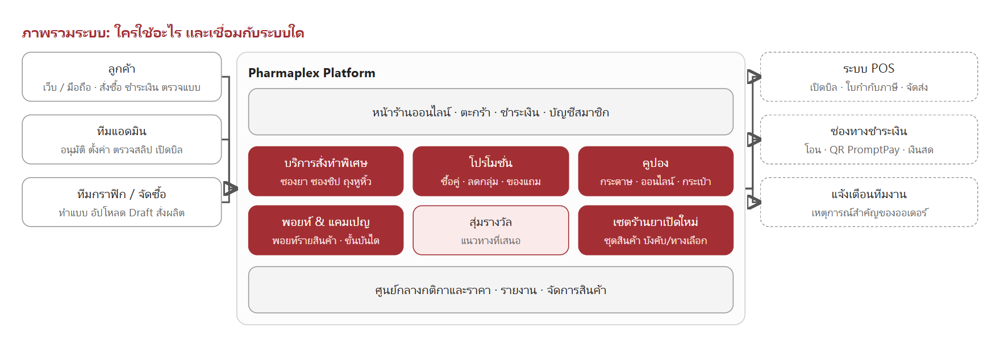

*รูป 1-1 ผู้ใช้งานแต่ละกลุ่มเข้าสู่ระบบผ่านหน้าร้านหรือหน้าแอดมิน ระบบกลางรวบรวมกติกาทุกโมดูลไว้ที่เดียว และส่งข้อมูลการขายไปยัง POS และช่องทางชำระเงิน*

### 1.3 โมดูลทั้งหมดในระบบ

| โมดูล | คืออะไร | ใช้เมื่อไหร่ | มีกี่แบบ |
|---|---|---|---|
| บริการสั่งทำพิเศษ | สั่งผลิตสินค้าตามแบบของร้าน เช่น ซองยาพิมพ์ชื่อร้าน | ร้านต้องการบรรจุภัณฑ์เฉพาะที่ไม่มีในสต็อก | 4 ประเภทสินค้า และทุกประเภทเลือกตัวเลือกได้หลายแบบ |
| โปรโมชั่น | ส่วนลดที่เกิดขึ้นอัตโนมัติตอนซื้อ ไม่ต้องใส่โค้ด | ต้องการกระตุ้นการซื้อสินค้ากลุ่มหนึ่ง | 2 แบบ |
| คูปอง | สิทธิ์ส่วนลดที่ลูกค้าต้องได้รับก่อนจึงใช้ได้ | แจกหน้างาน ส่งเสริมการขายผ่านเว็บ หรือแจกประจำเดือน | 5 แบบ |
| พอยท์และแคมเปญ | สะสมพอยท์ราย SKU และรางวัลปลดล็อกตามยอดสะสม | ให้ลูกค้าสะสมยอดและแลกของ | พอยท์ 1 ระบบ และแคมเปญ 2 แบบ |
| การสุ่มรางวัล | เปลี่ยนพอยท์ ยอดซื้อ หรือโค้ด เป็นสิทธิ์ลุ้นรางวัล | กิจกรรมส่งเสริมการขายที่มีของรางวัลหลากหลาย | 2 โหมดการจับรางวัล |
| เซตร้านยาเปิดใหม่ | ชุดสินค้าเริ่มต้นสำหรับร้านยาที่เพิ่งเปิด ปรับรายการได้ | ผู้ที่ต้องการเปิดร้านยาใหม่ | 2 ประเภทรายการ บังคับและทางเลือก |

### 1.4 ผู้ใช้งานและหน้าที่

| ผู้ใช้งาน | ทำอะไรได้ในระบบ |
|---|---|
| ลูกค้า (สมาชิก / ร้านค้า) | สั่งซื้อ ชำระเงิน ตรวจแบบ อนุมัติหรือขอแก้ไข ใช้คูปองและพอยท์ ติดตามสถานะ |
| แอดมิน (รวมเซลล์) | ตั้งค่าสินค้า โปรโมชั่น คูปอง แคมเปญ ตรวจสลิป อนุมัติคำสั่งซื้อ ปรับจำนวนจริง เปิดบิล และสั่งซื้อแทนลูกค้าได้ในบางกรณี เช่น เซลล์สั่งเซตร้านยาเปิดใหม่แทนลูกค้า |
| ทีมกราฟิก | จัดทำแบบ Mockup อัปโหลดแบบให้ลูกค้าตรวจ |
| ฝ่ายจัดซื้อ / โรงงาน | รับเรื่องผลิตและส่งสินค้าเข้าคลัง |
| ทีมงานภายใน | ได้รับการแจ้งเตือนเมื่อมีเหตุการณ์สำคัญของคำสั่งซื้อ |

### 1.5 หลักการที่ใช้ทั้งระบบ

- **ไม่ต้องใส่โค้ดกับโปรโมชั่น** ส่วนลดเกิดขึ้นเองเมื่อลูกค้าเข้าเงื่อนไข
- **ราคาและส่วนลดคำนวณที่ระบบเสมอ** หน้าจอแสดงตัวอย่างให้ลูกค้าเห็น แต่ยอดที่ชำระจริงคำนวณที่เซิร์ฟเวอร์
- **กติกาปรับได้จากหน้าแอดมิน** ไม่ต้องพัฒนาใหม่เมื่อต้องการเปลี่ยนแบรนด์ หมวด ช่วงเวลา หรือจำนวนที่กำหนด
- **ตรวจย้อนหลังได้** ทุกการใช้คูปอง สิทธิ์ลุ้น และการแลกพอยท์มีประวัติให้ตรวจ

### 1.6 การทำงานร่วมกันระหว่างโมดูลและนโยบายร่วมของระบบ

- **การใช้ร่วมกันในบิลเดียว** แอดมินตั้งค่าได้เองว่าแต่ละโมดูล (โปรโมชั่น คูปอง พอยท์ แคมเปญ สิทธิ์ลุ้น) เปิดหรือปิดใช้งาน และกำหนดได้ว่าโมดูลไหนใช้ร่วมกับโมดูลไหนได้บ้างในตะกร้าเดียวกัน ไม่ได้กำหนดตายตัวไว้ในระบบ
- **ยกเลิก / คืนสินค้า** เมื่อคูปอง พอยท์ หรือของแถมถูกใช้ไปแล้ว การยกเลิกหรือคืนสินค้าภายหลังจะไม่เรียกคืนสิ่งที่ใช้ไปแล้ว ถือว่าใช้สิทธิ์ไปแล้ว (คำขอคืนสินค้าทุกกรณีต้องผ่านการอนุมัติจากแอดมินก่อนอยู่แล้ว)
- **การแจ้งเตือนลูกค้า** ทั้งระบบไม่มีการแจ้งเตือนผ่านอีเมล SMS หรือ LINE ลูกค้าต้องเข้าเว็บเพื่อติดตามสถานะและสิทธิ์ต่าง ๆ ด้วยตนเอง
- **ภาษีมูลค่าเพิ่ม (VAT)** ราคาสินค้า ค่าจัดส่ง และส่วนลดที่แสดงในเอกสารนี้ทั้งหมดเป็นราคารวม VAT แล้ว
- **B2B กับ B2C** ทุกโมดูลใช้กติกาเดียวกันกับลูกค้าทุกกลุ่ม ยกเว้นเซตร้านยาเปิดใหม่ (โมดูล 7) ที่เปิดขายเฉพาะลูกค้าประเภทร้านค้า (B2B) เท่านั้น

---

## 2. บริการสั่งทำพิเศษ

### 2.1 คืออะไร

บริการสั่งทำพิเศษคือการสั่งผลิตสินค้าตามความต้องการของร้าน เช่น ซองยาพิมพ์ชื่อร้าน ซองซิป ถุงหูหิ้วพิมพ์โลโก้ ม่านบังยา และสติ๊กเกอร์ติดขวด สินค้ากลุ่มนี้ไม่มีสต็อกพร้อมส่ง ต้องผลิตตามสั่งใช้เวลาประมาณ 2–4 สัปดาห์

ลูกค้าเลือกตัวเลือกของสินค้า กรอกข้อมูลที่จะพิมพ์ลงบรรจุภัณฑ์ และดูภาพ Mockup ที่เปลี่ยนตามตัวเลือกได้ทันที ก่อนชำระมัดจำและเริ่มกระบวนการออกแบบ สินค้าหนึ่งรายการเปิดขายได้หลายปี (เช่น ฉบับปี 2569 และฉบับปี 2570) โดยคัดลอกตัวเลือก ราคา และแบบ Mockup จากปีก่อนหน้าไปตั้งต้นปีใหม่ได้ ลูกค้าเห็นเฉพาะปีล่าสุดที่เปิดขาย

### 2.2 ใช้เมื่อไหร่ และมีกี่แบบ

| ประเภทสินค้า | ตัวเลือกหลัก | ขนาด / จำนวน | รูปแบบการคิดราคา |
|---|---|---|---|
| ซองซิปยา | ประเภท (ใส, สีชา, สีขาวนม, สีแดง), รูปแบบ, สี | 6×8 ถึง 12×17 ซม. · จำนวนสำเร็จรูป 5,000 ถึง 100,000 ใบ | ต่อใบ |
| ถุงหูหิ้วพลาสติก | ชนิด (HD / PE), ชนิดหูหิ้ว, รูปแบบ, สี | 4×9 ถึง 6×14 นิ้ว · ขั้นต่ำ 50 กก. | ต่อกิโลกรัม |
| ม่านบังยา | รุ่น (ขามาตรฐาน / ขาเหล็กพิเศษ), รูปแบบ, สี | 90×160 ซม. หรือกำหนดขนาดเอง | ต่อตารางเมตร รวมขาตั้ง |
| สติ๊กเกอร์ติดขวด | ขนาด, รูปแบบ, สี | ดวง 3×6, 4×7, 5×8 ซม. หรือกำหนดขนาดเอง | ต่อแผ่น A3 |

สินค้ากลุ่มนี้ต่างจากสินค้า Pre-order ทั่วไปดังนี้

| หัวข้อ | Pre-order ทั่วไป | บริการสั่งทำพิเศษ |
|---|---|---|
| การชำระเงิน | ชำระเต็มจำนวนครั้งเดียว | มัดจำ 50% ก่อน และชำระส่วนที่เหลือเมื่อผลิตเสร็จ |
| การตรวจสอบ | ไม่มี | ตรวจสลิปและอนุมัติโดยแอดมินก่อนเริ่มออกแบบ (ยกเว้นชำระด้วย QR PromptPay ที่อนุมัติอัตโนมัติ) |
| แบบพิมพ์ | ไม่มี | ลูกค้าตรวจแบบและอนุมัติ หรือขอแก้ได้สูงสุด 3 ครั้ง |
| จำนวนผลิต | ตามที่สั่ง | อาจผลิตเกินหรือขาดได้ตามกระบวนการโรงงาน ปรับตามจำนวนจริง |
| การชำระอีกครั้ง | ไม่มี | มีการชำระรอบที่ 2 เมื่อมียอดค้าง หรือได้ใบลดหนี้คืนเมื่อจ่ายเกิน |
| การรับสินค้า | ตามรอบคิว | กดยืนยันรับสินค้าเอง แล้วให้คะแนนและรีวิวได้ |

### 2.3 ตัวเลือกสินค้าและข้อมูลที่ต้องกรอก

แอดมินตั้งค่าตัวเลือกของสินค้าแต่ละรายการเอง และเลือกรูปแบบการแสดงผลได้ 3 แบบ

| รูปแบบตัวเลือก | ใช้แสดงอะไร |
|---|---|
| ปุ่มข้อความ | ตัวเลือกทั่วไป เช่น ประเภท รูปแบบ |
| สี | วงกลมสีให้กด รองรับให้ลูกค้าพิมพ์รหัสสีหรือ Pantone เองได้ |
| ขนาด | กว้าง × ยาว ใช้กับสินค้าที่คิดราคาต่อตารางเมตร เลือกให้ลูกค้ากำหนดขนาดเองได้ |

ตัวเลือกบางรายการกำหนดให้ต้องแนบไฟล์เพิ่ม เช่น เลือก "มีแบบอยู่แล้ว" ต้องแนบไฟล์แบบมาด้วย

นอกจากตัวเลือกสินค้า แอดมินกำหนดช่องข้อมูลที่ลูกค้าต้องกรอกเองได้สูงสุด 20 ช่องต่อสินค้า เช่น ชื่อร้าน ที่อยู่ เบอร์โทรศัพท์ เวลาเปิดทำการ เป็นช่องข้อความ ข้อความหลายบรรทัด หรือช่องแนบไฟล์ ระบบดึงข้อมูลร้านของลูกค้ามาเติมล่วงหน้าให้ได้

### 2.4 ขั้นตอนการสั่งซื้อทั้งหมด

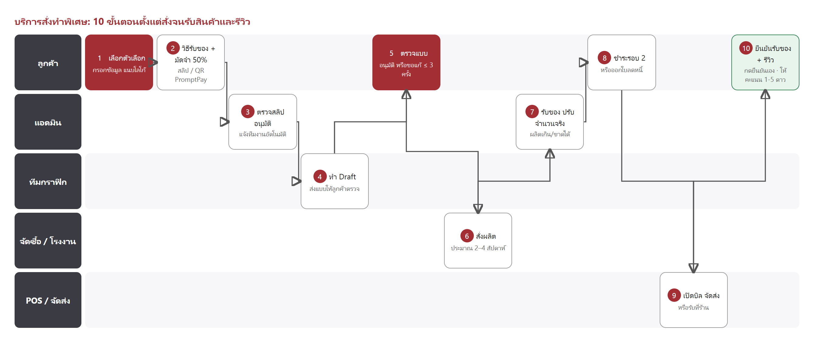

*รูป 2-1 ทั้ง 10 ขั้นตอนแบ่งตามผู้รับผิดชอบ ขั้นที่ 5 และ 7 เป็นจุดที่ลูกค้าและร้านต้องดำเนินการ ขั้นที่ 10 เป็นขั้นใหม่ที่ลูกค้ายืนยันรับสินค้าและให้คะแนนเอง*

### 2.5 รายละเอียดแต่ละขั้นตอน

**ขั้นที่ 1 เลือกตัวเลือกและกรอกข้อมูล**
ลูกค้าเลือกตัวเลือกของสินค้า กรอกข้อมูลตามช่องที่แอดมินกำหนด อัปโหลดโลโก้หรือไฟล์ตัวอย่างงาน (AI, EPS, PDF, SVG ที่แนะนำ และ PNG โปร่งใส / JPG ความละเอียดสูง ไม่เกิน 20 MB) เปิดดูตัวอย่างไฟล์ที่เลือกได้ก่อนส่งจริง และต้องยอมรับเงื่อนไขของสินค้าก่อนดำเนินการต่อ ถ้าเลือกขนาดกำหนดเองในสินค้าที่คิดราคาต่อชิ้น หรือเลือกขนาดที่ยังไม่เคยตั้งราคาไว้ ระบบจะส่งคำสั่งซื้อไปให้เจ้าหน้าที่ตีราคาก่อน ลูกค้าสั่งซื้อได้เสมอไม่ว่ากรณีใด


*รูป 2-2 หน้าเลือกตัวเลือกสินค้า ภาพ Mockup ด้านบนเปลี่ยนตามประเภท ขนาด และข้อมูลที่ลูกค้ากรอก*

**ขั้นที่ 2 เลือกวิธีรับสินค้าและชำระมัดจำ 50%**
ลูกค้าเลือกวิธีรับสินค้าและที่อยู่ในขั้นตอนเดียวกับการสรุปยอด (รายละเอียดอยู่ในหัวข้อ 2.9) ระบบคำนวณยอดมัดจำ 50% จาก (ค่าสินค้า + ค่าบล็อค − ส่วนลด) ยังไม่รวมค่าจัดส่ง ลูกค้าชำระด้วยการโอนพร้อมแนบสลิป (รอแอดมินตรวจ) หรือสแกน QR PromptPay (ระบบยืนยันให้อัตโนมัติ ไม่ต้องรอตรวจ) ถ้ามีใบลดหนี้ในบัญชีเลือกใช้ตัดยอดได้ทันที และถอนออกได้ก่อนส่งหลักฐานการชำระเงิน ชำระสะสมหลายครั้งได้ ไม่ต้องจ่ายครบในครั้งเดียว หรือแจ้งเจ้าหน้าที่ให้บันทึกสลิปแทนได้ถ้าส่งหลักฐานมาทางช่องทางอื่น (รายละเอียดอยู่ในหัวข้อ 2.8) วิธีรับสินค้าและที่อยู่จะล็อกแก้ไขไม่ได้หลังชำระมัดจำ


*รูป 2-3 หน้าสรุปยอดและชำระมัดจำ ยอดมัดจำคิดเป็น 50% ของยอดรวมตั้งต้น*

**ขั้นที่ 3 แอดมินตรวจสลิปและอนุมัติ**
เมื่อลูกค้าแนบสลิปโอนเงิน แอดมินตรวจยอดเทียบกับยอดที่ต้องชำระ และตรวจความถูกต้องของข้อมูล (สลิป QR PromptPay ระบบอนุมัติให้อัตโนมัติ ไม่ต้องรอแอดมิน) แอดมินเลือกทำได้ 3 ทาง
- **อนุมัติ** เพื่อเริ่มออกแบบ กำหนดส่งแบบภายใน 7 วัน
- **ส่งกลับให้แก้ไข** ลูกค้าแก้ข้อมูลหรือโลโก้แล้วส่งตรวจใหม่
- **ปฏิเสธสลิป** ลูกค้าเห็นเหตุผลและส่งสลิปใหม่ได้

**ขั้นที่ 4 ทีมกราฟิกจัดทำแบบ**
ทีมกราฟิกพิมพ์ใบสรุปความต้องการของลูกค้าจากระบบ นำไปออกแบบใน Adobe Illustrator แล้วอัปโหลดภาพ Mockup (JPG / PNG) เข้าสู่ออเดอร์ภายใน 7 วันหลังอนุมัติมัดจำ ลูกค้าได้รับแจ้งว่ามีแบบใหม่ให้ตรวจ

**ขั้นที่ 5 ลูกค้าตรวจแบบ**
ลูกค้าเข้าดูแบบในหน้า "คำสั่งซื้อของฉัน" ได้ตลอดเวลา แล้วเลือก **อนุมัติแบบ Final** หรือ **ขอแก้ไข** โดยวงจุดบนภาพแบบตรงตำแหน่งที่ต้องการแก้ (สูงสุด 30 จุด) พร้อมใส่โน้ตอธิบาย ต้องมีจุดหรือโน้ตอย่างน้อย 1 รายการ และต้องยืนยันในหน้าต่างเตือนก่อนส่ง เพราะใช้โควตาแล้วย้อนกลับไม่ได้ การขอแก้ไขทำได้สูงสุด 3 ครั้ง (Draft รวมสูงสุด 4 ฉบับ) รายละเอียดอยู่ในหัวข้อ 2.7

**ขั้นที่ 6 ส่งผลิตที่โรงงาน**
เมื่อลูกค้าอนุมัติแบบ คำสั่งซื้อเข้าสู่การผลิตและฝ่ายจัดซื้อส่งงานไปยังโรงงาน ใช้เวลาประมาณ 2–4 สัปดาห์

**ขั้นที่ 7 รับสินค้าและปรับจำนวนจริง**
โรงงานอาจผลิตได้จำนวนเกินหรือขาดจากที่สั่งได้ตามเงื่อนไขการผลิต เมื่อรับสินค้าแล้ว แอดมินปรับจำนวนจริงในออเดอร์ พร้อมกรอกค่าจัดส่งถ้าเป็นการจัดส่งนอกพื้นที่ ระบบคำนวณยอดรวมใหม่ทันที ส่วนที่ผลิตเกินลูกค้ารับในราคาต่อหน่วยเดิม รายละเอียดอยู่ในหัวข้อ 2.8

**ขั้นที่ 8 ชำระรอบที่ 2 หรือรับใบลดหนี้**
ถ้ายังมียอดค้าง ลูกค้าชำระส่วนที่เหลือผ่านหน้าเว็บ (สะสมหลายครั้งได้เช่นเดียวกับมัดจำ) และแอดมินตรวจสลิปรอบที่ 2 ถ้าไม่มียอดค้าง (ยอดพอดีหรือจ่ายเกิน หรือใบลดหนี้ครอบคลุมพอดี) ข้ามการชำระรอบนี้ไปได้เลย และถ้าลูกค้าจ่ายเกินยอดจริง ระบบออกใบลดหนี้คืนให้โดยอัตโนมัติ

**ขั้นที่ 9 เปิดบิลและจัดส่ง**
เจ้าหน้าที่เปิดบิลใน POS และกรอกเลขที่เอกสาร ออเดอร์เข้าสถานะรอจัดส่งหรือรอรับที่ร้านตามวิธีที่เลือกไว้ เจ้าหน้าที่จะนัดวันจัดส่งหรือวันรับของกับลูกค้าอีกครั้งหลังผลิตเสร็จ เพราะลูกค้าไม่ได้เลือกวันตอนสั่งซื้อ

**ขั้นที่ 10 ยืนยันรับสินค้าและให้คะแนน**
เมื่อได้รับสินค้าแล้ว ลูกค้ากดยืนยันรับสินค้าด้วยตนเองในหน้าออเดอร์ สถานะเปลี่ยนเป็น "รับสินค้าแล้ว" และปิดงาน จากนั้นให้คะแนนสินค้า 1-5 ดาวพร้อมความเห็นได้ 1 ครั้งต่อออเดอร์ รีวิวจะแสดงในหน้าสินค้าแบบสาธารณะโดยย่อชื่อลูกค้าเพื่อความเป็นส่วนตัว เช่น "จ***"

### 2.6 ภาพ Mockup และกลุ่มสี


*รูป 2-4 ตัวอย่าง Mockup ที่สร้างจากข้อมูลร้านและโลโก้ของลูกค้า ภาพนี้เป็นตัวอย่างเพื่อตรวจสอบเบื้องต้น แบบจริงกราฟิกจะส่งให้ตรวจก่อนผลิต*

แบบ Mockup แปลงจากไฟล์ .ai หรือ .pdf เป็นภาพเวกเตอร์ หรืออัปโหลดเป็นภาพนิ่งก็ได้ แบบหนึ่งผูกกับตัวเลือกได้หลายแบบ หรือไม่ผูกเลยเพื่อใช้เป็นแบบหลักของสินค้า ช่องในแบบเปลี่ยนตามข้อมูลลูกค้าได้ 3 ชนิด คือข้อความ (ผูกกับช่องข้อมูลที่กรอก) รูปภาพ (ไฟล์โลโก้) และสี

**กลุ่มสี** แอดมินจัดกลุ่มสีในแบบ เช่น "สีหลัก" หรือ "สีพื้นหลัง" แล้วผูกแต่ละกลุ่มกับตัวเลือกสีของสินค้า ลูกค้าเปลี่ยนสีจากตัวเลือกเดิมตอนเลือกสินค้า ไม่มีช่องเลือกสีซ้ำซ้อน กลุ่มที่ผูกตัวเลือกสีเดียวกันจะเปลี่ยนพร้อมกันทั้งหมด ส่วนกลุ่มที่ไม่ได้ผูกจะคงสีเดิมไว้ สีที่ลูกค้าเลือกถูกบันทึกเป็นชื่อกลุ่มและรหัสสี แสดงให้เห็นทั้งหน้าลูกค้า หน้าแอดมิน และใบสรุปความต้องการที่พิมพ์ให้ทีมกราฟิก

### 2.7 การตรวจแบบและแก้ไข

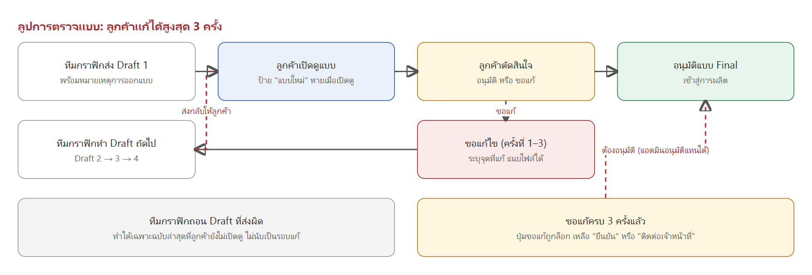

*รูป 2-5 ลูปการตรวจแบบ Draft แต่ละฉบับเก็บไว้ให้ลูกค้าเปิดดูและเทียบย้อนหลังได้*

| กฎ | รายละเอียด |
|---|---|
| วิธีขอแก้ไข | วงจุดบนภาพแบบสูงสุด 30 จุด พร้อมใส่โน้ตอธิบาย ต้องมีอย่างน้อย 1 รายการ |
| จำนวนครั้งที่ขอแก้ | ได้สูงสุด 3 ครั้ง ระบบรองรับ Draft รวมสูงสุด 4 ฉบับ |
| ครบ 3 ครั้งแล้ว | ปุ่มขอแก้ถูกล็อก เหลือเพียง "ยืนยัน" และ "ติดต่อเจ้าหน้าที่" |
| กำหนดส่งแบบ | ภายใน 7 วันนับจากวันที่แอดมินอนุมัติมัดจำ ลูกค้าเห็นกำหนดนี้ตั้งแต่ก่อนชำระ |
| แจ้งว่ามีแบบใหม่ | ลูกค้าเห็นป้าย "แบบใหม่" จนกว่าจะเปิดดู ปุ่มดูตัวอย่างงานกระพริบจนกว่าจะกดดูครั้งแรก |
| ถอนแบบที่ส่งผิด | ทีมกราฟิกถอน Draft ล่าสุดได้ ถ้าลูกค้ายังไม่เปิดดู และการถอนไม่นับเป็นรอบแก้ไข |
| อนุมัติแทนลูกค้า | ถ้าลูกค้ายืนยันผ่านช่องทางอื่น แอดมินอนุมัติแทนได้ และระบบบันทึกไว้ว่าอนุมัติโดยแอดมิน |

### 2.8 การคิดเงินและมัดจำ

**สูตรการคิดราคาสินค้า**

```
ราคาต่อหน่วย (PER_UNIT) = ราคาต่อหน่วย × จำนวน
ราคาต่อตารางเมตร (PER_AREA) = ราคาต่อตารางเมตร × มากกว่าระหว่าง(พื้นที่คิดขั้นต่ำ, กว้าง × ยาว) × จำนวน
```

ตารางราคาอ้างอิงจากตัวเลือกที่ "มีผลต่อราคา" คูณกับระดับราคาตามจำนวน (ใช้ระดับสูงสุดที่ไม่เกินจำนวนที่สั่ง) ค่าบล็อคคิดครั้งเดียวเมื่อลูกค้าติ๊ก "สั่งครั้งแรก" และตั้งแยกตามแถวราคาได้ พื้นที่คิดขั้นต่ำกันไม่ให้สินค้าชิ้นเล็กราคาต่ำเกินไป เช่น ตั้งขั้นต่ำ 1 ตร.ม. ซองขนาด 10×10 ซม. จะคิดราคาเท่ากับ 1 ตร.ม. ถ้าตั้งเป็น 0 ระบบคิดตามพื้นที่จริง

**สูตรการชำระเงิน 2 รอบ**

```
มัดจำรอบแรก = (ค่าสินค้า + ค่าบล็อค − ส่วนลด) × 50%   [ไม่รวมค่าจัดส่ง]
ยอดรวมทั้งหมด = ค่าสินค้าตามจำนวนผลิตจริง + ค่าจัดส่ง − ส่วนลด
ยอดชำระรอบที่ 2 = ยอดรวมทั้งหมด − ยอดที่ชำระแล้ว − ใบลดหนี้ที่เลือกใช้
```

**ตัวอย่างการคำนวณ** (ราคา 1 บาทต่อใบ สั่ง 5,000 ใบ และโรงงานผลิตได้จริง 5,500 ใบ)

| รายการ | จำนวน | ยอดเงิน (บาท) | หมายเหตุ |
|---|---|---|---|
| ค่าสินค้าตามที่สั่ง | 5,000 ใบ × 1 | 5,000.00 | ยอดรวมตั้งต้น |
| มัดจำรอบแรก 50% | | 2,500.00 | ชำระก่อนเริ่มออกแบบ |
| ผลิตได้จริงเกิน | +500 ใบ × 1 | +500.00 | แอดมินปรับจำนวนจริง |
| ยอดรวมหลังปรับ | 5,500 ใบ | 5,500.00 | ยอดที่ลูกค้าต้องชำระทั้งหมด |
| **ยอดค้างชำระรอบที่ 2** | | **3,000.00** | 5,500 − 2,500 |

**ตัวอย่างกรณีโรงงานผลิตขาด** ถ้าผลิตได้จริง 4,800 ใบ (ขาด 200 ใบ) และลูกค้าชำระมัดจำ 2,500 บาทไว้แล้ว ยอดรวมหลังปรับคือ 4,800 บาท ลูกค้าจึงมียอดค้างชำระ 2,300 บาท ถ้าลูกค้าชำระไว้แล้วเกินยอดรวมหลังปรับ ระบบจะออกใบลดหนี้คืนให้ตามส่วนต่างโดยอัตโนมัติ

**ขนาดที่ลูกค้ากำหนดเอง — ใครเป็นคนตีราคา**

| เงื่อนไข | ผล |
|---|---|
| คิดราคาต่อตารางเมตร และแกนขนาดไม่มีผลต่อราคา | ระบบคำนวณราคาเองจากพื้นที่ที่กรอก |
| คิดราคาต่อตารางเมตร แกนขนาดมีผลต่อราคา และตั้งราคาแถวนั้นไว้แล้ว | ระบบคำนวณราคาเองตามราคาแถวนั้น |
| คิดราคาต่อตารางเมตร แกนขนาดมีผลต่อราคา แต่ยังไม่ได้ตั้งราคา | ส่งให้เจ้าหน้าที่ตีราคาก่อนเริ่มกระบวนการ |
| คิดราคาต่อหน่วย (ต่อชิ้น) และกำหนดขนาดเอง | ส่งให้เจ้าหน้าที่ตีราคาเสมอ (คำนวณราคาต่อชิ้นจากขนาดไม่ได้) |
| ขนาดเกินค่าสูงสุดที่สินค้ากำหนดไว้ | ระบบปฏิเสธไม่ให้สั่ง |

ไม่ว่ากรณีใดลูกค้าสั่งซื้อได้เสมอ ไม่มีทางตัน เมื่อแอดมินตีราคาแล้วระบบคำนวณมัดจำ 50% ใหม่ให้อัตโนมัติ

**ข้อกำหนดเพิ่มเติม**
- ส่วนที่ผลิตเกินลูกค้ารับทั้งหมดในราคาต่อหน่วยเดิม ไม่ได้ส่วนลดเพิ่ม
- ส่วนลด (ถ้ามี) เป็นจำนวนเงินคงที่ ไม่เพิ่มตามจำนวนส่วนที่เกิน
- ใบลดหนี้ใช้ตัดยอดได้ทั้งตอนชำระมัดจำและรอบที่ 2 เลือกใช้แล้วตัดยอดทันที ถอนออกได้ก่อนส่งหลักฐานการชำระเงิน
- ชำระได้หลายงวดสะสม ทั้งมัดจำและรอบที่ 2 แต่ละครั้งที่แนบสลิประบบจะเก็บไว้ก่อน ยังไม่ส่งให้แอดมินตรวจจนกว่ายอดสลิปรวมจะครบยอดที่ต้องชำระ (หลังหักใบลดหนี้) ยอดรวมเกินยอดที่ต้องชำระจะบันทึกไม่ได้ ถ้าใบลดหนี้ครอบคลุมยอดพอดี ไม่ต้องแนบสลิปเพิ่ม
- เจ้าหน้าที่บันทึกการชำระแทนลูกค้าได้ เช่น กรณีลูกค้าส่งสลิปมาทางโทรศัพท์หรือ LINE โดยรับเฉพาะสลิปโอนเงิน ไม่รองรับ QR PromptPay ในกรณีนี้

### 2.9 วิธีรับสินค้าและค่าจัดส่ง

ลูกค้าเลือกวิธีรับสินค้าตอนสรุปยอด (ขั้นที่ 2) มี 3 แบบ

| วิธีรับสินค้า | ค่าใช้จ่าย | หมายเหตุ |
|---|---|---|
| มารับที่ร้าน | ฟรี | — |
| จัดส่งภายในพื้นที่ | ฟรี | ที่อยู่ต้องอยู่ในพื้นที่รอบจัดส่งที่ร้านกำหนดไว้ |
| จัดส่งนอกพื้นที่ | ตามระยะทาง | แอดมินกรอกค่าจัดส่งตอนปรับจำนวนผลิตจริง เก็บในยอดรอบที่ 2 |

ที่อยู่ที่เลือกถูกบันทึกเป็นสำเนา ณ วันที่สั่งซื้อ และล็อกแก้ไขไม่ได้หลังชำระมัดจำ (แก้ไขได้เฉพาะช่วงรอตีราคาหรือรอชำระมัดจำ) ไม่มีการเลือกวันหรือรอบจัดส่งล่วงหน้า เพราะสินค้ายังไม่ผลิต เจ้าหน้าที่จะนัดวันจัดส่งหรือวันรับของกับลูกค้าอีกครั้งหลังผลิตเสร็จ

### 2.10 สถานะคำสั่งซื้อ

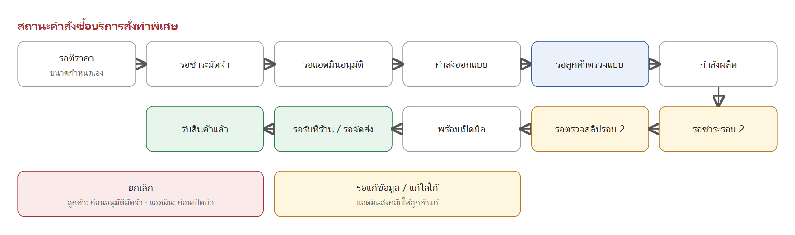

*รูป 2-6 สถานะหลักของคำสั่งซื้อ ลูกค้าติดตามสถานะได้ที่ "คำสั่งซื้อของฉัน" ในหน้าสมาชิก*

### 2.11 การยกเลิก การคืนเงิน และใบลดหนี้

| ช่วงสถานะ | ใครยกเลิกได้ | ผลที่เกิดขึ้น |
|---|---|---|
| รอตีราคา / รอชำระมัดจำ / รอแอดมินอนุมัติ / รอแก้ข้อมูล | ลูกค้าหรือแอดมิน | ยกเลิกได้ทันที ถ้าชำระเงินไว้แล้วคืนเป็นใบลดหนี้ |
| กำลังออกแบบ จนถึง รอตรวจสลิปรอบ 2 | แอดมินเท่านั้น | ยอดที่ชำระแล้วคืนเป็นใบลดหนี้ทั้งหมด |
| ตั้งแต่เปิดบิลขายแล้ว | ไม่สามารถยกเลิกผ่านระบบได้ | ติดต่อเจ้าหน้าที่โดยตรง |
| ชำระเกินยอดจริงหลังปรับจำนวนผลิต | ระบบทำให้อัตโนมัติ | ออกใบลดหนี้คืนส่วนต่าง |

ใบลดหนี้ใช้ตัดยอดได้ทั้งตอนชำระมัดจำและชำระรอบที่ 2 ของคำสั่งซื้อครั้งถัดไป การชำระเงินทำได้ด้วยการโอนพร้อมแนบสลิป หรือสแกน QR PromptPay เท่านั้น ไม่รับบัตรเครดิต และไม่รับเครดิตร้านค้าเป็นวิธีชำระ

### 2.12 การตั้งค่าของแอดมินต่อสินค้า

| หัวข้อที่ตั้งค่า | รายละเอียด |
|---|---|
| ข้อมูลสินค้า | ชื่อ คำอธิบาย เงื่อนไขการใช้งาน (terms) ระยะเวลาผลิต เปิด/ปิดการขาย และลำดับการแสดงผล |
| โหมดราคา | เลือกคิดราคาต่อหน่วยหรือต่อตารางเมตร พร้อมตั้งพื้นที่คิดขั้นต่ำ (เฉพาะโหมดต่อตารางเมตร) |
| ตัวเลือกสินค้า (แกนตัวเลือก) | สร้างได้หลายแกน เลือกรูปแบบแสดงผล (ปุ่มข้อความ / สี / ขนาด) และตั้งว่าแกนไหน "มีผลต่อราคา" |
| ตารางราคา | กำหนดราคาตามชุดตัวเลือก คูณกับระดับราคาตามจำนวน ช่องว่าง = ไม่ขายชุดนั้น |
| ค่าบล็อค | เปิดหรือปิดค่าบล็อค และตั้งราคาแยกตามแถวราคาได้ |
| ช่องข้อมูลลูกค้า (infoFields) | สร้างได้สูงสุด 20 ช่อง เลือกชนิดช่อง (ข้อความ / ข้อความหลายบรรทัด / ไฟล์) และตั้งให้เติมค่าจาก POS ล่วงหน้า |
| แบบ Mockup | อัปโหลดไฟล์ .ai / .pdf หรือภาพนิ่ง ผูกกับตัวเลือกที่ต้องการ จัดกลุ่มสีในแบบ และผูกแต่ละกลุ่มกับแกนสี |
| จำนวนสั่งซื้อ | ตั้งปุ่มจำนวนสำเร็จรูป และเปิด/ปิดให้ลูกค้ากรอกจำนวนเอง |
| ปีของสินค้า | คัดลอกตัวเลือก ราคา และแบบ Mockup จากปีก่อนหน้าไปตั้งต้นปีใหม่ได้

---

## 3. โปรโมชั่น

### 3.1 คืออะไร และใช้เมื่อไหร่

โปรโมชั่นคือส่วนลดที่เกิดขึ้นเองเมื่อลูกค้าใส่สินค้าลงตะกร้าและเข้าเงื่อนไข ลูกค้าไม่ต้องกรอกโค้ดหรือติ๊กขอส่วนลด แอดมินใช้โปรโมชั่นเมื่อต้องการกระตุ้นการซื้อสินค้ากลุ่มใดกลุ่มหนึ่ง เช่น ซื้อคู่กันให้ถูกลง ซื้อครบยอดแบรนด์ที่กำหนดเพื่อรับส่วนลดหรือฟรีค่าจัดส่ง หรือจัดลดราคาเฉพาะวันพิเศษ

### 3.2 มีกี่แบบ

| แบบ | ทำงานอย่างไร |
|---|---|
| โปรโมชั่นแบบเงื่อนไข (Bundle) | ตั้งเงื่อนไขการซื้อ แล้วเลือกผลตอบแทนอย่างใดอย่างหนึ่ง: ของแถม ส่วนลด หรือฟรีค่าจัดส่ง |
| โปรโมชั่นตามวันพิเศษ | ลดราคาสินค้าเฉพาะกลุ่มที่เลือกไว้ตามช่วงเวลาที่ตั้ง พร้อมโควตาจำนวนจำกัด |

### 3.3 โปรโมชั่นแบบเงื่อนไข (Bundle)

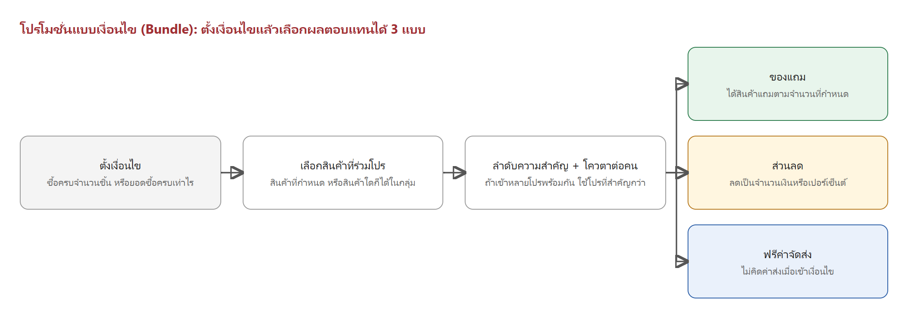

*รูป 3-1 ใช้การตั้งค่าชุดเดียวกับระบบ Bundle ที่ใช้งานอยู่ เพิ่มเติมคือเลือกได้ว่าผลตอบแทนจะเป็นของแถม ส่วนลด หรือฟรีค่าจัดส่ง*

| หัวข้อที่ตั้งค่า | รายละเอียด |
|---|---|
| เงื่อนไข | ซื้อครบจำนวนชิ้นที่กำหนด หรือยอดซื้อครบจำนวนเงินที่กำหนด (เลือกอย่างใดอย่างหนึ่ง) |
| สินค้าที่ร่วมโปร | เลือกสินค้าที่กำหนดไว้ หรือเปิดให้สินค้าชนิดใดก็ได้ในกลุ่มที่ตั้งไว้นับรวมกัน |
| ลำดับความสำคัญ (Priority) | ถ้าตะกร้าเข้าเงื่อนไขหลายโปรพร้อมกัน ใช้โปรที่ตั้งลำดับสำคัญกว่า |
| โควตาต่อคน | จำกัดจำนวนครั้งที่ลูกค้าคนเดียวรับสิทธิ์ได้ (ไม่ระบุ = ไม่จำกัด) |
| ช่วงเวลาที่มีผล | กำหนดวันเริ่มต้นและสิ้นสุด |
| การทวีคูณเมื่อซื้อเกินเงื่อนไขหลายเท่า | เช่น ลูกค้าซื้อ 2 เท่าหรือ 3 เท่าของจำนวนที่กำหนดในบิลเดียว แอดมินเลือกได้ต่อโปรโมชั่นว่าจะให้ผลตอบแทนทวีคูณตามจำนวน หรือจำกัดไว้ 1 ครั้งต่อบิล |

ผลตอบแทนเลือกได้ 1 อย่างต่อโปรโมชั่น

| ผลตอบแทน | ตัวอย่าง |
|---|---|
| ของแถม | ซื้อนมผงสูตร 3 คู่กับขวดนม PP รับของแถมตามจำนวนที่กำหนด ถ้าของแถมหมดสต็อกระหว่างโปรโมชั่น active ระบบจะแจ้งเตือนแอดมินและปิดโปรโมชั่นนั้นชั่วคราวให้อัตโนมัติ |
| ส่วนลด | ซื้อสินค้าแบรนด์ที่กำหนดครบ 1,000 บาท ลดทันที 100 บาท ถ้าตั้งเป็นส่วนลด % ตั้งเพดานส่วนลดสูงสุดได้ เช่น ลด 15% สูงสุดไม่เกิน 100 บาท |
| ฟรีค่าจัดส่ง | ซื้อสินค้าในกลุ่มที่กำหนด ไม่เสียค่าจัดส่ง |

ส่วนลดท้ายบิลตามแบรนด์และส่งฟรีตามกลุ่มสินค้าที่เคยแยกเป็นกติกาต่างหาก แท้จริงคือโปรโมชั่นแบบเงื่อนไขที่ตั้งเงื่อนไขเป็น "ยอดซื้อครบจำนวนเงิน" แล้วเลือกผลตอบแทนเป็นส่วนลดหรือฟรีค่าจัดส่งนั่นเอง จบในหน้าตั้งค่าเดียวกันได้ทั้งหมด ไม่ต้องมีหน้าตั้งค่าแยก

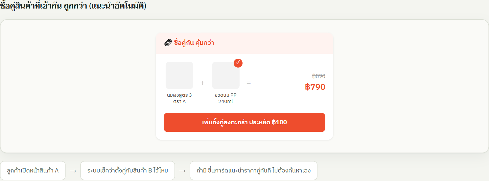

*รูป 3-2 ตัวอย่างหน้าจอ: เงื่อนไขซื้อครบ 2 ชิ้นที่กำหนด ผลตอบแทนเป็นราคาพิเศษเมื่อซื้อคู่ ระบบแนะนำให้ทันทีเมื่อลูกค้าเปิดดูสินค้าตัวแรก*

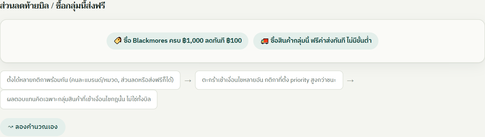

*รูป 3-3 ตัวอย่างหน้าจอ: เงื่อนไขยอดซื้อครบตามแบรนด์ ผลตอบแทนเป็นส่วนลดท้ายบิลหรือฟรีค่าจัดส่งแสดงขึ้นในหน้าสรุปยอดทันทีเมื่อเข้าเงื่อนไข*

### 3.4 โปรโมชั่นตามวันพิเศษ

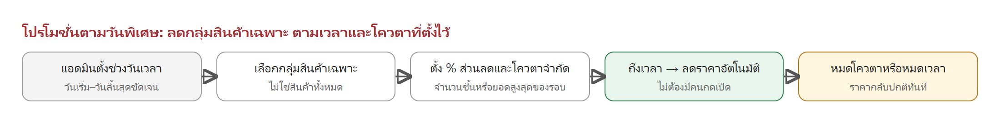

*รูป 3-4 ลดราคาเฉพาะกลุ่มสินค้าที่เลือกไว้ ไม่ใช่ทุกสินค้า และมีโควตาจำนวนจำกัดในแต่ละรอบ*

แอดมินกำหนดวันและเวลา เลือกกลุ่มสินค้าเฉพาะที่เข้าร่วม (ไม่ใช่สินค้าทั้งหมด) ตั้งเปอร์เซ็นต์ส่วนลดและโควตาจำนวนจำกัดของรอบ ถึงเวลาที่ตั้งไว้ราคาเปลี่ยนให้อัตโนมัติ เมื่อหมดโควตาหรือหมดเวลา ราคาจะกลับเป็นปกติทันทีโดยไม่ต้องมีคนกดปิด

| หัวข้อที่ตั้งค่า | รายละเอียด |
|---|---|
| ช่วงเวลา | วันและเวลาเริ่มต้น–สิ้นสุด |
| กลุ่มสินค้าที่ร่วมรายการ | เลือกเฉพาะบางหมวดหรือบางรายการ ไม่ใช่สินค้าทั้งหมด |
| เปอร์เซ็นต์ส่วนลด | ตั้งแยกแต่ละกลุ่มสินค้าได้ เช่น กลุ่มหนึ่งลด 50% อีกกลุ่มลด 30% |
| โควตาของรอบ | จำกัดจำนวนชิ้นหรือยอดสูงสุดที่ขายได้ในราคาพิเศษ หมดโควตาราคากลับปกติทันที |

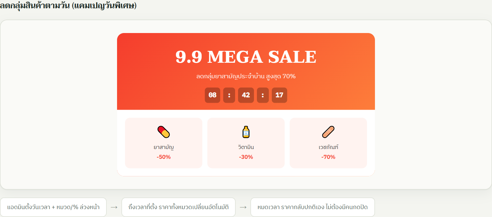

*รูป 3-5 ตัวอย่างหน้าจอ: แคมเปญวันพิเศษลดราคาเฉพาะกลุ่มสินค้า เช่น ยาสามัญ วิตามิน และเวชภัณฑ์ คนละเปอร์เซ็นต์กัน*

### 3.5 การแสดงผลหน้าเว็บ

- **ป้ายโปรโมชั่น** เช่น "ซื้อคู่ถูกกว่า", "ลดกลุ่มสินค้า" หรือ "ส่งฟรี" บนการ์ดสินค้า
- **ตัวกรองโปรโมชั่น** ลูกค้ากดดูเฉพาะสินค้าที่มีโปรโมชั่นได้จากหน้าค้นหา
- **รายละเอียดบนหน้าสินค้า** เงื่อนไขโปรโมชั่นแสดงในหน้าหลักของสินค้า ไม่ต้องกดเข้าแท็บย่อย

---

## 4. คูปอง

### 4.1 คืออะไร และใช้เมื่อไหร่

คูปองคือสิทธิ์ส่วนลดที่ลูกค้าต้อง "รับ" มาก่อนจึงใช้ได้ ต่างจากโปรโมชั่นที่เกิดขึ้นเอง คูปองเหมาะกับการแจกหน้างาน ส่งเสริมการขายผ่านช่องทางออนไลน์ ให้สิทธิ์ประจำเดือนแก่ลูกค้า หรือต้อนรับลูกค้าใหม่

### 4.2 มีกี่แบบ

| แบบ | วิธีรับสิทธิ์ | การกันการใช้ซ้ำ | เหมาะกับ |
|---|---|---|---|
| คูปองกระดาษ | พิมพ์เป็นใบ ทุกใบรหัสเหมือนกันทั้งชุด | ตัวกระดาษที่ร้านฉีกเก็บไว้เป็นหลักฐาน ใช้ได้เฉพาะหน้าร้าน/POS เท่านั้น ไม่รองรับการกรอกใช้งานบนเว็บ | แจกหน้างานและบูท |
| คูปองออนไลน์ (โค้ดแชร์ได้) | ใส่โค้ดตอนเช็คเอาต์ | ระบบตรวจประวัติการใช้ของบัญชีทุกครั้ง | แคมเปญที่แชร์ได้ เช่น โพสต์หรือ Influencer |
| คูปองเก็บเอง (เหมือน Shopee) | ลูกค้าเข้าดูคูปองที่เปิดให้เก็บแล้วกดเก็บเอง | ได้รหัสเฉพาะตัว 1 คน 1 รหัส ตัดโควตาทันที | สิทธิ์ที่เปิดให้ลูกค้าเลือกเก็บเอง |
| แจกอัตโนมัติทุกเดือน | ระบบออกสิทธิ์ให้ทุกคนเองทุกวันที่ 1 | ใช้ได้ถึงสิ้นเดือน ไม่ทบไปเดือนถัดไป | สิทธิ์ประจำเดือนที่ให้ลูกค้าทุกคน |
| คูปองลูกค้าใหม่ | ได้อัตโนมัติเมื่อเป็นบัญชีที่ยังไม่เคยสั่งซื้อ | ใช้ได้ครั้งเดียวต่อบัญชี | ต้อนรับลูกค้าใหม่ |

### 4.3 คูปองกระดาษ

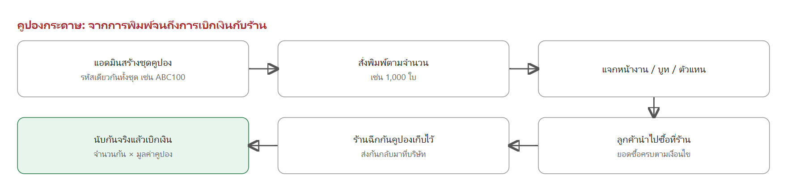

*รูป 4-1 ตั้งแต่แอดมินสร้างชุดคูปองจนถึงการเบิกเงินกับร้านที่ร่วมรายการ*

ตัวอย่างหน้าจอ: แอดมินกำหนดรหัส จำนวนที่พิมพ์ มูลค่าส่วนลด และวันหมดอายุ ระบบจะออกไฟล์พิมพ์ให้ทันที

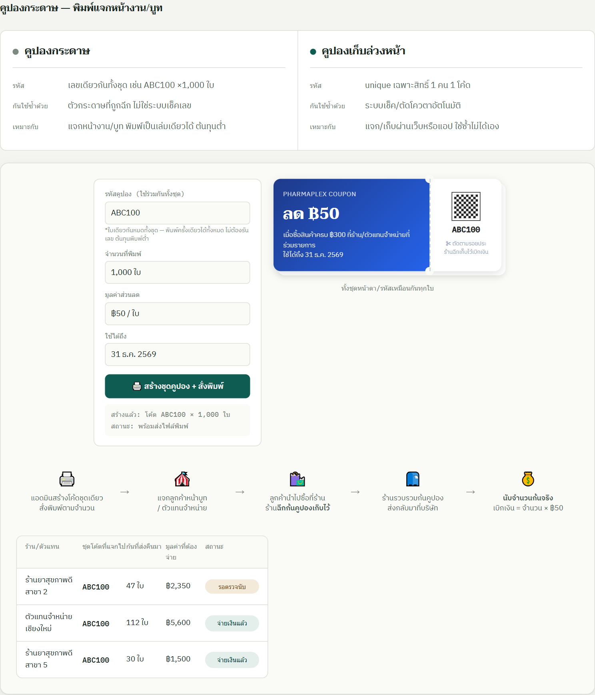

*รูป 4-2 ตัวอย่างหน้าจอ: การสร้างชุดคูปองกระดาษ และหน้าตาคูปองที่พิมพ์ออกมา*

ร้านที่ร่วมรายการฉีกก้นคูปองเก็บไว้เป็นหลักฐาน ส่งกลับมาที่บริษัท และระบบนับจำนวนก้นที่ได้รับจริงเพื่อคำนวณยอดเบิกเงิน **เบิกเงิน = จำนวนก้นที่นับได้ × มูลค่าต่อใบ** ระบบแสดงสถานะของแต่ละร้าน เช่น รอตรวจนับ หรือจ่ายเงินแล้ว คูปองกระดาษใช้ได้เฉพาะหน้าร้านหรือที่ POS เท่านั้น ไม่สามารถนำรหัสไปกรอกใช้ในเว็บได้ เพราะรหัสเหมือนกันทั้งชุดและกันการใช้ซ้ำด้วยวิธีฉีกกระดาษเท่านั้น

### 4.4 คูปองออนไลน์ (โค้ดแชร์ได้)

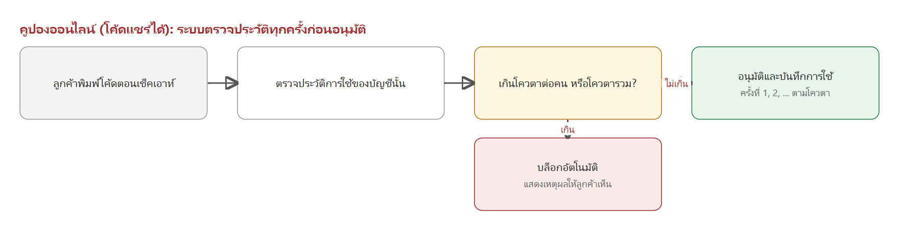

*รูป 4-3 โค้ดเดียวแจกได้ทุกคน ระบบตรวจประวัติการใช้ของบัญชีนั้นทุกครั้งก่อนอนุมัติ*

แนวคิดหลักคือไม่พึ่งความไม่ซ้ำของตัวโค้ด แต่ตรวจการใช้จริงของบัญชีทุกครั้ง ถ้าเกินโควตาต่อคนหรือโควตารวมที่ตั้งไว้ ระบบจะบล็อกอัตโนมัติและแสดงเหตุผลให้ลูกค้าเห็น

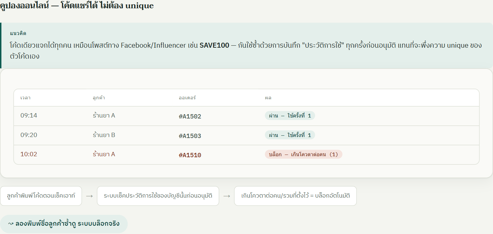

*รูป 4-4 ตัวอย่างประวัติการใช้: ครั้งแรกผ่าน ครั้งที่สองของบัญชีเดียวกันถูกบล็อกเมื่อเกินโควตาต่อคน*

### 4.5 คูปองเก็บเอง (เหมือน Shopee) และแจกอัตโนมัติทุกเดือน

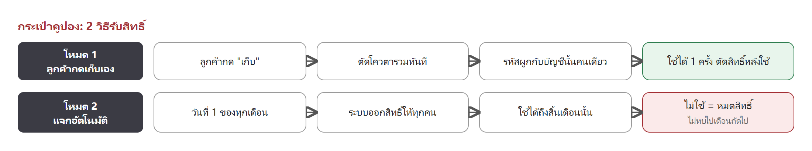

*รูป 4-5 โหมดเก็บเองและโหมดแจกอัตโนมัติใช้การตั้งค่าเดียวกัน ต่างกันที่วิธีรับสิทธิ์*

ตั้งค่าเงื่อนไขส่วนลด สินค้าที่ยกเว้น โควตา และวันหมดอายุครั้งเดียว แล้วเลือกโหมดแจก
- **โหมดเก็บเอง (เหมือน Shopee)** ลูกค้าเข้าดูคูปองที่เปิดให้เก็บในกระเป๋าคูปอง กดเก็บเอง ระบบตัดโควตารวมทันที และรหัสผูกกับบัญชีนั้นคนเดียว ใช้ได้ 1 ครั้ง
- **โหมดแจกอัตโนมัติ** ระบบออกสิทธิ์ให้ทุกคนทุกวันที่ 1 ของเดือน ใช้ได้ถึงสิ้นเดือนนั้น ถ้าไม่ใช้จะหมดสิทธิ์

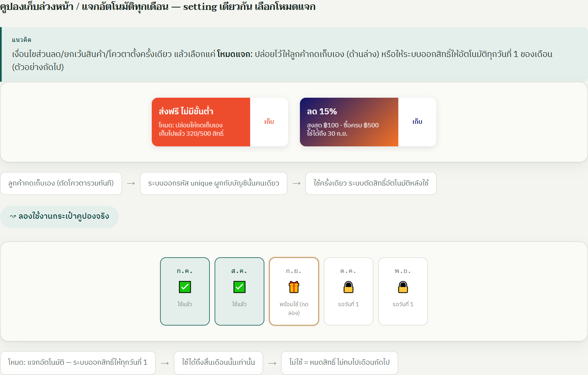

*รูป 4-6 ตัวอย่างหน้ากระเป๋าคูปอง: แต่ละเดือนแสดงสถานะว่าใช้แล้ว พร้อมใช้ หรือรอวันที่ 1*

### 4.6 คูปองสำหรับลูกค้าใหม่

- ใช้ได้เฉพาะลูกค้าที่ยังไม่เคยสั่งซื้อ (ตรวจจากประวัติการสั่งซื้อของบัญชี)
- เมื่อซื้อครบยอดที่กำหนด ได้ส่วนลดต้อนรับ เช่น ลด 300 บาท เมื่อซื้อครบ 5,000 บาท
- สิทธิ์ใช้ได้ครั้งเดียวต่อบัญชีผู้ใช้ใหม่

### 4.7 การตั้งค่าของแอดมิน

| แบบคูปอง | ตั้งค่าอะไรได้ |
|---|---|
| คูปองกระดาษ | รหัสชุด จำนวนที่พิมพ์ มูลค่าส่วนลด เงื่อนไขยอดซื้อขั้นต่ำ และวันหมดอายุ |
| คูปองออนไลน์ (โค้ดแชร์ได้) | โค้ด มูลค่าหรือรูปแบบส่วนลด โควตาต่อคน โควตารวม ช่วงเวลาที่ใช้ได้ และสินค้าที่ยกเว้น |
| คูปองเก็บเอง / แจกอัตโนมัติ | เงื่อนไขส่วนลด สินค้าที่ยกเว้น โควตารวม วันหมดอายุ และเลือกโหมดแจก (เก็บเองหรือแจกอัตโนมัติทุกเดือน) |
| คูปองลูกค้าใหม่ | ยอดซื้อขั้นต่ำ และมูลค่าส่วนลดต้อนรับ |
| เพดานส่วนลดสูงสุด (ทุกแบบที่เป็นส่วนลด %) | ตั้งเพดานบาทสูงสุดได้ เช่น ลด 15% สูงสุดไม่เกิน 100 บาท |

---

## 5. พอยท์และแคมเปญ

### 5.1 พอยท์สะสมอัตโนมัติเมื่อซื้อสินค้า

ลูกค้าได้พอยท์ทันทีเมื่อการชำระเงินของออเดอร์สำเร็จ ไม่ต้องกดแปลงหรือรอคิวใด ๆ พอยท์เข้าบัญชีพร้อมกับยอดสั่งซื้อ และนำไปใช้ได้ทันที

อัตราพอยท์กำหนดที่ระดับสินค้าแต่ละรายการ ไม่ได้คิดจากยอดรวมใบเสร็จ เช่น สินค้าบางรายการได้ 10 พอยท์ต่อหน่วย ส่วนสินค้าควบคุมราคา ยาน้ำ นมผง หรือสินค้าราคาพิเศษ ตั้งค่าเป็น 0 พอยท์ได้

```
พอยท์ที่ได้จากออเดอร์ = ผลรวมของ (จำนวนที่ซื้อ × พอยท์ต่อหน่วยของสินค้านั้น × ตัวคูณของแคมเปญ)
```

ตัวอย่าง: ซื้อสินค้าที่ได้ 10 พอยท์ต่อชิ้น จำนวน 2 ชิ้น และสินค้าอีกรายการที่ได้ 0 พอยท์ รวมได้ 20 พอยท์ทันทีที่ชำระเงินสำเร็จ

ถ้ามีหลายแคมเปญที่มีตัวคูณพอยท์ active พร้อมกัน ตัวคูณจะบวกกัน เช่น แคมเปญหนึ่งตัวคูณ ×1.5 และอีกแคมเปญ ×2 ลูกค้าจะได้รับตัวคูณรวม ×3.5

พอยท์ที่ได้มีวันหมดอายุ โดยแอดมินกำหนดวันหมดอายุของพอยท์แต่ละรอบหรือแต่ละแคมเปญที่แจกพอยท์ได้เอง ไม่ได้ fix เป็นนโยบายเดียวทั้งระบบ

### 5.2 พอยท์ในบัญชีและการนำไปใช้

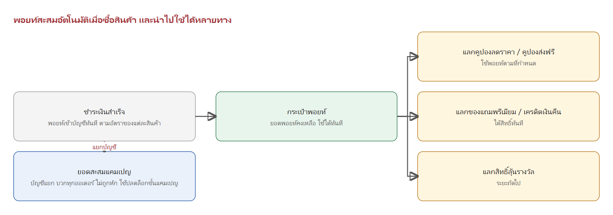

*รูป 5-1 พอยท์เข้าบัญชีทันทีเมื่อซื้อสินค้า ลูกค้านำพอยท์ไปใช้ได้หลายรูปแบบ ส่วนยอดสะสมแคมเปญเป็นอีกบัญชีหนึ่งที่แยกต่างหาก*

ลูกค้านำพอยท์ในบัญชีไปใช้ได้ดังนี้

| การใช้พอยท์ | รายละเอียด |
|---|---|
| แลกคูปองลดราคา | เช่น คูปองลด 50 บาท ใช้ 500 พอยท์ |
| แลกคูปองส่งฟรี | เช่น คูปองส่งฟรี ใช้ 300 พอยท์ |
| แลกของแถมพรีเมียม | เช่น ของแถม ใช้ 1,200 พอยท์ |
| แลกเครดิตเงินคืน | เช่น เครดิตเงินคืน 100 บาท ใช้ 1,000 พอยท์ |
| แลกสิทธิ์ลุ้นรางวัล | ตามที่ระบุในหัวข้อการสุ่มรางวัล (ระยะถัดไป) |

ยอดพอยท์คงเหลือ พอยท์ที่แลกแล้วจะถูกหักทันทีและได้สิทธิ์ใช้ทันที รายการที่แลกได้และจำนวนพอยท์กำหนดจากหน้าแอดมิน

**ยอดสะสมแคมเปญ** เป็นยอดซื้อสินค้าที่เข้าร่วมแคมเปญ ใช้ปลดล็อกรางวัลขั้นบันไดของแคมเปญสะสมยอดรายปี (หัวข้อ 5.4) ยอดนี้บวกทุกออเดอร์อัตโนมัติ ไม่ถูกหักเมื่อแลกพอยท์ และไม่สามารถนำไปแลกเป็นพอยท์หรือส่วนลดได้

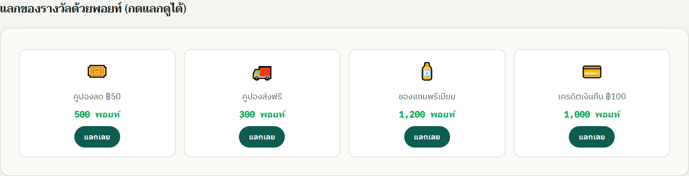

*รูป 5-2 ตัวอย่างหน้าแลกของรางวัลด้วยพอยท์ ลูกค้าเลือกแลกได้ทันทีตามจำนวนพอยท์ที่มี*

### 5.3 แคมเปญตามช่วงเวลาและโควตา

| หัวข้อ | รายละเอียด |
|---|---|
| ช่วงเวลา | กำหนดวันและเวลาเริ่มต้น–สิ้นสุดชัดเจน |
| สินค้าที่เข้าร่วม | ใช้ได้เฉพาะ SKU ที่ผูกไว้กับแคมเปญ สินค้าอื่นไม่ได้สิทธิ์ |
| โควตารวมทั้งระบบ | จำนวนสินค้าแคมเปญที่ขายได้ทั้งหมด |
| โควตาต่อร้านค้า | จำนวนสินค้าแคมเปญสูงสุดที่ร้านแต่ละร้านซื้อได้ |
| การพักโควตา | ระหว่างขั้นตอนชำระเงินระบบพักโควตาไว้ 15 นาที ถ้าชำระไม่สำเร็จโควตาคืนกลับเข้าระบบ |

### 5.4 แคมเปญสะสมยอดรายปี

สำหรับร้านขายส่งที่ทำสัญญาสะสมยอดซื้อรายปี แคมเปญจะปลดล็อกรางวัลตามขั้นบันไดของยอดสะสม รางวัลบางรายการไม่ได้อยู่ในคลังสินค้า POS เช่น ตั๋วเดินทาง หรือเครื่องใช้ไฟฟ้า ยอดสะสมจะรีเซ็ตเป็นศูนย์ทุกครั้งที่ขึ้นสัญญาปีใหม่ ไม่สะสมข้ามปี

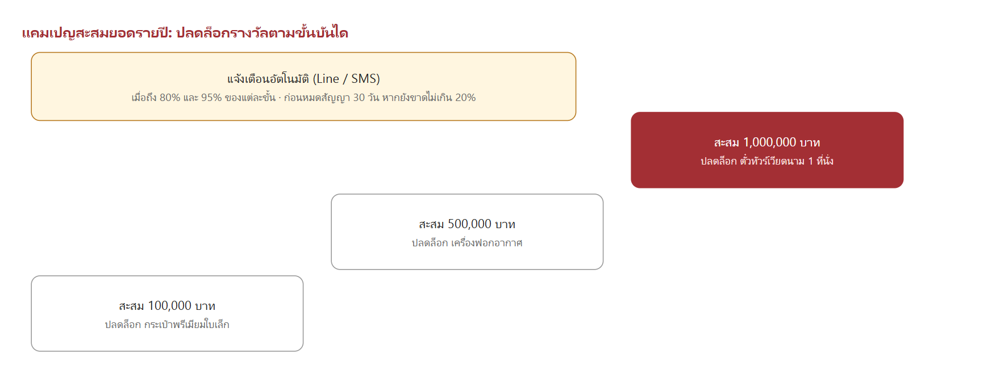

*รูป 5-3 ตัวอย่างขั้นบันไดของแคมเปญสะสมยอดรายปี*

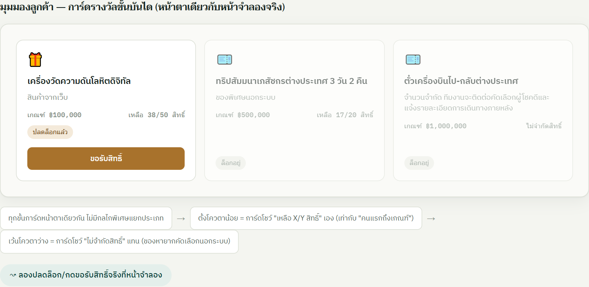

*รูป 5-4 ตัวอย่างหน้าจอ: การ์ดแต่ละขั้นแสดงเกณฑ์ สิทธิ์คงเหลือ และสถานะปลดล็อก ทุกขั้นใช้สิทธิ์ได้จนกว่าแคมเปญจะสิ้นสุด*

- รางวัลแต่ละขั้นแสดงจำนวนสิทธิ์คงเหลือ หรือแสดงว่าไม่จำกัดสิทธิ์สำหรับรางวัลที่คัดเลือกนอกระบบ
- เมื่อถึงยอดของขั้นนั้น ลูกค้ากดขอรับสิทธิ์ได้ทันที
- ไม่มีกำหนดวันหมดสิทธิ์การรับรางวัล ใช้สิทธิ์ได้จนกว่าแคมเปญจะสิ้นสุด

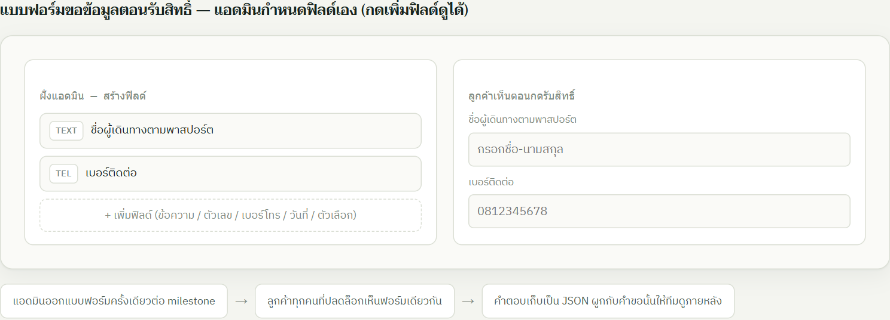

*รูป 5-5 แอดมินออกแบบฟอร์มขอข้อมูลตอนรับสิทธิ์ได้เอง เช่น ชื่อผู้เดินทางตามพาสปอร์ตและเบอร์ติดต่อ ลูกค้าทุกคนที่ปลดล็อกเห็นฟอร์มเดียวกัน*

### 5.5 การตั้งค่าของแอดมิน

| หัวข้อ | รายละเอียด |
|---|---|
| พอยท์ราย SKU | ตั้งพอยท์ต่อหน่วยของสินค้าแต่ละรายการเอง ปิดเป็น 0 พอยท์ได้ |
| ตัวคูณแคมเปญ | ตั้งตัวคูณพอยท์พิเศษสำหรับช่วงแคมเปญ |
| รายการแลกของรางวัล | เพิ่ม ลบ หรือแก้ไขของรางวัล และกำหนดจำนวนพอยท์ที่ใช้แลกแต่ละรายการ |
| แคมเปญตามช่วงเวลา | ผูก SKU ที่เข้าร่วม ตั้งช่วงเวลา และโควตารวม / โควตาต่อร้านค้า (รายละเอียดหัวข้อ 5.3) |
| แคมเปญสะสมยอดรายปี | ตั้งเกณฑ์ยอดสะสมแต่ละขั้น ของรางวัล (รวมของที่ไม่อยู่ใน POS) และออกแบบฟอร์มขอข้อมูลตอนรับสิทธิ์เอง ยอดสะสมรีเซ็ตเองทุกปีสัญญาใหม่ |
| วันหมดอายุพอยท์ | กำหนดวันหมดอายุของพอยท์แต่ละรอบหรือแคมเปญที่แจกได้เอง |

---

## 6. การสุ่มรางวัล

### 6.1 คืออะไร

การสุ่มรางวัลคือกิจกรรมที่ลูกค้าได้รับ "สิทธิ์ลุ้น" จากการกระทำต่าง ๆ ในระบบ แล้วนำสิทธิ์ไปลุ้นรางวัล ทุกทางที่ได้สิทธิ์รวมลงเป็นหน่วยกลางหน่วยเดียว ทำให้เปิดกิจกรรมใหม่ในอนาคตได้โดยไม่ต้องสร้างระบบใหม่ เพียงกำหนดว่ารอบนั้นรับสิทธิ์จากทางใดและแจกอะไร

### 6.2 สิทธิ์ลุ้นและทางเข้า

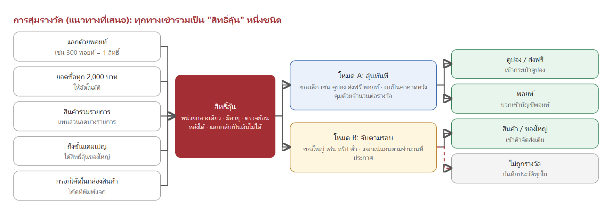

*รูป 6-1 สิทธิ์ลุ้นได้จากหลายทาง ทุกทางรวมเป็นสิทธิ์ชนิดเดียว แล้วเข้าสู่โหมดการจับรางวัลที่เหมาะกับของรางวัลนั้น*

| ทางเข้า | ตัวอย่าง |
|---|---|
| แลกด้วยพอยท์ | 300 พอยท์ได้ 1 สิทธิ์ ต่อยอดจากรายการแลกของที่มีอยู่แล้ว |
| ยอดซื้อ | ทุกยอดซื้อ 2,000 บาทในบิลได้ 1 สิทธิ์ อัตโนมัติ |
| สินค้าร่วมรายการ | แทนส่วนลดของสินค้าบางรายการ |
| ขั้นแคมเปญ | ถึงยอดสะสมขั้นนั้นได้สิทธิ์ลุ้นรางวัลใหญ่ |
| โค้ดในกล่องสินค้า | กรอกโค้ดที่พิมพ์แจกเพื่อรับสิทธิ์ |

สิทธิ์ลุ้นมีอายุ นับแยกต่อคน และตรวจย้อนหลังได้ทุกใบ สิทธิ์ที่ได้มาแล้วแลกกลับเป็นพอยท์หรือเงินไม่ได้

### 6.3 สองโหมดการจับรางวัล

| หัวข้อ | โหมด A: ลุ้นทันที | โหมด B: จับตามรอบ |
|---|---|---|
| วิธีการ | กดใช้สิทธิ์แล้วรู้ผลทันที | เก็บสิทธิ์รวมกันไว้ ถึงกำหนดจึงจับพร้อมกัน |
| เหมาะกับ | ของเล็ก เช่น คูปอง ส่งฟรี พอยท์ ของแถม | ของใหญ่ เช่น ทริป ทอง ตั๋วเครื่องบิน |
| งบประมาณ | เป็นค่าคาดหวัง คุมด้วยจำนวนต่อรางวัลและเพดานงบต่อวัน | แน่นอน แจกตามจำนวนที่ประกาศ |
| ประสบการณ์ | ลูกค้าเห็นผลทันที กลับมาเล่นบ่อย | สร้างจุดสนใจเป็นอีเวนต์ประกาศผลรายเดือนหรือไตรมาส |

ของรางวัลใหญ่ควรใช้โหมด B เพราะโหมด A ผลลัพธ์จริงอาจเกิดได้สองทาง คือไม่มีใครถูกเลย หรือถูกพร้อมกันหลายคนในวันเดียว โหมด B ทำให้แจกของใหญ่แน่นอนตามจำนวนที่ประกาศไว้ตั้งแต่ก่อนเปิดกิจกรรม

### 6.4 การตั้งค่าน้ำหนักและงบประมาณ

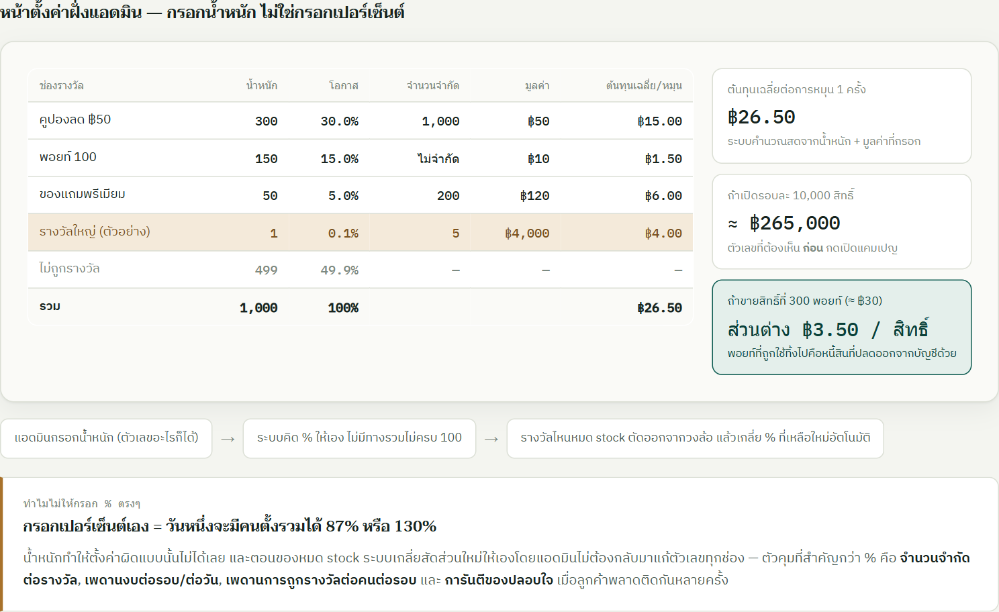

*รูป 6-2 ตัวอย่างหน้าแอดมิน: แอดมินกรอกน้ำหนักของแต่ละรางวัล ระบบคำนวณโอกาสและค่าใช้จ่ายเฉลี่ยต่อการหมุนให้ทันที*

- แอดมินกรอก **น้ำหนัก** ไม่ต้องกรอกเปอร์เซ็นต์ ระบบคำนวณโอกาสให้เอง ทำให้รวมไม่ครบ 100% ไม่ได้
- ตัวเลขที่ต้องเห็นก่อนเปิดกิจกรรมคือ ต้นทุนเฉลี่ยต่อการหมุน และงบรวมเมื่อคูณจำนวนสิทธิ์ทั้งรอบ
- เมื่อรางวัลใดหมดจำนวน ระบบตัดออกจากการจับและเกลี่ยสัดส่วนที่เหลือให้อัตโนมัติ
- ตัวคุมงบที่สำคัญคือ จำนวนจำกัดต่อรางวัล เพดานงบต่อรอบหรือต่อวัน เพดานการถูกรางวัลต่อคนต่อรอบ และการันตีของปลอบใจเมื่อลูกค้าพลาดติดกันหลายครั้ง
- จำกัดจำนวนสิทธิ์ลุ้นที่ลูกค้าคนเดียวซื้อสะสมได้ต่อรอบหรือต่อวัน (กันลูกค้ารายเดียวกว้านสิทธิ์ทั้งหมด) แอดมินตั้งค่าเพดานนี้ได้

### 6.5 ได้รางวัลแล้วไปไหน

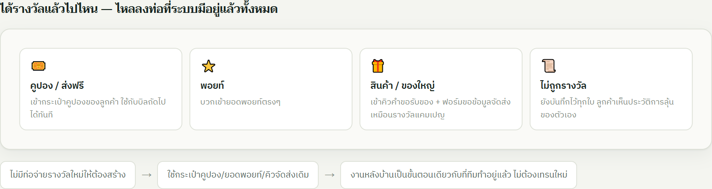

*รูป 6-3 รางวัลไม่ได้ต้องใช้ระบบใหม่ ทุกรางวัลไหลเข้าช่องทางที่มีอยู่แล้ว*

| ผลรางวัล | ไปที่ไหน |
|---|---|
| คูปอง / ส่งฟรี | เข้ากระเป๋าคูปอง ใช้กับบิลถัดไปได้ทันที |
| พอยท์ | บวกเข้ายอดพอยท์ |
| สินค้า / ของใหญ่ | เข้าคิวคำขอรับของ พร้อมฟอร์มข้อมูลจัดส่งเหมือนรางวัลแคมเปญ |
| ไม่ถูกรางวัล | บันทึกไว้ทุกใบ ลูกค้าดูประวัติการลุ้นของตัวเองได้ |

### 6.6 ความโปร่งใสและการตรวจสอบ

1. **ผลถูกตัดสินที่เซิร์ฟเวอร์ก่อนแสดงผล** วงล้อ บัตรขูด หรือกล่องของขวัญเป็นเพียงภาพเคลื่อนไหวเพื่อเปิดเผยผล จะไม่มีการสุ่มที่เครื่องลูกค้า
2. **บันทึกทุกใบที่ถูกใช้** ระบุว่าใครใช้ เมื่อไหร่ มาจากทางใด ได้อะไร และน้ำหนักหรือของคงเหลือตอนนั้นเป็นเท่าไร
3. **โหมดจับตามรอบมีการประกาศก่อนจับ** ประกาศจำนวนสิทธิ์ทั้งกองพร้อมรหัสยืนยัน เมื่อจับเสร็จเปิดเผยรหัสจริงพร้อมรายชื่อ ผู้เข้าร่วมตรวจสอบได้ว่าผลไม่ได้เลือกทีหลัง
4. **แก้ผลย้อนหลังไม่ได้** แอดมินทำได้เพียงเพิ่มรางวัลชดเชย ซึ่งบันทึกเป็นรายการแยกและเห็นชัดว่าใครอนุมัติ

### 6.7 ข้อควรตรวจสอบก่อนเปิดใช้งานจริง

การจัดชิงโชคหรือจับรางวัลมีข้อกำหนดทางกฎหมายและภาษีที่ต้องตรวจกับฝ่ายกฎหมายและฝ่ายบัญชี ทั้งเรื่องการขออนุญาตจัดกิจกรรมที่มีการเสี่ยงโชค และภาระภาษีของมูลค่ารางวัล เอกสารนี้ไม่ได้ให้คำตอบด้านกฎหมาย

ข้อสังเกตเชิงออกแบบ รูปแบบที่ลูกค้าได้สิทธิ์จากการซื้อสินค้าหรือแลกพอยท์ โดยทั่วไปตรงไปตรงมากว่ารูปแบบที่ลูกค้าจ่ายเงินเพื่อซื้อสิทธิ์ลุ้นโดยตรง

### 6.8 ลำดับการพัฒนา

| ระยะ | ขอบเขต |
|---|---|
| ระยะที่ 1 | โหมดลุ้นทันที แลกพอยท์เป็นสิทธิ์ และหน้าตั้งค่าน้ำหนักที่เห็นงบประมาณแบบสด |
| ระยะที่ 2 | เปิดทางรับสิทธิ์จากยอดซื้อและสินค้าร่วมรายการ ประวัติการลุ้น และรายงานงบที่จ่ายจริง |
| ระยะที่ 3 | โหมดจับตามรอบสำหรับของใหญ่ พร้อมประกาศกองสิทธิ์และรหัสยืนยัน |

### 6.9 การตั้งค่าของแอดมิน

| หัวข้อ | รายละเอียด |
|---|---|
| ทางเข้าของสิทธิ์ลุ้น | เปิดหรือปิดได้ทีละทาง (แลกพอยท์ ยอดซื้อ สินค้าร่วมรายการ ขั้นแคมเปญ โค้ดในกล่อง) และตั้งอัตราแลกของแต่ละทาง เช่น กี่พอยท์ หรือกี่บาท ต่อ 1 สิทธิ์ |
| รางวัลและน้ำหนัก | เพิ่มรายการรางวัล กรอกน้ำหนัก จำนวนจำกัด และมูลค่าต่อรางวัล (รายละเอียดหัวข้อ 6.4) |
| ตัวคุมงบ | เพดานงบต่อรอบหรือต่อวัน เพดานการถูกรางวัลต่อคนต่อรอบ และของปลอบใจการันตี |
| โหมดการจับ | เลือกต่อรางวัลว่าใช้โหมดลุ้นทันทีหรือจับตามรอบ |
| เพดานสิทธิ์ต่อคน | จำกัดจำนวนสิทธิ์ลุ้นสะสมที่ลูกค้าคนเดียวซื้อได้ต่อรอบหรือต่อวัน |

---

## 7. เซตร้านยาเปิดใหม่

### 7.1 คืออะไร และใช้เมื่อไหร่

เซตร้านยาเปิดใหม่คือชุดสินค้าเริ่มต้นสำหรับผู้ที่กำลังเปิดร้านยาใหม่ ลูกค้าสามารถเลือกซื้อทั้งเซตและปรับรายการทางเลือกได้ตามความต้องการ ใช้ได้กับเซตขนาดมาตรฐานหรือเซตที่แอดมินกำหนดเพิ่มเอง

ใช้ได้เฉพาะลูกค้าประเภทร้านค้า (B2B) เท่านั้น ไม่เปิดให้ลูกค้าทั่วไป (B2C)

ลูกค้าสั่งซื้อเองผ่านหน้าเว็บได้โดยตรง หรือให้แอดมิน/เซลล์เข้าไปสั่งซื้อแทนในหน้าแอดมินก็ได้ ทั้งสองทางใช้ราคาและเงื่อนไขชุดเดียวกัน

### 7.2 สินค้าบังคับและสินค้าทางเลือก

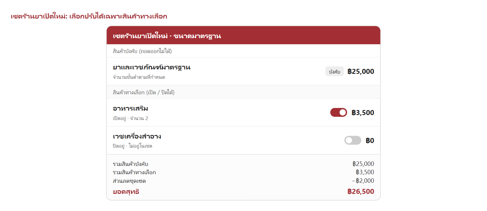

*รูป 7-1 สินค้าบังคับทุกรายการต้องอยู่ในเซต ลูกค้าปิดสินค้าทางเลือกได้ และยอดสุทธิคำนวณใหม่ทันที*

| ประเภท | การถอดออกจากเซต | จำนวนขั้นต่ำ | การแสดงผล |
|---|---|---|---|
| สินค้าบังคับ | ถอดออกไม่ได้ | ต้องครบตามที่กำหนด | ล็อกไว้ พร้อมป้าย "บังคับ" |
| สินค้าทางเลือก | ถอดออกได้ | 0 เมื่อไม่เลือก | สวิตช์เปิด-ปิด |

- **สินค้าบังคับ** คือยาและเวชภัณฑ์มาตรฐานที่จำเป็นต้องมีในร้านตามกฎหมายหรือเป็นแกนหลักของเซต
- **สินค้าทางเลือก** คืออาหารเสริม เวชเครื่องสำอาง หรือสินค้าเสริมอื่น ๆ
- ถ้าสินค้าบังคับในเซตหมดสต็อกระหว่างลูกค้ากำลังสั่งซื้อ ระบบจะบล็อกการสั่งทั้งเซตไว้ก่อน จนกว่าแอดมินจะเติมสต็อก

### 7.3 การคิดราคา

```
ราคาเซตรวม = ผลรวมสินค้าบังคับ + ผลรวมสินค้าทางเลือกที่เลือก − ส่วนลดชุดเซต
```

ตัวอย่าง: สินค้าบังคับ 25,000 บาท + สินค้าทางเลือกที่เลือก 3,500 บาท − ส่วนลดชุดเซต 2,000 บาท = **26,500 บาท**

### 7.4 การตั้งค่าของแอดมิน

| หัวข้อ | รายละเอียด |
|---|---|
| ข้อมูลเซต | ชื่อเซต คำอธิบาย และเปิด/ปิดการขาย |
| สินค้าบังคับ | เลือกสินค้าและตั้งจำนวนขั้นต่ำที่ต้องซื้อ |
| สินค้าทางเลือก | เลือกสินค้าและตั้งจำนวนเริ่มต้นที่แนะนำ |
| ส่วนลดชุดเซต | ตั้งส่วนลดรวมเมื่อซื้อทั้งเซต |
| ลูกค้าที่สั่งซื้อได้ | เฉพาะบัญชีร้านค้า (B2B) เท่านั้น |
| สั่งซื้อแทนลูกค้า | แอดมิน/เซลล์เลือกบัญชีลูกค้าแล้วสั่งซื้อแทนได้จากหน้าแอดมิน |
