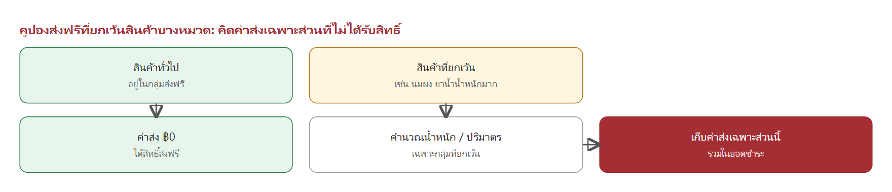

# Spec ระบบโปรโมชั่น คูปอง พอยท์ แคมเปญ สุ่มรางวัล และบริการสั่งทำพิเศษ
## Pharmaplex E-Commerce Platform

ฉบับ 1.0 · 6 ตุลาคม 2569 · เอกสารสำหรับนำเสนอและตรวจทาน

---

## 1. ภาพรวมของระบบ

### 1.1 ระบบนี้คืออะไร

Pharmaplex เป็นแพลตฟอร์มซื้อขายยาและเวชภัณฑ์ ทั้งสำหรับร้านค้าที่สั่งซื้อจำนวนมาก (B2B) และลูกค้าทั่วไป (B2C) เอกสารนี้อธิบายว่าระบบมีอะไรบ้าง แต่ละส่วนทำงานอย่างไร ใช้ตอนไหน และมีรูปแบบอะไรให้เลือกใช้

ระบบประกอบด้วยหน้าร้านออนไลน์ หน้าจอแอดมิน และการเชื่อมต่อกับระบบขายหน้าร้าน (POS) และช่องทางชำระเงิน โดยมี 6 โมดูลหลักที่เอกสารนี้อธิบาย

### 1.2 ภาพรวมการเชื่อมต่อ


*รูป 1-1 ผู้ใช้งานแต่ละกลุ่มเข้าสู่ระบบผ่านหน้าร้านหรือหน้าแอดมิน ระบบกลางรวบรวมกติกาทุกโมดูลไว้ที่เดียว และส่งข้อมูลการขายไปยัง POS และช่องทางชำระเงิน*

### 1.3 โมดูลทั้งหมดในระบบ

| โมดูล | คืออะไร | ใช้เมื่อไหร่ | มีกี่แบบ |
|---|---|---|---|
| บริการสั่งทำพิเศษ | สั่งผลิตสินค้าตามแบบของร้าน เช่น ซองยาพิมพ์ชื่อร้าน | ร้านต้องการบรรจุภัณฑ์เฉพาะที่ไม่มีในสต็อก | 4 ประเภทสินค้า และทุกประเภทเลือกตัวเลือกได้หลายแบบ |
| โปรโมชั่น | ส่วนลดที่เกิดขึ้นอัตโนมัติตอนซื้อ ไม่ต้องใส่โค้ด | ต้องการกระตุ้นการซื้อสินค้ากลุ่มหนึ่ง | 4 แบบ |
| คูปอง | สิทธิ์ส่วนลดที่ลูกค้าต้องได้รับก่อนจึงใช้ได้ | แจกหน้างาน ส่งเสริมการขายผ่านเว็บ หรือแจกประจำเดือน | 4 แบบ และคูปองส่งฟรีที่ยกเว้นหมวดได้ |
| พอยท์และแคมเปญ | สะสมพอยท์ราย SKU และรางวัลปลดล็อกตามยอดสะสม | ให้ลูกค้าสะสมยอดและแลกของ | พอยท์ 1 ระบบ และแคมเปญ 2 แบบ |
| การสุ่มรางวัล | เปลี่ยนพอยท์ ยอดซื้อ หรือโค้ด เป็นสิทธิ์ลุ้นรางวัล | กิจกรรมส่งเสริมการขายที่มีของรางวัลหลากหลาย | 2 โหมดการจับรางวัล (อยู่ระหว่างตกลงรายละเอียด) |
| เซตร้านยาเปิดใหม่ | ชุดสินค้าเริ่มต้นสำหรับร้านยาที่เพิ่งเปิด ปรับรายการได้ | ผู้ที่ต้องการเปิดร้านยาใหม่ | 2 ประเภทรายการ บังคับและทางเลือก |

### 1.4 ผู้ใช้งานและหน้าที่

| ผู้ใช้งาน | ทำอะไรได้ในระบบ |
|---|---|
| ลูกค้า (สมาชิก / ร้านค้า) | สั่งซื้อ ชำระเงิน ตรวจแบบ อนุมัติหรือขอแก้ไข ใช้คูปองและพอยท์ ติดตามสถานะ |
| แอดมิน | ตั้งค่าสินค้า โปรโมชั่น คูปอง แคมเปญ ตรวจสลิป อนุมัติคำสั่งซื้อ ปรับจำนวนจริง เปิดบิล |
| ทีมกราฟิก | จัดทำแบบ Mockup อัปโหลดแบบให้ลูกค้าตรวจ |
| ฝ่ายจัดซื้อ / โรงงาน | รับเรื่องผลิตและส่งสินค้าเข้าคลัง |
| ทีมงานภายใน | ได้รับการแจ้งเตือนเมื่อมีเหตุการณ์สำคัญของคำสั่งซื้อ |

### 1.5 หลักการที่ใช้ทั้งระบบ

- **ไม่ต้องใส่โค้ดกับโปรโมชั่น** ส่วนลดเกิดขึ้นเองเมื่อลูกค้าเข้าเงื่อนไข
- **ราคาและส่วนลดคำนวณที่ระบบเสมอ** หน้าจอแสดงตัวอย่างให้ลูกค้าเห็น แต่ยอดที่ชำระจริงคำนวณที่เซิร์ฟเวอร์
- **กติกาปรับได้จากหน้าแอดมิน** ไม่ต้องพัฒนาใหม่เมื่อต้องการเปลี่ยนแบรนด์ หมวด ช่วงเวลา หรือจำนวนที่กำหนด
- **ตรวจย้อนหลังได้** ทุกการใช้คูปอง สิทธิ์ลุ้น และการแลกพอยท์มีประวัติให้ตรวจ

---

## 2. บริการสั่งทำพิเศษ

### 2.1 คืออะไร

บริการสั่งทำพิเศษคือการสั่งผลิตสินค้าตามความต้องการของร้าน เช่น ซองยาพิมพ์ชื่อร้าน ซองซิป ถุงหูหิ้วพิมพ์โลโก้ ม่านบังยา และสติ๊กเกอร์ติดขวด สินค้ากลุ่มนี้ไม่มีสต็อกพร้อมส่ง ต้องผลิตตามสั่งใช้เวลาประมาณ 2–4 สัปดาห์

ลูกค้าเลือกตัวเลือกของสินค้า กรอกข้อมูลที่จะพิมพ์ลงบรรจุภัณฑ์ และดูภาพ Mockup ที่เปลี่ยนตามตัวเลือกได้ทันที ก่อนชำระมัดจำและเริ่มกระบวนการออกแบบ

### 2.2 ใช้เมื่อไหร่ และมีกี่แบบ

| ประเภทสินค้า | ตัวเลือกหลัก | ขนาด / จำนวน | รูปแบบการคิดราคา |
|---|---|---|---|
| ซองซิปยา | ประเภท (ใส, สีชา, สีขาวนม, สีแดง), รูปแบบ, สี | 6×8 ถึง 12×17 ซม. · จำนวนสำเร็จรูป 5,000 ถึง 100,000 ใบ | ต่อใบ |
| ถุงหูหิ้วพลาสติก | ชนิด (HD / PE), ชนิดหูหิ้ว, รูปแบบ, สี | 4×9 ถึง 6×14 นิ้ว · ขั้นต่ำ 50 กก. | ต่อกิโลกรัม |
| ม่านบังยา | รุ่น (ขามาตรฐาน / ขาเหล็กพิเศษ), รูปแบบ, สี | 90×160 ซม. หรือกำหนดขนาดเอง | ต่อตารางเมตร รวมขาตั้ง |
| สติ๊กเกอร์ติดขวด | ขนาด, รูปแบบ, สี | ดวง 3×6, 4×7, 5×8 ซม. หรือกำหนดขนาดเอง | ต่อแผ่น A3 |

สินค้ากลุ่มนี้ต่างจากสินค้า Pre-order ทั่วไปดังนี้

| หัวข้อ | Pre-order ทั่วไป | บริการสั่งทำพิเศษ |
|---|---|---|
| การชำระเงิน | ชำระเต็มจำนวนครั้งเดียว | มัดจำ 50% ก่อน และชำระส่วนที่เหลือเมื่อผลิตเสร็จ |
| การตรวจสอบ | ไม่มี | ตรวจสลิปและอนุมัติโดยแอดมินก่อนเริ่มออกแบบ |
| แบบพิมพ์ | ไม่มี | ลูกค้าตรวจแบบและอนุมัติ หรือขอแก้ได้สูงสุด 3 ครั้ง |
| จำนวนผลิต | ตามที่สั่ง | อาจผลิตเกินหรือขาดได้ตามกระบวนการโรงงาน ปรับตามจำนวนจริง |
| การชำระอีกครั้ง | ไม่มี | มีการชำระรอบที่ 2 เมื่อมียอดค้างหรือคืนเป็น Credit Note เมื่อจ่ายเกิน |

### 2.3 ขั้นตอนการสั่งซื้อทั้งหมด


*รูป 2-1 ทั้ง 9 ขั้นตอนแบ่งตามผู้รับผิดชอบ ขั้นที่ 5 และ 7 เป็นจุดที่ลูกค้าและร้านต้องดำเนินการ*

### 2.4 รายละเอียดแต่ละขั้นตอน

**ขั้นที่ 1 เลือกตัวเลือกและกรอกข้อมูลร้าน**
ลูกค้าเลือกประเภท ขนาด จำนวน รูปแบบ และสีของสินค้า แล้วกรอกข้อมูลที่จะพิมพ์ลงบรรจุภัณฑ์ เช่น ชื่อร้าน ที่อยู่ เบอร์โทรศัพท์ และเวลาเปิดทำการ ช่องข้อมูลขึ้นอยู่กับสินค้าแต่ละรายการ ลูกค้าอัปโหลดโลโก้หรือไฟล์ตัวอย่างงานได้ (AI, EPS, PDF, SVG ที่แนะนำ และ PNG โปร่งใส / JPG ความละเอียดสูง ไม่เกิน 20 MB) และต้องยอมรับเงื่อนไขของสินค้าก่อนดำเนินการต่อ


*รูป 2-2 หน้าเลือกตัวเลือกสินค้า ภาพ Mockup ด้านบนเปลี่ยนตามประเภท ขนาด และข้อมูลที่ลูกค้ากรอก*

**ขั้นที่ 2 สรุปยอดและชำระมัดจำ 50%**
ระบบคำนวณยอดรวมและยอดมัดจำ 50% ให้ลูกค้าเห็นก่อนชำระ ลูกค้าชำระด้วยการโอนพร้อมแนบสลิป หรือสแกน QR PromptPay ยังไม่รวมค่าจัดส่งในขั้นนี้ ลูกค้าเลือกวิธีรับสินค้าและที่อยู่ได้ในขั้นนี้ แต่จะล็อกการแก้ไขหลังชำระมัดจำ


*รูป 2-3 หน้าสรุปยอดและชำระมัดจำ ยอดมัดจำคิดเป็น 50% ของยอดรวมตั้งต้น*

**ขั้นที่ 3 แอดมินตรวจสลิปและอนุมัติ**
เมื่อลูกค้าแนบสลิป แอดมินตรวจยอดเทียบกับยอดที่ต้องชำระ และตรวจความถูกต้องของข้อมูล แอดมินสามารถ
- **อนุมัติ** เพื่อเริ่มออกแบบ กำหนดส่งแบบภายใน 7 วัน
- **ส่งกลับให้แก้ไข** ลูกค้าแก้ข้อมูลหรือโลโก้แล้วส่งตรวจใหม่
- **ปฏิเสธสลิป** ลูกค้าเห็นเหตุผลและส่งสลิปใหม่ได้

**ขั้นที่ 4 ทีมกราฟิกจัดทำแบบ**
ทีมกราฟิกพิมพ์ใบสรุปความต้องการของลูกค้าจากระบบ นำไปออกแบบใน Adobe Illustrator แล้วอัปโหลดภาพ Mockup (JPG / PNG) เข้าสู่ออเดอร์ ลูกค้าได้รับแจ้งว่ามีแบบใหม่ให้ตรวจ

**ขั้นที่ 5 ลูกค้าตรวจแบบ**
ลูกค้าเข้าดูแบบในหน้า "คำสั่งซื้อของฉัน" ได้ตลอดเวลา แล้วเลือก **อนุมัติแบบ Final** หรือ **ขอแก้ไข** โดยระบุจุดที่ต้องการแก้ไขและแนบไฟล์เพิ่มได้ การขอแก้ไขทำได้ **สูงสุด 3 ครั้ง** รายละเอียดอยู่ในหัวข้อ 2.6

**ขั้นที่ 6 ส่งผลิตที่โรงงาน**
เมื่อลูกค้าอนุมัติแบบ คำสั่งซื้อเข้าสู่การผลิตและฝ่ายจัดซื้อส่งงานไปยังโรงงาน ใช้เวลาประมาณ 2–4 สัปดาห์

**ขั้นที่ 7 รับสินค้าและปรับจำนวนจริง**
โรงงานอาจผลิตได้จำนวนเกินหรือขาดจากที่สั่งได้ตามเงื่อนไขการผลิต เมื่อรับสินค้าแล้ว แอดมินปรับจำนวนจริงในออเดอร์ ระบบคำนวณยอดใหม่ทันที ส่วนที่ผลิตเกินลูกค้ารับในราคาต่อหน่วยเดิม รายละเอียดอยู่ในหัวข้อ 2.7

**ขั้นที่ 8 ชำระรอบที่ 2 หรือรับ Credit Note**
ถ้ายังมียอดค้าง ลูกค้าชำระส่วนที่เหลือผ่านหน้าเว็บ และแอดมินตรวจสลิปรอบที่ 2 ถ้าลูกค้าจ่ายเกินยอดจริง ระบบออก Credit Note ให้โดยอัตโนมัติ

**ขั้นที่ 9 เปิดบิลและส่งมอบ**
เจ้าหน้าที่เปิดบิลใน POS และกรอกเลขที่เอกสาร แล้วส่งมอบด้วยการจัดส่งหรือให้มารับที่ร้าน ลูกค้าได้รับสินค้าแล้วสถานะจะเป็น "รับสินค้าแล้ว" และปิดงาน

### 2.5 ตัวอย่างภาพ Mockup ที่ลูกค้าเห็น


*รูป 2-4 ตัวอย่าง Mockup ที่สร้างจากข้อมูลร้านและโลโก้ของลูกค้า ภาพนี้เป็นตัวอย่างเพื่อตรวจสอบเบื้องต้น แบบจริงกราฟิกจะส่งให้ตรวจก่อนผลิต*

### 2.6 การตรวจแบบและแก้ไข


*รูป 2-5 ลูปการตรวจแบบ Draft แต่ละฉบับเก็บไว้ให้ลูกค้าเปิดดูและเทียบย้อนหลังได้*

| กฎ | รายละเอียด |
|---|---|
| จำนวนครั้งที่ขอแก้ | ได้สูงสุด 3 ครั้ง ระบบรองรับ Draft รวมสูงสุด 4 ฉบับ |
| ครบ 3 ครั้งแล้ว | ปุ่มขอแก้ถูกล็อก เหลือเพียง "ยืนยัน" และ "ติดต่อเจ้าหน้าที่" |
| กำหนดส่งแบบ | ภายใน 7 วันนับจากวันที่แอดมินอนุมัติมัดจำ ลูกค้าเห็นกำหนดนี้ตั้งแต่ก่อนชำระ |
| แจ้งว่ามีแบบใหม่ | ลูกค้าเห็นป้าย "แบบใหม่" จนกว่าจะเปิดดู ปุ่มดูตัวอย่างงานกระพริบจนกว่าจะกดดูครั้งแรก |
| ถอนแบบที่ส่งผิด | ทีมกราฟิกถอน Draft ล่าสุดได้ ถ้าลูกค้ายังไม่เปิดดู และการถอนไม่นับเป็นรอบแก้ไข |
| อนุมัติแทนลูกค้า | ถ้าลูกค้ายืนยันผ่านช่องทางอื่น แอดมินอนุมัติแทนได้ และระบบบันทึกไว้ว่าอนุมัติโดยแอดมิน |

### 2.7 การคิดเงินและมัดจำ

**สูตรการคิดเงิน**

```
มัดจำรอบแรก = ยอดรวมตั้งต้น × 50%
ยอดชำระรอบที่ 2 = ยอดรวมหลังปรับจำนวนจริง − ยอดที่ชำระแล้ว
ยอดรวมหลังปรับ = (จำนวนจริง × ราคาต่อหน่วย + ค่าบล็อค) + ค่าจัดส่ง − ส่วนลด
```

**ตัวอย่างการคำนวณ** (ราคา 1 บาทต่อใบ สั่ง 5,000 ใบ และโรงงานผลิตได้จริง 5,500 ใบ)

| รายการ | จำนวน | ยอดเงิน (บาท) | หมายเหตุ |
|---|---|---|---|
| ค่าสินค้าตามที่สั่ง | 5,000 ใบ × 1 | 5,000.00 | ยอดรวมตั้งต้น |
| มัดจำรอบแรก 50% | | 2,500.00 | ชำระก่อนเริ่มออกแบบ |
| ผลิตได้จริงเกิน | +500 ใบ × 1 | +500.00 | แอดมินปรับจำนวนจริง |
| ยอดรวมหลังปรับ | 5,500 ใบ | 5,500.00 | ยอดที่ลูกค้าต้องชำระทั้งหมด |
| **ยอดค้างชำระรอบที่ 2** | | **3,000.00** | 5,500 − 2,500 |

**ตัวอย่างกรณีโรงงานผลิตขาด** ถ้าผลิตได้จริง 4,800 ใบ (ขาด 200 ใบ) และลูกค้าชำระมัดจำ 2,500 บาทไว้แล้ว ยอดรวมหลังปรับคือ 4,800 บาท ลูกค้าจึงมียอดค้างชำระ 2,300 บาท หากชำระเต็มจำนวนแล้วมียอดจ่ายเกินจากการปรับลด ระบบจะออก Credit Note ให้ตามส่วนต่าง

**ข้อกำหนดเพิ่มเติม**
- ส่วนที่ผลิตเกินลูกค้ารับทั้งหมดในราคาต่อหน่วยเดิม
- ส่วนลด (ถ้ามี) เป็นจำนวนเงินคงที่ ไม่เพิ่มตามจำนวนส่วนที่เกิน
- ค่าบล็อคคิดเมื่อลูกค้าสั่งครั้งแรก และแอดมินปรับได้ก่อนเปิดบิล
- ค่าจัดส่งคิดในรอบที่ 2 ไม่รวมในยอดมัดจำ

### 2.8 สถานะคำสั่งซื้อ


*รูป 2-6 สถานะหลักของคำสั่งซื้อ ลูกค้าติดตามสถานะได้ที่ "คำสั่งซื้อของฉัน" ในหน้าสมาชิก*

### 2.9 การยกเลิกและการคืนเงิน

| กรณี | ผลที่เกิดขึ้น |
|---|---|
| ลูกค้ายกเลิกก่อนอนุมัติมัดจำ | ยกเลิกได้ทันที ไม่มียอดค้าง |
| ลูกค้ายกเลิกหลังอนุมัติมัดจำ | ยอดที่ชำระแล้วคืนเป็น Credit Note ใช้กับการสั่งซื้อครั้งถัดไปได้ |
| แอดมินยกเลิกก่อนเปิดบิล | ยอดที่ชำระแล้วคืนเป็น Credit Note |
| ชำระเกินยอดจริงหลังปรับจำนวน | ออก Credit Note ให้ส่วนต่างอัตโนมัติ |

การชำระเงินทำได้ด้วยการโอนพร้อมแนบสลิป หรือ QR PromptPay เท่านั้น ไม่รับบัตรเครดิต และไม่รับเครดิตร้านค้าเป็นวิธีชำระ

---

## 3. โปรโมชั่น

### 3.1 คืออะไร และใช้เมื่อไหร่

โปรโมชั่นคือส่วนลดที่เกิดขึ้นเองเมื่อลูกค้าใส่สินค้าลงตะกร้าและเข้าเงื่อนไข ลูกค้าไม่ต้องกรอกโค้ดหรือติ๊กขอส่วนลด แอดมินใช้โปรโมชั่นเมื่อต้องการกระตุ้นการซื้อสินค้ากลุ่มใดกลุ่มหนึ่ง เช่น ช่วงวันพิเศษ ซื้อคู่กันให้ถูกลง หรือซื้อตามยอดเพื่อรับของแถม

### 3.2 มีกี่แบบ

| แบบ | ลูกค้าได้อะไร | ตัวอย่าง |
|---|---|---|
| ซื้อคู่สินค้าที่เข้ากัน | ราคารวมถูกกว่าซื้อแยก และระบบแนะนำให้เองเมื่อดูสินค้าตัวแรก | นมผงสูตร 3 + ขวดนม ซื้อคู่ลดรวม 100 บาท |
| ลดกลุ่มสินค้าตามวัน | ราคาทั้งหมวดลดตามเวลาที่แอดมินตั้งไว้ | ลดกลุ่มยาสามัญสูงสุด 70% ในวันพิเศษ |
| ส่วนลดท้ายบิลตามแบรนด์ | ยอดซื้อแบรนด์ที่กำหนดถึงเกณฑ์ ได้ส่วนลดในหน้าสรุปยอด | ซื้อแบรนด์ครบ 1,000 บาท ลด 100 บาท |
| ส่งฟรีตามกลุ่มสินค้า | ค่าจัดส่งฟรีเมื่อซื้อสินค้าในกลุ่มที่กำหนด ไม่มีขั้นต่ำ | ซื้อสินค้ากลุ่มนี้ได้ส่งฟรี |

### 3.3 การทำงานเมื่อลูกค้าซื้อสินค้า


*รูป 3-1 ระบบตรวจทุกกติกาที่ลูกค้าเข้าข่ายและเลือกกติกาที่มีความสำคัญสูงกว่า แล้วคิดเฉพาะกลุ่มสินค้าที่เข้าเงื่อนไข*

ตะกร้าอาจเข้าเงื่อนไขหลายโปรโมชั่นพร้อมกันได้ กติกาที่แอดมินตั้งลำดับความสำคัญ (Priority) สูงกว่าจะชนะก่อน และผลประโยชน์คิดเฉพาะสินค้าที่เข้าเงื่อนไขของกติกานั้น ไม่ได้คิดทั้งบิล

### 3.4 ซื้อคู่สินค้า ถูกกว่าซื้อแยก


*รูป 3-2 ตัวอย่างหน้าจอ: เมื่อลูกค้าเปิดดูสินค้าตัวแรก ระบบแสดงการ์ดแนะนำซื้อคู่พร้อมราคาที่ประหยัดได้ และเพิ่มทั้งคู่ลงตะกร้าได้ในครั้งเดียว*

แอดมินตั้งคู่สินค้าไว้ล่วงหน้า เมื่อลูกค้าเปิดหน้าสินค้าตัวหนึ่ง ระบบจะตรวจว่าตั้งคู่กับสินค้าอื่นไว้หรือไม่ และแสดงการ์ดแนะนำทันที ลูกค้าไม่ต้องค้นหาเอง

### 3.5 ลดกลุ่มสินค้าตามวัน


*รูป 3-3 ตัวอย่างหน้าจอ: แคมเปญวันพิเศษลดราคาทั้งหมวดสินค้า เช่น ยาสามัญ วิตามิน และเวชภัณฑ์*

แอดมินกำหนดวันและเวลา พร้อมหมวดสินค้าและเปอร์เซ็นต์ส่วนลดล่วงหน้า ถึงเวลาที่ตั้งไว้ราคาเปลี่ยนให้อัตโนมัติ เมื่อหมดเวลาราคาจะกลับเป็นปกติเอง ไม่ต้องมีคนกดปิด

### 3.6 ส่วนลดท้ายบิลและส่งฟรี


*รูป 3-4 ตัวอย่างหน้าจอ: ส่วนลดท้ายบิลและส่งฟรีแสดงขึ้นในหน้าสรุปยอดทันทีเมื่อเข้าเงื่อนไข*

ตั้งกติกาหลายข้อพร้อมกันได้ เช่น ลดท้ายบิลสำหรับแบรนด์หนึ่ง และส่งฟรีสำหรับอีกกลุ่มหนึ่ง ลูกค้าและพนักงานไม่ต้องกรอกหรือติ๊กอะไรเพิ่ม

### 3.7 เลือกสินค้าเข้าโปรโมชั่นอย่างไร

- แอดมินเลือกเป้าหมายเป็น **แบรนด์** หรือ **หมวดหมู่** ก่อน ทำให้จัดการได้รวดเร็ว ไม่ต้องเลือกทีละรายการ
- หลังจากนั้นสามารถ **ยกเว้นสินค้าบางรายการ** ที่ไม่ต้องการให้เข้าร่วมได้
- การเปลี่ยนแปลงมีผลทันทีกับทุกตะกร้าที่ยังไม่ชำระ

### 3.8 การแสดงผลหน้าเว็บ

- **ป้ายโปรโมชั่น** เช่น "ซื้อคู่ถูกกว่า", "ลดกลุ่มสินค้า" หรือ "ส่งฟรี" บนการ์ดสินค้า
- **ตัวกรองโปรโมชั่น** ลูกค้ากดดูเฉพาะสินค้าที่มีโปรโมชั่นได้จากหน้าค้นหา
- **รายละเอียดบนหน้าสินค้า** เงื่อนไขโปรโมชั่นแสดงในหน้าหลักของสินค้า ไม่ต้องกดเข้าแท็บย่อย

---

## 4. คูปอง

### 4.1 คืออะไร และใช้เมื่อไหร่

คูปองคือสิทธิ์ส่วนลดที่ลูกค้าต้อง "รับ" มาก่อนจึงใช้ได้ ต่างจากโปรโมชั่นที่เกิดขึ้นเอง คูปองเหมาะกับการแจกหน้างาน ส่งเสริมการขายผ่านช่องทางออนไลน์ หรือให้สิทธิ์ประจำเดือนแก่ลูกค้า

### 4.2 มีกี่แบบ

| แบบ | วิธีรับสิทธิ์ | การกันการใช้ซ้ำ | เหมาะกับ |
|---|---|---|---|
| คูปองกระดาษ | พิมพ์เป็นใบ ทุกใบรหัสเหมือนกันทั้งชุด | ตัวกระดาษที่ร้านฉีกเก็บไว้เป็นหลักฐาน | แจกหน้างานและบูท |
| คูปองเก็บล่วงหน้า | ลูกค้าได้รหัสเฉพาะตัว 1 คน 1 รหัส | ระบบตรวจและตัดโควตาอัตโนมัติ | แจกหรือเก็บผ่านเว็บและแอป |
| คูปองออนไลน์ (โค้ดแชร์ได้) | ใส่โค้ดตอนเช็คเอาต์ | ระบบตรวจประวัติการใช้ของบัญชีทุกครั้ง | แคมเปญที่แชร์ได้ เช่น โพสต์หรือ Influencer |
| กระเป๋าคูปอง (แจกอัตโนมัติ) | ระบบออกสิทธิ์ให้ทุกวันที่ 1 ของเดือน | ใช้ได้ถึงสิ้นเดือน ไม่ทบไปเดือนถัดไป | สิทธิ์ประจำเดือน |

### 4.3 คูปองกระดาษ


*รูป 4-1 ตั้งแต่แอดมินสร้างชุดคูปองจนถึงการเบิกเงินกับร้านที่ร่วมรายการ*

ตัวอย่างหน้าจอ: แอดมินกำหนดรหัส จำนวนที่พิมพ์ มูลค่าส่วนลด และวันหมดอายุ ระบบจะออกไฟล์พิมพ์ให้ทันที


*รูป 4-2 ตัวอย่างหน้าจอ: การสร้างชุดคูปองกระดาษ และหน้าตาคูปองที่พิมพ์ออกมา*

ร้านที่ร่วมรายการฉีกก้นคูปองเก็บไว้เป็นหลักฐาน ส่งกลับมาที่บริษัท และระบบนับจำนวนก้นที่ได้รับจริงเพื่อคำนวณยอดเบิกเงิน **เบิกเงิน = จำนวนก้นที่นับได้ × มูลค่าต่อใบ** ระบบแสดงสถานะของแต่ละร้าน เช่น รอตรวจนับ หรือจ่ายเงินแล้ว

### 4.4 คูปองออนไลน์ (โค้ดแชร์ได้)


*รูป 4-3 โค้ดเดียวแจกได้ทุกคน ระบบตรวจประวัติการใช้ของบัญชีนั้นทุกครั้งก่อนอนุมัติ*

แนวคิดหลักคือไม่พึ่งความไม่ซ้ำของตัวโค้ด แต่ตรวจการใช้จริงของบัญชีทุกครั้ง ถ้าเกินโควตาต่อคนหรือโควตารวมที่ตั้งไว้ ระบบจะบล็อกอัตโนมัติและแสดงเหตุผลให้ลูกค้าเห็น


*รูป 4-4 ตัวอย่างประวัติการใช้: ครั้งแรกผ่าน ครั้งที่สองของบัญชีเดียวกันถูกบล็อกเมื่อเกินโควตาต่อคน*

### 4.5 คูปองเก็บล่วงหน้าและกระเป๋าคูปอง


*รูป 4-5 โหมดกดเก็บเองและโหมดแจกอัตโนมัติใช้การตั้งค่าเดียวกัน ต่างกันที่วิธีรับสิทธิ์*

ตั้งค่าเงื่อนไขส่วนลด สินค้าที่ยกเว้น โควตา และวันหมดอายุครั้งเดียว แล้วเลือกโหมดแจก
- **โหมดกดเก็บเอง** ลูกค้ากดเก็บคูปองเอง ระบบตัดโควตารวมทันที และรหัสผูกกับบัญชีนั้นคนเดียว ใช้ได้ 1 ครั้ง
- **โหมดแจกอัตโนมัติ** ระบบออกสิทธิ์ให้ทุกคนทุกวันที่ 1 ของเดือน ใช้ได้ถึงสิ้นเดือนนั้น ถ้าไม่ใช้จะหมดสิทธิ์


*รูป 4-6 ตัวอย่างหน้ากระเป๋าคูปอง: แต่ละเดือนแสดงสถานะว่าใช้แล้ว พร้อมใช้ หรือรอวันที่ 1*

### 4.6 คูปองสำหรับลูกค้าใหม่

- ใช้ได้เฉพาะลูกค้าที่ยังไม่เคยสั่งซื้อ (ตรวจจากประวัติการสั่งซื้อของบัญชี)
- เมื่อซื้อครบยอดที่กำหนด ได้ส่วนลดต้อนรับ เช่น ลด 300 บาท เมื่อซื้อครบ 5,000 บาท
- สิทธิ์ใช้ได้ครั้งเดียวต่อบัญชีผู้ใช้ใหม่

### 4.7 คูปองส่งฟรีที่ยกเว้นหมวดสินค้า

คูปองส่งฟรีกำหนดหมวดสินค้าที่ไม่ร่วมรายการได้ เช่น นมผง หรือยาน้ำที่มีน้ำหนักมาก ตัวอย่างการคิดค่าจัดส่งเมื่อตะกร้ามีทั้งสองกลุ่ม



*รูป 4-7 ส่วนที่ได้สิทธิ์ส่งฟรีจะไม่ถูกเก็บค่าส่ง ระบบเก็บค่าส่งเฉพาะส่วนที่ยกเว้น โดยคำนวณจากน้ำหนักและปริมาตรของกลุ่มที่ยกเว้นเท่านั้น*

1. แบ่งสินค้าในตะกร้าเป็นกลุ่มส่งฟรีได้และกลุ่มที่ถูกยกเว้น
2. คำนวณน้ำหนักและปริมาตรเฉพาะกลุ่มที่ยกเว้น
3. ดูค่าจัดส่งจากตารางตามน้ำหนัก ปริมาตร และโซนจัดส่ง
4. คูปองส่งฟรีทำให้ค่าจัดส่งของกลุ่มส่งฟรีเป็น 0 บาท ลูกค้าจ่ายเฉพาะค่าจัดส่งส่วนที่ยกเว้น

---

## 5. พอยท์และแคมเปญ

### 5.1 พอยท์สะสมอัตโนมัติเมื่อซื้อสินค้า

ลูกค้าได้พอยท์ทันทีเมื่อการชำระเงินของออเดอร์สำเร็จ ไม่ต้องกดแปลงหรือรอคิวใด ๆ พอยท์เข้าบัญชีพร้อมกับยอดสั่งซื้อ และนำไปใช้ได้ทันที

อัตราพอยท์กำหนดที่ระดับสินค้าแต่ละรายการ ไม่ได้คิดจากยอดรวมใบเสร็จ เช่น สินค้าบางรายการได้ 10 พอยท์ต่อหน่วย ส่วนสินค้าควบคุมราคา ยาน้ำ นมผง หรือสินค้าราคาพิเศษ ตั้งค่าเป็น 0 พอยท์ได้

```
พอยท์ที่ได้จากออเดอร์ = ผลรวมของ (จำนวนที่ซื้อ × พอยท์ต่อหน่วยของสินค้านั้น × ตัวคูณของแคมเปญ)
```

ตัวอย่าง: ซื้อสินค้าที่ได้ 10 พอยท์ต่อชิ้น จำนวน 2 ชิ้น และสินค้าอีกรายการที่ได้ 0 พอยท์ รวมได้ 20 พอยท์ทันทีที่ชำระเงินสำเร็จ

### 5.2 พอยท์ในบัญชีและการนำไปใช้


*รูป 5-1 พอยท์เข้าบัญชีทันทีเมื่อซื้อสินค้า ลูกค้านำพอยท์ไปใช้ได้หลายรูปแบบ ส่วนยอดสะสมแคมเปญเป็นอีกบัญชีหนึ่งที่แยกต่างหาก*

ลูกค้านำพอยท์ในบัญชีไปใช้ได้ดังนี้

| การใช้พอยท์ | รายละเอียด |
|---|---|
| แลกคูปองลดราคา | เช่น คูปองลด 50 บาท ใช้ 500 พอยท์ |
| แลกคูปองส่งฟรี | เช่น คูปองส่งฟรี ใช้ 300 พอยท์ |
| แลกของแถมพรีเมียม | เช่น ของแถม ใช้ 1,200 พอยท์ |
| แลกเครดิตเงินคืน | เช่น เครดิตเงินคืน 100 บาท ใช้ 1,000 พอยท์ |
| แลกสิทธิ์ลุ้นรางวัล | ตามที่ระบุในหัวข้อการสุ่มรางวัล (ระยะถัดไป) |

ยอดพอยท์คงเหลือ พอยท์ที่แลกแล้วจะถูกหักทันทีและได้สิทธิ์ใช้ทันที รายการที่แลกได้และจำนวนพอยท์กำหนดจากหน้าแอดมิน

**ยอดสะสมแคมเปญ** เป็นยอดซื้อสินค้าที่เข้าร่วมแคมเปญ ใช้ปลดล็อกรางวัลขั้นบันไดของแคมเปญสะสมยอดรายปี (หัวข้อ 5.5) ยอดนี้บวกทุกออเดอร์อัตโนมัติ ไม่ถูกหักเมื่อแลกพอยท์ และไม่สามารถนำไปแลกเป็นพอยท์หรือส่วนลดได้


*รูป 5-2 ตัวอย่างหน้าแลกของรางวัลด้วยพอยท์ ลูกค้าเลือกแลกได้ทันทีตามจำนวนพอยท์ที่มี*

### 5.4 แคมเปญตามช่วงเวลาและโควตา

| หัวข้อ | รายละเอียด |
|---|---|
| ช่วงเวลา | กำหนดวันและเวลาเริ่มต้น–สิ้นสุดชัดเจน |
| สินค้าที่เข้าร่วม | ใช้ได้เฉพาะ SKU ที่ผูกไว้กับแคมเปญ สินค้าอื่นไม่ได้สิทธิ์ |
| โควตารวมทั้งระบบ | จำนวนสินค้าแคมเปญที่ขายได้ทั้งหมด |
| โควตาต่อร้านค้า | จำนวนสินค้าแคมเปญสูงสุดที่ร้านแต่ละร้านซื้อได้ |
| การพักโควตา | ระหว่างขั้นตอนชำระเงินระบบพักโควตาไว้ 15 นาที ถ้าชำระไม่สำเร็จโควตาคืนกลับเข้าระบบ |

### 5.5 แคมเปญสะสมยอดรายปี

สำหรับร้านขายส่งที่ทำสัญญาสะสมยอดซื้อรายปี แคมเปญจะปลดล็อกรางวัลตามขั้นบันไดของยอดสะสม รางวัลบางรายการไม่ได้อยู่ในคลังสินค้า POS เช่น ตั๋วเดินทาง หรือเครื่องใช้ไฟฟ้า


*รูป 5-3 ตัวอย่างขั้นบันไดของแคมเปญสะสมยอดรายปี ระบบแจ้งเตือนเมื่อใกล้ถึงแต่ละขั้น*


*รูป 5-4 ตัวอย่างหน้าจอ: การ์ดแต่ละขั้นแสดงเกณฑ์ สิทธิ์คงเหลือ และสถานะปลดล็อก ทุกขั้นใช้สิทธิ์ได้จนกว่าแคมเปญจะสิ้นสุด*

- รางวัลแต่ละขั้นแสดงจำนวนสิทธิ์คงเหลือ หรือแสดงว่าไม่จำกัดสิทธิ์สำหรับรางวัลที่คัดเลือกนอกระบบ
- เมื่อถึงยอดของขั้นนั้น ลูกค้ากดขอรับสิทธิ์ได้ทันที
- ไม่มีกำหนดวันหมดสิทธิ์การรับรางวัล ใช้สิทธิ์ได้จนกว่าแคมเปญจะสิ้นสุด


*รูป 5-5 แอดมินออกแบบฟอร์มขอข้อมูลตอนรับสิทธิ์ได้เอง เช่น ชื่อผู้เดินทางตามพาสปอร์ตและเบอร์ติดต่อ ลูกค้าทุกคนที่ปลดล็อกเห็นฟอร์มเดียวกัน*

### 5.6 การแจ้งเตือนเป้าหมาย

ระบบแจ้งเตือนลูกค้าผ่าน Line หรือ SMS โดยอัตโนมัติ เมื่อยอดสะสมถึง 80% และ 95% ของแต่ละขั้น และเมื่อเหลือเวลาสัญญา 30 วันสุดท้ายโดยยอดซื้อยังขาดไม่เกิน 20% จากเป้าหมาย

---

## 6. การสุ่มรางวัล

> ส่วนนี้เป็นแนวทางที่เสนอ ยังไม่ได้เปิดใช้งาน อยู่ระหว่างตกลงรายละเอียดและตรวจสอบข้อกฎหมายและภาษี

### 6.1 คืออะไร

การสุ่มรางวัลคือกิจกรรมที่ลูกค้าได้รับ "สิทธิ์ลุ้น" จากการกระทำต่าง ๆ ในระบบ แล้วนำสิทธิ์ไปลุ้นรางวัล ข้อเสนอคือให้ทุกทางที่ได้สิทธิ์รวมลงเป็นหน่วยกลางหน่วยเดียว ทำให้เปิดกิจกรรมใหม่ในอนาคตได้โดยไม่ต้องสร้างระบบใหม่ เพียงกำหนดว่ารอบนั้นรับสิทธิ์จากทางใดและแจกอะไร

### 6.2 สิทธิ์ลุ้นและทางเข้า


*รูป 6-1 สิทธิ์ลุ้นได้จากหลายทาง ทุกทางรวมเป็นสิทธิ์ชนิดเดียว แล้วเข้าสู่โหมดการจับรางวัลที่เหมาะกับของรางวัลนั้น*

| ทางเข้า | ตัวอย่าง |
|---|---|
| แลกด้วยพอยท์ | 300 พอยท์ได้ 1 สิทธิ์ ต่อยอดจากรายการแลกของที่มีอยู่แล้ว |
| ยอดซื้อ | ทุกยอดซื้อ 2,000 บาทในบิลได้ 1 สิทธิ์ อัตโนมัติ |
| สินค้าร่วมรายการ | แทนส่วนลดของสินค้าบางรายการ |
| ขั้นแคมเปญ | ถึงยอดสะสมขั้นนั้นได้สิทธิ์ลุ้นรางวัลใหญ่ |
| โค้ดในกล่องสินค้า | กรอกโค้ดที่พิมพ์แจกเพื่อรับสิทธิ์ |

สิทธิ์ลุ้นมีอายุ นับแยกต่อคน และตรวจย้อนหลังได้ทุกใบ สิทธิ์ที่ได้มาแล้วแลกกลับเป็นพอยท์หรือเงินไม่ได้

### 6.3 สองโหมดการจับรางวัล

| หัวข้อ | โหมด A: ลุ้นทันที | โหมด B: จับตามรอบ |
|---|---|---|
| วิธีการ | กดใช้สิทธิ์แล้วรู้ผลทันที | เก็บสิทธิ์รวมกันไว้ ถึงกำหนดจึงจับพร้อมกัน |
| เหมาะกับ | ของเล็ก เช่น คูปอง ส่งฟรี พอยท์ ของแถม | ของใหญ่ เช่น ทริป ทอง ตั๋วเครื่องบิน |
| งบประมาณ | เป็นค่าคาดหวัง คุมด้วยจำนวนต่อรางวัลและเพดานงบต่อวัน | แน่นอน แจกตามจำนวนที่ประกาศ |
| ประสบการณ์ | ลูกค้าเห็นผลทันที กลับมาเล่นบ่อย | สร้างจุดสนใจเป็นอีเวนต์ประกาศผลรายเดือนหรือไตรมาส |

**ข้อเสนอ** ของรางวัลใหญ่ควรใช้โหมด B เพราะโหมด A ผลลัพธ์จริงอาจเกิดได้สองทาง คือไม่มีใครถูกเลย หรือถูกพร้อมกันหลายคนในวันเดียว โหมด B ทำให้แจกของใหญ่แน่นอนตามจำนวนที่ประกาศไว้ตั้งแต่ก่อนเปิดกิจกรรม

### 6.4 การตั้งค่าน้ำหนักและงบประมาณ


*รูป 6-2 ตัวอย่างหน้าแอดมิน: แอดมินกรอกน้ำหนักของแต่ละรางวัล ระบบคำนวณโอกาสและค่าใช้จ่ายเฉลี่ยต่อการหมุนให้ทันที*

- แอดมินกรอก **น้ำหนัก** ไม่ต้องกรอกเปอร์เซ็นต์ ระบบคำนวณโอกาสให้เอง ทำให้รวมไม่ครบ 100% ไม่ได้
- ตัวเลขที่ต้องเห็นก่อนเปิดกิจกรรมคือ ต้นทุนเฉลี่ยต่อการหมุน และงบรวมเมื่อคูณจำนวนสิทธิ์ทั้งรอบ
- เมื่อรางวัลใดหมดจำนวน ระบบตัดออกจากการจับและเกลี่ยสัดส่วนที่เหลือให้อัตโนมัติ
- ตัวคุมงบที่สำคัญคือ จำนวนจำกัดต่อรางวัล เพดานงบต่อรอบหรือต่อวัน เพดานการถูกรางวัลต่อคนต่อรอบ และการันตีของปลอบใจเมื่อลูกค้าพลาดติดกันหลายครั้ง

### 6.5 ได้รางวัลแล้วไปไหน


*รูป 6-3 รางวัลไม่ได้ต้องใช้ระบบใหม่ ทุกรางวัลไหลเข้าช่องทางที่มีอยู่แล้ว*

| ผลรางวัล | ไปที่ไหน |
|---|---|
| คูปอง / ส่งฟรี | เข้ากระเป๋าคูปอง ใช้กับบิลถัดไปได้ทันที |
| พอยท์ | บวกเข้ายอดพอยท์ |
| สินค้า / ของใหญ่ | เข้าคิวคำขอรับของ พร้อมฟอร์มข้อมูลจัดส่งเหมือนรางวัลแคมเปญ |
| ไม่ถูกรางวัล | บันทึกไว้ทุกใบ ลูกค้าดูประวัติการลุ้นของตัวเองได้ |

### 6.6 ความโปร่งใสและการตรวจสอบ

1. **ผลถูกตัดสินที่เซิร์ฟเวอร์ก่อนแสดงผล** วงล้อ บัตรขูด หรือกล่องของขวัญเป็นเพียงภาพเคลื่อนไหวเพื่อเปิดเผยผล จะไม่มีการสุ่มที่เครื่องลูกค้า
2. **บันทึกทุกใบที่ถูกใช้** ระบุว่าใครใช้ เมื่อไหร่ มาจากทางใด ได้อะไร และน้ำหนักหรือของคงเหลือตอนนั้นเป็นเท่าไร
3. **โหมดจับตามรอบมีการประกาศก่อนจับ** ประกาศจำนวนสิทธิ์ทั้งกองพร้อมรหัสยืนยัน เมื่อจับเสร็จเปิดเผยรหัสจริงพร้อมรายชื่อ ผู้เข้าร่วมตรวจสอบได้ว่าผลไม่ได้เลือกทีหลัง
4. **แก้ผลย้อนหลังไม่ได้** แอดมินทำได้เพียงเพิ่มรางวัลชดเชย ซึ่งบันทึกเป็นรายการแยกและเห็นชัดว่าใครอนุมัติ

### 6.7 ข้อควรตรวจสอบก่อนเปิดใช้งานจริง

การจัดชิงโชคหรือจับรางวัลมีข้อกำหนดทางกฎหมายและภาษีที่ต้องตรวจกับฝ่ายกฎหมายและฝ่ายบัญชี ทั้งเรื่องการขออนุญาตจัดกิจกรรมที่มีการเสี่ยงโชค และภาระภาษีของมูลค่ารางวัล เอกสารนี้ไม่ได้ให้คำตอบด้านกฎหมาย

ข้อสังเกตเชิงออกแบบ รูปแบบที่ลูกค้าได้สิทธิ์จากการซื้อสินค้าหรือแลกพอยท์ โดยทั่วไปตรงไปตรงมากว่ารูปแบบที่ลูกค้าจ่ายเงินเพื่อซื้อสิทธิ์ลุ้นโดยตรง

### 6.8 ลำดับการพัฒนาที่เสนอ

| ระยะ | ขอบเขต |
|---|---|
| ระยะที่ 1 | โหมดลุ้นทันที แลกพอยท์เป็นสิทธิ์ และหน้าตั้งค่าน้ำหนักที่เห็นงบประมาณแบบสด |
| ระยะที่ 2 | เปิดทางรับสิทธิ์จากยอดซื้อและสินค้าร่วมรายการ ประวัติการลุ้น และรายงานงบที่จ่ายจริง |
| ระยะที่ 3 | โหมดจับตามรอบสำหรับของใหญ่ พร้อมประกาศกองสิทธิ์และรหัสยืนยัน |

---

## 7. เซตร้านยาเปิดใหม่

### 7.1 คืออะไร และใช้เมื่อไหร่

เซตร้านยาเปิดใหม่คือชุดสินค้าเริ่มต้นสำหรับผู้ที่กำลังเปิดร้านยาใหม่ ลูกค้าสามารถเลือกซื้อทั้งเซตและปรับรายการทางเลือกได้ตามความต้องการ ใช้ได้กับเซตขนาดมาตรฐานหรือเซตที่แอดมินกำหนดเพิ่มเอง

### 7.2 สินค้าบังคับและสินค้าทางเลือก


*รูป 7-1 สินค้าบังคับทุกรายการต้องอยู่ในเซต ลูกค้าปิดสินค้าทางเลือกได้ และยอดสุทธิคำนวณใหม่ทันที*

| ประเภท | การถอดออกจากเซต | จำนวนขั้นต่ำ | การแสดงผล |
|---|---|---|---|
| สินค้าบังคับ | ถอดออกไม่ได้ | ต้องครบตามที่กำหนด | ล็อกไว้ พร้อมป้าย "บังคับ" |
| สินค้าทางเลือก | ถอดออกได้ | 0 เมื่อไม่เลือก | สวิตช์เปิด-ปิด |

- **สินค้าบังคับ** คือยาและเวชภัณฑ์มาตรฐานที่จำเป็นต้องมีในร้านตามกฎหมายหรือเป็นแกนหลักของเซต
- **สินค้าทางเลือก** คืออาหารเสริม เวชเครื่องสำอาง หรือสินค้าเสริมอื่น ๆ

### 7.3 การคิดราคา

```
ราคาเซตรวม = ผลรวมสินค้าบังคับ + ผลรวมสินค้าทางเลือกที่เลือก − ส่วนลดชุดเซต
```

ตัวอย่าง: สินค้าบังคับ 25,000 บาท + สินค้าทางเลือกที่เลือก 3,500 บาท − ส่วนลดชุดเซต 2,000 บาท = **26,500 บาท**

---

## 8. ข้อกำหนดทั่วไป

- **ภาษาและการแสดงผล** หน้าร้านและหน้าแอดมินแสดงผลเป็นภาษาไทย ใช้งานได้บนคอมพิวเตอร์และมือถือ
- **การเข้าถึงบริการ** บริการสั่งทำพิเศษและประวัติการใช้คูปองต้องเข้าสู่ระบบด้วยบัญชีสมาชิก ลูกค้าเห็นเฉพาะข้อมูลของตนเอง
- **ราคาและส่วนลด** คำนวณที่เซิร์ฟเวอร์ทุกครั้ง หน้าจอแสดงตัวอย่างให้เห็นล่วงหน้า แต่ยอดชำระจริงเป็นยอดที่ระบบยืนยันในขั้นตอนชำระเงิน
- **การปรับกติกา** แอดมินตั้งค่าและเปลี่ยนกติกาได้จากหน้าจอแอดมิน มีผลกับตะกร้าที่ยังไม่ชำระ
- **การตรวจสอบย้อนหลัง** ทุกการใช้ส่วนลด คูปอง สิทธิ์ลุ้น และการแลกพอยท์มีประวัติให้ตรวจสอบได้
- **ภาพตัวอย่าง** ภาพหน้าจอในเอกสารเป็นภาพจากระบบจำลองเพื่อสื่อสารแนวทางการทำงาน อาจมีความแตกต่างเล็กน้อยกับระบบจริง
