# Spec ระบบโปรโมชั่น คูปอง พอยท์ แคมเปญ สุ่มรางวัล บริการสั่งทำพิเศษ และเซตร้านยาเปิดใหม่
## Pharmaplex E-Commerce Platform

ฉบับ 1.0 · อัปเดตล่าสุด 14 พฤศจิกายน 2569 · เอกสารสำหรับนำเสนอและตรวจทาน

---

## 1. ภาพรวมของระบบ

### 1.1 ระบบนี้คืออะไร

Pharmaplex เป็นแพลตฟอร์มซื้อขายยาและเวชภัณฑ์ ทั้งสำหรับร้านค้าที่สั่งซื้อจำนวนมาก (B2B) และลูกค้าทั่วไป (B2C) เอกสารนี้อธิบายว่าระบบมีอะไรบ้าง แต่ละส่วนทำงานอย่างไร ใช้ตอนไหน และมีรูปแบบอะไรให้เลือกใช้

ระบบประกอบด้วยหน้าร้านออนไลน์ หน้าจอแอดมิน และการเชื่อมต่อกับระบบขายหน้าร้าน (POS) และช่องทางชำระเงิน โดยมี 6 โมดูลหลักที่เอกสารนี้อธิบาย

### 1.2 ภาพรวมการเชื่อมต่อ

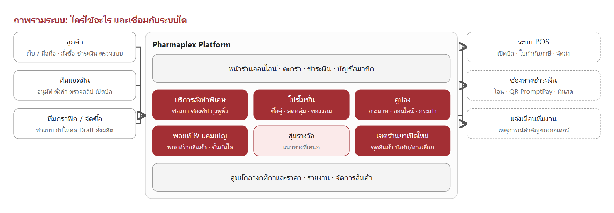

*รูป 1-1 ผู้ใช้งานแต่ละกลุ่มเข้าสู่ระบบผ่านหน้าร้านหรือหน้าแอดมิน ระบบกลางรวบรวมกติกาทุกโมดูลไว้ที่เดียว และส่งข้อมูลการขายไปยัง POS และช่องทางชำระเงิน*

### 1.3 โมดูลทั้งหมดในระบบ

| โมดูล | คืออะไร | ใช้เมื่อไหร่ | มีกี่แบบ |
|---|---|---|---|
| บริการสั่งทำพิเศษ | สั่งผลิตสินค้าตามแบบของร้าน เช่น ซองยาพิมพ์ชื่อร้าน | ร้านต้องการบรรจุภัณฑ์เฉพาะที่ไม่มีในสต็อก | 4 ประเภทสินค้า และทุกประเภทเลือกตัวเลือกได้หลายแบบ |
| โปรโมชั่น | สิทธิ์ที่เกิดขึ้นตอนซื้อ ไม่ต้องใส่โค้ด ลูกค้าเลือกโปรเองในตะกร้า (ผลตอบแทนผสมได้หลายอย่าง) | ต้องการกระตุ้นการซื้อสินค้ากลุ่มหนึ่ง | 2 แบบ |
| คูปอง | สิทธิ์ส่วนลดที่ลูกค้าต้องได้รับก่อนจึงใช้ได้ | แจกหน้างาน ส่งเสริมการขายผ่านเว็บ หรือแจกประจำเดือน | 2 กลุ่ม: กระดาษ และออนไลน์ (โค้ดส่วนลด / เก็บเอง / แจกรายเดือน) |
| พอยท์และแคมเปญ | สะสมพอยท์ราย SKU และรางวัลปลดล็อกตามยอดสะสม | ให้ลูกค้าสะสมยอดและแลกของ | พอยท์ 1 ระบบ และแคมเปญ 2 แบบ |
| การสุ่มรางวัล | เปลี่ยนพอยท์ ยอดซื้อ หรือโค้ด เป็นสิทธิ์ลุ้นรางวัล | กิจกรรมส่งเสริมการขายที่มีของรางวัลหลากหลาย | 2 โหมดการจับรางวัล |
| เซตร้านยาเปิดใหม่ | ชุดสินค้าเริ่มต้นสำหรับร้านยาที่เพิ่งเปิด ปรับรายการได้ | ผู้ที่ต้องการเปิดร้านยาใหม่ | 2 ประเภทรายการ บังคับและทางเลือก |

### 1.4 ผู้ใช้งานและหน้าที่

| ผู้ใช้งาน | ทำอะไรได้ในระบบ |
|---|---|
| ลูกค้า (สมาชิก / ร้านค้า) | สั่งซื้อ ชำระเงิน ตรวจแบบ อนุมัติหรือขอแก้ไข ใช้คูปองและพอยท์ ติดตามสถานะ |
| แอดมิน (รวมเซลล์) | ตั้งค่าสินค้า โปรโมชั่น คูปอง แคมเปญ ตรวจสลิป อนุมัติคำสั่งซื้อ ปรับจำนวนจริง เปิดบิล และสั่งซื้อแทนลูกค้าได้ในบางกรณี เช่น เซลล์สั่งเซตร้านยาเปิดใหม่แทนลูกค้า |
| ทีมกราฟิก | จัดทำแบบ Mockup อัปโหลดแบบให้ลูกค้าตรวจ |
| ฝ่ายจัดซื้อ / โรงงาน | รับเรื่องผลิตและส่งสินค้าเข้าคลัง |
| ทีมงานภายใน | ได้รับการแจ้งเตือนเมื่อมีเหตุการณ์สำคัญของคำสั่งซื้อ |

### 1.5 หลักการที่ใช้ทั้งระบบ

- **ไม่ต้องใส่โค้ดกับโปรโมชั่น** ส่วนลดเกิดขึ้นเองเมื่อลูกค้าเข้าเงื่อนไข
- **ราคาและส่วนลดคำนวณที่ระบบเสมอ** หน้าจอแสดงตัวอย่างให้ลูกค้าเห็น แต่ยอดที่ชำระจริงคำนวณที่เซิร์ฟเวอร์
- **กติกาปรับได้จากหน้าแอดมิน** ไม่ต้องพัฒนาใหม่เมื่อต้องการเปลี่ยนแบรนด์ หมวด ช่วงเวลา หรือจำนวนที่กำหนด
- **ตรวจย้อนหลังได้** ทุกการใช้คูปอง สิทธิ์ลุ้น และการแลกพอยท์มีประวัติให้ตรวจ

### 1.6 การทำงานร่วมกันระหว่างโมดูลและนโยบายร่วมของระบบ

- **การใช้ร่วมกันในบิลเดียว** แอดมินตั้งค่าได้เองว่าแต่ละโมดูล (โปรโมชั่น คูปอง พอยท์ แคมเปญ สิทธิ์ลุ้น) เปิดหรือปิดใช้งาน และกำหนดได้ว่าโมดูลไหนใช้ร่วมกับโมดูลไหนได้บ้างในตะกร้าเดียวกัน ไม่ได้กำหนดตายตัวไว้ในระบบ
- **ยกเลิก / คืนสินค้า** เมื่อคูปอง พอยท์ หรือของแถมถูกใช้ไปแล้ว การยกเลิกหรือคืนสินค้าภายหลังจะไม่เรียกคืนสิ่งที่ใช้ไปแล้ว ถือว่าใช้สิทธิ์ไปแล้ว (คำขอคืนสินค้าทุกกรณีต้องผ่านการอนุมัติจากแอดมินก่อนอยู่แล้ว)
- **การแจ้งเตือนลูกค้า** ทั้งระบบไม่มีการแจ้งเตือนผ่านอีเมล SMS หรือ LINE ลูกค้าต้องเข้าเว็บเพื่อติดตามสถานะและสิทธิ์ต่าง ๆ ด้วยตนเอง
- **ภาษีมูลค่าเพิ่ม (VAT)** ราคาสินค้า ค่าจัดส่ง และส่วนลดที่แสดงในเอกสารนี้ทั้งหมดเป็นราคารวม VAT แล้ว
- **กลุ่มที่ใช้ซ้ำ และผลตอบแทนแบบ component (ข้อเสนอ)** ตั้งครั้งเดียวแล้วเลือกใช้ได้ทุกโมดูล: **กลุ่มลูกค้า** (รายชื่อลูกค้า/ร้าน/สาขา เลือกเองหรือนำเข้าไฟล์ CSV/XLSX ตาม template คอลัมน์ “รหัสลูกค้า” + “ชื่อร้าน” ไม่บังคับ) · **กลุ่มสินค้า** (แบรนด์/หมวด/SKU รวม-ยกเว้น) · ทุกหน้าตั้งค่ามีช่อง “ใครใช้สิทธิ์นี้ได้” (ทุกคน/บางคน) เป็นตัวเลือกเดียวกัน — **ไม่มีหน้า “ชุดของรางวัล” กลางแล้ว**: ผลตอบแทน/ของรางวัลตั้งด้วย **component เดียว** ที่ฝังในหน้าตั้งค่าของแต่ละโมดูล (โปรโมชั่น แคตตาล็อกแลกพอยท์ ขั้นแคมเปญ รางวัลสุ่มรางวัล) ผสมได้หลายชนิดต่อรายการ: ของแถม SKU (เลือกสินค้าในระบบ) · ส่วนลด (บาท/% + เพดาน) · พอยท์ (กำหนดจำนวน) · คูปอง (เลือกจากที่มี) · เครดิตเงินคืน (ออกโดยระบบ) · สิทธิ์ลุ้น (เช่น ลุ้นในแคมเปญ โหมด B หรือหมุนวงล้อ) · ของรางวัลนอก POS (ข้อความ) และฟรีค่าจัดส่ง (เฉพาะโปรโมชั่น) — ชุดผลตอบแทนแต่ละชุดเก็บแยกตามโมดูลและมี flag ว่ามาจากโมดูลไหน (source_module) — รายละเอียดอยู่ใน `dev-architecture.html` และ `requirements.html` กลุ่มลูกค้าอัตโนมัติตามกติกา (เช่น ประเภท B2B) เป็นระยะหลัง
- **B2B กับ B2C** ทุกโมดูลใช้กติกาเดียวกันกับลูกค้าทุกกลุ่ม ยกเว้นเซตร้านยาเปิดใหม่ (โมดูล 7) ที่เปิดขายเฉพาะลูกค้าประเภทร้านค้า (B2B) เท่านั้น


### 1.7 หน้าแรกของลูกค้า (ข้อเสนอ)

หน้าแรกต่อยอดจากหน้าแรกเดิมของเว็บ (แบนเนอร์ → หมวดหมู่ → ข่าวสาร → แบรนด์) โดยแทรกส่วนของโมดูลใหม่ตามลำดับความเร่งด่วน ทุกส่วนซ่อนเองเมื่อไม่มีเนื้อหา และแสดงเฉพาะรายการที่ลูกค้าอยู่ในกลุ่มเป้าหมาย (ตรวจที่เซิร์ฟเวอร์)

| ลำดับ | ส่วน | แสดงอะไร | ใครเห็น |
|---|---|---|---|
| 1 | Hero + แบนเนอร์ย่อย (เดิม) | สไลด์ใหญ่และแบนเนอร์ข้าง ลิงก์ไปโปร/แคมเปญเด่น แยกชุด B2B/ทั่วไป | ทุกคน |
| 2 | สถานะของฉัน | พอยท์ (เตือนใกล้หมดอายุ) · คูปองพร้อมใช้ · ยอดสะสมแคมเปญ · Tickets ลุ้นรางวัล | ล็อกอิน (ยังไม่ล็อกอินเห็นกล่องชวนเข้าสู่ระบบ) |
| 3 | Flash Sale | ตัวนับเวลา + สินค้า 4 ชิ้น + ปุ่มดูทั้งหมด | ทุกคนในกลุ่มเป้าหมาย |
| 4 | หมวดหมู่ (เดิม) | ไอคอนหมวดสินค้า | ทุกคน |
| 5 | โปรโมชั่นแนะนำ | โปรโมชั่น 3 รายการที่ลูกค้ามีสิทธิ์ (เรียงตามวันสิ้นสุดใกล้สุด) | ทุกคนในกลุ่มเป้าหมาย |
| 6 | คูปองที่เก็บได้ | คูปองเก็บเอง/แจกรายเดือน กดเก็บได้ทันที (ไม่รวมคูปองกระดาษและโค้ดออนไลน์) | ล็อกอิน ในกลุ่มเป้าหมาย |
| 7 | แคมเปญ | ความคืบหน้าขั้นบันได |
| 8 | เซตร้านยาเปิดใหม่ | เซต S/M/L พร้อมราคาเริ่มต้น | B2B สั่งได้ · B2C เห็นแต่สั่งไม่ได้ |
| 9 | ลุ้นรางวัล | กิจกรรมที่เปิดอยู่ + Tickets ของลูกค้า + วันประกาศผล | ล็อกอิน ในกลุ่มเป้าหมาย |
| 10 | แลกพอยท์ | ของรางวัล 4 รายการที่แลกได้ เรียงที่พอยท์พอก่อน | ล็อกอิน ในกลุ่มเป้าหมายของรายการแลก |
| 11-12 | ข่าวสาร · แบรนด์ (เดิม) | การ์ดข่าวและโลโก้แบรนด์ | ทุกคน |

**ข้อที่ต้องตัดสินใจกับลูกค้า:** ให้แอดมินจัดลำดับ/เปิดปิดส่วนในหน้าแรกเองหรือไม่ (รอบแรกลำดับตายตัว) · ลูกค้าที่ยังไม่ล็อกอินเห็นราคา Flash หรือไม่ · ลูกค้านอกกลุ่มเห็นรายการแบบล็อกหรือซ่อน (Q-2 — ข้อเสนอนี้ซ่อน)

---

## 2. บริการสั่งทำพิเศษ

### 2.1 คืออะไร

บริการสั่งทำพิเศษคือการสั่งผลิตสินค้าตามความต้องการของร้าน เช่น ซองยาพิมพ์ชื่อร้าน ซองซิป ถุงหูหิ้วพิมพ์โลโก้ ม่านบังยา และสติ๊กเกอร์ติดขวด สินค้ากลุ่มนี้ไม่มีสต็อกพร้อมส่ง ต้องผลิตตามสั่งใช้เวลาประมาณ 2–4 สัปดาห์

ลูกค้าเลือกตัวเลือกของสินค้า กรอกข้อมูลที่จะพิมพ์ลงบรรจุภัณฑ์ และดูภาพ Mockup ที่เปลี่ยนตามตัวเลือกได้ทันที ก่อนชำระมัดจำและเริ่มกระบวนการออกแบบ สินค้าหนึ่งรายการเปิดขายได้หลายปี (เช่น ฉบับปี 2569 และฉบับปี 2570) โดยคัดลอกตัวเลือก ราคา และแบบ Mockup จากปีก่อนหน้าไปตั้งต้นปีใหม่ได้ ลูกค้าเห็นเฉพาะปีล่าสุดที่เปิดขาย

### 2.2 ใช้เมื่อไหร่ และมีกี่แบบ

| ประเภทสินค้า | ตัวเลือกหลัก | ขนาด / จำนวน | รูปแบบการคิดราคา |
|---|---|---|---|
| ซองซิปยา | ประเภท (ใส, สีชา, สีขาวนม, สีแดง), รูปแบบ, สี | 6×8 ถึง 12×17 ซม. · จำนวนสำเร็จรูป 5,000 ถึง 100,000 ใบ | ต่อใบ |
| ถุงหูหิ้วพลาสติก | ชนิด (HD / PE), ชนิดหูหิ้ว, รูปแบบ, สี | 4×9 ถึง 6×14 นิ้ว · ขั้นต่ำ 50 กก. | ต่อกิโลกรัม |
| ม่านบังยา | รุ่น (ขามาตรฐาน / ขาเหล็กพิเศษ), รูปแบบ, สี | 90×160 ซม. หรือกำหนดขนาดเอง | ต่อตารางเมตร รวมขาตั้ง |
| สติ๊กเกอร์ติดขวด | ขนาด, รูปแบบ, สี | ดวง 3×6, 4×7, 5×8 ซม. หรือกำหนดขนาดเอง | ต่อแผ่น A3 |

สินค้ากลุ่มนี้ต่างจากสินค้า Pre-order ทั่วไปดังนี้

| หัวข้อ | Pre-order ทั่วไป | บริการสั่งทำพิเศษ |
|---|---|---|
| การชำระเงิน | ชำระเต็มจำนวนครั้งเดียว | มัดจำ 50% ก่อน และชำระส่วนที่เหลือเมื่อผลิตเสร็จ |
| การตรวจสอบ | ไม่มี | ตรวจสลิปและอนุมัติโดยแอดมินก่อนเริ่มออกแบบ (ยกเว้นชำระด้วย QR PromptPay ที่อนุมัติอัตโนมัติ) |
| แบบพิมพ์ | ไม่มี | ลูกค้าตรวจแบบและอนุมัติ หรือขอแก้ได้สูงสุด 3 ครั้ง |
| จำนวนผลิต | ตามที่สั่ง | อาจผลิตเกินหรือขาดได้ตามกระบวนการโรงงาน ปรับตามจำนวนจริง |
| การชำระอีกครั้ง | ไม่มี | มีการชำระรอบที่ 2 เมื่อมียอดค้าง หรือได้ใบลดหนี้คืนเมื่อจ่ายเกิน |
| การรับสินค้า | ตามรอบคิว | กดยืนยันรับสินค้าเอง แล้วให้คะแนนและรีวิวได้ |

### 2.3 ตัวเลือกสินค้าและข้อมูลที่ต้องกรอก

แอดมินตั้งค่าตัวเลือกของสินค้าแต่ละรายการเอง และเลือกรูปแบบการแสดงผลได้ 3 แบบ

| รูปแบบตัวเลือก | ใช้แสดงอะไร |
|---|---|
| ปุ่มข้อความ | ตัวเลือกทั่วไป เช่น ประเภท รูปแบบ |
| สี | วงกลมสีให้กด รองรับให้ลูกค้าพิมพ์รหัสสีหรือ Pantone เองได้ |
| ขนาด | กว้าง × ยาว ใช้กับสินค้าที่คิดราคาต่อตารางเมตร เลือกให้ลูกค้ากำหนดขนาดเองได้ |

ตัวเลือกบางรายการกำหนดให้ต้องแนบไฟล์เพิ่ม เช่น เลือก "มีแบบอยู่แล้ว" ต้องแนบไฟล์แบบมาด้วย

นอกจากตัวเลือกสินค้า แอดมินกำหนดช่องข้อมูลที่ลูกค้าต้องกรอกเองได้สูงสุด 20 ช่องต่อสินค้า เช่น ชื่อร้าน ที่อยู่ เบอร์โทรศัพท์ เวลาเปิดทำการ เป็นช่องข้อความ ข้อความหลายบรรทัด หรือช่องแนบไฟล์ ระบบดึงข้อมูลร้านของลูกค้ามาเติมล่วงหน้าให้ได้

### 2.4 ขั้นตอนการสั่งซื้อทั้งหมด

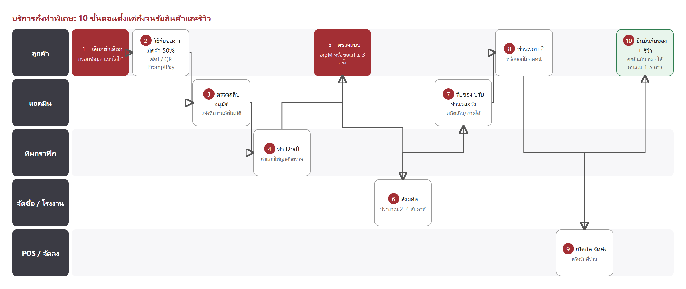

*รูป 2-1 ทั้ง 10 ขั้นตอนแบ่งตามผู้รับผิดชอบ ขั้นที่ 5 และ 7 เป็นจุดที่ลูกค้าและร้านต้องดำเนินการ ขั้นที่ 10 เป็นขั้นใหม่ที่ลูกค้ายืนยันรับสินค้าและให้คะแนนเอง*

### 2.5 รายละเอียดแต่ละขั้นตอน

**ขั้นที่ 1 เลือกตัวเลือกและกรอกข้อมูล**
ลูกค้าเลือกตัวเลือกของสินค้า กรอกข้อมูลตามช่องที่แอดมินกำหนด อัปโหลดโลโก้หรือไฟล์ตัวอย่างงาน (AI, EPS, PDF, SVG ที่แนะนำ และ PNG โปร่งใส / JPG ความละเอียดสูง ไม่เกิน 20 MB) เปิดดูตัวอย่างไฟล์ที่เลือกได้ก่อนส่งจริง และต้องยอมรับเงื่อนไขของสินค้าก่อนดำเนินการต่อ ถ้าเลือกขนาดกำหนดเองในสินค้าที่คิดราคาต่อชิ้น หรือเลือกขนาดที่ยังไม่เคยตั้งราคาไว้ ระบบจะส่งคำสั่งซื้อไปให้เจ้าหน้าที่ตีราคาก่อน ลูกค้าสั่งซื้อได้เสมอไม่ว่ากรณีใด

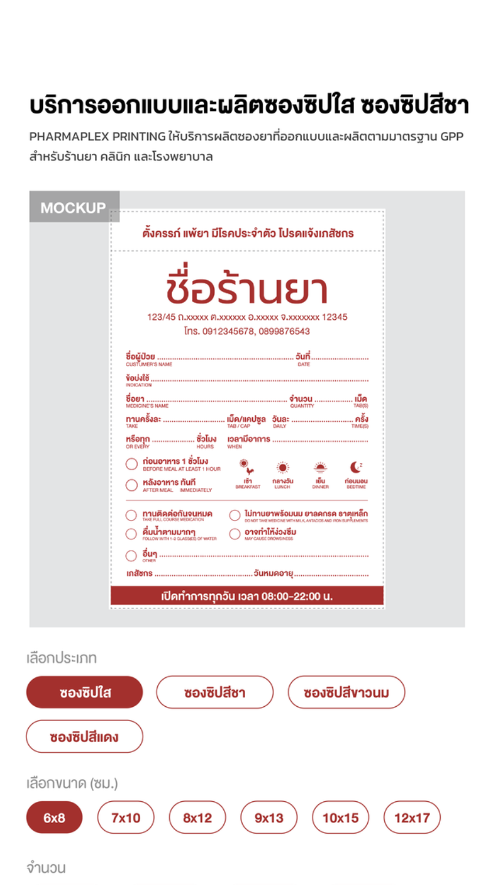

*รูป 2-2 หน้าเลือกตัวเลือกสินค้า ภาพ Mockup ด้านบนเปลี่ยนตามประเภท ขนาด และข้อมูลที่ลูกค้ากรอก*

**ขั้นที่ 2 เลือกวิธีรับสินค้าและชำระมัดจำ 50%**
ลูกค้าเลือกวิธีรับสินค้าและที่อยู่ในขั้นตอนเดียวกับการสรุปยอด (รายละเอียดอยู่ในหัวข้อ 2.9) ระบบคำนวณยอดมัดจำ 50% จาก (ค่าสินค้า + ค่าบล็อค − ส่วนลด) ยังไม่รวมค่าจัดส่ง ลูกค้าชำระด้วยการโอนพร้อมแนบสลิป (รอแอดมินตรวจ) หรือสแกน QR PromptPay (ระบบยืนยันให้อัตโนมัติ ไม่ต้องรอตรวจ) ถ้ามีใบลดหนี้ในบัญชีเลือกใช้ตัดยอดได้ทันที และถอนออกได้ก่อนส่งหลักฐานการชำระเงิน ชำระสะสมหลายครั้งได้ ไม่ต้องจ่ายครบในครั้งเดียว หรือแจ้งเจ้าหน้าที่ให้บันทึกสลิปแทนได้ถ้าส่งหลักฐานมาทางช่องทางอื่น (รายละเอียดอยู่ในหัวข้อ 2.8) วิธีรับสินค้าและที่อยู่จะล็อกแก้ไขไม่ได้หลังชำระมัดจำ

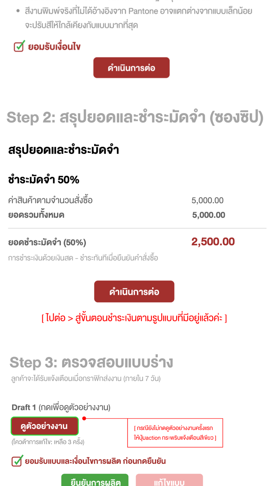

*รูป 2-3 หน้าสรุปยอดและชำระมัดจำ ยอดมัดจำคิดเป็น 50% ของยอดรวมตั้งต้น*

**ขั้นที่ 3 แอดมินตรวจสลิปและอนุมัติ**
เมื่อลูกค้าแนบสลิปโอนเงิน แอดมินตรวจยอดเทียบกับยอดที่ต้องชำระ และตรวจความถูกต้องของข้อมูล (สลิป QR PromptPay ระบบอนุมัติให้อัตโนมัติ ไม่ต้องรอแอดมิน) แอดมินเลือกทำได้ 3 ทาง
- **อนุมัติ** เพื่อเริ่มออกแบบ กำหนดส่งแบบภายใน 7 วัน
- **ส่งกลับให้แก้ไข** ลูกค้าแก้ข้อมูลหรือโลโก้แล้วส่งตรวจใหม่
- **ปฏิเสธสลิป** ลูกค้าเห็นเหตุผลและส่งสลิปใหม่ได้

**ขั้นที่ 4 ทีมกราฟิกจัดทำแบบ**
ทีมกราฟิกพิมพ์ใบสรุปความต้องการของลูกค้าจากระบบ นำไปออกแบบใน Adobe Illustrator แล้วอัปโหลดภาพ Mockup (JPG / PNG) เข้าสู่ออเดอร์ภายใน 7 วันหลังอนุมัติมัดจำ ลูกค้าได้รับแจ้งว่ามีแบบใหม่ให้ตรวจ

**ขั้นที่ 5 ลูกค้าตรวจแบบ**
ลูกค้าเข้าดูแบบในหน้า "คำสั่งซื้อของฉัน" ได้ตลอดเวลา แล้วเลือก **อนุมัติแบบ Final** หรือ **ขอแก้ไข** โดยวงจุดบนภาพแบบตรงตำแหน่งที่ต้องการแก้ (สูงสุด 30 จุด) พร้อมใส่โน้ตอธิบาย ต้องมีจุดหรือโน้ตอย่างน้อย 1 รายการ และต้องยืนยันในหน้าต่างเตือนก่อนส่ง เพราะใช้โควตาแล้วย้อนกลับไม่ได้ การขอแก้ไขทำได้สูงสุด 3 ครั้ง (Draft รวมสูงสุด 4 ฉบับ) รายละเอียดอยู่ในหัวข้อ 2.7

**ขั้นที่ 6 ส่งผลิตที่โรงงาน**
เมื่อลูกค้าอนุมัติแบบ คำสั่งซื้อเข้าสู่การผลิตและฝ่ายจัดซื้อส่งงานไปยังโรงงาน ใช้เวลาประมาณ 2–4 สัปดาห์

**ขั้นที่ 7 รับสินค้าและปรับจำนวนจริง**
โรงงานอาจผลิตได้จำนวนเกินหรือขาดจากที่สั่งได้ตามเงื่อนไขการผลิต เมื่อรับสินค้าแล้ว แอดมินปรับจำนวนจริงในออเดอร์ พร้อมกรอกค่าจัดส่งถ้าเป็นการจัดส่งนอกพื้นที่ ระบบคำนวณยอดรวมใหม่ทันที ส่วนที่ผลิตเกินลูกค้ารับในราคาต่อหน่วยเดิม รายละเอียดอยู่ในหัวข้อ 2.8

**ขั้นที่ 8 ชำระรอบที่ 2 หรือรับใบลดหนี้**
ถ้ายังมียอดค้าง ลูกค้าชำระส่วนที่เหลือผ่านหน้าเว็บ (สะสมหลายครั้งได้เช่นเดียวกับมัดจำ) และแอดมินตรวจสลิปรอบที่ 2 ถ้าไม่มียอดค้าง (ยอดพอดีหรือจ่ายเกิน หรือใบลดหนี้ครอบคลุมพอดี) ข้ามการชำระรอบนี้ไปได้เลย และถ้าลูกค้าจ่ายเกินยอดจริง ระบบออกใบลดหนี้คืนให้โดยอัตโนมัติ

**ขั้นที่ 9 เปิดบิลและจัดส่ง**
เจ้าหน้าที่เปิดบิลใน POS และกรอกเลขที่เอกสาร ออเดอร์เข้าสถานะรอจัดส่งหรือรอรับที่ร้านตามวิธีที่เลือกไว้ เจ้าหน้าที่จะนัดวันจัดส่งหรือวันรับของกับลูกค้าอีกครั้งหลังผลิตเสร็จ เพราะลูกค้าไม่ได้เลือกวันตอนสั่งซื้อ

**ขั้นที่ 10 ยืนยันรับสินค้าและให้คะแนน**
เมื่อได้รับสินค้าแล้ว ลูกค้ากดยืนยันรับสินค้าด้วยตนเองในหน้าออเดอร์ สถานะเปลี่ยนเป็น "รับสินค้าแล้ว" และปิดงาน จากนั้นให้คะแนนสินค้า 1-5 ดาวพร้อมความเห็นได้ 1 ครั้งต่อออเดอร์ รีวิวจะแสดงในหน้าสินค้าแบบสาธารณะโดยย่อชื่อลูกค้าเพื่อความเป็นส่วนตัว เช่น "จ***"

### 2.6 ภาพ Mockup และกลุ่มสี

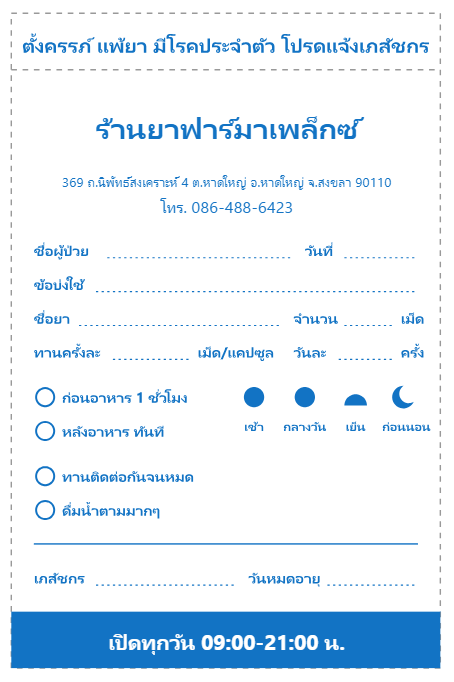

*รูป 2-4 ตัวอย่าง Mockup ที่สร้างจากข้อมูลร้านและโลโก้ของลูกค้า ภาพนี้เป็นตัวอย่างเพื่อตรวจสอบเบื้องต้น แบบจริงกราฟิกจะส่งให้ตรวจก่อนผลิต*

แบบ Mockup แปลงจากไฟล์ .ai หรือ .pdf เป็นภาพเวกเตอร์ หรืออัปโหลดเป็นภาพนิ่งก็ได้ แบบหนึ่งผูกกับตัวเลือกได้หลายแบบ หรือไม่ผูกเลยเพื่อใช้เป็นแบบหลักของสินค้า ช่องในแบบเปลี่ยนตามข้อมูลลูกค้าได้ 3 ชนิด คือข้อความ (ผูกกับช่องข้อมูลที่กรอก) รูปภาพ (ไฟล์โลโก้) และสี

**กลุ่มสี** แอดมินจัดกลุ่มสีในแบบ เช่น "สีหลัก" หรือ "สีพื้นหลัง" แล้วผูกแต่ละกลุ่มกับตัวเลือกสีของสินค้า ลูกค้าเปลี่ยนสีจากตัวเลือกเดิมตอนเลือกสินค้า ไม่มีช่องเลือกสีซ้ำซ้อน กลุ่มที่ผูกตัวเลือกสีเดียวกันจะเปลี่ยนพร้อมกันทั้งหมด ส่วนกลุ่มที่ไม่ได้ผูกจะคงสีเดิมไว้ สีที่ลูกค้าเลือกถูกบันทึกเป็นชื่อกลุ่มและรหัสสี แสดงให้เห็นทั้งหน้าลูกค้า หน้าแอดมิน และใบสรุปความต้องการที่พิมพ์ให้ทีมกราฟิก

### 2.7 การตรวจแบบและแก้ไข

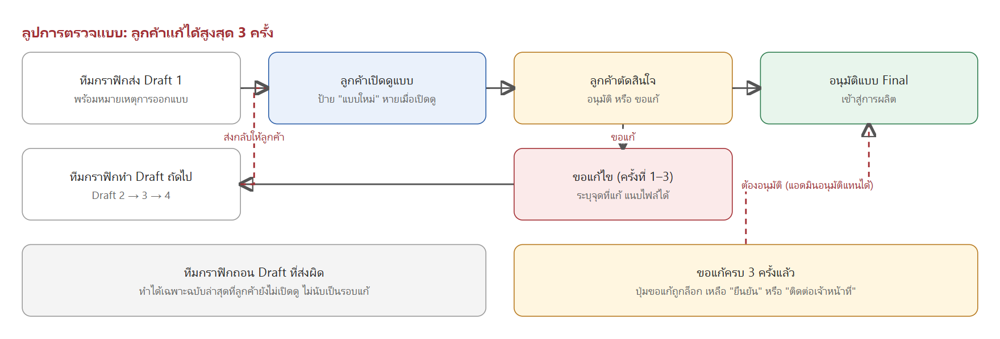

*รูป 2-5 ลูปการตรวจแบบ Draft แต่ละฉบับเก็บไว้ให้ลูกค้าเปิดดูและเทียบย้อนหลังได้*

| กฎ | รายละเอียด |
|---|---|
| วิธีขอแก้ไข | วงจุดบนภาพแบบสูงสุด 30 จุด พร้อมใส่โน้ตอธิบาย ต้องมีอย่างน้อย 1 รายการ |
| จำนวนครั้งที่ขอแก้ | ได้สูงสุด 3 ครั้ง ระบบรองรับ Draft รวมสูงสุด 4 ฉบับ |
| ครบ 3 ครั้งแล้ว | ปุ่มขอแก้ถูกล็อก เหลือเพียง "ยืนยัน" และ "ติดต่อเจ้าหน้าที่" |
| กำหนดส่งแบบ | ภายใน 7 วันนับจากวันที่แอดมินอนุมัติมัดจำ ลูกค้าเห็นกำหนดนี้ตั้งแต่ก่อนชำระ |
| แจ้งว่ามีแบบใหม่ | ลูกค้าเห็นป้าย "แบบใหม่" จนกว่าจะเปิดดู ปุ่มดูตัวอย่างงานกระพริบจนกว่าจะกดดูครั้งแรก |
| ถอนแบบที่ส่งผิด | ทีมกราฟิกถอน Draft ล่าสุดได้ ถ้าลูกค้ายังไม่เปิดดู และการถอนไม่นับเป็นรอบแก้ไข |
| อนุมัติแทนลูกค้า | ถ้าลูกค้ายืนยันผ่านช่องทางอื่น แอดมินอนุมัติแทนได้ และระบบบันทึกไว้ว่าอนุมัติโดยแอดมิน |

### 2.8 การคิดเงินและมัดจำ

**สูตรการคิดราคาสินค้า**

```
ราคาต่อหน่วย (PER_UNIT) = ราคาต่อหน่วย × จำนวน
ราคาต่อตารางเมตร (PER_AREA) = ราคาต่อตารางเมตร × มากกว่าระหว่าง(พื้นที่คิดขั้นต่ำ, กว้าง × ยาว) × จำนวน
```

ตารางราคาอ้างอิงจากตัวเลือกที่ "มีผลต่อราคา" คูณกับระดับราคาตามจำนวน (ใช้ระดับสูงสุดที่ไม่เกินจำนวนที่สั่ง) ค่าบล็อคคิดครั้งเดียวเมื่อลูกค้าติ๊ก "สั่งครั้งแรก" และตั้งแยกตามแถวราคาได้ พื้นที่คิดขั้นต่ำกันไม่ให้สินค้าชิ้นเล็กราคาต่ำเกินไป เช่น ตั้งขั้นต่ำ 1 ตร.ม. ซองขนาด 10×10 ซม. จะคิดราคาเท่ากับ 1 ตร.ม. ถ้าตั้งเป็น 0 ระบบคิดตามพื้นที่จริง

**สูตรการชำระเงิน 2 รอบ**

```
มัดจำรอบแรก = (ค่าสินค้า + ค่าบล็อค − ส่วนลด) × 50%   [ไม่รวมค่าจัดส่ง]
ยอดรวมทั้งหมด = ค่าสินค้าตามจำนวนผลิตจริง + ค่าจัดส่ง − ส่วนลด
ยอดชำระรอบที่ 2 = ยอดรวมทั้งหมด − ยอดที่ชำระแล้ว − ใบลดหนี้ที่เลือกใช้
```

**ตัวอย่างการคำนวณ** (ราคา 1 บาทต่อใบ สั่ง 5,000 ใบ และโรงงานผลิตได้จริง 5,500 ใบ)

| รายการ | จำนวน | ยอดเงิน (บาท) | หมายเหตุ |
|---|---|---|---|
| ค่าสินค้าตามที่สั่ง | 5,000 ใบ × 1 | 5,000.00 | ยอดรวมตั้งต้น |
| มัดจำรอบแรก 50% | | 2,500.00 | ชำระก่อนเริ่มออกแบบ |
| ผลิตได้จริงเกิน | +500 ใบ × 1 | +500.00 | แอดมินปรับจำนวนจริง |
| ยอดรวมหลังปรับ | 5,500 ใบ | 5,500.00 | ยอดที่ลูกค้าต้องชำระทั้งหมด |
| **ยอดค้างชำระรอบที่ 2** | | **3,000.00** | 5,500 − 2,500 |

**ตัวอย่างกรณีโรงงานผลิตขาด** ถ้าผลิตได้จริง 4,800 ใบ (ขาด 200 ใบ) และลูกค้าชำระมัดจำ 2,500 บาทไว้แล้ว ยอดรวมหลังปรับคือ 4,800 บาท ลูกค้าจึงมียอดค้างชำระ 2,300 บาท ถ้าลูกค้าชำระไว้แล้วเกินยอดรวมหลังปรับ ระบบจะออกใบลดหนี้คืนให้ตามส่วนต่างโดยอัตโนมัติ

**ขนาดที่ลูกค้ากำหนดเอง — ใครเป็นคนตีราคา**

| เงื่อนไข | ผล |
|---|---|
| คิดราคาต่อตารางเมตร และแกนขนาดไม่มีผลต่อราคา | ระบบคำนวณราคาเองจากพื้นที่ที่กรอก |
| คิดราคาต่อตารางเมตร แกนขนาดมีผลต่อราคา และตั้งราคาแถวนั้นไว้แล้ว | ระบบคำนวณราคาเองตามราคาแถวนั้น |
| คิดราคาต่อตารางเมตร แกนขนาดมีผลต่อราคา แต่ยังไม่ได้ตั้งราคา | ส่งให้เจ้าหน้าที่ตีราคาก่อนเริ่มกระบวนการ |
| คิดราคาต่อหน่วย (ต่อชิ้น) และกำหนดขนาดเอง | ส่งให้เจ้าหน้าที่ตีราคาเสมอ (คำนวณราคาต่อชิ้นจากขนาดไม่ได้) |
| ขนาดเกินค่าสูงสุดที่สินค้ากำหนดไว้ | ระบบปฏิเสธไม่ให้สั่ง |

ไม่ว่ากรณีใดลูกค้าสั่งซื้อได้เสมอ ไม่มีทางตัน เมื่อแอดมินตีราคาแล้วระบบคำนวณมัดจำ 50% ใหม่ให้อัตโนมัติ

**ข้อกำหนดเพิ่มเติม**
- ส่วนที่ผลิตเกินลูกค้ารับทั้งหมดในราคาต่อหน่วยเดิม ไม่ได้ส่วนลดเพิ่ม
- ส่วนลด (ถ้ามี) เป็นจำนวนเงินคงที่ ไม่เพิ่มตามจำนวนส่วนที่เกิน
- ใบลดหนี้ใช้ตัดยอดได้ทั้งตอนชำระมัดจำและรอบที่ 2 เลือกใช้แล้วตัดยอดทันที ถอนออกได้ก่อนส่งหลักฐานการชำระเงิน
- ชำระได้หลายงวดสะสม ทั้งมัดจำและรอบที่ 2 แต่ละครั้งที่แนบสลิประบบจะเก็บไว้ก่อน ยังไม่ส่งให้แอดมินตรวจจนกว่ายอดสลิปรวมจะครบยอดที่ต้องชำระ (หลังหักใบลดหนี้) ยอดรวมเกินยอดที่ต้องชำระจะบันทึกไม่ได้ ถ้าใบลดหนี้ครอบคลุมยอดพอดี ไม่ต้องแนบสลิปเพิ่ม
- เจ้าหน้าที่บันทึกการชำระแทนลูกค้าได้ เช่น กรณีลูกค้าส่งสลิปมาทางโทรศัพท์หรือ LINE โดยรับเฉพาะสลิปโอนเงิน ไม่รองรับ QR PromptPay ในกรณีนี้

### 2.9 วิธีรับสินค้าและค่าจัดส่ง

ลูกค้าเลือกวิธีรับสินค้าตอนสรุปยอด (ขั้นที่ 2) มี 3 แบบ

| วิธีรับสินค้า | ค่าใช้จ่าย | หมายเหตุ |
|---|---|---|
| มารับที่ร้าน | ฟรี | — |
| จัดส่งภายในพื้นที่ | ฟรี | ที่อยู่ต้องอยู่ในพื้นที่รอบจัดส่งที่ร้านกำหนดไว้ |
| จัดส่งนอกพื้นที่ | ตามระยะทาง | แอดมินกรอกค่าจัดส่งตอนปรับจำนวนผลิตจริง เก็บในยอดรอบที่ 2 |

ที่อยู่ที่เลือกถูกบันทึกเป็นสำเนา ณ วันที่สั่งซื้อ และล็อกแก้ไขไม่ได้หลังชำระมัดจำ (แก้ไขได้เฉพาะช่วงรอตีราคาหรือรอชำระมัดจำ) ไม่มีการเลือกวันหรือรอบจัดส่งล่วงหน้า เพราะสินค้ายังไม่ผลิต เจ้าหน้าที่จะนัดวันจัดส่งหรือวันรับของกับลูกค้าอีกครั้งหลังผลิตเสร็จ

### 2.10 สถานะคำสั่งซื้อ

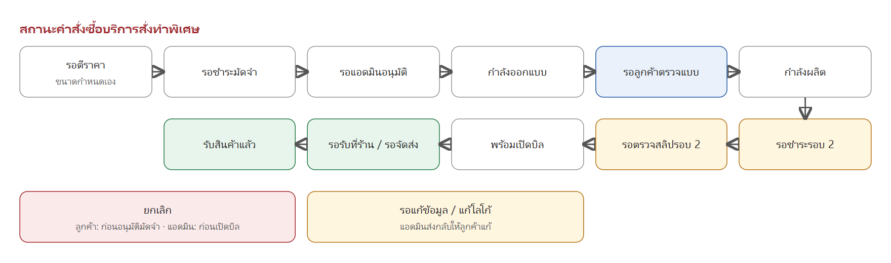

*รูป 2-6 สถานะหลักของคำสั่งซื้อ ลูกค้าติดตามสถานะได้ที่ "คำสั่งซื้อของฉัน" ในหน้าสมาชิก*

### 2.11 การยกเลิก การคืนเงิน และใบลดหนี้

| ช่วงสถานะ | ใครยกเลิกได้ | ผลที่เกิดขึ้น |
|---|---|---|
| รอตีราคา / รอชำระมัดจำ / รอแอดมินอนุมัติ / รอแก้ข้อมูล | ลูกค้าหรือแอดมิน | ยกเลิกได้ทันที ถ้าชำระเงินไว้แล้วคืนเป็นใบลดหนี้ |
| กำลังออกแบบ จนถึง รอตรวจสลิปรอบ 2 | แอดมินเท่านั้น | ยอดที่ชำระแล้วคืนเป็นใบลดหนี้ทั้งหมด |
| ตั้งแต่เปิดบิลขายแล้ว | ไม่สามารถยกเลิกผ่านระบบได้ | ติดต่อเจ้าหน้าที่โดยตรง |
| ชำระเกินยอดจริงหลังปรับจำนวนผลิต | ระบบทำให้อัตโนมัติ | ออกใบลดหนี้คืนส่วนต่าง |

ใบลดหนี้ใช้ตัดยอดได้ทั้งตอนชำระมัดจำและชำระรอบที่ 2 ของคำสั่งซื้อครั้งถัดไป การชำระเงินทำได้ด้วยการโอนพร้อมแนบสลิป หรือสแกน QR PromptPay เท่านั้น ไม่รับบัตรเครดิต และไม่รับเครดิตร้านค้าเป็นวิธีชำระ

### 2.12 การตั้งค่าของแอดมินต่อสินค้า

| หัวข้อที่ตั้งค่า | รายละเอียด |
|---|---|
| ข้อมูลสินค้า | ชื่อ คำอธิบาย เงื่อนไขการใช้งาน (terms) ระยะเวลาผลิต เปิด/ปิดการขาย และลำดับการแสดงผล |
| โหมดราคา | เลือกคิดราคาต่อหน่วยหรือต่อตารางเมตร พร้อมตั้งพื้นที่คิดขั้นต่ำ (เฉพาะโหมดต่อตารางเมตร) |
| ตัวเลือกสินค้า (แกนตัวเลือก) | สร้างได้หลายแกน เลือกรูปแบบแสดงผล (ปุ่มข้อความ / สี / ขนาด) และตั้งว่าแกนไหน "มีผลต่อราคา" |
| ตารางราคา | กำหนดราคาตามชุดตัวเลือก คูณกับระดับราคาตามจำนวน ช่องว่าง = ไม่ขายชุดนั้น |
| ค่าบล็อค | เปิดหรือปิดค่าบล็อค และตั้งราคาแยกตามแถวราคาได้ |
| ช่องข้อมูลลูกค้า (infoFields) | สร้างได้สูงสุด 20 ช่อง เลือกชนิดช่อง (ข้อความ / ข้อความหลายบรรทัด / ไฟล์) และตั้งให้เติมค่าจาก POS ล่วงหน้า |
| แบบ Mockup | อัปโหลดไฟล์ .ai / .pdf หรือภาพนิ่ง ผูกกับตัวเลือกที่ต้องการ จัดกลุ่มสีในแบบ และผูกแต่ละกลุ่มกับแกนสี |
| จำนวนสั่งซื้อ | ตั้งปุ่มจำนวนสำเร็จรูป และเปิด/ปิดให้ลูกค้ากรอกจำนวนเอง |
| ปีของสินค้า | คัดลอกตัวเลือก ราคา และแบบ Mockup จากปีก่อนหน้าไปตั้งต้นปีใหม่ได้

### 2.13 หน้าจอทั้งหมด (ลูกค้าและแอดมิน)

ภาพชุดนี้แสดงหน้าจอของบริการสั่งทำตามลำดับขั้นที่ 1-10 ในหัวข้อ 2.5 ตั้งแต่เลือกตัวเลือกจนถึงรับสินค้าและรีวิว วงกลม/กรอบสีแดงบนภาพชี้จุดที่ต้องกดหรือจุดที่ควรสังเกตของขั้นตอนนั้น

**ก่อนเริ่มขาย — แอดมินตั้งค่าบริการ**

แอดมินสร้างบริการใหม่จากหน้ารายการบริการ (2.12) กดปุ่ม "เพิ่มบริการ" จะเปิดฟอร์มเปล่าให้กรอกชื่อ คำอธิบาย และตั้งค่าต่อในแท็บย่อย (การสั่งซื้อ / ตัวเลือก / ราคา / แบบ Mockup) บริการที่ใช้สาธิตชุดนี้ตั้งค่าไว้ล่วงหน้าแล้ว ภาพด้านล่างจึงเปิดจากปุ่มแก้ไขของบริการเดิมเพื่อให้เห็นตัวเลือกและแบบ Mockup ที่กรอกจริง


**ขั้นที่ 1-2 (ฝั่งลูกค้า) — เลือกตัวเลือกและชำระมัดจำ**

ลูกค้าเข้าหน้า "บริการอื่นๆ" เลือกบริการที่ต้องการ เลือกตัวเลือกสินค้า กรอกข้อมูลสำหรับพิมพ์ลงบรรจุภัณฑ์ แนบไฟล์โลโก้ถ้ามี และติ๊กยอมรับเงื่อนไขก่อนกดปุ่ม "ดำเนินการต่อ" ไปหน้าตรวจสอบและยืนยัน จากนั้นกด "ยืนยันคำสั่งซื้อและชำระมัดจำ" เพื่อสร้างออเดอร์ หน้าชำระเงินเริ่มที่ QR PromptPay ตามค่าเริ่มต้นของระบบ แต่ลูกค้าเลือกแนบสลิปแทนได้ (กรณีนี้ใช้แสดงขั้นตรวจสลิปของแอดมินในขั้นถัดไป) กรอกข้อมูลผู้โอนและแนบไฟล์แล้วกด "ส่ง"


**ขั้นที่ 3 — แอดมินตรวจสลิปและอนุมัติ**

หลังลูกค้าส่งสลิป ออเดอร์เข้าคิว "ตรวจการชำระเงิน" ในหน้า `/admin/service-orders` แอดมินกดปุ่ม "ดำเนินการ" ที่แถวออเดอร์เพื่อเปิดหน้าต่างตรวจสอบ ตรวจยอดกับสลิปแล้วกด "อนุมัติ" เพื่อเริ่มขั้นตอนทำแบบ ฝั่งลูกค้าระหว่างนี้จะเห็นสถานะ "รอตรวจสอบการชำระเงิน" ที่หน้าออเดอร์ และติดตามออเดอร์ทั้งหมดของตัวเองได้จากแท็บ "บริการสั่งทำ" ในหน้าระบบสมาชิก


**ขั้นที่ 4-5 — ทีมกราฟิกส่งแบบ แล้วลูกค้าตรวจ**

เมื่ออนุมัติมัดจำแล้ว หน้าต่างเดิมจะโผล่ฟอร์ม "ส่งแบบให้ลูกค้าตรวจ" ให้แอดมิน/กราฟิกแนบภาพแบบและหมายเหตุ กด "ส่งแบบให้ลูกค้า" ออเดอร์เข้าสถานะรอลูกค้าตรวจแบบ ฝั่งลูกค้าเปิดดูแบบที่หน้าออเดอร์ เลือกได้ว่าจะ "อนุมัติแบบนี้ เข้าสู่การผลิต" หรือ "ขอแก้ไข (วงจุดในแบบ)" — ถ้าขอแก้ไข ใช้เครื่องมือวงกลม/ตีกรอบ/ปักหมุดชี้จุดที่ต้องการแก้พร้อมพิมพ์รายละเอียด แล้วกด "ส่งให้กราฟิกแก้ไข" (ใช้โควตาแก้ไข 1 ใน 3 ครั้ง ย้อนกลับไม่ได้)


**ขั้นที่ 6-7 — ส่งผลิตแล้วปรับจำนวนจริงตอนสินค้าเข้า**

เมื่อลูกค้ากด "อนุมัติแบบนี้" ออเดอร์เข้าสถานะอยู่ระหว่างผลิตทันที ระหว่างรอผลิต (2-4 สัปดาห์) ทีมกราฟิก/จัดซื้อพิมพ์ "ใบสรุปความต้องการลูกค้า" จากไอคอนเครื่องพิมพ์บนหน้าต่างออเดอร์ไปใช้อ้างอิงกับโรงงาน เมื่อสินค้าเข้าสต็อกจริง แอดมินกลับมาเปิดออเดอร์เดิมเพื่อแก้ไขจำนวนในช่อง "จำนวนจริง" ของแต่ละรายการ (ปกติผลิตเกิน/ขาดจากที่สั่งได้ตามเงื่อนไขโรงงาน) แล้วกด "ยืนยัน และแจ้งลูกค้า" ระบบคำนวณยอดใหม่และเปลี่ยนสถานะเป็นรอชำระเงินรอบ 2 ให้อัตโนมัติ


**ขั้นที่ 8 — ชำระเงินรอบที่ 2**

ลูกค้าเห็นยอดค้างชำระส่วนเกินที่หน้าออเดอร์และกดปุ่ม "ชำระเงิน" เพื่อจ่ายส่วนที่เหลือเองได้ตามปกติ ตัวอย่างชุดนี้สาธิตอีกช่องทางหนึ่งคือกรณีลูกค้าโอนเงินและแจ้งเจ้าหน้าที่ทางโทรศัพท์/LINE แทน: แอดมินกดปุ่ม "ชำระเงินแทนลูกค้า" ในหน้าต่างออเดอร์ กรอกธนาคาร ยอดโอน วันเวลา และแนบสลิปแทนลูกค้า แล้วกด "บันทึกการชำระเงิน" สลิปจะเข้าคิวให้แอดมินตรวจและกด "อนุมัติ" เหมือนขั้นที่ 3 อีกครั้งก่อนปลดล็อกไปขั้นเปิดบิล


**ขั้นที่ 9 — เปิดบิลขายและจัดส่ง**

เมื่อชำระรอบ 2 ครบแล้ว ออเดอร์เข้าสถานะรอเปิดบิลขาย แอดมินกรอก "เลขที่เอกสาร POS" แล้วกด "เปิดบิลแล้ว" เพื่อยิงเข้าสู่ขั้นจัดส่ง/รอรับสินค้า (สาธิตนี้ลูกค้าเลือกมารับที่ร้าน) ฝั่งลูกค้าเห็นสถานะรอรับสินค้าที่หน้าออเดอร์ และกด "ได้รับสินค้าแล้ว" เองเมื่อมารับของจริง


**ขั้นที่ 10 — ยืนยันรับสินค้าและให้คะแนน**

หลังยืนยันรับสินค้า (มีหน้าต่างให้ยืนยันอีกครั้งก่อนปิดงาน) ออเดอร์เปลี่ยนเป็นสถานะเสร็จสิ้น และฟอร์มให้คะแนนจะปรากฏทันที ลูกค้าให้ดาว 1-5 พร้อมความเห็น (ให้ได้ครั้งเดียว แก้ไขภายหลังไม่ได้) แล้วกด "ส่งรีวิว" ฝั่งแอดมินเปิดออเดอร์เดิมดูได้ว่าไทม์ไลน์ครบทั้ง 7 ขั้นแล้ว พร้อมสวิตช์ "แสดงรีวิวนี้ในหน้าบริการ" ไว้เปิดให้รีวิวแสดงต่อสาธารณะเมื่อตรวจสอบแล้วว่าเหมาะสม ซึ่งเป็นจุดปิดงานของออเดอร์นี้


---

## 3. โปรโมชั่น

### 3.1 คืออะไร และใช้เมื่อไหร่

โปรโมชั่นคือส่วนลดที่เกิดขึ้นเองเมื่อลูกค้าใส่สินค้าลงตะกร้าและเข้าเงื่อนไข ลูกค้าไม่ต้องกรอกโค้ดหรือติ๊กขอส่วนลด แอดมินใช้โปรโมชั่นเมื่อต้องการกระตุ้นการซื้อสินค้ากลุ่มใดกลุ่มหนึ่ง เช่น ซื้อคู่กันให้ถูกลง ซื้อครบยอดแบรนด์ที่กำหนดเพื่อรับส่วนลดหรือฟรีค่าจัดส่ง หรือจัดลดราคาเฉพาะวันพิเศษ

### 3.2 มีกี่แบบ

| แบบ | ทำงานอย่างไร |
|---|---|
| โปรโมชั่นแบบเงื่อนไข (Bundle) | ตั้งเงื่อนไขการซื้อ แล้วตั้งผลตอบแทนได้หลายอย่างพร้อมกัน: ของแถม ส่วนลด ฟรีค่าจัดส่ง พอยท์ คูปอง เครดิตเงินคืน สิทธิ์ลุ้น ของรางวัลนอก POS |
| โปรโมชั่นตามวันพิเศษ | ลดราคาสินค้าเฉพาะกลุ่มที่เลือกไว้ตามช่วงเวลาที่ตั้ง พร้อมโควตาจำนวนจำกัด |

### 3.3 โปรโมชั่นแบบเงื่อนไข (Bundle)

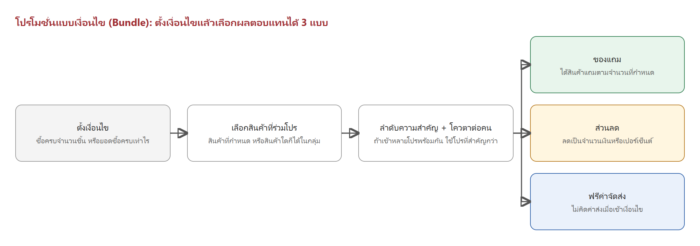

*รูป 3-1 ใช้การตั้งค่าชุดเดียวกับระบบ Bundle ที่ใช้งานอยู่ เพิ่มเติมคือผลตอบแทนไม่ต้องเลือกอย่างเดียวอีกแล้ว — ผสมของแถม ส่วนลด ฟรีค่าจัดส่ง และอื่นๆ ได้ในโปรเดียว (ภาพประกอบเป็นแนวคิดรุ่นแรก)*

| หัวข้อที่ตั้งค่า | รายละเอียด |
|---|---|
| เงื่อนไข | ซื้อครบจำนวนชิ้นที่กำหนด หรือยอดซื้อครบจำนวนเงินที่กำหนด (เลือกอย่างใดอย่างหนึ่ง) |
| สินค้าที่ร่วมโปร | เลือกสินค้าที่กำหนดไว้ หรือเปิดให้สินค้าชนิดใดก็ได้ในกลุ่มที่ตั้งไว้นับรวมกัน |
| โควต้าทั้งหมด (ทุกคนรวมกัน) | จำกัดจำนวนสิทธิ์รวมของโปร เช่น มีแค่ 100 ออเดอร์ — ใช้คู่กับโควต้าต่อคนได้ เช่น 100 สิทธิ์ และคนละไม่เกิน 2 · หมดแล้วสถานะเป็น “หมดโควต้า” |
| โควตาต่อคน | จำกัดจำนวนครั้งที่ลูกค้าคนเดียวรับสิทธิ์ได้ (ไม่ระบุ = ไม่จำกัด) |
| ตรวจสอบหน่วยสินค้าอย่างเข้มงวด | อยู่ในโซนเดียวกับเงื่อนไขและสินค้าที่ต้องมี (ซื้อ “กล่อง” ไม่นับเป็น “ขวด” เมื่อเปิด) |
| เฉพาะลูกค้าใหม่ | เงื่อนไขของลูกค้า: บัญชีที่ยังไม่เคยสั่งซื้อเลย (แทน “คูปองลูกค้าใหม่” เดิม) |
| ใช้ร่วมกับโปรอื่น | ตั้งได้ว่าใช้ร่วมกับโปรโมชั่นอื่น/คูปอง/การชำระด้วยพอยท์ได้หรือไม่ — แทนลำดับ priority: ลูกค้าเลือกโปรเองเป็นการ์ดในตะกร้า โปรที่ใช้ร่วมกันไม่ได้เป็นสีเทา |
| ช่วงเวลาที่มีผล | กำหนดวันเริ่มต้นและสิ้นสุด |

ผลตอบแทนเพิ่มได้หลายอย่างต่อโปรโมชั่น (ใช้ component ผลตอบแทนเดียวกับโมดูลอื่น แต่ชุดของโปรโมชั่นเก็บแยกของตัวเอง) เช่น ลด 10% + ของแถม 1 ชิ้น + 50 พอยท์

ผลตอบแทน “พอยท์” ในโปรโมชั่นเลือกได้ 2 แบบ: **ตัวคูณพอยท์ของสินค้าที่เข้าโปร** (เช่น ×1.5 — คูณกับพอยท์ต่อหน่วยของสินค้านั้น) หรือ **พอยท์ฟรีจำนวนคงที่** (เช่น แถม 50 พอยท์) จะใช้อย่างใดอย่างหนึ่ง ทั้งคู่ หรือไม่ให้พอยท์เลยก็ได้ — โปรโมชั่นเป็นที่เดียวที่เพิ่มพอยท์ได้ (แคมเปญไม่ให้พอยท์/ตัวคูณ) ถ้าซื้อโปรที่ไม่มีผลตอบแทนพอยท์ ก็ได้เฉพาะพอยท์ปกติของสินค้า

| ผลตอบแทน | ตัวอย่าง |
|---|---|
| ของแถม | ซื้อนมผงสูตร 3 คู่กับขวดนม PP รับของแถมตามจำนวนที่กำหนด ถ้าของแถมหมดสต็อกระหว่างโปรโมชั่น active ระบบจะแจ้งเตือนแอดมินและปิดโปรโมชั่นนั้นชั่วคราวให้อัตโนมัติ |
| ส่วนลด | ซื้อสินค้าแบรนด์ที่กำหนดครบ 1,000 บาท ลดทันที 100 บาท ถ้าตั้งเป็นส่วนลด % ตั้งเพดานส่วนลดสูงสุดได้ เช่น ลด 15% สูงสุดไม่เกิน 100 บาท |
| ฟรีค่าจัดส่ง | ซื้อสินค้าในกลุ่มที่กำหนด ไม่เสียค่าจัดส่ง |
| พอยท์ / คูปอง / เครดิตเงินคืน | ได้หลังชำระเงินสำเร็จ: พอยท์ตามจำนวนที่ตั้ง · คูปองจากที่มีในระบบ · เครดิตเงินคืนที่ระบบออกให้ |
| สิทธิ์ลุ้น / ของรางวัลนอก POS | สิทธิ์ลุ้นในกิจกรรมสุ่มรางวัล (โหมด B หรือวงล้อ) · ของรางวัลนอก POS ระบุเป็นข้อความ เข้าคิวส่งมอบ |

ส่วนลดท้ายบิลตามแบรนด์และส่งฟรีตามกลุ่มสินค้าที่เคยแยกเป็นกติกาต่างหาก แท้จริงคือโปรโมชั่นแบบเงื่อนไขที่ตั้งเงื่อนไขเป็น "ยอดซื้อครบจำนวนเงิน" แล้วเลือกผลตอบแทนเป็นส่วนลดหรือฟรีค่าจัดส่งนั่นเอง จบในหน้าตั้งค่าเดียวกันได้ทั้งหมด ไม่ต้องมีหน้าตั้งค่าแยก

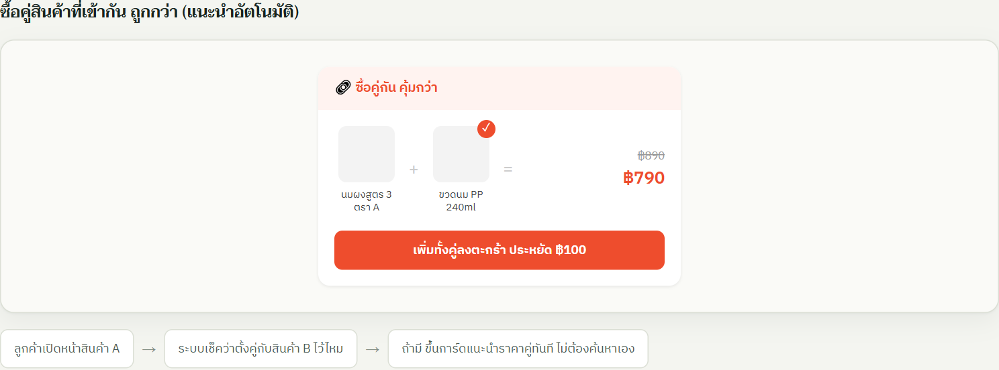

*รูป 3-2 ตัวอย่างหน้าจอ: เงื่อนไขซื้อครบ 2 ชิ้นที่กำหนด ผลตอบแทนเป็นราคาพิเศษเมื่อซื้อคู่ ระบบแนะนำให้ทันทีเมื่อลูกค้าเปิดดูสินค้าตัวแรก*

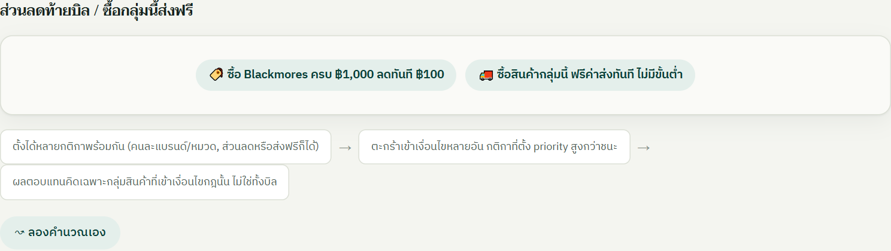

*รูป 3-3 ตัวอย่างหน้าจอ: เงื่อนไขยอดซื้อครบตามแบรนด์ ผลตอบแทนเป็นส่วนลดท้ายบิลหรือฟรีค่าจัดส่งแสดงขึ้นในหน้าสรุปยอดทันทีเมื่อเข้าเงื่อนไข*

### 3.4 โปรโมชั่นตามวันพิเศษ

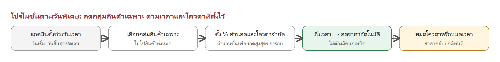

*รูป 3-4 ลดราคาเฉพาะกลุ่มสินค้าที่เลือกไว้ ไม่ใช่ทุกสินค้า และมีโควตาจำนวนจำกัดในแต่ละรอบ*

แอดมินกำหนดวันและเวลา เลือกกลุ่มสินค้าเฉพาะที่เข้าร่วม (ไม่ใช่สินค้าทั้งหมด) ตั้งเปอร์เซ็นต์ส่วนลดและโควตาจำนวนจำกัดของรอบ ถึงเวลาที่ตั้งไว้ราคาเปลี่ยนให้อัตโนมัติ เมื่อหมดโควตาหรือหมดเวลา ราคาจะกลับเป็นปกติทันทีโดยไม่ต้องมีคนกดปิด

| หัวข้อที่ตั้งค่า | รายละเอียด |
|---|---|
| ช่วงเวลา | วันและเวลาเริ่มต้น–สิ้นสุด |
| กลุ่มสินค้าที่ร่วมรายการ | เลือกเฉพาะบางหมวดหรือบางรายการ ไม่ใช่สินค้าทั้งหมด |
| เปอร์เซ็นต์ส่วนลด | ตั้งแยกแต่ละกลุ่มสินค้าได้ เช่น กลุ่มหนึ่งลด 50% อีกกลุ่มลด 30% |
| โควตาของรอบ | จำกัดจำนวนชิ้นหรือยอดสูงสุดที่ขายได้ในราคาพิเศษ หมดโควตาราคากลับปกติทันที |

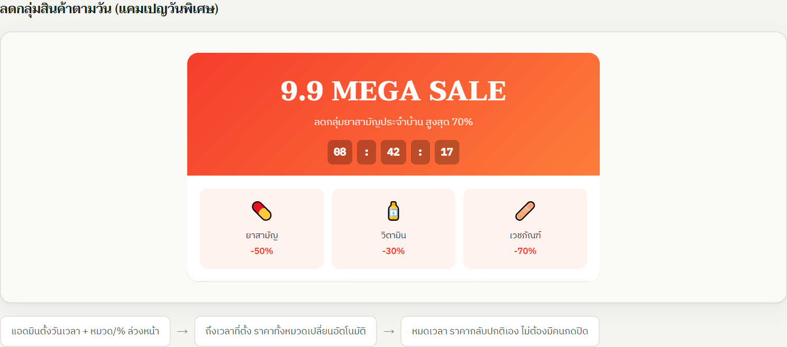

*รูป 3-5 ตัวอย่างหน้าจอ: โปรโมชั่นวันพิเศษลดราคาเฉพาะกลุ่มสินค้า เช่น ยาสามัญ วิตามิน และเวชภัณฑ์ คนละเปอร์เซ็นต์กัน*

### 3.5 การแสดงผลหน้าเว็บ

- **ป้ายโปรโมชั่น** เช่น "ซื้อคู่ถูกกว่า", "ลดกลุ่มสินค้า" หรือ "ส่งฟรี" บนการ์ดสินค้า
- **ตัวกรองโปรโมชั่น** ลูกค้ากดดูเฉพาะสินค้าที่มีโปรโมชั่นได้จากหน้าค้นหา
- **รายละเอียดบนหน้าสินค้า** เงื่อนไขโปรโมชั่นแสดงในหน้าหลักของสินค้า ไม่ต้องกดเข้าแท็บย่อย

### 3.6 หน้าจอและ flow การใช้งาน

หน้าจอทั้งหมดของโมดูลนี้เรียงตามลำดับ flow การใช้งาน แต่ละภาพมีเลขกำกับบนจอ และคำอธิบายของแต่ละเลขอยู่ใต้ภาพ ตามด้วยกติกา ข้อยกเว้น และสถานะที่ต้องรองรับ หน้าแอดมินใช้โครงเดียวกับหน้า "เซตของแถม" ที่ใช้งานอยู่ เพราะเป็นแนวคิดเดียวกัน ส่วนที่เพิ่มจากเดิมมีป้าย "ใหม่" กำกับ

#### ภาพรวม · ภาพรวม Flow โปรโมชั่น

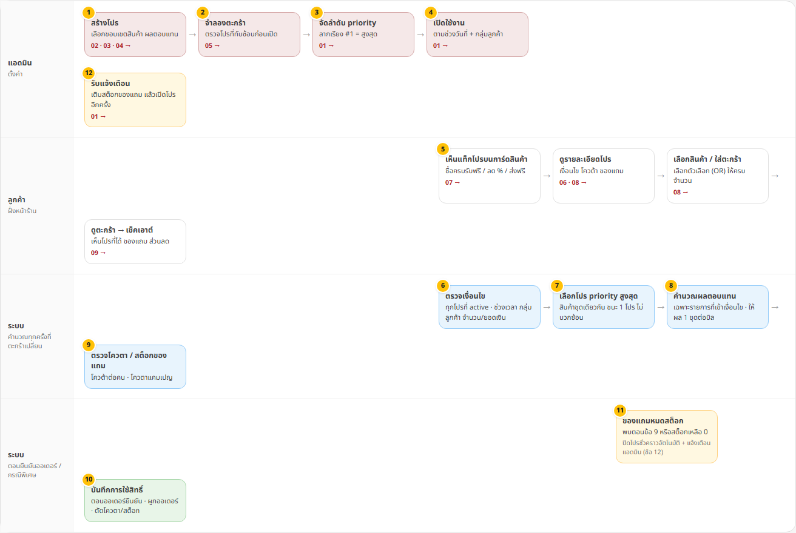

**คำอธิบายแต่ละส่วนในหน้าจอ**

1. สร้างโปร เริ่มจากกล่องเดียว ใช้ฟอร์มเดียวกับ Bundle เดิม — ส่วนที่เพิ่มใหม่มีป้าย "ใหม่": ผลตอบแทน 3 แบบ ขอบเขตแบรนด์/หมวด ใช้ร่วมกับสิทธิ์อื่น (หน้า 02) · ลดตามวันพิเศษแยกหน้า 04
2. จำลองตะกร้า เป็นขั้นแนะนำ ไม่บังคับ — ใช้ตรวจว่าโปรใหม่ไปชนโปรเดิมหรือไม่ก่อนเปิดใช้งาน (ทดสอบโปรที่ยังปิดอยู่ได้)
3. จัดลำดับ ลากแถวในตาราง ตัวเลข #1 = สูงสุด ระบบบันทึกทันที (เหมือน Bundle เดิม) — แนะนำจัดหลังสร้างโปรใหม่ทุกครั้ง เพราะโปรใหม่ถูกวางท้ายสุดโดยค่าเริ่มต้น
4. เปิดใช้งาน สถานะแสดงตามวันที่เริ่ม–สิ้นสุด (ใช้งาน / ยังไม่เริ่มต้น / หมดอายุ) บันทึกเป็น "ใช้งาน" ไม่ได้ถ้ายังไม่มีสินค้าที่ต้องมีและผลตอบแทน
5. แท็กบนการ์ดสินค้า ป้ายเดียวต่อประเภทผลตอบแทนของโปรที่เข้าเงื่อนไข/ใกล้ถึง
6. ตรวจเงื่อนไข ทำใหม่ทุกครั้งที่จำนวนหรือรายการในตะกร้าเปลี่ยน ไม่ใช้ผลที่จำไว้จากหน้าก่อน
7. เลือกโปร ลูกค้ากดการ์ดเลือก/ยกเลิกเอง — โปรที่ใช้ร่วมกันไม่ได้เป็นสีเทาพร้อมเหตุผล ไม่มี priority · ดูของจริงได้ที่โมดูลจำลองระบบครบวงจร
8. คำนวณ ผลตอบแทนอิงเฉพาะบรรทัดที่เข้าเงื่อนไข · ให้ผลตอบแทน 1 ชุดต่อบิล (ต่อออเดอร์ที่เข้าเงื่อนไข)
9. ตรวจโควตา/สต็อก ถ้าโควต้าต่อคนเต็ม โปรไม่ถูกใช้ (ปุ่มหน้าลูกค้าแสดง "โควต้าเต็มแล้ว") · ถ้าของแถมไม่พอสำหรับชุดที่ได้ ระบบให้เท่าที่สต็อกพอ ถ้าเหลือ 0 ไปข้อ 11
10. บันทึกการใช้สิทธิ์ เกิดตอนออเดอร์ยืนยัน/ชำระสำเร็จ ไม่ใช่ตอนใส่ตะกร้า — จึงไม่ต้องมีการพักโควตา
11. ของแถมหมดสต็อก ระบบปิดโปรชั่วคราวทันที ตะกร้าที่มีโปรนี้อยู่จะไม่ได้ของแถมและแสดงข้อความอธิบาย (หน้า 09)
12. รับแจ้งเตือน แอดมินเห็นป้ายแดง "ปิดชั่วคราว: ของแถมหมด" ที่แถวโปรในหน้ารายการ (หน้า 01) เติมสต็อกแล้วกดเปิดใช้งานเอง

**กติกา / ข้อยกเว้น / สถานะ**

- **ของแถมหมด = โปรนั้นไม่ทำงาน** (ไม่ให้ของแถม และไม่แปลงเป็นส่วนลดแทน) · แอดมินต้องคอยตรวจสต็อกของแถมเอง ระบบเตือนแอดมินด้วยป้ายแดง “ปิดชั่วคราว: ของแถมหมด” ที่แถวโปรในหน้ารายการ · โปรไม่เปิดคืนเองแม้เติมสต็อกแล้ว แอดมินต้องกดเปิดเอง
- แก้ไขโปรที่มีผู้ใช้สิทธิ์ไปแล้ว มีผลกับตะกร้า/ออเดอร์ใหม่เท่านั้น ประวัติเดิมไม่เปลี่ยน
- ลูกค้าเห็นโปรเฉพาะที่ active และอยู่ในช่วงเวลา · โปร "ยังไม่เริ่มต้น" แสดงเป็นการ์ดเทาและกดไม่ได้

**ข้อที่ต้องตัดสินใจกับลูกค้า**

- ยอดที่ใช้นับเงื่อนไขโปรคิดจากราคาก่อนหรือหลังลด Flash Sale (ค่าเริ่มต้น = หลังลด คือราคาที่ลูกค้าจ่ายจริง)

#### แอดมิน · รายการโปรโมชั่น (2 แบบ ไม่มี priority)

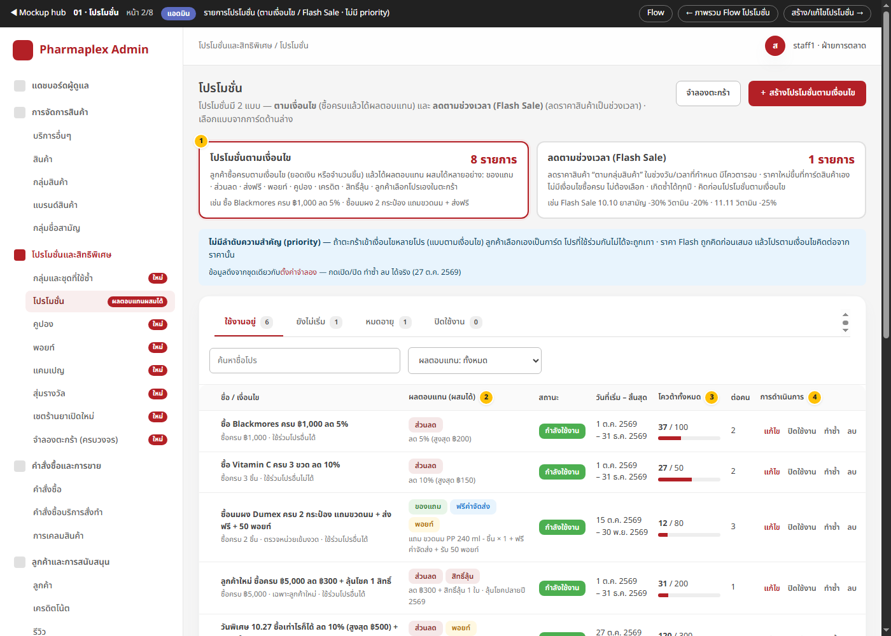

**เพิ่ม/เปลี่ยนในรอบนี้**

- ถอดลำดับ priority และการลากเรียงออก
- โปรโมชั่นแยกเป็น 2 แบบในเมนูเดียว: โปรโมชั่นตามเงื่อนไข และโปรโมชั่นลดตามช่วงเวลา (Flash Sale) — เลือกจากการ์ดด้านบนของหน้า แต่ละแบบมีตารางและแท็บสถานะของตัวเอง (ใช้งานอยู่ / ยังไม่เริ่ม / หมดอายุ / ปิดใช้งาน) และปุ่มสร้างตามแบบ
- เพิ่มคอลัมน์โควต้าทั้งหมด (ใช้แล้ว/ทั้งหมด) และผลตอบแทนแบบผสมหลายชนิด

**คำอธิบายแต่ละส่วนในหน้าจอ**

1. ผลตอบแทน เปลี่ยน โปรหนึ่งโปรมีหลายผลตอบแทนพร้อมกันได้ แสดงเป็น chip ต่อชนิด (ของแถม ส่วนลด ฟรีค่าส่ง พอยท์ คูปอง เครดิต สิทธิ์ลุ้น ของนอก POS) · กรองได้ตามชนิดที่มีอยู่ในโปร
1.1 เลือกแบบโปรโมชั่น: การ์ด 2 ใบ — “ตามเงื่อนไข” (ซื้อครบแล้วได้ผลตอบแทน ลูกค้าเลือกการ์ดเอง) และ “ลดตามช่วงเวลา (Flash Sale)” (ลดราคาตามกลุ่มสินค้าเป็นช่วงเวลา ไม่มีเงื่อนไข ไม่ต้องเลือก เกิดซ้ำได้) พร้อมคำอธิบาย ตัวอย่าง และจำนวนรายการ · ปุ่ม “＋ สร้าง…” เปลี่ยนตามแบบที่เลือก
2. แท็บสถานะ (ในแต่ละแบบ) ใช้งานอยู่ · ยังไม่เริ่ม · หมดอายุ (รวมหมดโควต้า) · ปิดใช้งาน พร้อมจำนวน
3. โควต้าทั้งหมด ใหม่ ใช้แล้ว / ทั้งหมด (ทุกคนรวมกัน) + แถบความคืบหน้า · เต็มแล้วเปลี่ยนเป็น “หมดโควต้า” เอง และเลือกไม่ได้ในตะกร้า · คอลัมน์ “ต่อคน” คือโควต้าต่อลูกค้า
4. การดำเนินการ แก้ไข / เปิด-ปิดใช้งาน / ทำซ้ำ / ลบ ทำงานจริงกับข้อมูลตั้งค่าจำลอง · ทำซ้ำสร้าง “(สำเนา)” สถานะไม่ใช้งาน · ไม่มีการลากเรียงลำดับ
5. Flash Sale มีตารางของตัวเอง (ชื่อ ช่วงเวลา เกิดซ้ำ กลุ่มสินค้า/ส่วนลด ขายไปแล้ว/โควตารอบ สถานะ) และหน้าตั้งค่าเฉพาะ (กลุ่มสินค้า + โควตารอบ) เพราะกลไกต่างจากแบบตามเงื่อนไข — ราคา Flash ถูกคิดก่อนโปรเงื่อนไข · โปรวันพิเศษที่ต้องการผลตอบแทนอื่น (เช่น พอยท์ ×2) สร้างเป็นโปรตามเงื่อนไขแบบไม่มียอดขั้นต่ำ

**กติกา / ข้อยกเว้น / สถานะ**

- ลำดับ priority ถูกถอดออกทั้งระบบ: ลูกค้าเลือกโปรเอง · ระบบเทาโปรที่ใช้ร่วมกันไม่ได้ · ถ้าเลือกอยู่แล้วโปรชนกัน ระบบสลับให้ตามที่ลูกค้ากด
- สิทธิ์จัดการ: ROLE_MARKETING, ROLE_PRODUCT — บทบาทอื่นเห็นข้อความ “คุณไม่มีสิทธิ์เข้าถึง”
- โปรเดิมที่เป็นเซตของแถม (Bundle) ถูกย้ายเข้ารายการนี้ ผลตอบแทน = ของแถม ขอบเขต = เลือกรายสินค้า
- ลบโปรที่มีประวัติใช้สิทธิ์: ซ่อนจากรายการ เก็บประวัติไว้ (soft delete)

#### แอดมิน · สร้าง/แก้ไขโปรโมชั่น

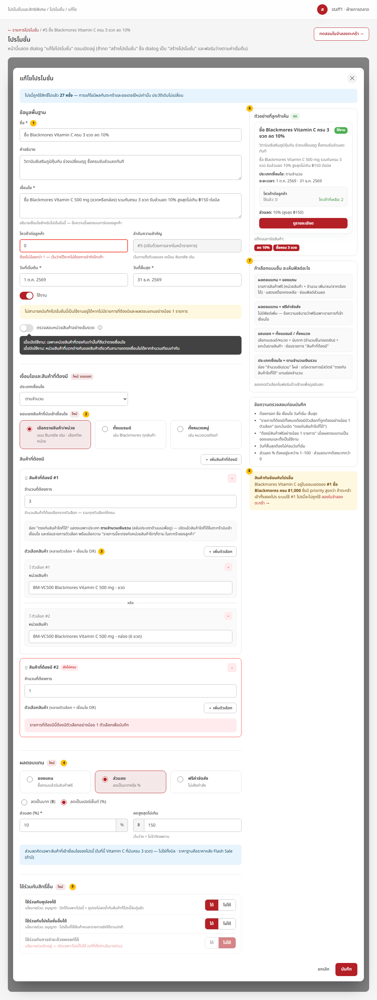

**เพิ่ม/เปลี่ยนในรอบนี้**

- เพิ่ม “โควต้าทั้งหมด (ทุกคนรวมกัน)” ใช้คู่กับโควต้าต่อลูกค้าได้ เช่น 50 สิทธิ์ คนละไม่เกิน 2
- ย้าย “ตรวจสอบหน่วยสินค้าอย่างเข้มงวด” ไปอยู่ในโซนเงื่อนไขและสินค้าที่ต้องมี แบ่ง section A–E
- เพิ่มเงื่อนไข “เฉพาะลูกค้าใหม่ (ไม่เคยสั่งซื้อ)” แทนคูปองลูกค้าใหม่
- ผลตอบแทนเปลี่ยนเป็น component ผสมหลายชนิด: ของแถม SKU · ส่วนลดบาท/% (+เพดาน) · ฟรีค่าจัดส่ง · พอยท์ · คูปอง · เครดิตเงินคืน · สิทธิ์ลุ้น · ของรางวัลนอก POS — ไม่มี “ชุดของรางวัล” กลางและไม่มี priority แล้ว

**คำอธิบายแต่ละส่วนในหน้าจอ**

1. ข้อมูลพื้นฐาน ใช้ฟิลด์เดิมของเซตของแถม (ชื่อ คำอธิบาย เงื่อนไข โควต้า วันที่ ใช้งาน) · ตรวจหน่วยอย่างเข้มงวดย้ายไปอยู่หัวข้อ “เงื่อนไขและสินค้าที่ต้องมี” · ไม่มีลำดับความสำคัญ · ตรวจแบบ inline ใต้ช่อง (ตัวอย่างโควต้า = 0 ขึ้นขอบแดง) · กด Enter ในฟอร์มเท่ากับบันทึก (หน่วงกันกดซ้ำ 0.5 วินาที)
2. ขอบเขตสินค้า ใหม่ ค่าเริ่มต้น = "เลือกรายสินค้า/หน่วย" (พฤติกรรมเดิมทั้งหมด) · เลือกแบรนด์/หมวดแล้วช่อง "สินค้าที่ต้องมี" ถูกแทนที่ด้วยตัวเลือกแบรนด์/หมวด + ยกเว้นรายสินค้า · เปลี่ยนขอบเขตหลังกรอกแล้ว ระบบถามยืนยันก่อนล้างรายการเดิม
3. ตัวเลือก (OR) หลายตัวเลือกในรายการเดียว = ลูกค้าเลือกตัวใดก็ได้ รวมกันให้ครบ "จำนวนที่ต้องการ" · เพิ่มตัวเลือกใหม่ไม่ได้ถ้ามีตัวเลือกที่ยังว่างอยู่ (toast "กรุณาเติมข้อมูลตัวเลือกให้ครบถ้วน…") · ลากเรียงลำดับตัวเลือกได้
4. ผลตอบแทน เปลี่ยน รวมได้หลายอย่างในโปรเดียว: ของแถม SKU · ส่วนลด (บาท/% + เพดาน) · ฟรีค่าจัดส่ง · พอยท์ · คูปอง · เครดิตเงินคืน · สิทธิ์ลุ้น · ของรางวัลนอก POS — component เดียวกับทุกโมดูล แต่ละโมดูลเก็บชุดของตัวเอง (flag source_module ) ไม่มีหน้า “ชุดของรางวัล” กลางแล้ว
5. ใช้ร่วมกับสิทธิ์อื่น ใหม่ ค่าเริ่มต้นตามนโยบายร่วมของระบบ โปรนี้ "ปิด" ให้เข้มกว่าได้ แต่ "เปิด" เกินนโยบายร่วมไม่ได้ (แถวสีจางพร้อมเหตุผล)
6. ตัวอย่างที่ลูกค้าเห็น เปลี่ยนตามฟอร์มทันที (ชื่อ เงื่อนไข ช่วงวันที่ ผลตอบแทน แท็กบนการ์ดสินค้า) ใช้ component เดียวกับหน้า 06 — เห็นสถานะ "ยังไม่เริ่มต้น/ใช้งาน" ตามวันที่กรอก
7. ฟิลด์ที่เปลี่ยนตามตัวเลือก แผงสรุปให้ทีมพัฒนาและลูกค้าเห็นภาพรวมว่าแต่ละตัวเลือกเปิดฟิลด์อะไร โดยไม่ต้องคลิกทดลองทีละแบบ
8. เตือนโปรที่ชนกัน แทนการเตือน priority เดิม: บอกว่าถ้าลูกค้าเลือกโปรนี้ โปรไหนจะถูกเทา — ลูกค้าเลือกเองในตะกร้า
9. กลุ่มเป้าหมาย ใหม่ ทุกโปรมีช่อง “ใครใช้สิทธิ์นี้ได้” — ทุกคน (ค่าเริ่มต้น) หรือบางคนโดยเลือกจาก กลุ่มลูกค้า ที่ตั้งไว้ (รวม/ยกเว้น) · แสดงจำนวนผู้เข้าข่ายสด · ต้องมีกลุ่ม “รวม” อย่างน้อย 1 กลุ่มจึงบันทึกเป็นใช้งานได้ · ตัวอย่างหน้านี้แสดงสถานะ “บางคน”
10. กลุ่มสินค้า ขอบเขตสินค้ามีตัวเลือก “กลุ่มสินค้าที่ตั้งไว้” จาก กลุ่มสินค้า ไม่ต้องกรอกซ้ำ
11. โควต้าทั้งหมด ใหม่ จำกัดจำนวนสิทธิ์รวมของโปร (นับเป็นออเดอร์) แยกจากโควต้าต่อลูกค้า — ใช้คู่กันได้ เช่น 50 สิทธิ์ คนละไม่เกิน 2 · ตัดตอนชำระสำเร็จ · เต็มแล้วสถานะ “หมดโควต้า”
12. จัดกลุ่มเงื่อนไข A ประเภท · B ขอบเขต · C สินค้าที่ต้องมี · D ตรวจหน่วยสินค้า · E เงื่อนไขลูกค้า — อยู่โซนเดียวกัน
13. เฉพาะลูกค้าใหม่ ใหม่ แทน “คูปองลูกค้าใหม่” — โปรโมชั่นที่ติ๊กข้อนี้ใช้ได้เฉพาะบัญชีที่ไม่เคยสั่งซื้อ

**กติกา / ข้อยกเว้น / สถานะ**

- บันทึกเป็นใช้งานได้เมื่อมี "สินค้าที่ต้องมี"/ขอบเขต และผลตอบแทนครบ (ของแถมต้องมีสินค้าฟรีอย่างน้อย 1 รายการ) — บันทึกเป็นไม่ใช้งานได้เสมอ
- ปุ่ม "บันทึก" แสดง toast สำเร็จ แล้วกลับหน้ารายการ · เกิดข้อผิดพลาดจากเซิร์ฟเวอร์ = dialog ไม่ปิด แสดง toast แดง
- แก้โปรที่ใช้ไปแล้ว: ประวัติการใช้สิทธิ์เก็บ snapshot เงื่อนไข/ผลตอบแทนตอนใช้ ไม่เปลี่ยนตาม
- โปรเดิม (Bundle) เปิดแล้วเห็นขอบเขต = เลือกรายสินค้า, ผลตอบแทน = ของแถม, ใช้ร่วม = ตามนโยบายร่วม

**ข้อที่ต้องตัดสินใจกับลูกค้า**

- ลูกค้าเลือกโปรเองเมื่อเข้าเงื่อนไขหลายโปร — ต้องการให้ระบบ “แนะนำ” ชุดที่ประหยัดสุดล่วงหน้า (ติ๊กไว้ให้) หรือไม่ติ๊กอะไรเลย
- ของแถมได้พอยท์หรือไม่ (ค่าเริ่มต้น = 0 พอยท์ เพราะราคา ฿0)

#### แอดมิน · โปรโมชั่นลดตามวันพิเศษ (Flash Sale)

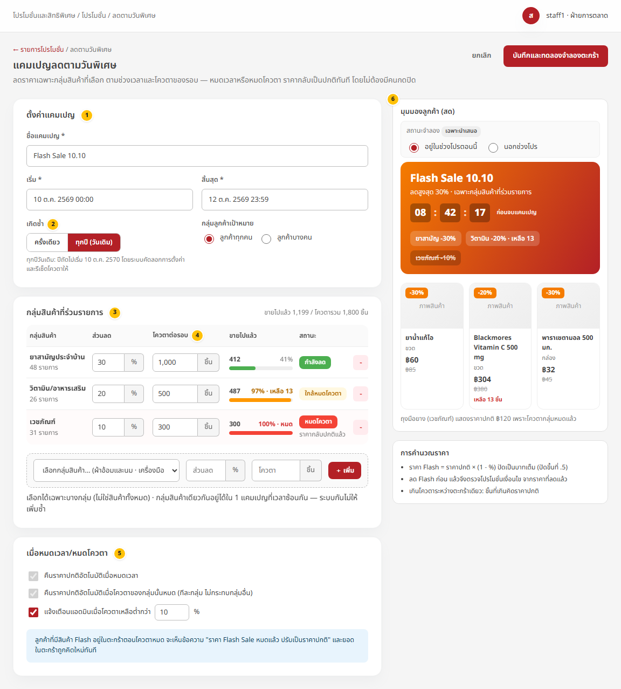

**คำอธิบายแต่ละส่วนในหน้าจอ**

1. ตั้งค่าโปรโมชั่น ชื่อ + วันเวลาเริ่ม–สิ้นสุด (ระดับนาที) · สิ้นสุดต้องหลังเริ่ม · ช่วงเวลาซ้อนกับโปรโมชั่นอื่นที่มีกลุ่มสินค้าเดียวกัน ระบบเตือนและไม่ให้บันทึก
2. เกิดซ้ำ "ครั้งเดียว" หรือ "ทุกปี (วันเดิม)" — ทุกปีคัดลอกการตั้งค่าไปปีถัดไปอัตโนมัติและรีเซ็ตโควตา (แอดมินแก้ได้ก่อนถึงวัน)
3. กลุ่มสินค้า เลือกได้เฉพาะบางหมวด/กลุ่ม ตั้ง % ต่อกลุ่ม (เช่น 30% / 20% / 10%) · เพิ่ม/ลบแถวได้ระหว่างโปรโมชั่นกำลังทำงาน (เพิ่มกลุ่มมีผลทันที)
4. โควตาต่อรอบและความคืบหน้า นับเป็นชิ้นที่ขายได้ในราคาพิเศษ · แถบเขียว < 90% / เหลือง ≥ 90% / แดงเมื่อหมด · หมดโควตา = ราคากลับปกติเฉพาะกลุ่มนั้นทันที (ไม่รอหมดเวลา)
5. คืนราคาอัตโนมัติ ล็อกเปิดไว้ ไม่ให้ปิด (เป็นหลักของโปรประเภทนี้) · ตั้งแจ้งเตือนแอดมินเมื่อโควตาใกล้หมดได้
6. มุมมองลูกค้า + สถานะจำลอง ปุ่มสลับ "อยู่ในช่วงโปร / นอกช่วงโปร" ใช้เพื่อนำเสนอเท่านั้น ไม่เปลี่ยนข้อมูลจริง (ระบบจริงเช็คจากวันเวลาที่ตั้ง) · แบนเนอร์มีนาฬิกานับถอยหลัง การ์ดสินค้าขีดฆ่าราคาเดิม และป้าย "เหลือ N ชิ้น" เมื่อโควตาต่ำกว่า 20%

**เพิ่ม/เปลี่ยนในหน้านี้ (กลุ่มเป้าหมาย / ชุดที่ใช้ซ้ำ)**

- กลุ่มลูกค้าเป้าหมาย: ใช้ ช่อง “ใครใช้สิทธิ์นี้ได้” (ตัวเลือกกลุ่มเป้าหมายเดียวกับทุกหน้า): ทุกคน (ค่าเริ่มต้น) หรือบางคน = เลือกจากกลุ่มลูกค้าที่ตั้งไว้ในเมนู “กลุ่มและชุดที่ใช้ซ้ำ” แบบ รวม/ยกเว้น (ยกเว้นชนะรวม) · แสดงจำนวนผู้เข้าข่ายสด · เลือก “บางคน” ต้องมีกลุ่ม “รวม” ≥ 1 กลุ่มจึงเผยแพร่ได้ — แทนช่อง “เพิ่มลูกค้า” รายคนเดิม

**กติกา / ข้อยกเว้น / สถานะ**

- สถานะโปรโมชั่น: ตั้งเวลาไว้ → กำลังจัดอยู่ → จบแล้ว (หมดเวลา/หมดโควตาทุกกลุ่ม) · แก้ % ระหว่างจัดอยู่มีผลกับตะกร้าใหม่ ตะกร้าที่ค้างอยู่คิดใหม่ทุกครั้งที่โหลด
- ใช้ได้กับลูกค้าที่กำหนดเท่านั้น (ทุกคน / บางคน) · ลูกค้านอกกลุ่มเห็นราคาปกติ ไม่เห็นแบนเนอร์
- ถ้าสินค้าอยู่ทั้งในโปรโมชั่น Flash และโปรโมชั่นเงื่อนไข ลด Flash ก่อน แล้วโปรเงื่อนไขคิดจากราคาที่ลดแล้ว

**ข้อที่ต้องตัดสินใจกับลูกค้า**

- โควตาต่อรอบนับ "ชิ้น" (ค่าเริ่มต้น) หรือ "ยอดเงิน" — spec ระบุได้ทั้งสองแบบ
- ปัดเศษราคา Flash เป็นบาทเต็ม (ค่าเริ่มต้น) หรือเก็บสตางค์
- ยอดที่ใช้นับเงื่อนไขโปรเงื่อนไขคิดจากราคาหลังลด Flash (ค่าเริ่มต้น) หรือราคาก่อนลด
- มีโควตาต่อลูกค้า/ร้านด้วยหรือไม่ (ตอนนี้โควตาเป็นของทั้งรอบเท่านั้น)

#### ภาพรวม · จำลองระบบครบวงจร (โมดูลใหม่)

แยกการจำลองตะกร้าออกจากโมดูลโปรโมชั่นเป็นโมดูลของตัวเอง เพื่อจำลองครบวงจร: โปรโมชั่น · คูปอง · พอยท์ · แคมเปญ · สุ่มรางวัล — ตั้งค่าได้จริง คำนวณจริงด้วยลอจิกเดียวกับที่ระบบจะทำ และกดชำระแล้วผลเกิดจริง ใช้สาธิตให้ลูกค้าดู ข้อมูลเก็บในเบราว์เซอร์ (ไม่ต้องมีเซิร์ฟเวอร์) ลอจิกอยู่ที่ mockup/assets/pmp-core.js

**3 หน้าจอ**

1. ตั้งค่า (แอดมิน) — แก้โปรโมชั่น คูปอง แคตตาล็อกแลก แคมเปญขั้นบันได กิจกรรมสุ่มรางวัล และตั้งค่ากลาง (ส่งฟรี เพดานใช้พอยท์ วันที่จำลอง) · ผลตอบแทนทุกที่ใช้ component เดียว
2. ตะกร้า / ชำระเงิน (ลูกค้า) — เลือกลูกค้าจำลอง (B2B / ลูกค้าใหม่ / B2C) ใส่สินค้า เลือกการ์ดโปร (โปรที่ชนกันเป็นสีเทา) ใส่โค้ด/เลือกคูปองจากกระเป๋า ใช้พอยท์/เครดิต เห็นสรุปยอด สิ่งที่จะได้หลังชำระ และลำดับการตัดสิน (trace) · ปุ่ม “เลือกชุดที่ประหยัดสุด” · กดชำระแล้วตัดโควตา ให้พอยท์ คูปอง เครดิต สิทธิ์ลุ้น สะสมยอดแคมเปญ
3. สิทธิ์ & ผลลัพธ์ของลูกค้า — ศูนย์คูปอง (เก็บเอง/แจกรายเดือน) · แลกพอยท์ · ขั้นบันไดแคมเปญ (ขอรับสิทธิ์) · ลุ้นโชคโหมด A/B · คิวรับของ (ของแถม/ของนอก POS) · ประวัติออเดอร์พร้อมผลที่เกิดขึ้น

**ลำดับการคิดเงิน**

1. ราคาฐาน (ลด Flash Sale ถ้าเข้าเงื่อนไข)
2. โปรโมชั่นที่ลูกค้าเลือก (ตรวจวันที่ สถานะ โควต้าทั้งหมด โควต้าต่อคน กลุ่มเป้าหมาย/ลูกค้าใหม่ ขอบเขตสินค้า เงื่อนไขจำนวน/ยอดเงิน การตรวจหน่วยเข้มงวด) แล้วคิดผลตอบแทนทุกชนิดที่ผสมไว้
3. คูปอง (โค้ด/เก็บเอง/แจกรายเดือน — ช่วงเวลา ขั้นต่ำ โควตา ข้อยกเว้นจากกลุ่มสินค้า ใช้ร่วมกับโปรได้ไหม)
4. ค่าจัดส่ง (ฟรีเมื่อยอดถึงเกณฑ์ หรือผลตอบแทน/คูปองส่งฟรี)
5. ชำระด้วยพอยท์ (ไม่เกิน % ที่ตั้ง และต้องไม่ถูกห้ามโดยโปร/คูปองที่เลือก) และเครดิตเงินคืน
6. หลังชำระ: ตัดโควตา · พอยท์ที่ได้ = Σ จำนวน × พอยท์ต่อหน่วย (ไม่ตั้ง = 0) × ตัวคูณจากโปรโมชั่น (บวกกัน) + พอยท์ฟรีจากโปรโมชั่น · เก็บพอยท์/ยอดสะสมไว้ที่รายการสินค้าในออเดอร์ (ยกเลิกออเดอร์หักคืนเสมอ) · ออกคูปอง/เครดิต/สิทธิ์ลุ้น/ของนอก POS · สะสมยอดแคมเปญ · ออกสิทธิ์ลุ้นจากยอดซื้อ

**ครอบคลุมทุกโมดูล (รอบที่ 3)**

ข้อมูลจำลองและลอจิกครอบคลุม: โปรโมชั่น · Flash Sale (ลด % ตามกลุ่มสินค้า + โควตารอบ คิดก่อนโปร) · คูปองออนไลน์ (โค้ด/เก็บเอง/แจกรายเดือน) · คูปองกระดาษ (ชุด ร้านที่ร่วม ส่งก้นเบิก ตรวจนับ จ่ายเงิน ธงเตือน) · พอยท์ · แคมเปญขั้นบันได (ฟอร์มรับสิทธิ์ต่อขั้น + คิวอนุมัติ/ปฏิเสธ) · สุ่มรางวัล A/B · เซตร้านยาเปิดใหม่ (สินค้าบังคับ/ทางเลือก สต็อก B2B/B2C สั่งแทน) · กลุ่มลูกค้า (ใช้เป็นกลุ่มเป้าหมายได้) — และทุกหน้า mockup ของโมดูลเหล่านี้มีกล่อง “ใช้งานจริง” ที่ฝังหน้าจำลองไว้ด้านบน กดทำงานได้จริง ยกเว้นหน้า flow (แผนภาพ) และหน้าแรกลูกค้า (มีเฉพาะกล่อง “สถานะของฉัน”)

**หน้า mockup ที่ทำงานจริง (UI เดิม)**

หน้า mockup ที่ทำงานจริงด้วย UI เดิมของหน้านั้น (hydrate ด้วย mockup/assets/live.js): ศูนย์คูปอง · พอยท์ของฉัน · แลกพอยท์ · ขั้นบันไดแคมเปญ + ฟอร์มรับสิทธิ์ · สิทธิ์ลุ้น · ลุ้นทันที (วงล้อ) · หน้ารวมโปรโมชั่น · ตรวจสอบคูปองกระดาษ · รายการชุดคูปองกระดาษ · คิวเบิกเงินร้าน · รายการแคมเปญ · คิวคำขอรับรางวัล · รายการกิจกรรมสุ่มรางวัล · กลุ่มลูกค้า · รายการเซตร้านยา · สมุดพอยท์ · โค้ดส่วนลด (ตาราง+ฟอร์มแก้ไข) · แคตตาล็อกแลกพอยท์ (ตาราง+ฟอร์มแก้ไข) — หน้าอื่นที่เหลือใช้กล่อง “▶ ใช้งานจริง” (ฝังหน้าจำลอง) · มีกล่องลอย “จำลอง” มุมขวาล่างของแต่ละหน้าเพื่อเปลี่ยนลูกค้า/วันที่จำลอง

**หน้าตั้งค่าแอดมินที่ทำงานจริง (UI เดิม)**

หน้าตั้งค่า/แก้ไขที่ผูกกับข้อมูลจริงด้วย UI เดิม (มีแถบ “เลือกรายการที่จะแก้ไข” + ปุ่มสร้างใหม่ ช่องกรอก/ตัวเลือก/สวิตช์/ตารางบันทึกอัตโนมัติ): แก้ไขโปรโมชั่น (เงื่อนไข A–E · ขอบเขต · ใช้ร่วม · กลุ่มเป้าหมาย · ผลตอบแทน) · Flash Sale (ตารางกลุ่มสินค้า/ส่วนลด/โควตา) · คูปองเก็บเอง/แจกรายเดือน · ชุดคูปองกระดาษ (เลือกร้าน) · กิจกรรมสุ่มรางวัล + ตารางรางวัล/น้ำหนัก · เซตร้านยา (ตารางสินค้าบังคับ/ทางเลือก) · กลุ่มลูกค้า (ตารางสมาชิก + นำเข้า) · โค้ดส่วนลด · แคตตาล็อกแลกพอยท์ · ที่ยังเป็นกล่อง “ใช้งานจริง”: ตัวสร้างขั้นแคมเปญขั้นบันได, กติกาพอยท์, หน้าสินค้า/รายละเอียดโปร/ตะกร้า, จับรางวัลโหมด B, หน้าแรกลูกค้า

**รอบล่าสุด**

เพิ่มรอบนี้: ตัวสร้างแคมเปญขั้นบันได (การ์ดขั้น ยอดเกณฑ์ รางวัล ฟอร์มรับสิทธิ์ ลบ/เพิ่มขั้น) · ตะกร้า (การ์ดเลือกโปร คูปอง พอยท์ ชำระเงินจริง) · กติกาพอยท์ (อัตรารายสินค้า) · ความคืบหน้าแคมเปญ · จับรางวัลโหมด B · บันทึกการลุ้น · ประวัติการลุ้น · เลือกเซตร้านยา · ที่ยังเป็นกล่อง “ใช้งานจริง”: หน้าสินค้า/รายละเอียดโปร, คูปองในตะกร้า/พอยท์ที่จะได้/สินค้าแคมเปญโควตา, คูปองกระดาษตัวอย่าง, เซตร้านยา (ปรับเซต/สถานะ/สั่งแทน), จับตามรอบฝั่งลูกค้า, หน้าแรกลูกค้า

**ความครอบคลุมสุดท้าย**

รอบสุดท้าย: ทุกหน้า mockup ของโมดูลที่จำลอง (ยกเว้นหน้า flow ซึ่งเป็นแผนภาพ) ทำงานจริงด้วย UI เดิมของหน้านั้นแล้ว (mockup/assets/live.js) — เพิ่มรอบนี้: หน้าแรกลูกค้า · สินค้า/รายละเอียดโปร · คูปองในเช็คเอาต์ · พอยท์ที่จะได้ · จับตามรอบ (โหมด B) · เซตร้านยา (ปรับเซต/สั่งแทน/สถานะหมด) · ตัวอย่างคูปองกระดาษหน้า-หลัง · กลุ่มสินค้า (กติกา รวม/ยกเว้น) · ภาพรวมคูปอง — กล่อง “ใช้งานจริง” แบบ iframe เหลือเป็นทางสำรองเท่านั้น

**ข้อจำกัดของการจำลอง**

- เป็นการจำลองฝั่งเบราว์เซอร์ ไม่มีผู้ใช้หลายคนพร้อมกัน และไม่ผ่านการชำระเงินจริง · โหมดจับรางวัล B จำลองการสุ่มด้วย seed/รหัสยืนยันแบบง่าย

#### ลูกค้า · หน้ารวมโปรโมชั่น

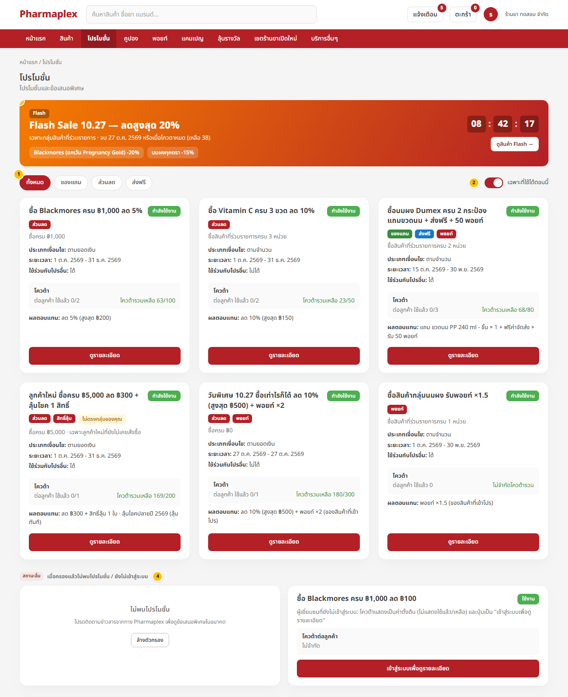

**คำอธิบายแต่ละส่วนในหน้าจอ**

1. ตัวกรองประเภท ใหม่ ทั้งหมด / ของแถม / ส่วนลด / ส่งฟรี — หน้าเดิมแสดงทุกเซตในหน้าเดียวไม่มีตัวกรอง · เลือกได้ทีละประเภท ค่าเริ่มต้น "ทั้งหมด"
2. เฉพาะที่ใช้ได้ตอนนี้ ใหม่ เปิดอยู่ = ซ่อนโปรที่ยังไม่เริ่มและที่โควต้าเต็ม · ปิด = เห็นทั้งหมด (โปรที่ยังไม่เริ่มแสดงปุ่มเทา "ยังไม่เริ่มต้น" ตามหน้าเดิม) · จำค่าไว้ในเบราว์เซอร์
3. โควต้าต่อลูกค้า กล่องเทาตามหน้าเดิม: ไม่จำกัด (เขียว) หรือ ใช้แล้ว / เหลือ — เหลือ > 0 เขียว, = 0 แดง และปุ่มเปลี่ยนเป็น "โควต้าเต็มแล้ว" (ปิดการกด) · ค่า "ใช้แล้ว" นับจำนวนครั้งที่รับสิทธิ์จากออเดอร์ที่ยืนยันแล้ว
4. สถานะว่าง / ยังไม่ล็อกอิน ไม่พบโปร: ข้อความ "ไม่พบโปรโมชั่น" + คำอธิบายเดิม · ผู้เยี่ยมชม: ปุ่ม "เข้าสู่ระบบเพื่อดูรายละเอียด" (เปิด popup ล็อกอิน) ไม่นับโควต้า
5. แบนเนอร์ Flash ใหม่ แสดงเมื่อมีโปรโมชั่นลดตามวันพิเศษ (Flash Sale)ที่กำลังจัดอยู่และลูกค้าอยู่ในกลุ่มเป้าหมาย · นับถอยหลังถึงเวลาสิ้นสุด · กลุ่มที่โควตาหมดไม่แสดงใน chip · ปุ่มพาไปรายการสินค้าที่ร่วมรายการ

**กติกา / ข้อยกเว้น / สถานะ**

- แสดงเฉพาะโปรที่ใช้งานและอยู่ในช่วงวันที่ (เรียงตามวันสิ้นสุดใกล้สุดก่อน ไม่มี priority) — ยกเว้นโปร "ยังไม่เริ่มต้น" ที่แสดงเป็นการ์ดประกาศล่วงหน้า · โปรหมดอายุหรือปิดชั่วคราว (ของแถมหมด) ไม่แสดง
- โปรที่โควต้าทั้งหมดเต็มแสดงป้าย “หมดโควต้า” เป็นสีเทา · สถานะ chip ตามหน้าเดิม: ใช้งาน / ยังไม่เริ่มต้น / หมดอายุ
- คลิกทั้งการ์ดหรือปุ่ม "ดูรายละเอียด" ไปหน้า 08 · ถ้าโควต้าเต็มปุ่มกดไม่ได้
- ข้อความ "ของแถม/ส่วนลด/ส่งฟรี" ที่ท้ายการ์ดสร้างจากผลตอบแทนที่ตั้งไว้ (เดิมมีเฉพาะ "สินค้าฟรี")

**ข้อที่ต้องตัดสินใจกับลูกค้า**

- แบนเนอร์ Flash อยู่บนหน้า "โปรโมชั่น" นี้ด้วย หรือแสดงเฉพาะหน้าแรก/หน้าสินค้า
- โปรที่โควต้าเต็ม: ยังแสดงการ์ดเทา (ค่าเริ่มต้น เหมือนหน้าเดิม) หรือซ่อนทันที

#### ลูกค้า · การ์ดสินค้า + หน้าสินค้าที่มีโปร

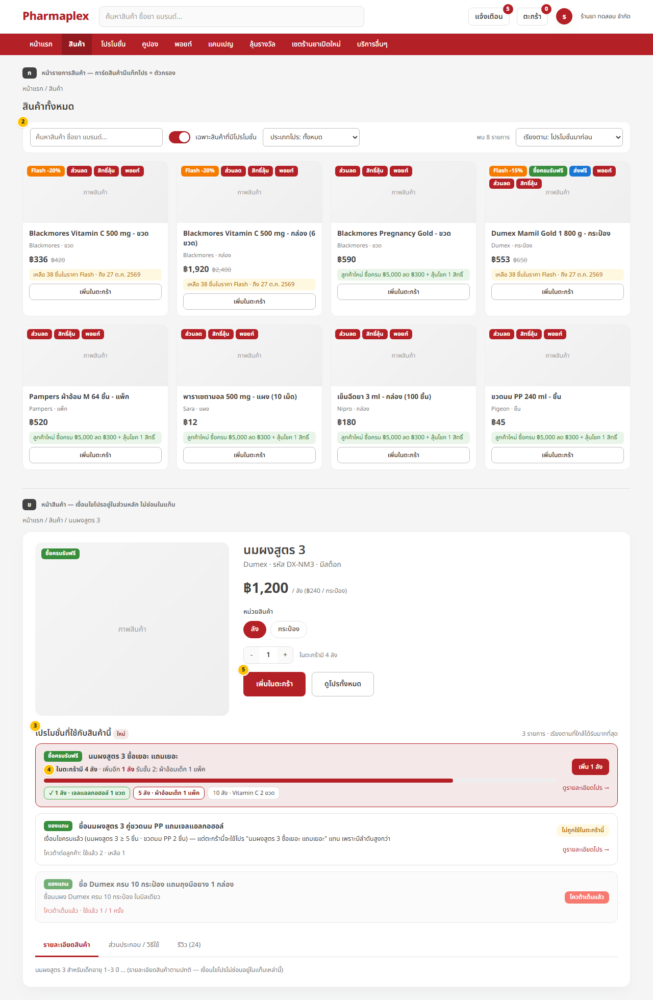

**คำอธิบายแต่ละส่วนในหน้าจอ**

1. แท็กบนการ์ดสินค้า ใหม่ ซื้อครบรับฟรี (แดง) / ของแถม (เขียว) / ส่งฟรี (น้ำเงิน) / ลด % หรือ ลด ฿ (แดง) / Flash (ส้ม) · สูงสุด 2 แท็กต่อการ์ด (เกินเป็น "+1") เรียงตามความสำคัญ · ข้อความบรรทัดล่างสรุปโปรที่ใกล้ที่สุด สั้นไม่เกิน 1 บรรทัด
2. ตัวกรองและการเรียง ใหม่ "เฉพาะสินค้าที่มีโปรโมชั่น" + ประเภทโปร + "เรียงตาม: โปรโมชั่นมาก่อน" (ดันสินค้าที่มีโปรขึ้นก่อน แล้วค่อยเรียงตามเดิม) · ตัวกรองคงอยู่ใน URL
3. โปรโมชั่นที่ใช้กับสินค้านี้ ใหม่ อยู่ในส่วนหลักของหน้าสินค้า เหนือแท็บรายละเอียด (ตาม spec 3.5 ไม่ซ่อนในแท็บย่อย) · แสดงทุกโปรที่สินค้านี้เข้าร่วม ทั้งที่ลูกค้าได้ ใกล้ได้ ไม่ถูกใช้ และโควต้าเต็ม
4. ความคืบหน้าจากตะกร้าจริง "ในตะกร้ามี 4 ลัง · เพิ่มอีก 1 ลัง รับขั้น 2" ใช้ข้อมูลตะกร้าปัจจุบันของลูกค้า · ปุ่ม "เพิ่ม 1 ลัง" เพิ่มจำนวนที่ขาดให้ทันที · ผู้เยี่ยมชมที่ยังไม่ล็อกอินเห็นเงื่อนไขแต่ไม่มีแถบความคืบหน้า
5. CTA "เพิ่มในตะกร้า" ตามปกติ · "ดูโปรทั้งหมด" ไปหน้า 06 · ลิงก์ "ดูรายละเอียดโปร" ในแต่ละแถวไปหน้า 08

**กติกา / ข้อยกเว้น / สถานะ**

- ราคาบนการ์ด/หน้าสินค้า: ขีดฆ่าราคาปกติเมื่อมี Flash เท่านั้น — ส่วนลดจากโปรเงื่อนไขแสดงในตะกร้า ไม่ปรับราคาบนการ์ด เพราะขึ้นกับตะกร้าทั้งใบ
- โปรที่ยังไม่เริ่มต้นแสดงเป็นแถวเทา "เริ่ม 1 พ.ย. 2569" (ไม่มีปุ่ม) · โปรหมดอายุ/ปิดชั่วคราวไม่แสดง
- แสดงสูงสุด 5 โปรต่อสินค้า เกินนั้นมีลิงก์ "ดูโปรทั้งหมด"
- สินค้าที่เป็น "ของแถม" ของโปรใด แสดงข้อความ "เป็นของแถมในโปร …" แต่ไม่ลดราคาเมื่อซื้อเอง

**ข้อที่ต้องตัดสินใจกับลูกค้า**

- จำนวนแท็กสูงสุดต่อการ์ด (เสนอ 2) และลำดับความสำคัญของแท็ก (Flash > ซื้อครบรับฟรี > ส่งฟรี)
- ต้องการแท็ก "ใกล้ได้รับโปร" บนการ์ดสินค้าในหน้ารายการด้วยหรือไม่ (ตอนนี้แสดงเฉพาะหน้าสินค้า/ตะกร้า)

#### ลูกค้า · รายละเอียดโปร + เลือกสินค้า

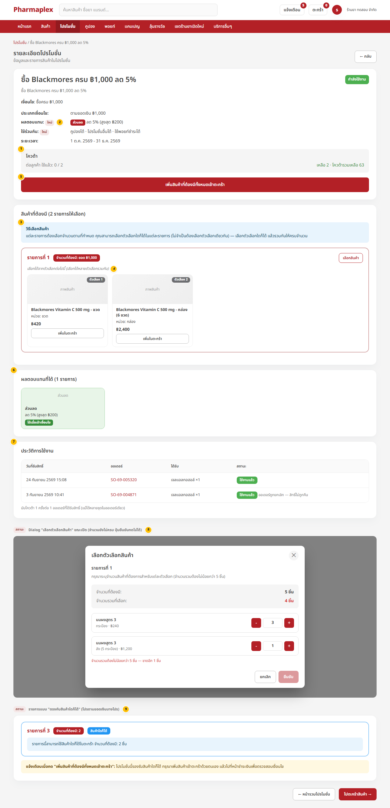

**คำอธิบายแต่ละส่วนในหน้าจอ**

1. โควต้า ตามหน้าเดิม (กล่องเทา ใช้แล้ว / โควต้าที่เหลือ เขียว–แดง) · เหลือ 0: ปุ่มเพิ่มสินค้าทั้งหมดและปุ่มเลือกสินค้าถูกปิด พร้อมข้อความ "โควต้าเต็มแล้ว" · ผู้เยี่ยมชมถูกพาไปล็อกอินก่อนเปิดหน้านี้
2. ผลตอบแทน / ใช้ร่วมกับ ใหม่ สองแถวใต้ "ประเภทเงื่อนไข" อธิบายด้วยตัวอย่างตัวเลขจริงของโปรนั้น · ผลตอบแทนเป็นส่วนลดแสดงเป็น "ลด 10% สูงสุด ฿150"
3. วิธีเลือกสินค้า ข้อความเดิม + คำอธิบาย OR: เลือกตัวเลือกใดก็ได้ในรายการ แล้วรวมกันให้ครบจำนวน (ไม่ต้องเป็นตัวเลือกเดียวกัน)
4. การ์ดตัวเลือก ใช้ ProductUnitCard เดิม + ป้าย "ตัวเลือก N" มุมขวาบน · มีปุ่มเพิ่มในตะกร้าต่อใบได้ตามปกติ · สินค้าหมดสต็อกแสดงป้ายแดงและปิดปุ่ม
5. ปุ่มหลัก "เพิ่มสินค้าที่ต้องมีทั้งหมดเข้าตะกร้า": ถ้าทุกรายการมีตัวเลือกเดียว เพิ่มเข้าตะกร้าทันทีแล้วไปตะกร้า · ถ้ามีรายการที่ต้องเลือก (หลายตัวเลือก) เปิด dialog ทีละรายการ · ถ้ามีรายการ "สินค้าใดก็ได้" แจ้งเตือนว่าต้องเพิ่มเอง
6. สินค้าฟรี การ์ดสินค้าไม่มีปุ่ม พร้อมป้าย "ฟรี ×จำนวนต่อชุด" และมูลค่า · ของแถมหมด: ป้ายแดง "หมดชั่วคราว" และโปรถูกปิดตามกติกา
7. ประวัติการใช้งาน เพิ่มคอลัมน์ ออเดอร์ (ลิงก์ไปรายละเอียดออเดอร์) และของที่ได้รับ · ออเดอร์ถูกยกเลิกยังนับว่าใช้สิทธิ์แล้ว (นโยบายร่วม) พร้อมข้อความบอก
8. Dialog เลือกตัวเลือก ตัวคูณจำนวนต่อตัวเลือก (−/พิมพ์/+) · แสดงจำนวนที่ต้องมี และจำนวนรวมที่เลือก (แดงเมื่อไม่ครบ เขียวเมื่อครบ) · ปุ่มยืนยันกดไม่ได้จนกว่าจะครบ (ถ้ากดเมื่อไม่ครบ toast "จำนวนรวมต้องไม่น้อยกว่า 5 ชิ้น") · ยืนยันแล้วไปรายการถัดไปที่ต้องเลือก ครบแล้วเพิ่มลงตะกร้าและไปหน้าเช็คเอาต์/ตะกร้า
9. "ตรงกับสินค้าใดก็ได้" การ์ดขอบฟ้า ไม่มีรายการสินค้า มีป้าย "สินค้าใดก็ได้" และข้อความอธิบาย — ไม่สามารถเพิ่มล่วงหน้าได้ ต้องไปเลือกสินค้าเองแล้วดูผลที่ตะกร้า

**กติกา / ข้อยกเว้น / สถานะ**

- จำนวนรวมที่เลือกในรายการ นับเป็นชิ้นตามหน่วยที่เลือก (ลัง 1 = 1 ชิ้น) · ถ้าโปรเปิด "ตรวจหน่วยอย่างเข้มงวด" การ์ดตัวเลือกแสดงเฉพาะหน่วยที่ตรงเงื่อนไข
- โปรหมดอายุ/ยังไม่เริ่ม: ปุ่มเพิ่มสินค้าถูกปิด แสดงสถานะบนหัวการ์ด · เปิดหน้าโปรที่ไม่มีอยู่/ถูกปิด = "ไม่พบโปรโมชั่นที่ต้องการ" + ปุ่มกลับ
- ไม่มีปุ่ม "รับสิทธิ์" — สิทธิ์เกิดอัตโนมัติเมื่อตะกร้าเข้าเงื่อนไขและยืนยันออเดอร์

**ข้อที่ต้องตัดสินใจกับลูกค้า**

- ปุ่ม "เพิ่มสินค้าที่ต้องมีทั้งหมดเข้าตะกร้า" ในระบบจริงถูกซ่อนไว้ (comment) — เปิดใช้งานในหน้านี้หรือคงซ่อนต่อ
- หลังเพิ่มสินค้าลงตะกร้าแล้ว ไปหน้าตะกร้า/เช็คเอาต์ทันที (พฤติกรรมเดิม) หรืออยู่หน้าเดิมพร้อม toast
- การ์ดตัวเลือกบังคับให้เลือกจากกลุ่ม "กระป๋อง/ลัง" แยกหรือรวมกันได้ (ค่าเริ่มต้น = รวมกันได้)

#### ลูกค้า · ตะกร้า: การ์ดเลือกโปร (กดสลับได้)

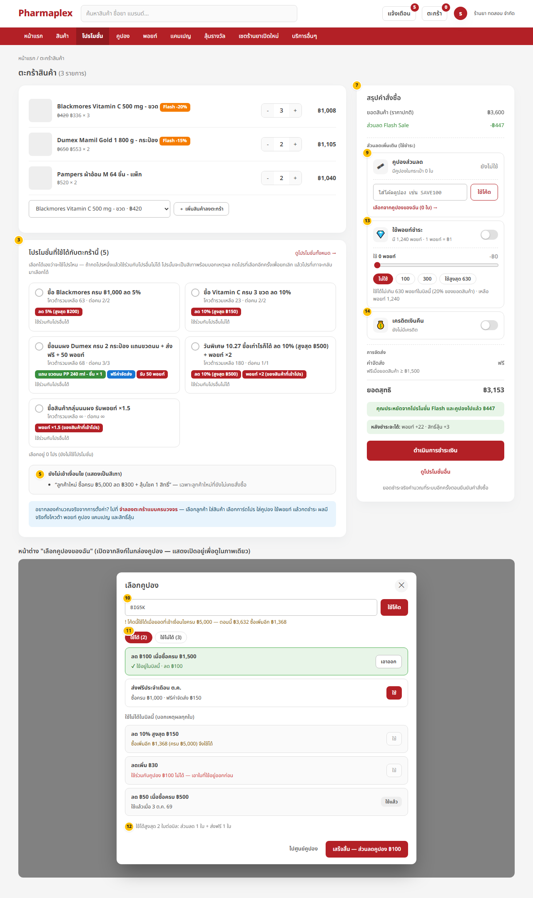

**คำอธิบายแต่ละส่วนในหน้าจอ**

1. บรรทัดของแถม พื้นเขียว ป้าย "ของแถม ฟรี" ราคาแสดงว่า "ฟรี" · จำนวนล็อก ลูกค้าแก้/ลบเองไม่ได้ (จำนวนมาจากโปร) — เมื่อลูกค้าลดสินค้าที่ต้องมี ของแถมหายไปเองพร้อม toast "ของแถมถูกนำออก เพราะไม่เข้าเงื่อนไขแล้ว" · ของแถมแสดงมูลค่าไว้เป็นข้อมูล ไม่รวมในยอด
2. บรรทัดส่วนลด แยกเป็นบรรทัดพื้นแดงอ่อน บอกโปรและฐานที่คำนวณ (เฉพาะสินค้าที่เข้าเงื่อนไข ไม่ใช่ทั้งบิล) · ได้ส่วนลดครั้งเดียวต่อบิล ไม่ว่าซื้อเกินเงื่อนไขกี่เท่า
3. การ์ดเลือกโปร เปลี่ยน ไม่มี priority และไม่เลือกให้อัตโนมัติ — ทุกโปรที่ตะกร้าเข้าเงื่อนไขขึ้นเป็นการ์ด ลูกค้ากดเลือก/ยกเลิกเอง · กดแล้วโปรที่ใช้ร่วมกันไม่ได้เป็นสีเทาพร้อมเหตุผล (“ใช้ร่วมกับ … ไม่ได้”) กดยกเลิกแล้วกลับมาเลือกได้ · การ์ดบอกผลตอบแทนทุกอย่างที่จะได้ (ส่วนลด ของแถม ฟรีค่าส่ง พอยท์ …) ลองกดการ์ดได้จริง
4. ข้อความชวนซื้อเพิ่ม "เพิ่มอีก N …" แสดงเมื่อใกล้ถึงขั้น/ยอดถัดไป (ขาดไม่เกิน 1 ขั้นหรือ 30% ของเงื่อนไข) · ปุ่มเพิ่มจำนวนที่ขาดให้ทันที · ถ้าเปลี่ยนโปรที่ได้ (ขั้น 1 → ขั้น 2) บอกว่าของแถมเดิมจะถูกแทน
5. ยังไม่เข้าเงื่อนไข โปรที่เห็นแต่ใช้ไม่ได้ (โควต้าทั้งหมดเต็ม · ต้องเป็นลูกค้าใหม่ · โควต้าต่อคนเต็ม) แสดงสีเทาท้ายรายการพร้อมเหตุผล ไม่เปิดให้กด
6. ของแถมหมดสต็อก ค่าเริ่มต้นที่เสนอ: โปรถูกปิดชั่วคราวตามกติกา → บรรทัดของแถมขึ้นเทา ขีดฆ่า ป้าย "หมดชั่วคราว" และข้อความอธิบาย · ไม่แปลงเป็นส่วนลดอัตโนมัติ · ไม่บล็อกการชำระเงิน
7. สรุปยอดแยกกลุ่ม ส่วนลดโปรโมชั่น (และ Flash) อยู่แยกจากส่วนลดคูปองและการใช้พอยท์ เพื่อให้ตรวจสอบง่ายและสอดคล้องลำดับการคิดเงิน: Flash → โปรโมชั่น → คูปอง → ส่ง → พอยท์ · แต่ละบรรทัดมีคำอธิบายย่อยบอกที่มา
8. ยอดที่ประหยัด รวม Flash + โปรโมชั่น (ไม่รวมมูลค่าของแถม และคูปองที่ยังไม่ใช้) · ปุ่มชำระเงินพาไปหน้าเช็คเอาต์เดิม ซึ่งคำนวณโปรซ้ำอีกครั้งที่เซิร์ฟเวอร์
9. กล่องคูปองในสรุปยอด จุดเดียวที่ลูกค้าจัดการคูปอง: แสดงใบที่ใช้อยู่เป็นแถบเขียว กด ✕ เอาออกได้ทันที · มีช่องใส่โค้ดอยู่ในกล่องเลย ไม่ต้องเปิดหน้าต่าง · ลิงก์ "เลือกจากคูปองของฉัน" บอกจำนวนใบที่ใช้ได้ · ยอดสุทธิคำนวณใหม่ทันที (ศูนย์คูปองมีปุ่ม "ไปใช้ที่ตะกร้า" พามาที่หน้านี้)
10. ช่องใส่โค้ด บอกผลใต้ช่องบรรทัดเดียว: ผ่าน (เขียว ลดเท่าไร) / ใช้ไม่ได้ (แดง เหตุผล เช่น ใช้ครบโควตาต่อคนแล้ว) / ยังไม่ถึงขั้นต่ำ (เหลือง บอกว่าขาดอีกเท่าไร)
11. คูปองของฉัน แยกแท็บ "ใช้ได้" กับ "ใช้ไม่ได้" — ใบที่ใช้ได้มีปุ่ม "ใช้" / ใบที่ใช้อยู่มีปุ่ม "เอาออก" · ใบที่ใช้ไม่ได้บอกเหตุผลสั้นๆ ใต้ชื่อ (ขั้นต่ำ ยกเว้นสินค้า ใช้ร่วมไม่ได้ ใช้แล้ว) และกดไม่ได้
12. กติกาซ้อนใบ 1 บรรทัด: ส่วนลด 1 ใบ + ส่งฟรี 1 ใบต่อบิล (ตามค่ากลางในหน้าแอดมิน) · ปุ่มล่าง "เสร็จสิ้น" บอกส่วนลดคูปองที่ได้
13. ใช้พอยท์ชำระ สวิตช์เปิด/ปิด แล้วเลือกจำนวนด้วยแถบเลื่อนหรือปุ่มลัด (ไม่ใช้ / 100 / 300 / ใช้สูงสุด) — แสดงยอดที่หักทันที พร้อมเพดานที่ใช้ได้ในบิลนี้และพอยท์ที่เหลือ · ถ้าโปรหรือคูปองที่เลือกไม่ให้ใช้ร่วมกับพอยท์ การ์ดจะเป็นสีเทาและบอกเหตุผลแทนสวิตช์
14. เครดิตเงินคืน สวิตช์เดียว เปิดแล้วหักเต็มยอดเครดิตเท่าที่หักได้ (ไม่เกินยอดที่ต้องชำระ) · ถ้าเครดิตเป็น ฿0 สวิตช์ถูกปิดและบอกว่า "ยังไม่มีเครดิต"

**กติกา / ข้อยกเว้น / สถานะ**

- คำนวณใหม่ทุกครั้งที่จำนวนเปลี่ยน · สถานะโหลด: แสดงบรรทัดสรุปเป็น skeleton ไม่แสดงตัวเลขเก่า
- ถ้าสต็อกของแถมไม่พอสำหรับจำนวนที่ต้องให้ (เช่น ต้องให้ 3 ชิ้นแต่เหลือ 2) ระบบให้เท่าที่มีและแจ้งข้อความ "ของแถมเหลือเพียง N ชิ้น"
- โควต้าต่อลูกค้าเต็ม หรือโควต้าทั้งหมดของโปรเต็ม: โปรแสดงเป็นสีเทา พร้อมเหตุผล “โควต้าเต็มแล้ว” เลือกไม่ได้
- ยกเลิกออเดอร์/คืนสินค้าภายหลัง ไม่เรียกคืนของแถมหรือส่วนลดที่ใช้ไปแล้ว (นโยบายร่วม)
- ยอดขั้นต่ำของคูปองเทียบกับ "ยอดที่คูปองใบนั้นครอบคลุม" หลังหักโปรโมชั่น (ไม่นับสินค้ายกเว้น และไม่นับรายการที่จับคู่โปรถ้าคูปองตั้งใช้ร่วมโปรไม่ได้) — ลำดับการใส่คูปองไม่มีผลกับขั้นต่ำ
- ส่วนลดคูปองใบถัดไปคิดจากยอดคงเหลือหลังใบก่อนหน้า ไม่หักเกินมูลค่ารายการ/ติดลบ · คูปองส่งฟรีฟรีเฉพาะรายการที่เข้าเงื่อนไข
- โควตาของโค้ด/คูปองตัดเมื่อชำระสำเร็จ — ถ้ายกเลิกก่อนชำระ สิทธิ์ยังอยู่ · ถ้าตะกร้าเปลี่ยนจนคูปองที่ใช้อยู่ไม่เข้าเงื่อนไข ระบบถอดคูปองให้และแจ้งเหตุผลที่หน้าสรุป

**ข้อที่ต้องตัดสินใจกับลูกค้า**

- ของแถมหมดสต็อกตอนลูกค้ามีโปรในตะกร้า: ค่าเริ่มต้นในมอคอัพ = ไม่ให้ของแถม ไม่ชดเชย แจ้งข้อความ · ทางเลือก: แปลงเป็นส่วนลดเท่ามูลค่าของแถม (เช่น ฿60 — ต้องเพิ่มฟิลด์ "มูลค่าชดเชย" ในโปร) หรือให้ลูกค้าเลือกของแถมอื่นในโปรเดียวกัน
- แสดง "โปรที่ไม่ถูกใช้" ให้ลูกค้าเห็นหรือไม่ (ค่าเริ่มต้น = แสดงเฉพาะที่ผ่านเงื่อนไขครบ)
- ระบบควรติ๊ก “ชุดที่ประหยัดสุด” ไว้ให้ก่อนหรือไม่ (ค่าเริ่มต้นในมอคอัพ = ติ๊กให้ 1 โปรแรก ลูกค้าเปลี่ยนได้)
- จำนวนคูปองสูงสุดต่อบิล (เสนอ 2: ส่วนลด 1 + ส่งฟรี 1) · ลูกค้ายังไม่ล็อกอินเปิดหน้าต่างคูปองได้หรือไม่ (เสนอ: ต้องล็อกอินก่อนเลือกคูปอง)
- แสดงมูลค่าของแถมในสรุปยอดและในยอด "ประหยัดไปแล้ว" หรือไม่ (ค่าเริ่มต้น = แสดงมูลค่าในบรรทัด ไม่รวมในยอดประหยัด)

#### สรุปข้อที่ต้องตัดสินใจกับลูกค้า

- ยอดที่นับเข้าเงื่อนไขโปรคิดหลังหักส่วนลดวันพิเศษ (ค่าที่ใช้) หรือก่อน
- โปรแบบเลือกรายสินค้าที่ชนกับโปรแบรนด์/หมวดที่ priority สูงกว่า แพ้ทั้งโปรหรือแพ้เฉพาะสินค้าที่ชน
- ลบโปรที่มีประวัติการใช้แล้ว: ซ่อนแล้วเก็บประวัติ หรือห้ามลบ
- ของแถมได้พอยท์หรือไม่ (ค่าที่ใช้: 0 พอยท์)

---

## 4. คูปอง

### 4.1 คืออะไร และใช้เมื่อไหร่

คูปองคือสิทธิ์ส่วนลดที่ลูกค้าต้อง "รับ" มาก่อนจึงใช้ได้ ต่างจากโปรโมชั่นที่เกิดขึ้นเอง คูปองเหมาะกับการแจกหน้างาน ส่งเสริมการขายผ่านช่องทางออนไลน์ ให้สิทธิ์ประจำเดือนแก่ลูกค้า หรือต้อนรับลูกค้าใหม่

### 4.2 มีกี่แบบ

| แบบ | วิธีรับสิทธิ์ | การกันการใช้ซ้ำ | เหมาะกับ |
|---|---|---|---|
| คูปองกระดาษ | พิมพ์เป็นใบ ทุกใบรหัสเหมือนกันทั้งชุด | ตัวกระดาษที่ร้านฉีกเก็บไว้เป็นหลักฐาน ใช้ได้เฉพาะหน้าร้าน/POS เท่านั้น ไม่รองรับการกรอกใช้งานบนเว็บ | แจกหน้างานและบูท |
| คูปองออนไลน์ · โค้ดส่วนลด | ใส่โค้ดตอนเช็คเอาต์ | ระบบตรวจประวัติการใช้ของบัญชีทุกครั้ง | แคมเปญที่แชร์ได้ เช่น โพสต์หรือ Influencer |
| คูปองออนไลน์ · เก็บเอง | ลูกค้าเข้าดูคูปองที่เปิดให้เก็บแล้วกดเก็บเอง | ได้รหัสเฉพาะตัว 1 คน 1 รหัส ตัดโควตาทันที | สิทธิ์ที่เปิดให้ลูกค้าเลือกเก็บเอง |
| คูปองออนไลน์ · แจกรายเดือน | ระบบออกสิทธิ์ให้ทุกคนเองทุกวันที่ 1 | ใช้ได้ถึงสิ้นเดือน ไม่ทบไปเดือนถัดไป | สิทธิ์ประจำเดือนที่ให้ลูกค้าทุกคน |
| (ย้ายไปโปรโมชั่น) ลูกค้าใหม่ | ไม่ใช่คูปองแล้ว — ตั้งเป็นโปรโมชั่นที่ติ๊ก “เฉพาะลูกค้าใหม่” | ตรวจจากประวัติคำสั่งซื้อของบัญชี | ต้อนรับลูกค้าใหม่ (ผลตอบแทนผสมได้) |

### 4.3 คูปองกระดาษ

**กติกาที่ตกลงแล้ว:** (1) คูปองกระดาษ **ใช้ออนไลน์ไม่ได้** — รหัสเหมือนกันทั้งชุด จึงใช้ได้เฉพาะที่ร้านผู้ร่วมรายการ และไม่มีป้าย “ออนไลน์” ในหน้าคูปองกระดาษ (2) ก้นคูปองที่ร้านส่งเบิกเกินกำหนด 30 วัน **ปฏิเสธ** ไม่จ่ายเงิน

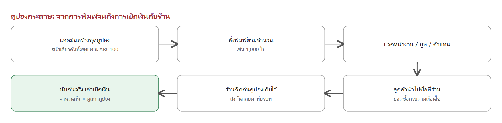

*รูป 4-1 ตั้งแต่แอดมินสร้างชุดคูปองจนถึงการเบิกเงินกับร้านที่ร่วมรายการ*

**ระบบไม่ได้สั่งพิมพ์เอง แต่ส่งออกไฟล์ให้โรงพิมพ์ได้** แอดมินตั้งค่าชุดคูปอง ดูตัวอย่างหน้า-หลัง แล้วส่งออกไฟล์พิมพ์ (หน้า + หลัง พร้อมตัดตก/เครื่องหมายตัด/เส้นปรุ) ไปให้โรงพิมพ์ (การติดต่อและสั่งงานกับโรงพิมพ์ Pharmaplex จัดการเอง ระบบไม่เก็บข้อมูลโรงพิมพ์หรือใบสั่งพิมพ์) ทีมการตลาดนำคูปองไปแจกหน้างานเอง ระบบไม่ออกเลขรันรายใบให้ ทุกใบเหมือนกันทั้งชุด คูปองกระดาษมี 2 ด้านที่ต้องกำหนดและแสดงให้ตรงกันทุกที่ ทั้งหน้าตั้งค่า หน้าตัวอย่าง ไฟล์พิมพ์ และหน้าตรวจสอบของลูกค้า

| ด้าน | ข้อมูลที่แสดง |
|---|---|
| หน้า | แบรนด์และหัวคูปอง สิทธิ์ที่ได้ (ส่วนลดเป็นบาท หรือของฟรี) ยอดซื้อขั้นต่ำ (ถ้ามี) “ใช้ที่ร้านที่ร่วมรายการ” วันที่ใช้ได้ และก้นคูปองที่ร้านฉีกเก็บ ซึ่งมี **บาร์โค้ดรหัสชุด** (เหมือนกันทุกใบ) พิมพ์หมุน 90° ตามแนวก้น |
| หลัง | ร้าน/สาขาที่ใช้ได้ (ร้านในระบบ + พาร์ทเนอร์) · **เงื่อนไขเป็นข้อ ๆ** ที่แอดมินเพิ่มเอง (สูงสุด 8 ข้อ ข้อละไม่เกิน 80 ตัวอักษร พิมพ์เป็นเลขข้อ) พร้อม “ไม่ทอนเงินสด” และช่วงวันที่ที่ระบบเติมให้ · **หมายเหตุท้ายบัตร** ตัวอักษรเล็ก (ค่าเริ่มต้น “คูปองนี้พิมพ์โดย Pharmaplex เท่านั้น ห้ามถ่ายสำเนา…” แก้ได้ในหน้าตั้งค่า ≤240 ตัวอักษร) — ไม่พิมพ์ระยะเวลาส่งก้นเบิกบนบัตร (ตั้งในส่วนการเบิกจ่ายเท่านั้น) |

กติกาของคูปองกระดาษ

- ร้าน/สาขาที่ร่วมรายการเลือกได้จาก "รายชื่อร้านและพาร์ทเนอร์ที่ลงทะเบียนไว้ล่วงหน้า" เท่านั้น ห้ามพิมพ์ชื่อร้านอิสระ เพื่อกันคนนอกอ้างชื่อมาเบิกเงิน ตั้งได้ว่าทุกร้านที่ลงทะเบียนหรือเลือกเฉพาะบางร้าน ไม่มีการกำหนดจำนวนใบต่อร้าน — พาร์ทเนอร์ส่งก้นมากี่ใบก็จ่ายตามนั้น (ร้านที่คนไปมาก/น้อยต่างกันเป็นเรื่องปกติ ไม่บังคับเฉลี่ย) ยอดรวมถูกคุมด้วยจำนวนที่ออกอยู่แล้ว พาร์ทเนอร์นอกระบบที่เพิ่มผิดลบออกได้ (ถ้าถูกลบ จะถอดออกจากทุกชุดที่เลือกไว้ด้วย)
- คูปองกระดาษใช้ที่หน้าร้าน/POS ของผู้รับคูปองเท่านั้น (ไม่มีช่องทางอื่นให้ตั้ง) ส่วนสิทธิ์ต่อบิล การใช้ร่วมกับโปรโมชั่น/คูปองอื่น/พอยท์ และสินค้ายกเว้น ไม่ต้องตั้งในชุด — ให้ลูกค้าไปกำหนดด้วยข้อความเงื่อนไขหลังบัตร และคุมที่หน้างาน (ยอดซื้อขั้นต่ำตั้งได้แบบไม่บังคับ ใช้กี่ใบต่อบิลไม่บังคับ แล้วแต่ลูกค้าจะใช้)
- ด้านหลังคูปองประกอบจาก ผู้รับ + เงื่อนไขเป็นข้อ ๆ + ข้อกำหนดตายตัว “ไม่ทอนเงินสด”/ช่วงวันที่ + หมายเหตุท้ายบัตร เมื่อแอดมินแก้ค่า ตัวอย่างหน้า-หลังเปลี่ยนตามทันที ตัวอย่างอยู่ด้านขวาของฟอร์มตลอด
- ชุดที่เผยแพร่และใช้งานแล้วแก้ได้เฉพาะชื่อ/ที่มาของชุด ข้อความเงื่อนไข และรายชื่อผู้รับ (เพิ่มได้ ถอดได้เฉพาะผู้รับที่ยังไม่เคยเบิก) ส่วนรหัส สิทธิ์ และราคาแก้ไม่ได้ ต้อง "ทำซ้ำชุด" เป็นชุดใหม่

**สิทธิ์ที่ผู้ถือคูปองได้รับ (ออกแบบใหม่)**

คูปองกระดาษไม่จำกัดแค่ส่วนลดที่ร้านในระบบอีกต่อไป — แจกเป็น “ใบแลกของฟรี/บริการฟรี” ที่ร้านพาร์ทเนอร์ได้ด้วย เช่น พิมพ์คูปองไปแจกลูกค้าให้ไปแลกไอศกรีม 1 ถ้วยฟรีที่ร้านไอศกรีม ผู้รับคูปองจึงมี 2 แบบ และสิทธิ์มี 2 ชนิด

| ชนิดสิทธิ์ | ผู้ถือได้อะไร | ขั้นต่ำ | ยอดที่บริษัทเบิกจ่ายต่อ 1 ใบ |
|---|---|---|---|
| ส่วนลดเงินสด | ลดเป็นบาทตายตัวเมื่อซื้อครบขั้นต่ำ (ของเดิม) | มี | มูลค่าส่วนลดบนใบ |
| ของแถม/บริการฟรี | แลกรายการที่ระบุเป็นข้อความ เช่น “ไอศกรีมวานิลลา 1 ถ้วย” | ไม่มี | ราคาตกลงกับพาร์ทเนอร์ (หรือ ฿0 ถ้าพาร์ทเนอร์ออกให้เอง) |

| ผู้รับคูปอง | คือใคร | ส่งก้นเบิกอย่างไร |
|---|---|---|
| ร้านในระบบ | ร้าน/สาขา/ตัวแทนที่ลงทะเบียนแล้ว (รวมสาขาของบริษัท) | ส่งก้นเข้าคิวเบิกเงินเอง |
| พาร์ทเนอร์นอกระบบ | ผู้ร่วมรายการที่ไม่มีบัญชี เช่น ร้านไอศกรีม คาเฟ่ — บันทึกชื่อ ผู้ติดต่อ สาขาที่รับแลก | ส่งก้นคูปองให้ทีมงาน แอดมินบันทึกแทนและเก็บหลักฐาน (ภาพก้น/ใบเสร็จของพาร์ทเนอร์) |

ชุดเดียวเลือกผู้รับได้ทั้งสองแบบพร้อมกัน (เช่น ทุกสาขาของบริษัท + ร้านไอศกรีม 1 เจ้า) ยังคงห้ามพิมพ์ชื่อร้านอิสระตอนตั้งชุด — พาร์ทเนอร์ต้องถูกบันทึกในทะเบียนพาร์ทเนอร์ก่อน

**การเบิกจ่าย (2 แบบ ตั้งต่อชุด)**

- **บริษัทจ่ายให้ผู้รับ** จ่ายตามก้นที่ตรวจนับได้ × ราคา (ส่วนลดเงินสด = มูลค่าบนใบ · ของฟรี = ราคาตกลงต่อใบ) ระบบแสดง **ยอดรับผิดชอบสูงสุด** = จำนวนที่ออก × ราคาตกลง เพื่อใช้อนุมัติงบก่อนเผยแพร่ชุด
- **พาร์ทเนอร์ออกให้เอง** ไม่มีการจ่ายเงิน — ระบบยังนับก้นเพื่อเป็นสถิติและตรวจสอบ ปิดงานหลังตรวจนับ

**รูปแบบบัตร (template)** ตอนกดสร้างชุดคูปองกระดาษ แอดมินเลือก template ก่อน (คลาสสิก · แถบสีหัวบัตร · สีเต็มใบ · ตั๋วแลกของฟรี · มินิมอล) และสีบัตร 4 สี แล้วค่อยใส่ข้อมูลชุด เปลี่ยน template/สีได้จนกว่าจะเผยแพร่ ตัวอย่างหน้า-หลังและไฟล์พิมพ์ใช้ template เดียวกัน template กำหนดแค่หน้าตา ไม่กระทบสิทธิ์ ผู้รับ หรือราคา ทุก template มีก้นคูปอง 22% พร้อมบาร์โค้ดตำแหน่งเดิม

**ไม่มีเลขรันนิ่งรายใบ** คูปองพิมพ์ครั้งละจำนวนมาก ทุกใบในชุดจึงเหมือนกันทั้งหมด ที่ก้นคูปองพิมพ์ **บาร์โค้ดรหัสชุด** (ไม่ใช่ QR และไม่ใช่เลขรันนิ่ง) ใช้ 2 จุด คือแคชเชียร์สแกนที่ POS ตอนขาย และผู้ตรวจสแกนนับก้นตอนเบิก — ตรวจเทียบจำนวนได้ แต่ตรวจรายใบว่าซ้ำไม่ได้ ความเสี่ยงถ่ายสำเนาจึงคุมด้วย (1) ยอดรับผิดชอบสูงสุด = จำนวนที่ออก × ราคา (2) ธงแดงเมื่อก้นรวมของชุดเกินจำนวนที่ออก (3) ร้านต้องส่งก้นตัวจริงภายในกำหนด ผู้ตรวจสังเกตก้นที่ซีดหรือเป็นสำเนา

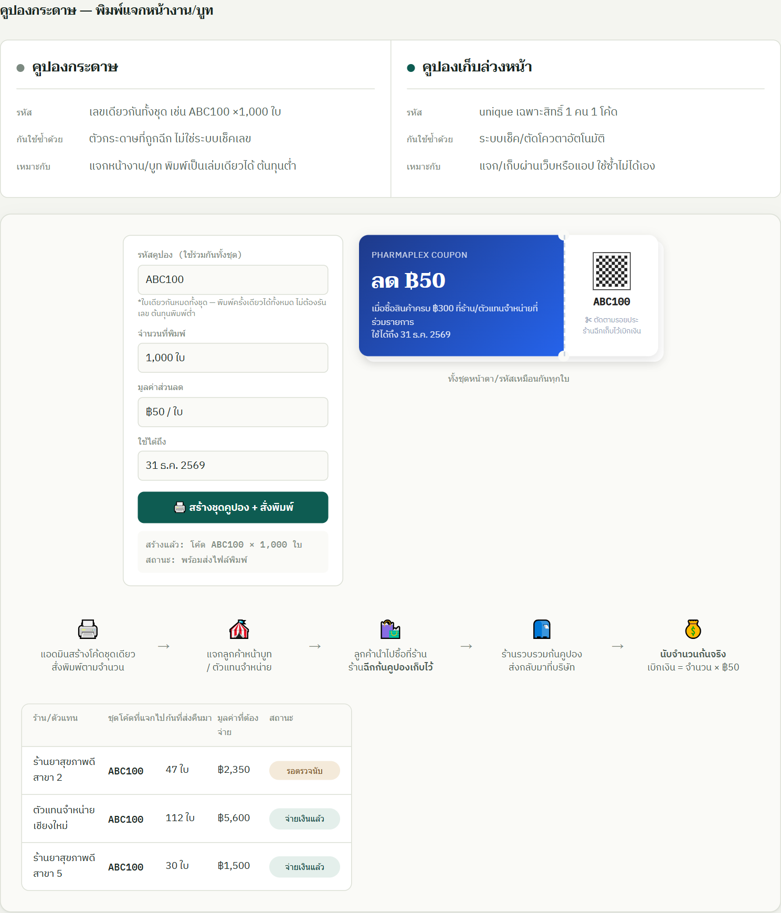

*รูป 4-2 ภาพจาก prototype รุ่นแรก ใช้ประกอบแนวคิดการสร้างชุดและด้านหน้าคูปองเท่านั้น ปุ่มสั่งพิมพ์ในภาพไม่มีในระบบจริง หน้าจอล่าสุดที่มีทั้งหน้าและหลังอยู่ในหัวข้อ 4.8*

ร้านหรือพาร์ทเนอร์ที่ร่วมรายการฉีกก้นคูปองเก็บไว้เป็นหลักฐาน ส่งกลับมาที่บริษัท และระบบนับจำนวนก้นที่ได้รับจริงเพื่อคำนวณยอดเบิกจ่าย **เบิกจ่าย = จำนวนก้นที่นับได้ × (มูลค่าบนใบ หรือราคาตกลงของของฟรี)** ระบบแสดงสถานะของแต่ละร้าน เช่น รอตรวจนับ หรือจ่ายเงินแล้ว คูปองกระดาษใช้ได้เฉพาะหน้าร้านหรือที่ POS เท่านั้น ไม่สามารถนำรหัสไปกรอกใช้ในเว็บได้ เพราะรหัสเหมือนกันทั้งชุดและกันการใช้ซ้ำด้วยวิธีฉีกกระดาษเท่านั้น

### 4.4 คูปองออนไลน์ (โค้ดแชร์ได้)

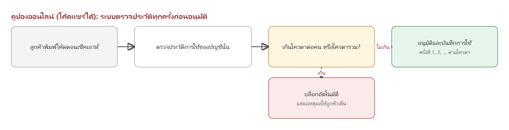

*รูป 4-3 โค้ดเดียวแจกได้ทุกคน ระบบตรวจประวัติการใช้ของบัญชีนั้นทุกครั้งก่อนอนุมัติ*

แนวคิดหลักคือไม่พึ่งความไม่ซ้ำของตัวโค้ด แต่ตรวจการใช้จริงของบัญชีทุกครั้ง ถ้าเกินโควตาต่อคนหรือโควตารวมที่ตั้งไว้ ระบบจะบล็อกอัตโนมัติและแสดงเหตุผลให้ลูกค้าเห็น

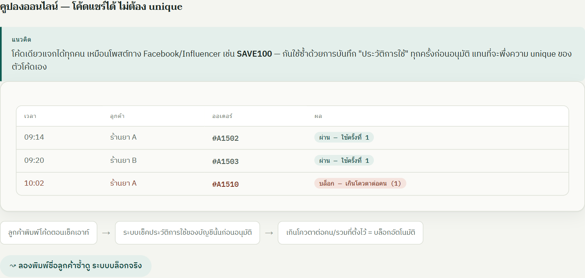

*รูป 4-4 ตัวอย่างประวัติการใช้: ครั้งแรกผ่าน ครั้งที่สองของบัญชีเดียวกันถูกบล็อกเมื่อเกินโควตาต่อคน*

### 4.5 คูปองเก็บเอง (เหมือน Shopee) และแจกอัตโนมัติทุกเดือน

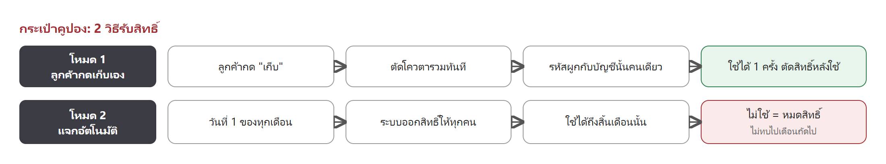

*รูป 4-5 โหมดเก็บเองและโหมดแจกอัตโนมัติใช้การตั้งค่าเดียวกัน ต่างกันที่วิธีรับสิทธิ์*

ตั้งค่าเงื่อนไขส่วนลด ข้อยกเว้น (เลือกจากกลุ่มสินค้าที่ตั้งไว้ได้) โควตา และวันหมดอายุครั้งเดียว แล้วเลือกโหมดแจก
- **โหมดเก็บเอง (เหมือน Shopee)** ลูกค้าเข้าดูคูปองที่เปิดให้เก็บในกระเป๋าคูปอง กดเก็บเอง ระบบตัดโควตารวมทันที และรหัสผูกกับบัญชีนั้นคนเดียว ใช้ได้ 1 ครั้ง
- **โหมดแจกอัตโนมัติ** ระบบออกสิทธิ์ให้ทุกคนทุกวันที่ 1 ของเดือน ใช้ได้ถึงสิ้นเดือนนั้น ถ้าไม่ใช้จะหมดสิทธิ์

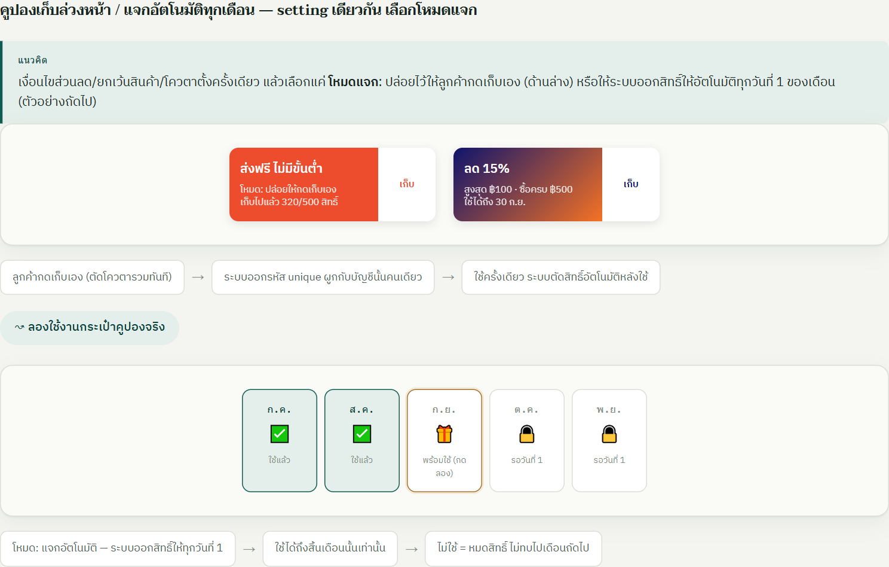

*รูป 4-6 ตัวอย่างหน้ากระเป๋าคูปอง: แต่ละเดือนแสดงสถานะว่าใช้แล้ว พร้อมใช้ หรือรอวันที่ 1*

### 4.6 ลูกค้าใหม่ — ย้ายไปเป็นโปรโมชั่น

- ไม่มี “คูปองลูกค้าใหม่” แล้ว — ตั้งเป็นโปรโมชั่นที่ติ๊ก “เฉพาะลูกค้าใหม่” (ไม่เคยสั่งซื้อมาก่อนเลย ตรวจจากประวัติการสั่งซื้อของบัญชี)
- ผลตอบแทนผสมได้ เช่น ซื้อครบ 5,000 บาท ลด 300 บาท + สิทธิ์ลุ้น 1 ใบ
- คูปองออนไลน์จึงเหลือ 3 แบบ: โค้ดส่วนลด · เก็บเอง · แจกรายเดือน และเมื่อรวมกับคูปองกระดาษเป็น 2 กลุ่มหลัก

### 4.7 การตั้งค่าของแอดมิน

| แบบคูปอง | ตั้งค่าอะไรได้ |
|---|---|
| คูปองกระดาษ | **รูปแบบบัตร:** template + สีบัตร (เลือกก่อนสร้างชุด) · **กลุ่ม “ข้อมูลบนบัตร”:** รหัสชุด ชื่อ/ที่มาของชุด จำนวนที่ออก วันที่ใช้ได้ · **กลุ่ม “เงื่อนไขและราคา”:** สิทธิ์ (ส่วนลดบาท/ของฟรี) ยอดซื้อขั้นต่ำ (ไม่บังคับ) ผู้รับ (ร้านในระบบ + พาร์ทเนอร์ — เพิ่ม/ลบพาร์ทเนอร์นอกระบบได้) การเบิกจ่าย (บริษัทจ่าย/พาร์ทเนอร์ออกเอง + ราคาตกลง + กำหนดส่งก้น) เงื่อนไขหลังบัตรเป็นข้อ ๆ (≤8 ข้อ) และหมายเหตุท้ายบัตร (≤240 ตัวอักษร) · ก้นคูปองมีบาร์โค้ดรหัสชุด ไม่มีเลขรันนิ่ง (ระบบไม่มีการสั่งพิมพ์) |
| คูปองออนไลน์ · โค้ดส่วนลด | โค้ด มูลค่าหรือรูปแบบส่วนลด โควตาต่อคน โควตารวม ช่วงเวลาที่ใช้ได้ และข้อยกเว้น (เลือกจากกลุ่มสินค้าได้ + ยกเว้นรายสินค้า) |
| คูปองออนไลน์ · เก็บเอง / แจกรายเดือน | เงื่อนไขส่วนลด ข้อยกเว้น (เลือกจากกลุ่มสินค้าได้) โควตารวม วันหมดอายุ และเลือกโหมดแจก (เก็บเองหรือแจกรายเดือน) |
| เพดานส่วนลดสูงสุด (ตั้งในคูปองแต่ละอัน เมื่อเป็นส่วนลด %) | ตั้งเพดานบาทสูงสุดได้ เช่น ลด 15% สูงสุดไม่เกิน 100 บาท — ไม่มี “ตั้งค่ากลาง” แอดมินตั้งที่คูปองแต่ละอันเอง |

### 4.8 หน้าจอและ flow การใช้งาน

หน้าจอทั้งหมดของโมดูลนี้เรียงตามลำดับ flow การใช้งาน แต่ละภาพมีเลขกำกับบนจอ และคำอธิบายของแต่ละเลขอยู่ใต้ภาพ ตามด้วยกติกา ข้อยกเว้น และสถานะที่ต้องรองรับ คูปองกระดาษแสดงทั้งด้านหน้าและด้านหลัง ระบุร้าน/สาขาที่ใช้ได้ ช่องทางออนไลน์ และสิทธิ์ให้ชัดเจน โดยไม่มีการสั่งพิมพ์ในระบบ

#### ภาพรวม · ภาพรวม Flow คูปอง

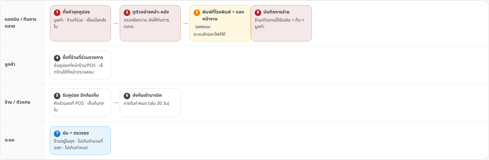

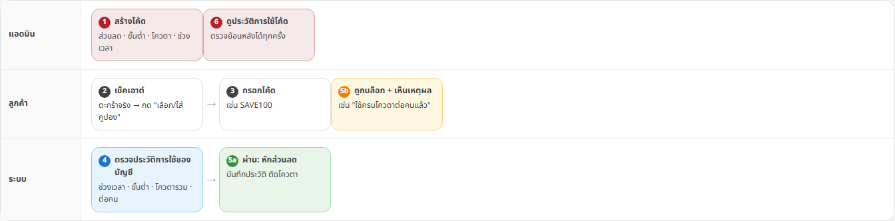

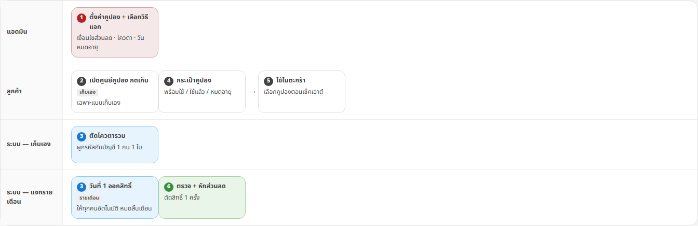

**คำอธิบายแต่ละส่วนในหน้าจอ**

1. คูปองกระดาษ: ระบบเข้ามามีส่วนตอนตั้งค่า/ดูตัวอย่าง และตอนร้านส่งก้นเข้ามาเบิก — ส่วนพิมพ์และแจกอยู่นอกระบบ (โหนดสีเหลือง)
2. คูปองออนไลน์: ทุกครั้งที่กรอกโค้ดระบบตรวจประวัติของบัญชี ถ้าไม่ผ่านจะบล็อกพร้อมบอกเหตุผลที่ลูกค้าอ่านเข้าใจ
3. เก็บเอง = ลูกค้ากดเก็บ (ตัดโควตารวมทันที) · รายเดือน = ระบบออกให้วันที่ 1 และหมดอายุสิ้นเดือน — ทั้งคู่อยู่ในกระเป๋าเดียวกัน
4. ลูกค้าใหม่: ไม่ใช่คูปองแล้ว — ใช้โปรโมชั่น “เฉพาะลูกค้าใหม่” แทน
5. ตารางเปรียบเทียบ: วิธีรับสิทธิ์ / กันใช้ซ้ำ / ใช้ที่ไหน / เหมาะกับ — ใช้อธิบายลูกค้าว่าคูปองกระดาษกับคูปองออนไลน์ต่างกันอย่างไร
6. กติกาใช้ร่วมกัน: ส่วนลด 1 + ส่งฟรี 1 ต่อบิลสำหรับออนไลน์ และการตั้ง "ใช้ร่วมโปร/คูปองอื่น" ต่อใบ
7. สถานะที่ลูกค้า/ร้านเห็นและความหมาย — ใช้เป็นชุดชิปเดียวกันทุกหน้าของโมดูล

**กติกา / ข้อยกเว้น / สถานะ**

- ลำดับคิดเงินในตะกร้า: ราคาสินค้า → โปรโมชั่น → คูปอง → ค่าจัดส่ง → พอยท์ที่ได้
- คูปองลดได้ไม่เกินยอดของรายการที่เข้าเงื่อนไข (ไม่ติดลบ ไม่ทอนเงินสด)
- ทุกการใช้/ถูกบล็อก/ตรวจนับ มีประวัติให้ตรวจย้อนหลังในหน้าแอดมิน

**ข้อที่ต้องตัดสินใจกับลูกค้า**

- จำนวนคูปองสูงสุดต่อบิลออนไลน์ (เสนอ 2 ใบ: ส่วนลด 1 + ส่งฟรี 1)

#### แอดมิน · ภาพรวมคูปอง 2 กลุ่ม (กระดาษ / ออนไลน์)

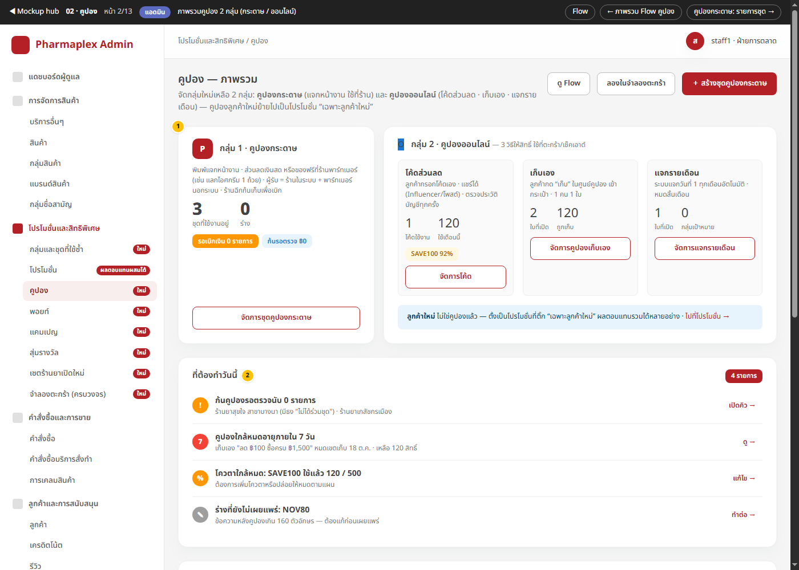

**คำอธิบายแต่ละส่วนในหน้าจอ**

1. จัดกลุ่มใหม่ เหลือ 2 กลุ่ม: คูปองกระดาษ และคูปองออนไลน์ (โค้ดส่วนลด / เก็บเอง / แจกรายเดือน) — เปลี่ยนคำเรียกให้ตรงวิธีที่ลูกค้าได้สิทธิ์ · “คูปองลูกค้าใหม่” ย้ายไปเป็นเงื่อนไขของโปรโมชั่น
2. "ที่ต้องทำวันนี้" เรียงตามความเร่งด่วน: ก้นรอตรวจนับ / ใกล้หมดอายุ ≤ 7 วัน / โควตาเหลือ ≤ 10% / ร่างค้าง — ว่างทั้งหมดแสดง "ไม่มีงานค้าง"
4. ความเคลื่อนไหวล่าสุด: ย้อนดูเหตุการณ์สำคัญทั้งระบบคูปอง (ใช้ตรวจย้อนหลัง) แยกประเภทด้วยชิปสี

**กติกา / ข้อยกเว้น / สถานะ**

- ค่าเพดานที่เปลี่ยนมีผลกับการสร้าง/แก้คูปอง "ต่อไป" — คูปองที่ตั้งไว้แล้วเกินเพดานใหม่ยังใช้ค่าเดิมจนกว่าจะถูกแก้
- จำนวนคูปองต่อบิลใช้กับช่องทางออนไลน์ — คูปองกระดาษใช้ที่หน้าร้านตามจำนวน "ใบ/บิล" ที่ตั้งในแต่ละชุด
- ตัวเลขในการ์ดนับตามเวลาจริง ไม่รวมคูปองที่หมดอายุหรือปิดแล้ว

**ข้อที่ต้องตัดสินใจกับลูกค้า**

- ค่าเริ่มต้น "ส่วนลด 1 + ส่งฟรี 1 ต่อบิล" และเพดาน 20% / ฿500 เป็นข้อเสนอ — ลูกค้าต้องยืนยันตัวเลขจริง
- ไม่มี “ตั้งค่ากลาง” — เพดานส่วนลด การใช้ร่วม และกำหนดส่งก้น ตั้งในคูปองแต่ละอันเอง · สิทธิ์ผู้ใช้: ใครบันทึกจ่ายก้นคูปอง

#### แอดมิน · คูปองกระดาษ: รายการชุด

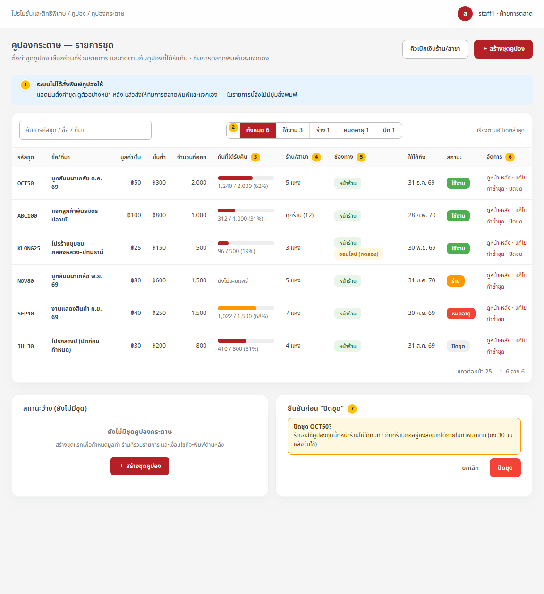

**เพิ่ม/เปลี่ยนในรอบนี้**

- คอลัมน์สิทธิ์ที่ได้รับ (ส่วนลดเงินสด / ของฟรี) และผู้รับ (ในระบบ + นอกระบบ)

**คำอธิบายแต่ละส่วนในหน้าจอ**

1. ข้อความแจ้งว่าระบบไม่ได้สั่งพิมพ์เอง แต่ส่งออกไฟล์ให้โรงพิมพ์ได้ที่หน้า “ส่งออกไฟล์สั่งพิมพ์” — ตารางนี้ไม่มีคอลัมน์หรือปุ่มสั่งพิมพ์
2. ตัวกรองสถานะพร้อมจำนวน (ร่าง / ใช้งาน / หมดอายุ / ปิด) + ค้นหาตามรหัสหรือชื่อที่มา
3. ก้นที่ได้รับคืน = ก้นที่ตรวจนับแล้วรวมทุกร้าน ÷ จำนวนที่ออก — ใช้ดูว่าชุดถูกใช้ไปเท่าไร (แถบเหลืองเมื่อเกิน 60%)
4. ร้าน/สาขา: "n แห่ง" = เลือกเฉพาะ, "ทุกร้าน (12)" = ทุกร้านที่ลงทะเบียน (ตัวเลขเปลี่ยนเมื่อมีร้านใหม่ลงทะเบียน)
5. ช่องทางแสดงเป็นชิป: หน้าร้านเสมอ · ออนไลน์ปรากฏเมื่อแอดมินเปิดเท่านั้น (ค่าเริ่มต้นไม่มี) พร้อมป้าย "ทดลอง" จนกว่าลูกค้ายืนยันนโยบาย
6. การจัดการ: ดูหน้า-หลัง / แก้ไข / ทำซ้ำชุด (สร้างร่างใหม่จากค่าเดิม ใช้รหัสใหม่) / ปิดชุด — ไม่มีปุ่มสั่งพิมพ์
7. ปิดชุดต้องยืนยัน: ปิดแล้วร้านใช้ที่หน้าร้านไม่ได้ แต่ก้นที่ค้างอยู่ยังเบิกได้ตามกำหนด
8. ชนิดสิทธิ์ + ผู้รับ ใหม่ คอลัมน์ “มูลค่า/ใบ” แสดงส่วนลดเงินสด หรือของฟรี (เช่น ไอศกรีม 1 ถ้วย) · คอลัมน์ “ร้าน/สาขา” รวมร้านในระบบและพาร์ทเนอร์นอกระบบ

**กติกา / ข้อยกเว้น / สถานะ**

- สถานะ ร่าง: ยังไม่มีผลกับร้าน · ใช้งาน: ร้านที่อยู่ในรายชื่อรับคูปองได้ · หมดอายุ: ระบบเปลี่ยนเองเมื่อพ้นวันสิ้นสุด (ยังเบิกก้นได้ภายในกำหนด) · ปิด: แอดมินสั่งปิดก่อนกำหนด
- รหัสชุดไม่ซ้ำกันทั้งระบบ แม้ชุดที่หมดอายุ/ปิดแล้ว
- ลบชุดไม่ได้ถ้ามีก้นที่ส่งเบิกแล้ว (ปิดชุดแทน)
- ชุดที่ปิดหรือหมดอายุแล้วยัง "ทำซ้ำ" ได้เพื่อออกชุดใหม่

**ข้อที่ต้องตัดสินใจกับลูกค้า**


#### แอดมิน · เลือก template คูปองกระดาษ (ก่อนสร้างชุด)

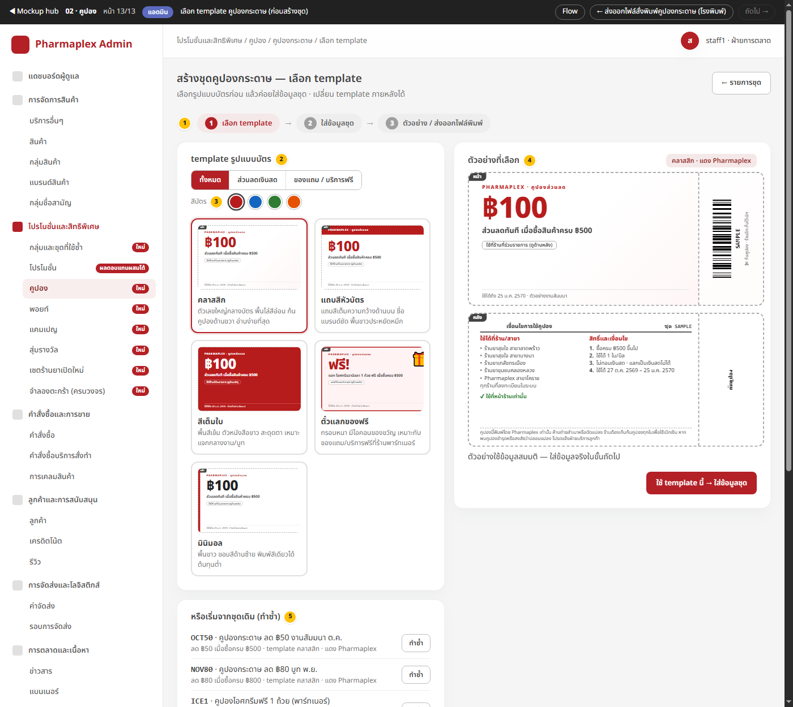

**เพิ่ม/เปลี่ยนในรอบนี้**

- flow การสร้างชุดใหม่: ① เลือก template → ② ใส่ข้อมูลชุด → ③ ตัวอย่าง/ส่งออกไฟล์พิมพ์ — กด “＋ สร้างชุดคูปอง” จากรายการชุดแล้วมาหน้านี้ก่อน
- template 5 แบบ: คลาสสิก · แถบสีหัวบัตร · สีเต็มใบ · ตั๋วแลกของฟรี · มินิมอล และสีบัตร 4 สี (แดง Pharmaplex / น้ำเงิน / เขียว / ส้ม)

**คำอธิบายแต่ละส่วนในหน้าจอ**

1. ขั้นตอนของการสร้างชุด 3 ขั้น (เลือก template → ใส่ข้อมูล → ตัวอย่าง/ส่งออก)
2. แกลเลอรี template แสดงตัวอย่างหน้าบัตรจริงด้วยข้อมูลสมมติ · ตัวกรองชนิดสิทธิ์ (ทั้งหมด / ส่วนลดเงินสด / ของแถม) ทำให้แบบที่เหมาะขึ้นป้าย “แนะนำ” และแบบอื่นจางลง แต่ยังเลือกได้
3. เลือกสีบัตร — ทุก template เปลี่ยนสีตามทันที
4. ตัวอย่างหน้า + หลังของ template ที่เลือกอยู่ด้านขวา ปุ่ม “ใช้ template นี้” สร้างชุดใหม่ที่ผูก template แล้วไปหน้าใส่ข้อมูล (template “ตั๋วแลกของฟรี” ตั้งสิทธิ์เริ่มต้นเป็นของแถม)
5. ทางลัด “ทำซ้ำชุดเดิม” คัดลอก template สี ผู้รับ เงื่อนไข ไปเป็นชุดใหม่ (รหัสชุดต้องตั้งใหม่)
6. เปิดจากปุ่ม “เปลี่ยน template” ในหน้าแก้ไข จะเป็นโหมดเปลี่ยน — ตัวอย่างใช้ข้อมูลจริงของชุด ไม่มีส่วนทำซ้ำ และกดแล้วกลับไปหน้าแก้ไข

**กติกา / ข้อยกเว้น / สถานะ**

- template กำหนดแค่หน้าตา (เลย์เอาต์/สี) ข้อมูลชุด สิทธิ์ ผู้รับ ราคา ไม่เปลี่ยนตาม ยกเว้นตอนสร้างใหม่จาก “ตั๋วแลกของฟรี”
- ชุดที่เผยแพร่แล้วเปลี่ยน template/สีไม่ได้ (บัตรพิมพ์ไปแล้ว) ต้องทำซ้ำชุดเป็นชุดใหม่
- ทุก template มีก้นคูปอง 22% และบาร์โค้ดรหัสชุดตำแหน่งเดิม เครื่อง POS/ผู้นับก้นใช้ได้เหมือนกันทุกแบบ
- ไฟล์พิมพ์ที่ส่งออกใช้ template และสีเดียวกับตัวอย่าง

**ข้อที่ต้องตัดสินใจกับลูกค้า**

- ต้องการ template แบบไหนเพิ่ม (เช่น แนวตั้ง, ใส่โลโก้พาร์ทเนอร์ co-brand, ใส่รูปสินค้า) และให้แอดมินอัปโหลดโลโก้/รูปเองหรือให้ทีมออกแบบทำให้
- ต้องการให้แอดมินสร้าง template ของตัวเองได้หรือไม่ (ตอนนี้เป็นชุดสำเร็จรูป 5 แบบ)

#### แอดมิน · สร้างชุดคูปองกระดาษ (หน้า/หลัง/สาขา/สิทธิ์)

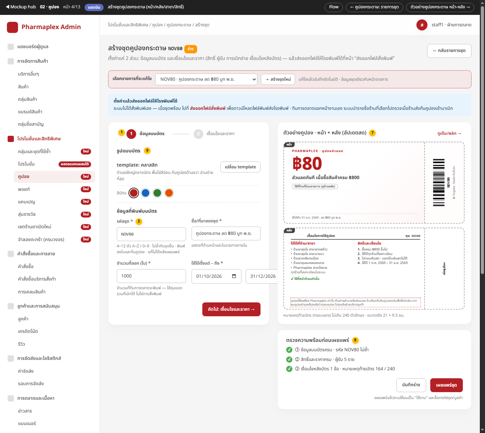

**เพิ่ม/เปลี่ยนในรอบนี้**

- เพิ่มชนิดสิทธิ์: ส่วนลดเงินสด หรือของแถม/บริการฟรี (เช่น ไอศกรีม 1 ถ้วย)
- ผู้รับคูปองรวมร้านในระบบและพาร์ทเนอร์นอกระบบ + เพิ่มพาร์ทเนอร์ได้
- ตั้งค่าแค่ 2 กลุ่ม: “ข้อมูลบนบัตร” และ “เงื่อนไขและราคา” (สิทธิ์ ผู้รับ การเบิกจ่าย ข้อความเงื่อนไข อยู่รวมกัน)

**คำอธิบายแต่ละส่วนในหน้าจอ**

1. ตัวนำทางสองกลุ่มอยู่ในหน้าเดียว กดสลับได้ · ฟอร์มซ้ายเปลี่ยนตามกลุ่ม ส่วนตัวอย่างขวาคงอยู่และอัปเดตสดทุกครั้งที่แก้
   - รูปแบบบัตร (template) แสดงชื่อ template ปัจจุบัน ปุ่ม “เปลี่ยน template” (ไปหน้าเลือก template โหมดเปลี่ยน) และสีบัตร 4 สี — ตัวอย่างหน้า-หลังเปลี่ยนตามทันที
2. (กลุ่ม ข้อมูลบนบัตร) รหัสชุดตรวจไม่ซ้ำแบบสด เป็นรหัสเดียวทั้งชุดที่พิมพ์ลงใบและก้นคูปอง แก้ไม่ได้หลังเผยแพร่ · ชื่อ/ที่มาของชุด จำนวนที่ออก ช่วงวันที่ใช้ได้ · ไม่มีเลขรันนิ่งรายใบ (ทุกใบเหมือนกัน) · ไม่มี “ชื่อสั้นหน้าบัตร”
3. (กลุ่ม เงื่อนไขและราคา) สิทธิ์: เลือก “ส่วนลดเงินสด” (บาทตายตัว) หรือ “ของแถม/บริการฟรี” (ข้อความระบุของ เช่น ไอศกรีม 1 ถ้วย) · ยอดซื้อขั้นต่ำเป็นตัวเลือก ไม่ใส่ = ไม่มีขั้นต่ำ · ไม่มีช่องสิทธิ์ต่อบิล/ใช้ร่วม/สินค้ายกเว้น
4. ผู้รับ: ทุกร้านที่ลงทะเบียน หรือเลือกเฉพาะรายร้าน/พาร์ทเนอร์จากทะเบียน · เพิ่มพาร์ทเนอร์นอกระบบได้ในหน้าเดียวกัน และมีปุ่ม “✕ ลบพาร์ทเนอร์” (ยืนยันก่อน แล้วถอดออกจากทุกชุด) · ไม่มีช่องจำกัดใบต่อผู้รับ
5. การเบิกจ่าย 2 แบบ: บริษัทจ่ายผู้รับตามก้นที่นับได้ × ราคาตกลง / พาร์ทเนอร์ออกให้เอง (ไม่มีการจ่าย) · กำหนดส่งก้นภายในกี่วัน · แสดงยอดรับผิดชอบสูงสุด = จำนวนที่ออก × ราคาตกลง เพื่อใช้อนุมัติงบ
6. เงื่อนไขหลังบัตรเป็นข้อ ๆ (ไม่บังคับ) ปุ่ม ＋ เพิ่มข้อ / ✕ ลบข้อ สูงสุด 8 ข้อ ข้อละ ≤80 ตัวอักษร พิมพ์เป็นเลขข้อบนหลังบัตร · ช่อง “หมายเหตุท้ายบัตร” (ข้อความตัวเล็กท้ายบัตร) มีค่าเริ่มต้น แก้ได้ ≤240 ตัวอักษร มีปุ่มคืนค่าเริ่มต้น เกินแล้วเผยแพร่ไม่ได้ · ระยะเวลาส่งก้นเบิกตั้งในส่วนการเบิกจ่าย ไม่พิมพ์บนบัตร
7. ตัวอย่างหน้าและหลังจริงสองด้านเสมอ (ไม่มีปุ่มสั่งพิมพ์/ดาวน์โหลดไฟล์พิมพ์) · ลิงก์ไปหน้าดูเต็มแบบพลิก
8. สรุปความพร้อม 3 ข้อ: ✓ ผ่าน ✕ ต้องแก้ (บล็อกการเผยแพร่) · ปุ่ม "เผยแพร่ชุด" กดได้เมื่อไม่มี ✕ (ข้อความเกิน 160 หรือไม่มีผู้รับ = ✕)
9. ไม่มีช่อง “ใครใช้ได้” (ตัดออก) — คุมว่าใครถือใช้ได้ไม่ได้ ควบคุมที่ “ผู้รับคูปอง” แทน

**กติกา / ข้อยกเว้น / สถานะ**

- สถานะชุด: ร่าง → ใช้งาน → หมดอายุ (อัตโนมัติเมื่อพ้นวันสิ้นสุด) หรือ ปิดชุด (แอดมินสั่ง) · ชุดที่ใช้งานแล้วแก้ได้เฉพาะ ชื่อ/ที่มาของชุด/ข้อความเงื่อนไข/รายชื่อผู้รับ (เพิ่มร้านได้ ถอดร้านที่ยังไม่เคยเบิกได้) — รหัส สิทธิ์ ราคา แก้ไม่ได้
- ข้อความด้านหลังสร้างจากค่าที่ตั้งอัตโนมัติ — แอดมินเพิ่มได้เฉพาะ “เงื่อนไขเป็นข้อ ๆ” และ “หมายเหตุท้ายบัตร”
- ปุ่ม "บันทึกร่าง" บันทึกได้แม้ยังมี ✕ (แสดงเป็นร่างในรายการ) แต่เผยแพร่ไม่ได้

**ข้อที่ต้องตัดสินใจกับลูกค้า**

- ผู้รับคูปองนอกระบบ (ร้านไอศกรีม ฯลฯ): ให้ส่งก้นคูปองมาที่บริษัทแล้วแอดมินบันทึกแทน หรือเปิดสิทธิ์ให้เข้าระบบแบบจำกัด (ข้อเสนอ: บันทึกแทนก่อน) · ใครอนุมัติราคาตกลง/งบของชุดที่มีต้นทุน
- ภาษี/ใบกำกับของการจ่ายเงินให้พาร์ทเนอร์ — ใช้ใบกำกับภาษีของพาร์ทเนอร์เป็นหลักฐานจ่าย (รอฝ่ายบัญชียืนยัน)
- ธง “รวมเกินจำนวนที่ออก” เป็นความผิดปกติร้ายแรง (ควรห้ามจ่ายจนตรวจสอบ) — ลูกค้าตัดสินนโยบาย

#### แอดมิน · ตัวอย่างคูปองกระดาษ หน้า-หลัง

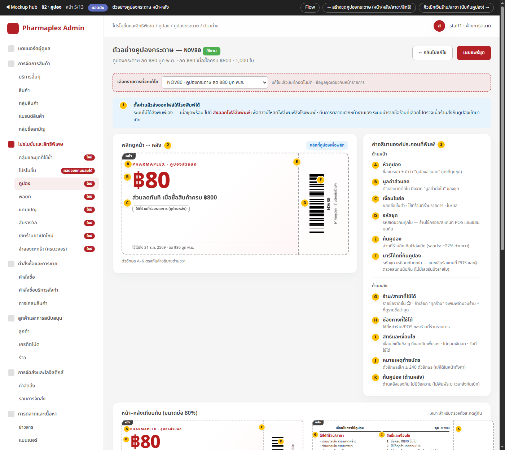

**เพิ่ม/เปลี่ยนในรอบนี้**

- หน้าคูปองของฟรีแสดง “ฟรี! แลก … ” แทนมูลค่าเงิน

**คำอธิบายแต่ละส่วนในหน้าจอ**

1. แจ้งว่าระบบไม่ได้สั่งพิมพ์เอง — แต่มีลิงก์ไป “ส่งออกไฟล์สั่งพิมพ์” เพื่อดาวน์โหลดไฟล์ส่งโรงพิมพ์
2. คูปองแบบพลิกได้ (คลิกพลิกหน้า ↔ หลัง) ขนาดเท่าของจริงที่ 100% ใช้ตรวจข้อความทีละด้าน
3. ตัวอักษร A–K บนใบคือจุดอ้างอิงถึงรายการอธิบาย — ใช้ตอนคุยกับทีมการตลาดว่า "จุด G ต้องตรงกับรายชื่อร้าน"
4. ข้อกำหนดขนาดพิมพ์เป็นคำแนะนำ (21 × 9.5 ซม. ก้นคูปอง 22%) ระบบไม่ตรวจไฟล์ของทีมการตลาด
5. เช็กลิสต์ 4 ข้อแรกระบบติ๊กให้จากข้อมูลที่ตรวจได้ · 2 ข้อท้ายเป็นของคนตรวจเอง (ไม่บล็อกการเผยแพร่)
7. หน้าคูปองของฟรี ใหม่ เมื่อสิทธิ์เป็นของแถม/บริการฟรี ด้านหน้าแสดง “แลก … ฟรี” แทนมูลค่าเงิน ไม่มีขั้นต่ำ · ด้านหลังแสดงรายชื่อร้านพาร์ทเนอร์และสาขา

**กติกา / ข้อยกเว้น / สถานะ**

- ตัวอย่างสร้างจากค่าที่ตั้งในหน้า "สร้างชุด" เสมอ — แก้ค่าแล้วตัวอย่างเปลี่ยนตาม ไม่มีการแก้ข้อความบนตัวอย่างโดยตรง
- ถ้ารายชื่อร้านยาวเกินพื้นที่ (เกิน ~6 ร้าน) หลังใบจะแสดง "ร้านที่ร่วมรายการ 12 แห่ง ดูรายชื่อที่ pharmaplex.co.th/coupon" แทนการพิมพ์ทุกชื่อ
- ชุดที่เผยแพร่แล้วดูตัวอย่างได้เสมอ แต่แก้รหัส/มูลค่าไม่ได้ — ต้อง "ทำซ้ำชุด" เป็นรหัสใหม่

**ข้อที่ต้องตัดสินใจกับลูกค้า**

- จำนวนร้านสูงสุดที่ยอมให้พิมพ์ชื่อลงหลังใบ (ข้อเสนอ: ไม่เกิน 6 ร้าน เกินนั้นให้ชี้ไปดูรายชื่อที่เว็บ) — ลูกค้าต้องยืนยันว่ายอมรับให้ลูกค้าปลายทางต้องเปิดเว็บเช็กหรือไม่
- ข้อความ URL บนหลังใบ (ตัวอย่าง pharmaplex.co.th/coupon) — ต้องยืนยันโดเมน/หน้าจริงที่จะใช้

#### แอดมิน · ส่งออกไฟล์สั่งพิมพ์คูปองกระดาษ (โรงพิมพ์)

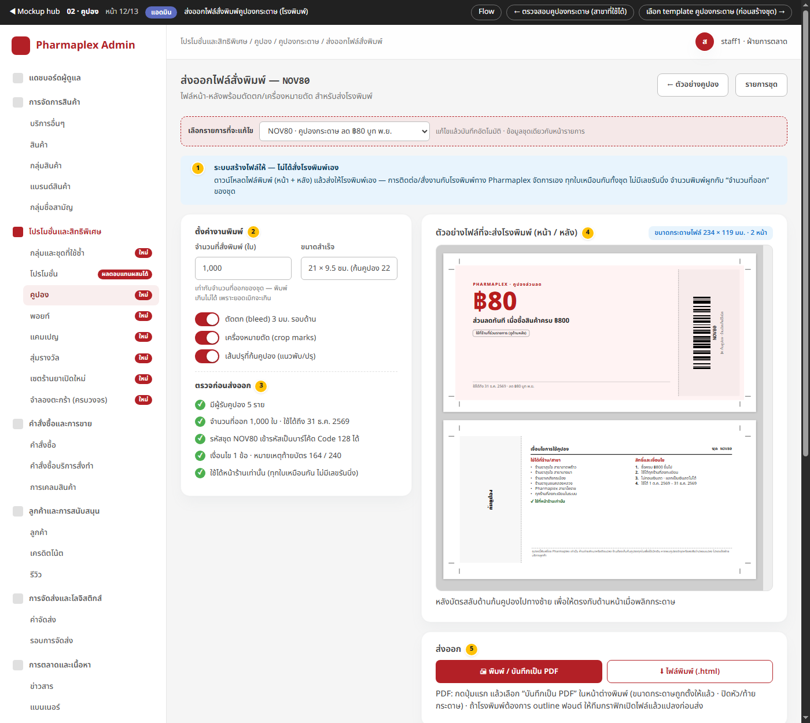

**เพิ่ม/เปลี่ยนในรอบนี้**

- หน้าใหม่: ระบบสร้างไฟล์พิมพ์ (หน้า + หลัง) ให้ส่งโรงพิมพ์ — ระบบไม่ได้สั่งพิมพ์เองและไม่ได้ส่งให้โรงพิมพ์โดยตรง

**คำอธิบายแต่ละส่วนในหน้าจอ**

1. ข้อความบอกชัดว่าระบบสร้างไฟล์ให้แต่ไม่ได้สั่งโรงพิมพ์เอง · ทุกใบเหมือนกัน ไม่มีเลขรันนิ่ง
2. ตั้งค่างานพิมพ์: จำนวนสั่งพิมพ์ผูกกับ “จำนวนที่ออก” (แก้ไม่ได้ในหน้านี้ กันพิมพ์เกินจนยอดเบิกเกิน) · ขนาดสำเร็จ 21 × 9.5 ซม. (ก้นคูปอง 22%) · สวิตช์ตัดตก 3 มม. เครื่องหมายตัด และเส้นปรุที่ก้นคูปอง
3. ตรวจก่อนส่งออก: มีผู้รับ · จำนวน/วันที่ครบ · รหัสชุดเข้ารหัสบาร์โค้ดได้ · เงื่อนไขและหมายเหตุไม่ล้น — ✕ บล็อกการส่งออก ! เตือนเฉย ๆ (เช่น พิมพ์สะสมเกินจำนวนที่ออก)
4. ตัวอย่างคือไฟล์จริงที่จะดาวน์โหลด หน้า + หลัง ย่อขนาด เปลี่ยนตามสวิตช์ตัดตก/เครื่องหมายตัด · หลังบัตรสลับด้านก้นไปทางซ้ายเพื่อให้ตรงกับด้านหน้าเมื่อพลิกกระดาษ
5. ส่งออก 2 แบบ: พิมพ์/บันทึกเป็น PDF · ไฟล์พิมพ์ .html
6. ประวัติการส่งออก: ส่งอะไรเมื่อไรและจำนวนพิมพ์ — ใช้ย้อนดูว่าพิมพ์สะสมไปกี่ใบแล้ว

**กติกา / ข้อยกเว้น / สถานะ**

- ไฟล์สร้างจากค่าปัจจุบันของชุด แก้ชุดแล้วต้องส่งออกใหม่ ไฟล์เก่าไม่อัปเดตตาม
- พิมพ์สะสมเกินจำนวนที่ออก: ระบบเตือน (ไม่บล็อก) เพราะอาจเป็นการพิมพ์ซ้ำจากงานเดิม
- ชื่อไฟล์: รหัสชุด + -print เช่น NOV80-print.html

**ข้อที่ต้องตัดสินใจกับลูกค้า**

- โรงพิมพ์รับไฟล์ชนิดไหน (PDF / AI) และต้องการ CMYK/outline ฟอนต์หรือไม่ — ถ้าต้อง ต้องเพิ่มขั้นตอนกราฟิกหรือ export PDF ฝั่งเซิร์ฟเวอร์
- ขนาด/ตำแหน่งเส้นปรุ และสเปกบาร์โค้ดขั้นต่ำที่เครื่อง POS อ่านได้ ต้องทดสอบกับเครื่องจริง

#### แอดมิน · เบิกเงินจากก้นคูปอง (ตาราง + popup)

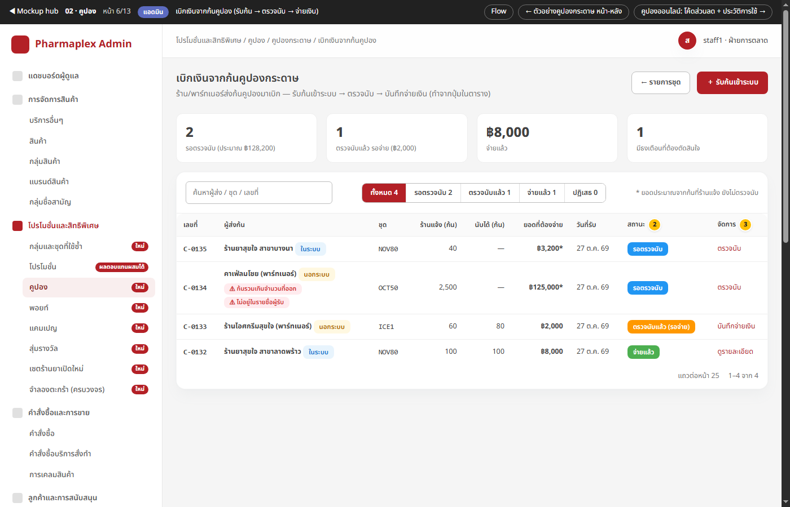

**เพิ่ม/เปลี่ยนในรอบนี้**

- จัดหน้าตามรูปแบบเดียวกับหน้ารายการอื่นของระบบ: การ์ดสรุป + ตารางพร้อมแท็บสถานะ + popup สำหรับแต่ละการกระทำ (รับก้นเข้าระบบ / ตรวจนับ / บันทึกจ่ายเงิน)

**คำอธิบายแต่ละส่วนในหน้าจอ**

1. แท็บสถานะ (ทั้งหมด / รอตรวจนับ / ตรวจนับแล้ว / จ่ายแล้ว / ปฏิเสธ) พร้อมจำนวน และช่องค้นหาผู้ส่ง/ชุด/เลขที่ · ปุ่ม “＋ รับก้นเข้าระบบ” อยู่มุมขวาบน
2. ตาราง: เลขที่ · ผู้ส่ง (ป้ายในระบบ/นอกระบบ + ป้ายธง) · ชุด · ก้นที่ร้านแจ้ง · ก้นที่นับได้ · ยอดที่ต้องจ่าย (* = ประมาณ) · วันที่รับ · สถานะ
3. คอลัมน์ “จัดการ” ขึ้นปุ่มตามสถานะ: รอตรวจนับ → “ตรวจนับ” · ตรวจนับแล้ว → “บันทึกจ่ายเงิน” (หรือ “ปิดงาน”) · จ่ายแล้ว/ปฏิเสธ → “ดูรายละเอียด” กดแล้วเปิด popup
4. popup รับก้นเข้าระบบ: ผู้ส่ง (ร้านในระบบ/พาร์ทเนอร์ ไม่มีช่องพิมพ์ชื่อเอง) · ชุด · จำนวนก้น · วันที่รับ · หมายเหตุ/หลักฐาน · ยอดประมาณ → บันทึกแล้วรายการเป็น “รอตรวจนับ”
5. popup ตรวจนับ: สรุปผู้ส่ง/ชุด/ก้นที่แจ้ง · ธงเตือนพร้อมบอกว่าต้องทำอะไร · ช่องนับก้นได้จริง เทียบกับที่ร้านแจ้งและคำนวณยอดสด · “ยืนยันจำนวน” หรือ “ปฏิเสธ…” (ต้องกรอกเหตุผล) · มีประวัติรายการ
6. popup บันทึกจ่ายเงิน: ยอดที่ต้องจ่าย · เหตุผลอนุมัติพิเศษ (บังคับเมื่อมีธง) · วันที่จ่าย · เลขอ้างอิงโอน · “บันทึกจ่ายเงิน” หรือ “ปิดงาน” (พาร์ทเนอร์ออกเอง) · “ส่งกลับตรวจนับใหม่”

**กติกา / ข้อยกเว้น / สถานะ**

- สถานะ: รอตรวจนับ → ตรวจนับแล้ว (รอจ่าย) → จ่ายแล้ว/ปิดงานแล้ว · หรือ ปฏิเสธ (ต้องมีเหตุผล) · จ่ายแล้วแก้ตัวเลขไม่ได้ ต้องบันทึกรายการปรับยอดใหม่
- ธงเตือนจากระบบ (ผู้ส่งไม่อยู่ในรายชื่อผู้รับของชุด / ก้นรวมเกินจำนวนที่ออก) ไม่บล็อกการนับ แต่ก่อนจ่ายต้องกรอก “เหตุผลอนุมัติพิเศษ” ซึ่งบันทึกไว้ในประวัติ
- ยอดจ่าย = จำนวนที่นับได้ × ราคาต่อใบ (ส่วนลด = มูลค่าบนใบ · ของฟรี = ราคาตกลง) · ชุดที่พาร์ทเนอร์ออกเอง “ไม่มีการจ่าย” ปิดงานหลังตรวจนับ
- ทุกการกดถูกบันทึกในประวัติของรายการ

**ข้อที่ต้องตัดสินใจกับลูกค้า**

- ใครมีสิทธิ์ “บันทึกจ่ายเงิน” — เฉพาะฝ่ายบัญชี หรือแอดมินการตลาดด้วย · ต้องแนบสลิป/หลักฐานการโอนหรือไม่

#### แอดมิน · คูปองออนไลน์: โค้ดส่วนลด + ประวัติการใช้

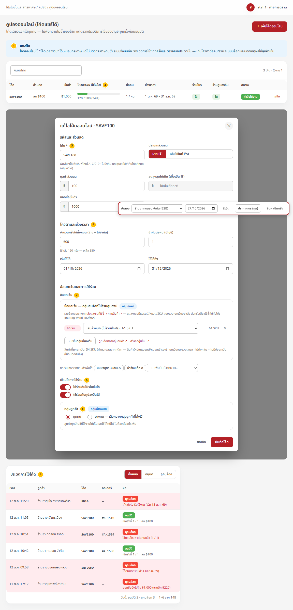

**คำอธิบายแต่ละส่วนในหน้าจอ**

1. ย้ำแนวคิด: โค้ดไม่ต้อง unique — ความถูกต้องมาจากการตรวจประวัติการใช้ของบัญชีทุกครั้ง ไม่ใช่จากตัวโค้ด
2. โควตารวมแสดงเป็นแถบ (แดงเมื่อใช้เกิน 90%) พร้อมตัวเลขใช้แล้ว/ทั้งหมด — "ไม่จำกัด" แสดงเฉพาะจำนวนที่ใช้
3. โค้ดพิมพ์เองได้ ระบบแปลงเป็นตัวพิมพ์ใหญ่และตัดช่องว่าง — ชนกับโค้ดที่ยังใช้งาน/ยังไม่เริ่มอยู่เตือน แต่ไม่บังคับ unique กับโค้ดที่หมดอายุ
4. ต่อคน = ต่อบัญชีลูกค้า (นับจากประวัติ "อนุมัติ" เท่านั้น — ครั้งที่ถูกบล็อกหรือยกเลิกออเดอร์ก่อนชำระไม่นับ)
5. เงื่อนไขการใช้ร่วม: ร่วมโปรโมชั่นไม่ได้ = ไม่คิดคูปองกับรายการที่จับคู่โปรแล้ว · ร่วมคูปองอื่นไม่ได้ = ต้องเป็นใบเดียวในบิล
6. ประวัติการใช้: อนุมัติ = เขียว / ถูกบล็อก = แดงพร้อมเหตุผลที่ตรงกับข้อความที่ลูกค้าเห็นตอนเช็คเอาต์
7. ข้อยกเว้น ใหม่ เลือกจาก กลุ่มสินค้า ที่ตั้งไว้ (แบรนด์/หมวด/SKU แบบรวม-ยกเว้น) ได้ — ไม่ต้องกรอกซ้ำ และยังเพิ่มยกเว้นรายสินค้าได้ · สินค้าที่ติดข้อยกเว้นไม่ถูกนับเข้าขั้นต่ำและไม่ได้ส่วนลด
8. กลุ่มลูกค้า ใช้ตัวเลือกเดียวกับทุกหน้า — “บางคน” เลือกจากกลุ่มลูกค้าที่ตั้งไว้ (รวม/ยกเว้น) · ลูกค้านอกกลุ่มกรอกโค้ดจะได้ข้อความ “โค้ดนี้ใช้ไม่ได้กับบัญชีของคุณ” · ลำดับตรวจโค้ดคงเดิม (พบโค้ด → ช่วงเวลา → กลุ่มลูกค้า → ยอดขั้นต่ำ)

**กติกา / ข้อยกเว้น / สถานะ**

- ลำดับตรวจเมื่อลูกค้ากรอกโค้ด: พบโค้ด → อยู่ในช่วงเวลา → กลุ่มลูกค้าตรง → ยอดถึงขั้นต่ำ (นับเฉพาะสินค้าที่ไม่ถูกยกเว้น) → โควตารวม → โควตาต่อคน → เงื่อนไขใช้ร่วม
- โควตารวมตัดเมื่อ "ชำระสำเร็จ" ไม่ใช่ตอนใส่โค้ด · ถ้ายกเลิกก่อนชำระ โควตาไม่ถูกตัด
- หมดอายุ/ยังไม่เริ่ม: โค้ดยังเห็นในรายการ แต่ลูกค้ากรอกแล้วขึ้นข้อความเหตุผลตรง ๆ
- แก้ไขโค้ดที่มีประวัติแล้ว: แก้โควตา/วันที่/ขั้นต่ำได้ มีผลกับการใช้ครั้งต่อไปเท่านั้น (ไม่ย้อนหลัง)
- ยกเลิก/คืนสินค้าหลังใช้โค้ดแล้ว ไม่คืนสิทธิ์ ถือว่าใช้แล้ว

**ข้อที่ต้องตัดสินใจกับลูกค้า**

- ถ้าลูกค้า "ยังไม่ได้ล็อกอิน" แล้วกรอกโค้ด จะให้ตรวจสิทธิ์ได้หรือไม่ (ข้อเสนอ: ต้องล็อกอินก่อนจึงตรวจสิทธิ์ เพื่อนับต่อบัญชีได้)
- มีโค้ดที่ผูกกับกลุ่มลูกค้าเฉพาะราย (audience) ต้องใช้จริงหรือไม่ — ถ้าไม่ใช้ ตัดช่องนี้ออกเพื่อลดความซับซ้อน

#### แอดมิน · คูปองออนไลน์: เก็บเอง / แจกรายเดือน

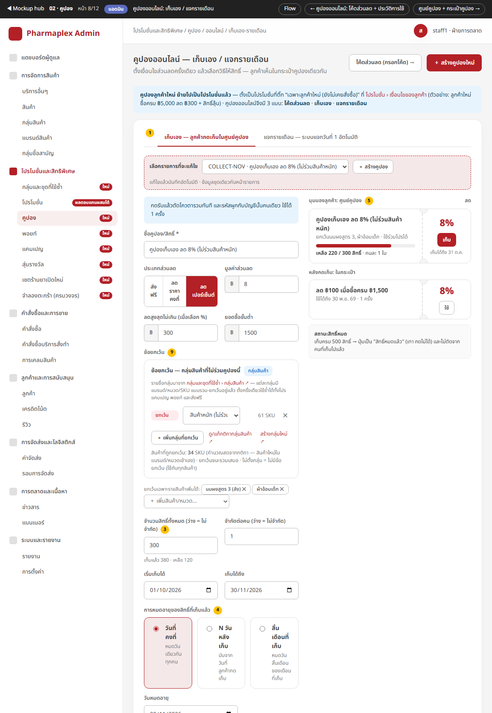

**เพิ่ม/เปลี่ยนในรอบนี้**

- เหลือ 2 แท็บ: เก็บเอง · แจกรายเดือน (ตัดแท็บลูกค้าใหม่ออก)
- ข้อยกเว้นเลือกจากกลุ่มสินค้าที่ตั้งไว้ได้ทั้งเก็บเองและแจกรายเดือน
- ตัดตัวเลือก "รูปแบบการแจก" ในฟอร์มออก เพราะซ้ำกับแท็บ — วิธีแจกกำหนดจากแท็บที่สร้างใบนั้นเท่านั้น (แท็บเก็บเองมีกล่องข้อความอธิบายกติกาแทน)

**คำอธิบายแต่ละส่วนในหน้าจอ**

1. สองแท็บ = สองวิธีให้สิทธิ์ ใช้ชุดฟิลด์ส่วนลดเดียวกัน ต่างกันที่ "วิธีรับ" · ใบหนึ่งอยู่ได้แท็บเดียว
2. รูปแบบการแจกกำหนดจากแท็บที่สร้าง (ไม่มีตัวเลือกซ้ำในฟอร์ม) — สร้างได้หลายใบพร้อมกัน เช่น ใบเก็บเอง + ใบรายเดือน
3. จำนวนสิทธิ์ทั้งหมด = โควตารวม ตัดทันทีเมื่อลูกค้ากดเก็บ (แสดง "เหลือ n / ทั้งหมด" ให้ลูกค้าเห็น) · ว่าง = ไม่จำกัด
4. การหมดอายุของสิทธิ์ที่เก็บแล้ว: วันที่คงที่ / N วันหลังเก็บ / สิ้นเดือนที่เก็บ — ช่องกรอกเปลี่ยนตามตัวเลือก
5. ตัวอย่างฝั่งลูกค้าอัปเดตสดตามค่าที่ตั้ง ทั้งในศูนย์คูปอง (ก่อนเก็บ) และกระเป๋า (หลังเก็บ)
6. แถบรายเดือน: ใช้แล้ว / พร้อมใช้ / รอวันที่ 1 — หมดอายุล็อกที่สิ้นเดือนเดียวกันเสมอ
7. ลูกค้าใหม่ ไม่ใช่คูปองแล้ว — ใช้ “โปรโมชั่น + เฉพาะลูกค้าใหม่” แทน (ตรวจจากประวัติคำสั่งซื้อ ไม่มีออเดอร์มาก่อน) จึงรวมของแถม/พอยท์/สิทธิ์ลุ้นกับส่วนลดได้
8. ข้อยกเว้น ใหม่ เลือกจาก กลุ่มสินค้า ที่ตั้งไว้ + ยกเว้นรายสินค้าได้ ทั้งเก็บเองและแจกรายเดือน
9. กลุ่มลูกค้าเป้าหมาย ทั้งแบบเก็บเอง และแบบแจกอัตโนมัติรายเดือน ใช้ตัวเลือกเดียวกับทุกหน้า · แจกรายเดือน: ระบบออกสิทธิ์ให้เฉพาะสมาชิกกลุ่ม ณ วันที่ออกสิทธิ์ (สมาชิกใหม่ที่เข้ากลุ่มกลางเดือนได้รอบถัดไป) · แบบเก็บเอง: คนนอกกลุ่มไม่เห็นคูปองในศูนย์คูปอง

**กติกา / ข้อยกเว้น / สถานะ**

- ลูกค้าเก็บซ้ำเกิน "ต่อคน" ไม่ได้ — ปุ่มเปลี่ยนเป็น "เก็บแล้ว"; สิทธิ์ที่เก็บแล้วไม่หายถ้าแอดมินปิดการแจกภายหลัง
- แก้เงื่อนไขส่วนลดของใบที่มีคนเก็บแล้ว: ใบที่เก็บไปแล้วใช้ค่าเดิมตอนเก็บ (snapshot) ยกเว้น "เงื่อนไขใช้ร่วม" ที่อ่านจากต้นทางสด
- แจกรายเดือน: ไม่ทบข้ามเดือน ไม่ใช้ = หมดสิทธิ์ · ออกให้เฉพาะบัญชีที่ใช้งานอยู่

**ข้อที่ต้องตัดสินใจกับลูกค้า**

- ลูกค้าใหม่ที่เคยได้ “คูปองลูกค้าใหม่” ในแบบเดิม — ย้ายเป็นโปรโมชั่นลูกค้าใหม่ และคูปองที่ออกไปแล้วยังใช้ได้จนหมดอายุ
- ลูกค้าที่สมัครกลางเดือนจะได้สิทธิ์รายเดือนของเดือนนั้นทันทีหรือไม่ (ข้อเสนอ: ได้ทันที หมดสิ้นเดือน)
- เพดานจำนวนสิทธิ์/วันที่ของคูปองเก็บเอง "ไม่จำกัด" อนุญาตหรือไม่ — ข้อเสนอให้บังคับกรอกโควตารวมเพื่อกันงบบาน

#### ลูกค้า · ศูนย์คูปอง + กระเป๋าคูปอง

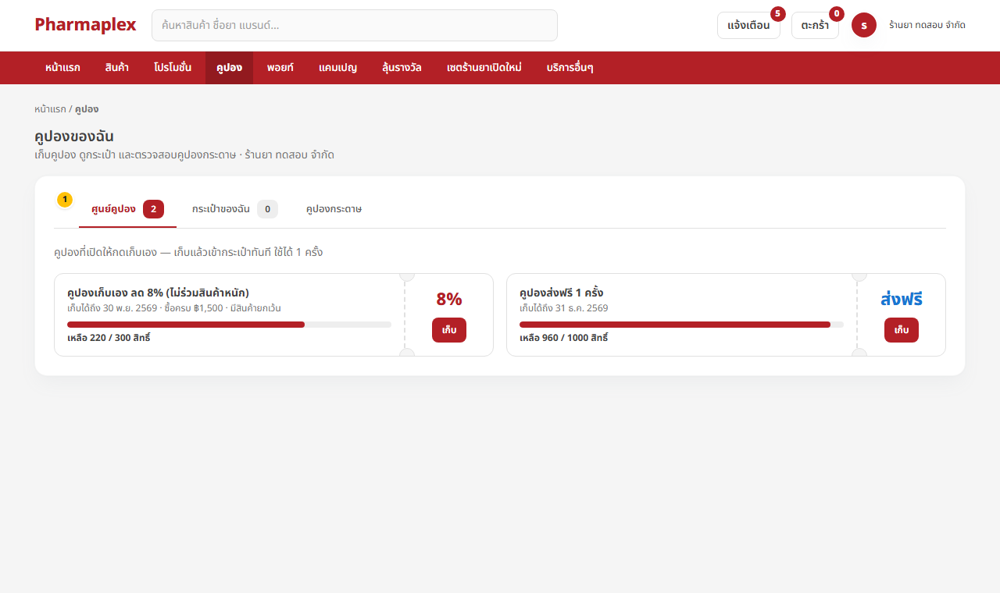

**คำอธิบายแต่ละส่วนในหน้าจอ**

1. สามแท็บ: ศูนย์คูปอง (เก็บเอง) / กระเป๋าของฉัน / คูปองกระดาษ — ตัวเลขข้างชื่อแท็บ = จำนวนที่เก็บได้ / พร้อมใช้
2. การ์ดในศูนย์คูปอง: แถบความคืบหน้า "เหลือ n / ทั้งหมด" · ปุ่มเปลี่ยนตามสถานะ: เก็บ / เก็บแล้ว / สิทธิ์หมดแล้ว / ยังไม่เปิด (ใช้ปุ่มเทาเมื่อกดไม่ได้)
3. กระเป๋าแยกชิปสถานะ พร้อมใช้ / ใช้แล้ว / หมดอายุ พร้อมจำนวน — เรียงใบที่ใกล้หมดอายุก่อน
4. สิทธิ์รายเดือนที่ระบบออกให้: ใบเดือนปัจจุบันกดใช้ได้ ใบเดือนหน้าแสดง "รอวันที่ 1 พ.ย." กดไม่ได้ + แถบรายเดือน ก.ย./ต.ค./พ.ย.
5. คูปองกระดาษไม่อยู่ในกระเป๋า — แท็บนี้อธิบายวิธีใช้ที่ร้านและลิงก์ไปหน้าตรวจสอบรหัส/ร้านที่ใช้ได้

**กติกา / ข้อยกเว้น / สถานะ**

- ปุ่ม "ใช้" พาไปตะกร้า/เช็คเอาต์และเลือกคูปองนั้นไว้ล่วงหน้า — ถ้าตะกร้าว่างจะพาไปเลือกสินค้าก่อน
- ใบที่ใช้แล้ว/หมดอายุ แสดงเป็นสีจาง กดไม่ได้ และแสดงเลขออเดอร์ที่ใช้ (กรณีใช้แล้ว)
- เก็บซ้ำเกิน "ต่อคน" ไม่ได้ — ปุ่มเป็น "เก็บแล้ว"; โควตารวมหมด = "สิทธิ์หมดแล้ว" (ใครเก็บไปก่อนหน้ายังใช้ได้)
- สถานะว่าง: ศูนย์คูปองที่ไม่มีใบให้เก็บ และกระเป๋าที่ว่าง แสดงข้อความนำทางไปอีกแท็บ
- ไม่มีการแจ้งเตือนนอกเว็บ — ลูกค้าต้องเข้ามาดูเองว่าคูปองใกล้หมดอายุ

**ข้อที่ต้องตัดสินใจกับลูกค้า**

- จะแสดงคูปองรายเดือนของเดือนหน้าที่ "ยังไม่ออก" ในกระเป๋าหรือไม่ (ข้อเสนอ: แสดงเพื่อให้ลูกค้ารู้ล่วงหน้า)
- ลูกค้าต้องการให้ผูกคูปองกระดาษเข้าบัญชี (กรอกรหัสเก็บไว้) หรือไม่ — ค่าเริ่มต้นไม่ผูก เพราะรหัสเหมือนกันทั้งชุด

#### ลูกค้า · ตรวจสอบคูปองกระดาษ (สาขาที่ใช้ได้)

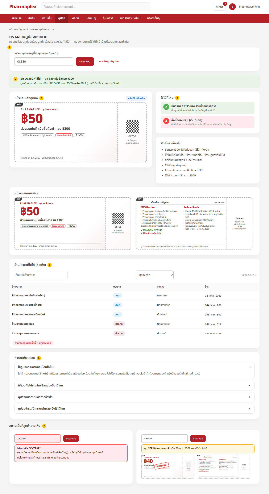

**เพิ่ม/เปลี่ยนในรอบนี้**

- ลูกค้าเห็นสิทธิ์ (ส่วนลด/ของฟรี) และรายชื่อร้านพาร์ทเนอร์พร้อมสาขา

**คำอธิบายแต่ละส่วนในหน้าจอ**

1. ช่องกรอกรหัสชุดบนคูปอง (ไม่ต้องล็อกอิน) — ไม่แยกพิมพ์เล็ก/ใหญ่ ตัดช่องว่าง · หน้านี้ "ตรวจสอบ/ให้ข้อมูล" เท่านั้น ไม่ใช้ส่วนลดให้
2. แบนเนอร์สถานะชุด: ใช้ได้ / หมดอายุ / ไม่พบ พร้อมสรุปมูลค่า ขั้นต่ำ วันที่ และจำนวนร้าน
3. แสดงคูปองทั้งหน้าและหลัง: พลิกดูได้ในใบเดียว และเทียบแบบหน้า–หลังข้างกัน เหมือนที่พิมพ์จริง
4. บรรทัดช่องทาง ✔/✘ ชัดเจน: หน้าร้าน/POS และออนไลน์ พร้อมเหตุผลเมื่อใช้ไม่ได้
5. รายชื่อร้าน/สาขาที่ใช้ได้ ค้นหาและกรองจังหวัดได้ — ร้านที่ไม่อยู่ในรายชื่อ = ใช้ไม่ได้
6. คำถามที่พบบ่อย 4 ข้อ (ออนไลน์ได้ไหม / ใช้ร่วมได้ไหม / หมดอายุ / ใบชำรุด) แบบพับเก็บได้
7. สถานะไม่พบรหัส และหมดอายุ (ตราประทับ "หมดอายุ" บนทั้งสองด้าน)
8. แลกที่ไหน/ได้อะไร ใหม่ ลูกค้ากรอกรหัสแล้วเห็นสิทธิ์ (ส่วนลด หรือของฟรี) และรายชื่อร้านที่รับ รวมพาร์ทเนอร์นอกระบบพร้อมสาขา

**กติกา / ข้อยกเว้น / สถานะ**

- ข้อมูลทุกอย่างมาจากชุดที่แอดมินตั้งค่า — ไม่แสดงจำนวนก้น/ยอดเบิก/ข้อมูลภายในของร้านใด ๆ
- ชุดสถานะร่างหรือปิด ตอบเหมือน "ไม่พบรหัส" (ไม่เปิดเผยชุดที่ยังไม่เผยแพร่)
- ถ้าชุดเลือก "ทุกร้านที่ลงทะเบียน" รายชื่อร้านจะแสดงทุกร้านที่ลงทะเบียน ณ วันที่ตรวจ
- จำกัดอัตราการเรียกต่อ IP เพื่อกันการไล่เดารหัส

**ข้อที่ต้องตัดสินใจกับลูกค้า**

- หน้านี้เปิดสาธารณะ (ไม่ต้องล็อกอิน) หรือเฉพาะสมาชิก — เสนอให้เปิดสาธารณะเพื่อให้ผู้ได้รับคูปองหน้างานเช็กได้ทันที
- จะแสดงเบอร์โทรร้านหรือไม่ (ตัวอย่างนี้แสดง) ต้องให้ร้าน/ตัวแทนยินยอม

#### สรุปข้อที่ต้องตัดสินใจกับลูกค้า

- จำนวนร้านสูงสุดที่พิมพ์ชื่อลงด้านหลังใบ (เสนอไม่เกิน 6 ร้าน เกินนั้นให้ดูรายชื่อที่เว็บ) และ URL ที่พิมพ์บนใบ
- จำนวนคูปองสูงสุดต่อบิลออนไลน์ (กติการะบบ เสนอ ส่วนลด 1 ใบ + ส่งฟรี 1 ใบ) และเพดานส่วนลดต่อบิล
- โปรโมชั่นเฉพาะลูกค้าใหม่ ควรจำกัดต่อบัญชี 1 ครั้ง (ข้อเสนอ) และนับ “ลูกค้าใหม่” จากการไม่เคยมีออเดอร์ (ไม่นับออเดอร์ที่ยกเลิก — รอยืนยัน)
- หน้าตรวจสอบคูปองกระดาษ (10) เปิดสาธารณะโดยไม่ต้องล็อกอินหรือไม่ และแสดงเบอร์โทรร้านหรือไม่

---

## 5. พอยท์และแคมเปญ

### 5.1 พอยท์สะสมอัตโนมัติเมื่อซื้อสินค้า

ลูกค้าได้พอยท์ทันทีเมื่อการชำระเงินของออเดอร์สำเร็จ ไม่ต้องกดแปลงหรือรอคิวใด ๆ พอยท์เข้าบัญชีพร้อมกับยอดสั่งซื้อ และนำไปใช้ได้ทันที

อัตราพอยท์กำหนดที่ระดับสินค้าแต่ละรายการ ไม่ได้คิดจากยอดรวมใบเสร็จ เช่น สินค้าบางรายการได้ 10 พอยท์ต่อหน่วย ส่วนสินค้าควบคุมราคา ยาน้ำ นมผง หรือสินค้าราคาพิเศษ ตั้งค่าเป็น 0 พอยท์ได้

```
พอยท์ที่ได้จากออเดอร์ = ผลรวมของ (จำนวนที่ซื้อ × พอยท์ต่อหน่วยของสินค้านั้น) × ตัวคูณจากโปรโมชั่น (ถ้ามี) + พอยท์ฟรีจากโปรโมชั่น (ถ้ามี)
```

ตัวอย่าง: ซื้อสินค้าที่ได้ 10 พอยท์ต่อชิ้น จำนวน 2 ชิ้น และสินค้าอีกรายการที่ได้ 0 พอยท์ รวมได้ 20 พอยท์ทันทีที่ชำระเงินสำเร็จ

**สินค้าที่ไม่ได้ตั้งพอยท์ได้ 0 พอยท์** ไม่มี “ค่าเริ่มต้นเมื่อสินค้าไม่ได้ตั้งไว้” อัตราพอยท์ตั้งที่สินค้าเท่านั้น (รายสินค้า หรือตั้งพร้อมกันตามแบรนด์/หมวด)

**พอยท์เพิ่มได้ผ่านโปรโมชั่นเท่านั้น (แคมเปญไม่ให้พอยท์และไม่มีตัวคูณ)** ในผลตอบแทนของโปรโมชั่น เลือก “พอยท์” ได้ 2 แบบ คือ (1) ตัวคูณพอยท์ของสินค้าที่เข้าโปร เช่น ซื้อโปรนี้ได้พอยท์ ×1.5 หรือ (2) พอยท์ฟรีจำนวนคงที่ เช่น แถม 50 พอยท์ จะใช้อย่างใดอย่างหนึ่ง ทั้งคู่ หรือไม่ให้พอยท์เลยก็ได้ ไม่ได้บังคับ ถ้ามีหลายโปรที่ให้ตัวคูณพร้อมกัน ตัวคูณบวกกัน เช่น ×1.5 และ ×2 ได้รวม ×2.5 (ส่วนเพิ่มของแต่ละโปรบวกเข้ากับ ×1)

**ยกเลิกออเดอร์ = หักคืนเสมอ ไม่มีตัวเลือก** เมื่อออเดอร์ที่เคยให้พอยท์หรือเคยบวกยอดสะสมแคมเปญถูกยกเลิก ระบบหักพอยท์และหักยอดสะสมคืนทุกครั้ง เพื่อให้คิดคืนได้ง่ายและตรงกัน ระบบ **เก็บฟิลด์ไว้ที่รายการสินค้าในออเดอร์** ตั้งแต่ตอนชำระเงิน ได้แก่ พอยท์ที่ได้จากรายการนั้น (หลังคูณตัวคูณโปรโมชั่นแล้ว) ตัวคูณที่ใช้ และยอดสะสมที่บวกให้แต่ละแคมเปญ ส่วนที่ตัวออเดอร์เก็บพอยท์ฟรีจากโปรโมชั่นและยอดรวมไว้ด้วย ตอนยกเลิกจึงอ่านค่าจากฟิลด์เหล่านี้มาหักได้ตรง ๆ ไม่ต้องคำนวณย้อนหลัง ถ้าพอยท์ถูกแลกไปแล้วจะหักได้เท่าที่เหลือในบัญชี และขั้นรางวัลที่ยังไม่ได้กดขอรับจะถูกล็อกกลับถ้ายอดสะสมต่ำกว่าเกณฑ์

**ยกเลิกออเดอร์ที่ใช้พอยท์ชำระ:** คืนพอยท์ให้เฉพาะเมื่อยกเลิกภายในปีสัญญา — ถ้ายกเลิกหลังสิ้นสุดปีสัญญา **ไม่คืนพอยท์** ที่ใช้ชำระไปแล้ว

พอยท์ที่ได้มีวันหมดอายุ โดยแอดมินกำหนดวันหมดอายุของพอยท์แต่ละออเดอร์หรือแต่ละโปรโมชั่นที่แจกพอยท์ได้เอง ไม่ได้ fix เป็นนโยบายเดียวทั้งระบบ

### 5.2 พอยท์ในบัญชีและการนำไปใช้

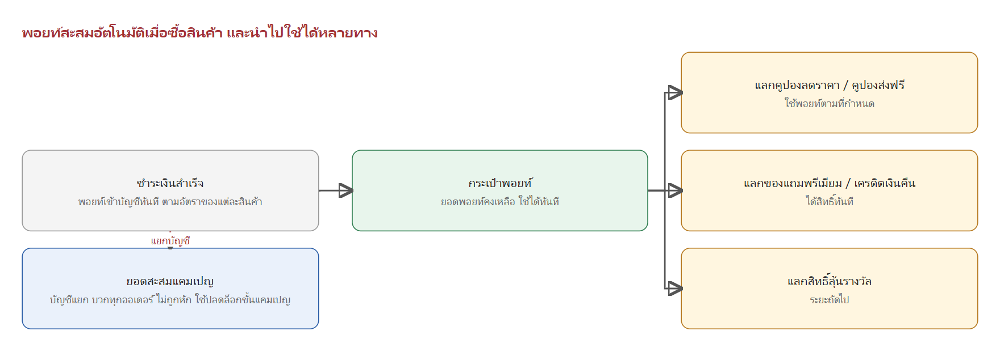

*รูป 5-1 พอยท์เข้าบัญชีทันทีเมื่อซื้อสินค้า ลูกค้านำพอยท์ไปใช้ได้หลายรูปแบบ ส่วนยอดสะสมแคมเปญเป็นอีกบัญชีหนึ่งที่แยกต่างหาก*

ลูกค้านำพอยท์ในบัญชีไปใช้ได้ดังนี้

| การใช้พอยท์ | รายละเอียด |
|---|---|
| แลกคูปองลดราคา | เช่น คูปองลด 50 บาท ใช้ 500 พอยท์ |
| แลกคูปองส่งฟรี | เช่น คูปองส่งฟรี ใช้ 300 พอยท์ |
| แลกของแถมพรีเมียม | เช่น ของแถม ใช้ 1,200 พอยท์ |
| แลกเครดิตเงินคืน | เช่น เครดิตเงินคืน 100 บาท ใช้ 1,000 พอยท์ |
| แลกสิทธิ์ลุ้นรางวัล | ตามที่ระบุในหัวข้อการสุ่มรางวัล (ระยะถัดไป) |
| ใช้พอยท์ชำระเงินในตะกร้า | ลูกค้าตัดพอยท์เป็นส่วนลดตอนชำระเงินได้ (1 พอยท์ = กี่บาท และใช้ได้ไม่เกินกี่ % ของยอดสินค้า ตั้งโดยแอดมิน) โดยโปรโมชั่นหรือคูปองที่เลือกไว้ต้องไม่ห้ามใช้ร่วมกับพอยท์ |

ยอดพอยท์คงเหลือ พอยท์ที่แลกแล้วจะถูกหักทันทีและได้สิทธิ์ใช้ทันที รายการที่แลกได้และจำนวนพอยท์กำหนดจากหน้าแอดมิน

**การเปิด/ปิดการชำระด้วยพอยท์:** แอดมินมีสวิตช์เดียวเปิด/ปิดการใช้พอยท์ชำระเงินในตะกร้าทั้งระบบ เมื่อปิด ลูกค้าไม่เห็นตัวเลือกใช้พอยท์ชำระในตะกร้า (แสดงเป็น "ปิดใช้งาน") แต่ยังสะสมพอยท์และแลกของรางวัลได้ตามปกติ ตัวอย่างพอยท์ที่ได้และยอดคงเหลือไม่เปลี่ยน การห้ามใช้พอยท์ชำระเฉพาะบางโปรโมชั่นหรือคูปองยังตั้งได้ที่ตัวโปรโมชั่น/คูปองเหมือนเดิม

**ยอดสะสมแคมเปญ** เป็นยอดซื้อสินค้าที่เข้าร่วมแคมเปญ ใช้ปลดล็อกรางวัลขั้นบันไดของแคมเปญสะสมยอดรายปี (หัวข้อ 5.3) ยอดนี้บวกทุกออเดอร์อัตโนมัติ (เก็บยอดที่บวกไว้ที่รายการสินค้าในออเดอร์ และหักคืนเสมอเมื่อยกเลิกออเดอร์) ไม่ถูกหักเมื่อแลกพอยท์ และไม่สามารถนำไปแลกเป็นพอยท์หรือส่วนลดได้

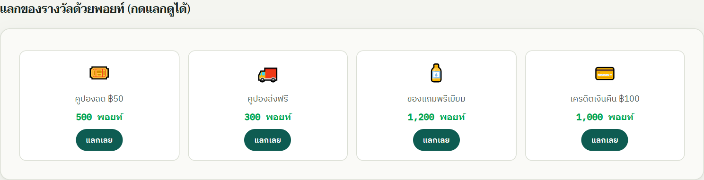

*รูป 5-2 ตัวอย่างหน้าแลกของรางวัลด้วยพอยท์ ลูกค้าเลือกแลกได้ทันทีตามจำนวนพอยท์ที่มี*

### 5.3 แคมเปญสะสมยอดรายปี (แคมเปญมีแบบเดียว)

สำหรับร้านขายส่งที่ทำสัญญาสะสมยอดซื้อรายปี แคมเปญจะปลดล็อกรางวัลตามขั้นบันไดของยอดสะสม รางวัลบางรายการไม่ได้อยู่ในคลังสินค้า POS เช่น ตั๋วเดินทาง หรือเครื่องใช้ไฟฟ้า ยอดสะสมจะรีเซ็ตเป็นศูนย์ทุกครั้งที่ขึ้นสัญญาปีใหม่ ไม่สะสมข้ามปี

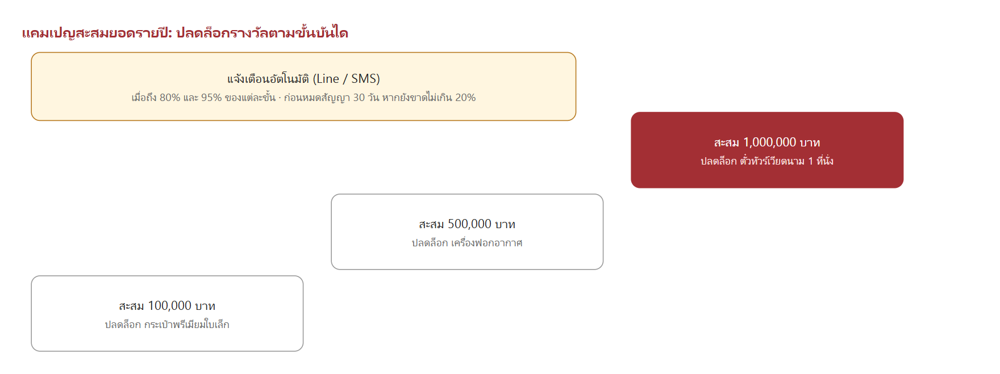

*รูป 5-3 ตัวอย่างขั้นบันไดของแคมเปญสะสมยอดรายปี*

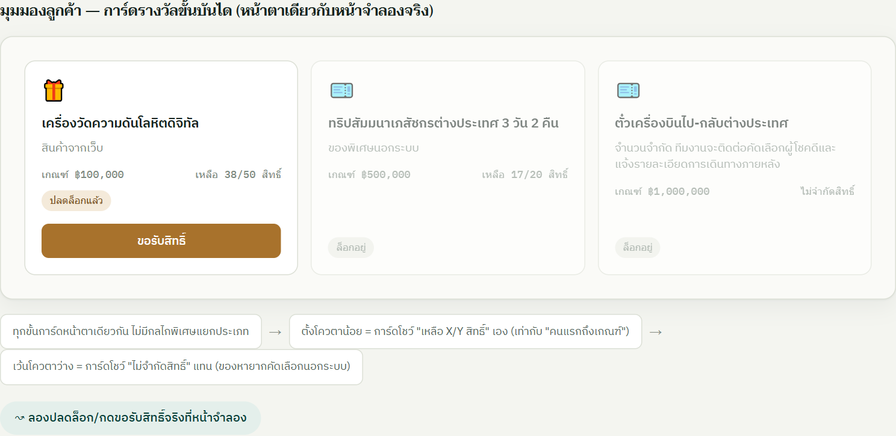

*รูป 5-4 ตัวอย่างหน้าจอ: การ์ดแต่ละขั้นแสดงเกณฑ์ สิทธิ์คงเหลือ และสถานะปลดล็อก ทุกขั้นใช้สิทธิ์ได้จนกว่าแคมเปญจะสิ้นสุด*

- รางวัลแต่ละขั้นแสดงจำนวนสิทธิ์คงเหลือ หรือแสดงว่าไม่จำกัดสิทธิ์สำหรับรางวัลที่คัดเลือกนอกระบบ
- เมื่อถึงยอดของขั้นนั้น ลูกค้ากดขอรับสิทธิ์ได้ทันที
- ไม่มีกำหนดวันหมดสิทธิ์การรับรางวัล ใช้สิทธิ์ได้จนกว่าแคมเปญจะสิ้นสุด

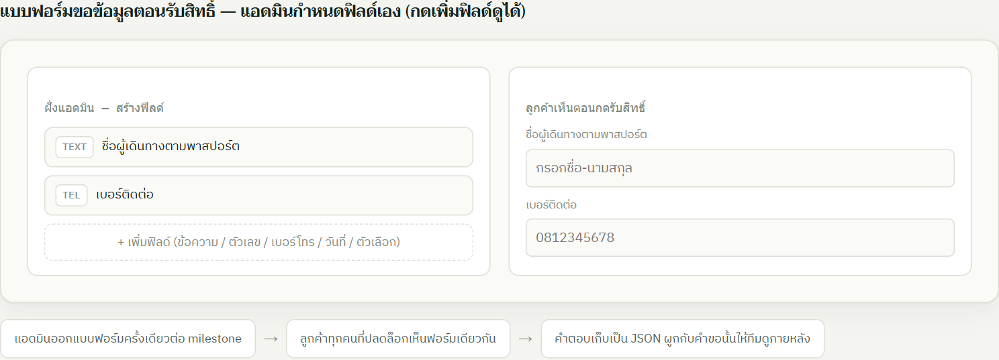

*รูป 5-5 แอดมินออกแบบฟอร์มขอข้อมูลตอนรับสิทธิ์ได้เอง เช่น ชื่อผู้เดินทางตามพาสปอร์ตและเบอร์ติดต่อ ลูกค้าทุกคนที่ปลดล็อกเห็นฟอร์มเดียวกัน*

### 5.4 การตั้งค่าของแอดมิน

| หัวข้อ | รายละเอียด |
|---|---|
| พอยท์ราย SKU | ตั้งพอยท์ต่อหน่วยของสินค้าแต่ละรายการเอง ไม่ตั้ง = 0 พอยท์ |
| ตัวคูณ/พอยท์ฟรีในโปรโมชั่น | ตั้งที่ผลตอบแทนของโปรโมชั่น (ไม่มีตัวคูณที่แคมเปญและไม่มีค่าเริ่มต้นของสินค้า) |
| รายการแลกของรางวัล | เพิ่ม ลบ หรือแก้ไขของรางวัล และกำหนดจำนวนพอยท์ที่ใช้แลกแต่ละรายการ |
| แคมเปญสะสมยอดรายปี | ตั้งเกณฑ์ยอดสะสมแต่ละขั้น ของรางวัล (รวมของที่ไม่อยู่ใน POS) และออกแบบฟอร์มขอข้อมูลตอนรับสิทธิ์เอง ยอดสะสมรีเซ็ตเองทุกปีสัญญาใหม่ |
| วันหมดอายุพอยท์ | กำหนดวันหมดอายุของพอยท์แต่ละโปรโมชั่นที่แจกได้เอง |
| การชำระด้วยพอยท์ | สวิตช์เปิด/ปิดทั้งระบบ · อัตราแปลง (1 พอยท์ = กี่บาท) · เพดานการใช้ชำระ (% ของยอดสินค้า) |

### 5.5 หน้าจอและ flow การใช้งาน

หน้าจอทั้งหมดของโมดูลนี้เรียงตามลำดับ flow การใช้งาน แต่ละภาพมีเลขกำกับบนจอ และคำอธิบายของแต่ละเลขอยู่ใต้ภาพ ตามด้วยกติกา ข้อยกเว้น และสถานะที่ต้องรองรับ พอยท์ที่แลกได้และยอดสะสมแคมเปญเป็นคนละบัญชี ทุกหน้าฝั่งลูกค้าแยกสองส่วนนี้ด้วยการ์ดคนละแบบ

#### โมดูลพอยท์

#### ภาพรวม · ภาพรวม Flow พอยท์

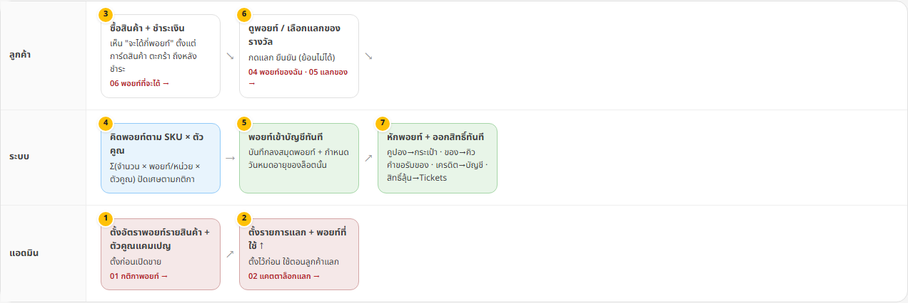

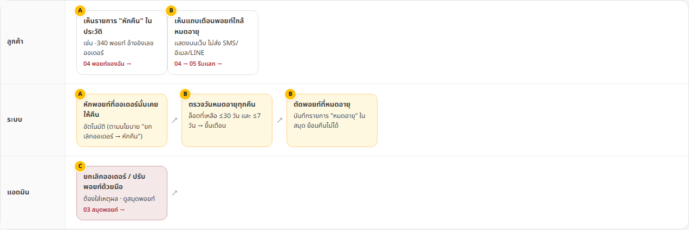

**คำอธิบายแต่ละส่วนในหน้าจอ**

1. ตั้งก่อนขาย: อัตราพอยท์รายสินค้า (รวมตั้งตามแบรนด์/หมวด) + นโยบายหมดอายุ — สินค้าที่ยังไม่ตั้งได้ 0 พอยท์ (ไม่มีค่าเริ่มต้น) · ตัวคูณพอยท์ตั้งที่โปรโมชั่น
2. ตั้งรายการแลก: ประเภท พอยท์ที่ใช้ โควตารวม/ต่อคน สถานะ — ปิดชั่วคราวได้โดยไม่กระทบสิทธิ์ที่ลูกค้าแลกไปแล้ว
3. ลูกค้าเห็นพอยท์ก่อนจ่าย: การ์ดสินค้า → ตะกร้า (รายการละเอียด) → หน้าผลลัพธ์หลังชำระ เพื่อให้เห็นว่าซื้ออะไรได้พอยท์เท่าไร
4. คิดที่เซิร์ฟเวอร์: ตัวเลขบนหน้าจอเป็นประมาณการ ยอดจริงคำนวณที่ระบบตอนชำระสำเร็จ (ใช้อัตราและตัวคูณ ณ เวลาที่ชำระ)
5. เข้าทันที: ไม่มีขั้นตอนกดรับ/แปลง — แต่ละออเดอร์สร้างล็อตใหม่ 1 ล็อต (ฐาน + ส่วนเพิ่มจากตัวคูณ) พร้อมวันหมดอายุ
6. แลกแล้วย้อนไม่ได้เอง: ต้องผ่านหน้าต่างยืนยันที่แสดงยอดคงเหลือหลังแลก — ถ้าแลกผิด ต้องติดต่อแอดมินเพื่อปรับพอยท์
7. ออกสิทธิ์ทันที: คูปอง→กระเป๋าคูปอง · ของพรีเมียม→คิวคำขอรับของ (ลูกค้ากรอกที่อยู่/ฟอร์ม) · เครดิต→ยอดเครดิตในบัญชี · สิทธิ์ลุ้น→Tickets
A. ยกเลิกออเดอร์: หักคืนเสมอ ไม่มีตัวเลือกเปิด/ปิด — หักเท่ากับที่ออเดอร์นั้นให้ไว้ (ทั้งพอยท์ที่ได้จากสินค้า และพอยท์ฟรีจากโปรโมชั่น) โดยอ่านจากฟิลด์ที่เก็บไว้ที่รายการสินค้าในออเดอร์ · ถ้าพอยท์ถูกแลกไปแล้วจะหักได้เท่าที่เหลือในบัญชี
B. หมดอายุ: ระบบตรวจทุกคืน ขึ้นแถบเตือนที่ 30 และ 7 วันก่อน แล้วตัดล็อตที่หมดอายุ — ไม่มีการส่ง SMS/อีเมล/LINE
C. ปรับด้วยมือ: ทำได้เฉพาะแอดมินที่มีสิทธิ์ ต้องใส่เหตุผล เกินวงเงินต้องให้ผู้จัดการอนุมัติ ทุกรายการมี audit "ใครทำ เมื่อไหร่"

**กติกา / ข้อยกเว้น / สถานะ**

- ลำดับหักตอนแลก: หักล็อตที่ใกล้หมดอายุก่อน (เพื่อไม่ให้ลูกค้าเสียพอยท์โดยไม่จำเป็น)
- ของแถมจากโปรโมชั่นและสินค้าราคา 0 ไม่ให้พอยท์; สินค้า 0 พอยท์ยังนับเข้ายอดสะสมแคมเปญได้ตามกติกาแคมเปญ (แยกบัญชี)
- คืนสินค้า/ยกเลิกหลังจากลูกค้าใช้สิทธิ์ที่แลกไปแล้ว: ไม่เรียกคืนสิทธิ์ที่ใช้แล้ว (นโยบายร่วม §1.6) — หักได้เท่าที่เหลือในบัญชี

**ข้อที่ต้องตัดสินใจกับลูกค้า**

- ถ้าลูกค้าแลกพอยท์ไปหมดแล้วค่อยยกเลิกออเดอร์: ให้ยอดติดลบได้ หรือหักได้แค่เท่าที่มี (ค่าเริ่มต้นในมอคอัพ: หักได้เท่าที่มี ไม่ติดลบ)
- ใช้อัตราตามยอดบิล (ทุก ฿100 ได้ X พอยท์) แทนอัตรารายสินค้าได้ไหม — ต้นแบบสถิตเดิมใช้แบบตามยอดบิล แต่ spec ที่อนุมัติคิดรายสินค้า

#### แอดมิน · กติกาพอยท์ + อัตรารายสินค้า

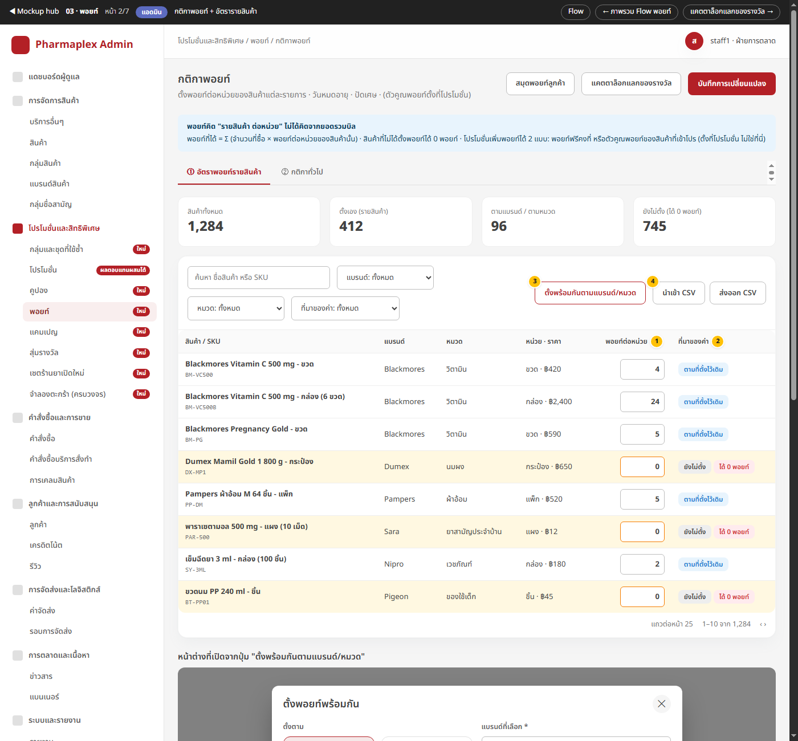

**คำอธิบายแต่ละส่วนในหน้าจอ**

1. พอยท์ต่อหน่วย (แก้ในตารางได้ตรง ๆ): จำนวนเต็ม ≥ 0 · ใส่ 0 = สินค้านี้ไม่ได้พอยท์ (แถวขึ้นสีเหลืองและมีป้าย "ไม่ได้พอยท์") · เปลี่ยนแล้วแถวขึ้นสถานะ "ยังไม่บันทึก" จนกด "บันทึกการเปลี่ยนแปลง"
2. ที่มาของค่า: ตั้งเอง (รายสินค้า) > ตามแบรนด์ > ตามหมวด > ยังไม่ตั้ง (= 0 พอยท์ ไม่มีค่าเริ่มต้น) — ค่าที่เฉพาะเจาะจงกว่าชนะ · กดชิปเพื่อล้างค่าที่ตั้งเอง
3. ตั้งพร้อมกันตามแบรนด์/หมวด: เลือกกลุ่ม + ค่า + วิธีใช้ แล้วระบบบอกจำนวน SKU ที่จะถูกเปลี่ยนก่อนกดนำไปใช้ · แนะนำให้ "ไม่ทับที่ตั้งเอง"
4. นำเข้า/ส่งออก CSV: คอลัมน์ sku, points_per_unit · นำเข้าแล้วแสดงสรุป "สำเร็จ X / ข้าม Y (SKU ไม่พบ, ค่าไม่ใช่จำนวนเต็ม)" ก่อนยืนยันจริง
6. ปัดเศษ: ตัวคูณจากโปรโมชั่น (เช่น ×1.5) ทำให้เกิดทศนิยมได้ ระบบปัดที่ระดับบรรทัดสินค้า หลังคูณตัวคูณ ผลรวมที่ลูกค้าเห็นจึงเท่ากับยอดที่ได้จริง
7. วันหมดอายุตั้งต่อโปรโมชั่น: มีนโยบายเริ่มต้นไว้ 1 ค่า แต่แต่ละโปรโมชั่นที่แจกพอยท์ override ได้ที่หน้าโปรโมชั่น — ตารางนี้แสดงผลที่ใช้จริงเพื่อให้ตรวจได้ที่เดียว
8. ยกเลิกออเดอร์ → หักคืนเสมอ: ไม่มีตัวเลือกเปิด/ปิด · หักพอยท์และยอดสะสมคืนตามฟิลด์ที่เก็บไว้ที่รายการสินค้าในออเดอร์ · บันทึกเป็นรายการ "หักคืน" อ้างเลขออเดอร์ในสมุดพอยท์ (ดูหน้า 03)
10. ใครได้รับพอยท์ ค่าเริ่มต้น “ทุกคน” · เลือก “บางคน” เมื่อพอยท์เปิดเฉพาะบางกลุ่ม (เช่น ร้านสัญญา) — ใช้กลุ่มลูกค้าเดียวกับโปรโมชั่นและคูปอง · ใครแลกของรางวัลได้ตั้งแยกต่อรายการในแคตตาล็อกแลก
15. การชำระด้วยพอยท์ (เปิด/ปิดทั้งระบบ) สวิตช์เดียวควบคุมว่าลูกค้าใช้พอยท์ชำระในตะกร้าได้หรือไม่ — ปิดแล้วการ์ด "ใช้พอยท์ชำระ" ในตะกร้าเป็นสถานะ "ปิดใช้งาน" แต่การสะสมและการแลกของรางวัลไม่กระทบ · ตั้งอัตราแปลง (1 พอยท์ = กี่บาท) และเพดาน % ของยอดสินค้าได้ที่การ์ดเดียวกัน · การห้ามใช้พอยท์ชำระกับโปร/คูปองบางใบยังตั้งที่ตัวโปร/คูปองได้เหมือนเดิม

**กติกา / ข้อยกเว้น / สถานะ**

- อัตราพอยท์ที่เปลี่ยน มีผลกับออเดอร์ที่ ชำระเงินสำเร็จหลังบันทึก เท่านั้น — พอยท์ที่ให้ไปแล้วไม่ถูกคำนวณย้อนหลัง
- ตัวคูณของโปรโมชั่นคิดเฉพาะสินค้าที่เข้าเงื่อนไขโปรนั้น; ถ้าสินค้าได้ 0 พอยท์ ตัวคูณไม่มีผล (0 × n = 0) — แต่พอยท์ฟรีคงที่ของโปรยังได้
- ของแถมจากโปรโมชั่นไม่ให้พอยท์ (ไม่ได้ซื้อ) · สินค้าที่เกิดจากการแลกพอยท์ก็ไม่ให้พอยท์
- ช่องพอยท์ต่อหน่วยรับเฉพาะจำนวนเต็ม; ถ้าแก้ค่าที่มาจากแบรนด์/หมวดในตาราง ที่มาจะเปลี่ยนเป็น "ตั้งเอง"
- ผู้ที่แก้ได้: ฝ่ายการตลาดที่มีสิทธิ์ "จัดการพอยท์" · ทุกการแก้อัตราบันทึก audit (ค่าเดิม → ค่าใหม่, ใคร, เมื่อไหร่)

**ข้อที่ต้องตัดสินใจกับลูกค้า**

- ใช้อัตราตามยอดบิลแทนได้ไหม (เช่น ทุก ฿100 ได้ 10 พอยท์ แบบต้นแบบสถิต admin.html เดิม) — spec ที่อนุมัติคิดรายสินค้า มอคอัพจึงยึดรายสินค้าเป็นหลัก สินค้าที่ไม่ได้ตั้ง = 0 พอยท์
- ลำดับความสำคัญ แบรนด์ vs หมวด เมื่อขัดกัน (มอคอัพ: แบรนด์ชนะ)
- วันหมดอายุที่ override ต่อโปรโมชั่น ใช้กับ "เฉพาะพอยท์ส่วนเพิ่มจากตัวคูณ" (มอคอัพ) หรือกับพอยท์ทั้งออเดอร์ในช่วงแคมเปญ
- ปัดเศษทิ้ง/ใกล้เคียง/ขึ้น และปัดรายบรรทัดหรือทั้งออเดอร์ (มอคอัพ: ปัดทิ้ง รายบรรทัด)

#### แอดมิน · แคตตาล็อกแลกของรางวัล

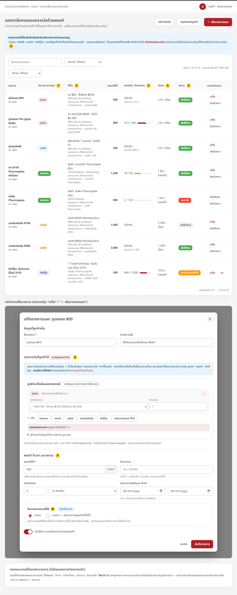

**เพิ่ม/เปลี่ยนในรอบนี้**

- ของรางวัลของแต่ละรายการแลกตั้งด้วย component ผลตอบแทนตรงในรายการ ไม่ต้องเลือก “ชุดของรางวัล” อีก (เพิ่มได้หลายอย่าง หรือรางวัลเดียวก็ได้)

**คำอธิบายแต่ละส่วนในหน้าจอ**

1. ประเภท: คูปอง / ของแถม / พอยท์ / เครดิต / สิทธิ์ลุ้น / ของนอก POS — อ่านอัตโนมัติจากรายการผลตอบแทนที่ตั้งในรายการแลก (ผสมหลายป้ายได้)
2. ได้รับ: สรุปสั้นของสิ่งที่ลูกค้าจะได้ (สร้างอัตโนมัติจากฟิลด์ในรายการ) เพื่อให้แอดมินเห็นผลโดยไม่ต้องเปิดแก้ไข
3. คงเหลือ / โควตารวม: ลดลงทันทีที่มีคนแลก · เหลือ 0 → สถานะอัตโนมัติเป็น "หมดแล้ว" และลูกค้ากดไม่ได้ · เติมโควตาได้ภายหลัง · ของแถมใช้สต็อกที่จัดสรรเป็นโควตา
4. ต่อคน: จำกัดจำนวนครั้งต่อลูกค้า 1 บัญชี รายเดือน/รายปี/ตลอดไป — ว่าง = ไม่จำกัด · ตรวจที่ฝั่งเซิร์ฟเวอร์ตอนกดแลก
5. สถานะ: เปิดใช้งาน / ปิดชั่วคราว (ซ่อนจากลูกค้า) / หมดแล้ว / รอเปิด (ตามช่วงเวลา) · ปิดชั่วคราวไม่กระทบสิทธิ์ที่ลูกค้าแลกไปแล้ว
6. ผลตอบแทนตั้งต่อรายการ: ใช้ component เดียวกับทุกโมดูล (ของแถม SKU เลือกจากสินค้าในระบบ · พอยท์กำหนดจำนวน · คูปองเลือกจากที่มี · เครดิตเงินคืน · สิทธิ์ลุ้นเลือกกิจกรรม · ของนอก POS พิมพ์ข้อความ) เพิ่ม/ลบ/แก้ได้จริง เก็บตามรายการแลก · รายการที่มีคนแลกแล้วแก้ผลตอบแทน = มีผลกับการแลกครั้งถัดไปเท่านั้น
7. สรุปผลตอบแทน: แถบสีใต้ component สรุปว่าลูกค้าจะได้อะไรบ้าง และดูโครงสร้างข้อมูลที่เก็บ (reward_group + source_module) ได้ · ของแถมจริง: สต็อกที่จัดสรรให้การแลกคือ “โควตารวม” ของรายการนี้
8. ของจริงเข้าคิวเดียวกับแคมเปญ: ลูกค้ากรอกที่อยู่แล้วทีมหลังบ้านจัดการต่อในคิวคำขอรับรางวัล — ไม่ต้องมีคิวแยกสำหรับพอยท์
9. พอยท์ที่ใช้: เป็นจำนวนเต็ม > 0 · แก้ได้ตลอด มีผลกับการแลกครั้งถัดไป · ระบบเตือนถ้าตั้งต่ำกว่ามูลค่าของรางวัลจริงมากผิดปกติ
10. ใครแลกได้ ตัวเลือกกลุ่มเป้าหมายเดียวกับทุกหน้า (ทุกคน / บางคน = กลุ่มลูกค้าที่ตั้งไว้) ต่อรายการแลก — เช่น ของพรีเมียมเฉพาะร้าน VIP · ลูกค้านอกกลุ่มไม่เห็นรายการในหน้าแลก

**กติกา / ข้อยกเว้น / สถานะ**

- ลบรายการที่เคยมีคนแลกแล้วไม่ได้ — ทำได้เพียง "ปิดชั่วคราว" (เก็บประวัติไว้ตรวจย้อนหลัง) ; รายการที่ยังไม่เคยมีคนแลกลบได้
- คูปองที่ได้จากการแลกเป็นคูปองออนไลน์ธรรมดาใบหนึ่ง (ผูกบัญชีลูกค้า ใช้ได้ครั้งเดียว) และใช้ตามกติกาคูปองทุกประการ
- แลกสิทธิ์ลุ้นได้เฉพาะเมื่อกิจกรรมปลายทางเปิดอยู่ — ถ้ากิจกรรมปิด รายการจะแสดง "รอเปิด" และกดไม่ได้
- ลูกค้าที่แลกเกินโควตาพร้อมกันหลายคน: ระบบตัดตามลำดับเวลาที่ชำระ ผู้ที่ช้ากว่าเห็นข้อความ "หมดแล้ว" และพอยท์ไม่ถูกหัก

**ข้อที่ต้องตัดสินใจกับลูกค้า**

- เครดิตเงินคืนใช้ร่วมกับคูปอง/โปรโมชั่นในบิลเดียวกันได้หรือไม่ และมีอายุหรือไม่ (มอคอัพ: 90 วัน)
- สิทธิ์ลุ้นที่แลกด้วยพอยท์นับเข้ากองทุนงบสุ่มรางวัลอย่างไร (กิจกรรมสุ่มรางวัลเป็นระยะถัดไป)
- ของพรีเมียมที่ส่งไม่ได้/สต็อกจริงหมด หลังลูกค้าแลกแล้ว: คืนพอยท์ให้อัตโนมัติ หรือให้แอดมินตัดสินใจรายกรณี

#### แอดมิน · สมุดพอยท์ลูกค้า + ปรับพอยท์

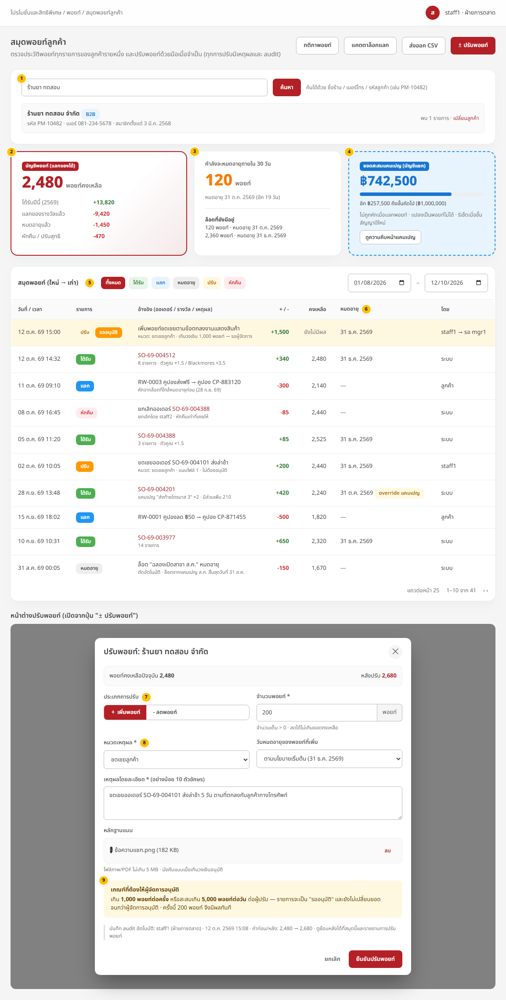

**คำอธิบายแต่ละส่วนในหน้าจอ**

1. ค้นหาลูกค้า: ชื่อร้าน / เบอร์โทร / รหัสลูกค้า (พิมพ์บางส่วนได้) — พบหลายรายให้เลือกจากรายการ; ไม่พบแสดง "ไม่พบลูกค้า ตรวจสอบรหัสอีกครั้ง"
2. พอยท์คงเหลือ: ยอดรวมทุกล็อตที่ยังไม่หมดอายุ — ตัวเลขนี้คือที่ลูกค้าเห็นและแลกได้ · แสดงสรุปได้รับ/แลก/หมดอายุ/หักคืนของปีปฏิทินปัจจุบันเพื่อใช้กระทบยอด
3. กำลังจะหมดอายุ 30 วัน: รวมล็อตที่หมดอายุภายใน 30 วัน พร้อมแจกแจงล็อต — ใช้ตอบลูกค้าที่โทรถามว่า "ทำไมพอยท์หาย"
4. ยอดสะสมแคมเปญ (บัญชีแยก): แสดงให้เห็นแต่ปรับจากหน้านี้ไม่ได้ — ไม่ถูกหักเมื่อแลกพอยท์ และไม่ใช่ส่วนหนึ่งของพอยท์คงเหลือ (สีและกรอบต่างกันตั้งใจ)
5. ประเภทรายการ: ได้รับ / แลก / หมดอายุ / ปรับ / หักคืน — กรองตามประเภทและช่วงวันที่ได้ · รายการอ้างอิงเลขออเดอร์หรือรหัสรางวัลคลิกเข้าดูได้
6. หมดอายุ (ต่อล็อต): แต่ละรายการ "ได้รับ" ผูกวันหมดอายุของตัวเอง (ตามรอบ/แคมเปญ) · รายการ override จากแคมเปญมีป้ายกำกับ
7. ปรับพอยท์ เพิ่ม/ลด: ลดได้ไม่เกินยอดคงเหลือ · แสดง "หลังปรับ" สดขณะกรอก เพื่อกันกรอกผิดจำนวน
8. เหตุผลบังคับ: เลือกหมวด + ใส่รายละเอียดอย่างน้อย 10 ตัวอักษร ปุ่มยืนยันกดไม่ได้จนกว่าจะครบ · หลักฐานแนบเป็นภาพ/PDF
9. อนุมัติและ audit: เกินวงเงินต้องให้ผู้จัดการอนุมัติ (แถวสีเหลืองในสมุด) · ทุกการปรับบันทึกผู้ทำ เวลา ค่าก่อน/หลัง เหตุผล หลักฐาน และแก้ไข/ลบย้อนหลังไม่ได้

**กติกา / ข้อยกเว้น / สถานะ**

- สมุดพอยท์เป็นแบบ append-only — แก้ผิดต้องปรับกลับด้วยรายการใหม่ ไม่แก้/ลบรายการเดิม
- รายการ "หักคืน" จากการยกเลิกออเดอร์ หักได้เท่าที่คงเหลือ ถ้าลูกค้าแลกไปแล้ว ส่วนที่ขาดไม่ตามเรียกคืน (ไม่ทำให้ติดลบ)
- ผู้ปรับกับผู้อนุมัติต้องเป็นคนละคน · ผู้จัดการอนุมัติ/ปฏิเสธพร้อมหมายเหตุ ปฏิเสธแล้วไม่เปลี่ยนยอด
- การแลกที่ลูกค้ากดผิด: แอดมินแก้ได้ด้วยการปรับ "แลกผิดพลาด" (+) และต้องยกเลิกสิทธิ์ที่ออกไปเองด้วย (เช่น คูปองในกระเป๋า)
- สิทธิ์เข้าหน้านี้: ฝ่ายการตลาด (ดู) · ผู้จัดการ (ดู + อนุมัติ) · ผู้ปรับต้องมีสิทธิ์ "ปรับพอยท์"

**ข้อที่ต้องตัดสินใจกับลูกค้า**

- วงเงินที่ต้องอนุมัติ: ต่อครั้ง 1,000 พอยท์ / ต่อวัน 5,000 พอยท์ (ค่าสมมุติ) — หรือกำหนดเป็นมูลค่า ฿ แทน
- แอดมินปรับ "ยอดสะสมแคมเปญ" ได้หรือไม่ (มอคอัพ: ปรับไม่ได้จากหน้านี้ ต้องทำที่ความคืบหน้าแคมเปญ)

#### ลูกค้า · พอยท์ของฉัน + ประวัติ

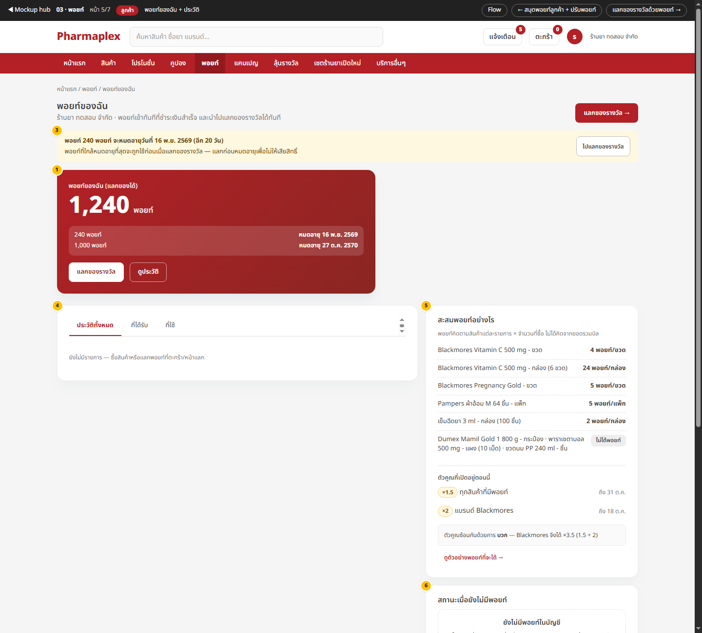

**คำอธิบายแต่ละส่วนในหน้าจอ**

1. การ์ดพอยท์: ตัวเลขใหญ่ = พอยท์ที่แลกได้ตอนนี้ (รวมทุกล็อตที่ยังไม่หมดอายุ) · แจกแจงล็อตตามวันหมดอายุ เรียงใกล้หมดก่อน · ไม่แสดงมูลค่าเป็นบาท
2. ยอดสะสมแคมเปญ (บัญชีแยก): เป็นการ์ดคนละสี กรอบประ มีป้ายกำกับชัดเจน และคำอธิบายว่าไม่ถูกหักเมื่อแลกพอยท์ — ป้องกันลูกค้าสับสนว่าแลกของแล้วยอดแคมเปญจะลด
3. แถบเตือนใกล้หมดอายุ: ขึ้นเมื่อมีล็อตหมดอายุภายใน 30 วัน (≤7 วันเปลี่ยนเป็นสีแดง) · แสดงบนเว็บเท่านั้น ไม่ส่ง SMS/อีเมล/LINE · ปิดแถบไม่ได้จนกว่าจะแลกหรือพอยท์หมด
4. แท็บ ประวัติ / ที่ได้รับ / ที่ใช้: "ประวัติ" รวมทุกอย่างเรียงใหม่ → เก่า · "ที่ได้รับ" เฉพาะรายการ + · "ที่ใช้" เฉพาะการแลก พร้อมลิงก์ไปดูสิทธิ์ที่ได้ (คูปอง/คำขอรับของ)
5. วิธีสะสม: อัตราตัวอย่างดึงจากสินค้าขายดี + ตัวคูณที่ active ตอนนี้พร้อมวันสิ้นสุด และบอกชัดว่าซ้อนกันด้วยการบวก — ลิงก์ไปหน้าตัวอย่างพอยท์ที่จะได้
6. สถานะว่าง: ลูกค้าใหม่หรือพอยท์ 0 เห็นการ์ดนี้แทนรายการ · ปุ่มแลกของรางวัลยังกดเข้าได้แต่ทุกรายการเป็น "พอยท์ไม่พอ"

**กติกา / ข้อยกเว้น / สถานะ**

- รายการ "หักคืน" แสดงเลขออเดอร์ที่ถูกยกเลิก · ถ้ายอดไม่พอหักจะหักเท่าที่มี ไม่ทำให้พอยท์ติดลบ
- รายการ "ทีมงานปรับพอยท์" แสดงเหตุผลสั้น ๆ ให้ลูกค้าเห็น (รายละเอียด/หลักฐานเห็นเฉพาะแอดมิน)
- แลกของ: หักจากล็อตที่ใกล้หมดอายุก่อน · พอยท์ที่หมดอายุแล้วขอคืนไม่ได้
- ลูกค้าหลายผู้ใช้ในร้านเดียวกัน (บัญชีร้าน) ใช้ยอดพอยท์ร่วมกันทั้งร้าน

**ข้อที่ต้องตัดสินใจกับลูกค้า**

- พอยท์เป็นของ "บัญชีร้าน" ทั้งร้านหรือรายผู้ใช้ (มอคอัพ: ทั้งร้าน)
- จะแสดงเตือนหมดอายุที่หน้าอื่น (หน้าแรก/ตะกร้า) ด้วยหรือเฉพาะหน้านี้และหน้าแลกของรางวัล

#### ลูกค้า · แลกของรางวัลด้วยพอยท์

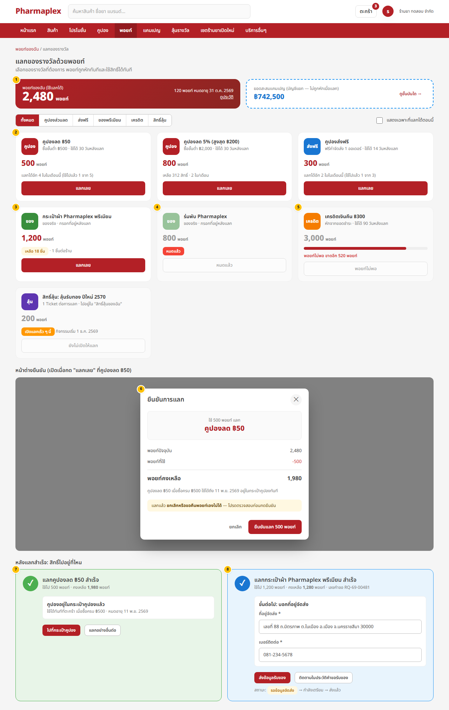

**คำอธิบายแต่ละส่วนในหน้าจอ**

1. แสดงยอดสองบัญชีแยกกัน: พอยท์ (แดง ใช้จ่ายได้) กับยอดสะสมแคมเปญ (กรอบประ น้ำเงิน ไม่ถูกหัก) — เพื่อไม่ให้ลูกค้าคิดว่าแลกของแล้วยอดแคมเปญลด
2. การ์ดที่แลกได้: ชื่อ + รายละเอียดสั้น (ขั้นต่ำ/อายุ) + พอยท์ที่ใช้ + สิทธิ์ที่เหลือของตัวเองในเดือน/ปี (ตามที่ตั้ง "ต่อคน") · ปุ่ม "แลกเลย" เปิดหน้าต่างยืนยัน ไม่แลกทันที
3. ใกล้หมดสต็อก: เหลือน้อยกว่า 20% ของโควตาแสดงป้ายเหลือกี่ชิ้น เพื่อกระตุ้นการตัดสินใจ — ไม่แสดงจำนวนเมื่อไม่จำกัด
4. หมดแล้ว: โควตารวมเป็น 0 — การ์ดจางลง ปุ่มกดไม่ได้ · ไม่ซ่อนเพื่อให้ลูกค้ารู้ว่ารายการนี้มีอยู่ (แอดมินเติมโควตาแล้วกลับมาแลกได้)
5. พอยท์ไม่พอ: บอกส่วนที่ขาด (3,000 − 2,480 = 520) และแถบความคืบหน้า · ปุ่มถูกปิด ไม่ใช่ซ่อน
6. ยืนยันก่อนแลก: แสดงพอยท์ก่อน/หลัง และข้อความเตือนว่ายกเลิกไม่ได้ · ปุ่มยืนยันมีจำนวนพอยท์กำกับ · ถ้าพอยท์เปลี่ยนระหว่างนั้น (เช่น หมดอายุ) ระบบตรวจซ้ำที่เซิร์ฟเวอร์
7. คูปอง/ส่งฟรี/เครดิต/สิทธิ์ลุ้น ได้ทันที: แสดงว่าสิทธิ์ไปอยู่ที่ไหน (กระเป๋าคูปอง / ยอดเครดิต / Tickets) พร้อมปุ่มพาไปใช้
8. ของพรีเมียม: สร้างคำขอเข้าคิวเดียวกับรางวัลแคมเปญ ลูกค้ากรอกที่อยู่/เบอร์ทันทีหรือกลับมากรอกทีหลังได้ — ติดตามสถานะในประวัติคำขอรับของ

**กติกา / ข้อยกเว้น / สถานะ**

- กดแลกซ้ำ/สองแท็บพร้อมกัน: ระบบหักและออกสิทธิ์ครั้งเดียว (idempotent) · แลกไม่สำเร็จ (โควตาหมดพอดี) ไม่หักพอยท์และแจ้ง "รายการนี้หมดแล้ว"
- คูปองลดที่แลกแล้วอายุนับจากวันที่แลก · เครดิตหักจากยอดชำระออเดอร์ถัดไปโดยอัตโนมัติ (ผู้ใช้เลือกไม่ใช้ได้)
- ถ้าแอดมินปิดรายการหลังลูกค้าเปิดหน้านี้ไว้ กดแลกแล้วจะแจ้ง "รายการนี้ไม่เปิดให้แลกแล้ว" โดยไม่หักพอยท์
- ของพรีเมียมที่ยังไม่กรอกที่อยู่ภายใน 14 วัน: ระบบเตือนบนเว็บ ไม่ยกเลิกสิทธิ์เอง

**ข้อที่ต้องตัดสินใจกับลูกค้า**

- ให้แลกของพรีเมียมแล้ว "ขอคืนพอยท์" ได้หากยังไม่ได้เริ่มจัดเตรียม หรือไม่ให้คืนเลย (มอคอัพ: ไม่ให้คืนเอง ต้องผ่านแอดมิน)
- ลูกค้าบัญชีร้านที่มีหลายผู้ใช้: ใครแลกได้บ้าง (เจ้าของร้านเท่านั้น หรือทุกผู้ใช้)

#### ลูกค้า · พอยท์ที่จะได้ (สินค้า/ตะกร้า/หลังชำระ)

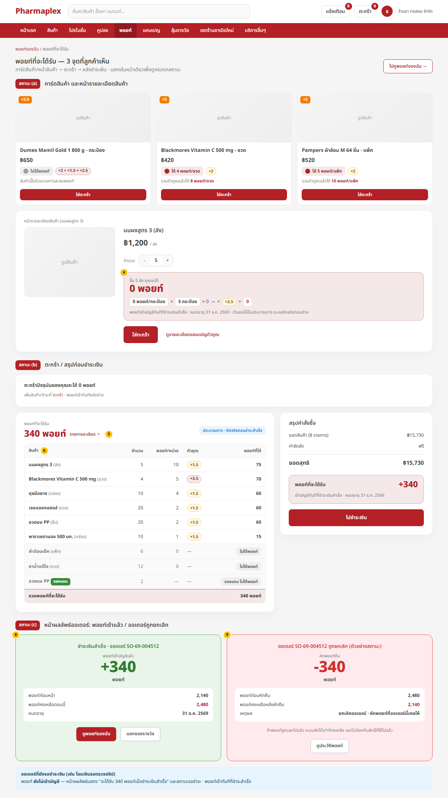

**คำอธิบายแต่ละส่วนในหน้าจอ**

1. ป้ายพอยท์บนการ์ดสินค้า: "ได้ N พอยท์/หน่วย" ตามหน่วยที่ขาย (ลัง/ขวด) + ป้ายตัวคูณแคมเปญพร้อมวันสิ้นสุด · บรรทัดล่างบอกยอดรวมตัวคูณต่อหน่วย — ตัวเลขที่ลูกค้าตัดสินใจจริง
2. ตัวคูณซ้อนกัน: แสดง "×1.5 + ×2 = ×3.5" ให้เห็นที่มา ไม่ใช่แค่ผลรวม · ป้ายบนรูปแสดงวันสิ้นสุดที่ใกล้ที่สุด (18 ต.ค.)
3. สินค้า 0 พอยท์: ป้ายเทา "ไม่ได้พอยท์" แทนที่จะซ่อน — ลูกค้าจะได้ไม่เข้าใจผิดว่าลืมให้พอยท์ · ไม่แสดงป้ายตัวคูณ
4. กล่องคำนวณหน้ารายละเอียด: เปลี่ยนตามจำนวนสด · แสดงสูตร พอยท์/หน่วย × จำนวน × ตัวคูณ · มีวันหมดอายุของพอยท์และข้อความว่าเป็นประมาณการ
5. สรุปในตะกร้า: ยอด "พอยท์ที่จะได้รับ" รวมอยู่ใกล้ยอดสุทธิ + ลิงก์ "รายการละเอียด ▾" ขยาย/ยุบได้ (ค่าเริ่มต้นยุบบนมือถือ)
6. รายการละเอียดรายบรรทัด: จำนวน × พอยท์/หน่วย × ตัวคูณ = พอยท์ · บรรทัด 0 พอยท์ใช้แถวสีเทา + เหตุผล (ไม่ได้พอยท์ / ของแถม) · ผลรวมต้องเท่ากับตัวเลขหัวตาราง
8. หลังชำระสำเร็จ: แสดง +พอยท์ ยอดก่อน/หลัง และวันหมดอายุ ทันทีในหน้าผลลัพธ์ · ปุ่มไปหน้าพอยท์ของฉัน และแลกของรางวัล
9. ออเดอร์ถูกยกเลิก: แสดง "หักพอยท์คืน −N" สีแดง ในหน้าสถานะออเดอร์และในประวัติพอยท์ · ตามนโยบายยกเลิกออเดอร์ที่แอดมินเปิดไว้

**กติกา / ข้อยกเว้น / สถานะ**

- ตัวเลขก่อนชำระเป็นประมาณการ — ยอดจริงคิดที่เซิร์ฟเวอร์ตอนชำระสำเร็จ โดยใช้อัตราและตัวคูณ ณ เวลานั้น (ถ้าตัวคูณหมดอายุระหว่างตะกร้า ยอดจะลดและแจ้งเตือนที่หน้าชำระเงิน)
- ปัดเศษทุกบรรทัดตามกติกาแอดมิน (ปัดทิ้ง) ก่อนรวม — ทศนิยม เช่น 17.5 พอยท์/ขวด จึงแสดงเป็นจำนวนเต็มเมื่อคูณจำนวนแล้ว
- ของแถม/สินค้าที่ได้จากการแลกพอยท์ไม่ให้พอยท์ · ส่วนลดและคูปองไม่ลดพอยท์ เพราะคิดจากสินค้าต่อหน่วย (ดูข้อที่ต้องตัดสินใจ)
- ลูกค้าเห็นพอยท์ที่จะได้เฉพาะสินค้าที่ตัวเองสั่งได้ · แสดงค่าเดียวกันทั้งการ์ด หน้ารายละเอียด ตะกร้า และหน้าผลลัพธ์

**ข้อที่ต้องตัดสินใจกับลูกค้า**

- พอยท์ต้องลดตามส่วนลด/คูปองที่ใช้ในบิลหรือไม่ (มอคอัพ: ไม่ลด เพราะคิดต่อหน่วยตามสเปก)
- การคืนสินค้าบางรายการ (ไม่ใช่ยกเลิกทั้งออเดอร์): หักพอยท์ตามสัดส่วนสินค้าที่คืนหรือไม่หัก (สเปกกล่าวถึงเฉพาะการยกเลิกออเดอร์)

#### โมดูลแคมเปญ

#### ภาพรวม · ภาพรวม Flow แคมเปญ

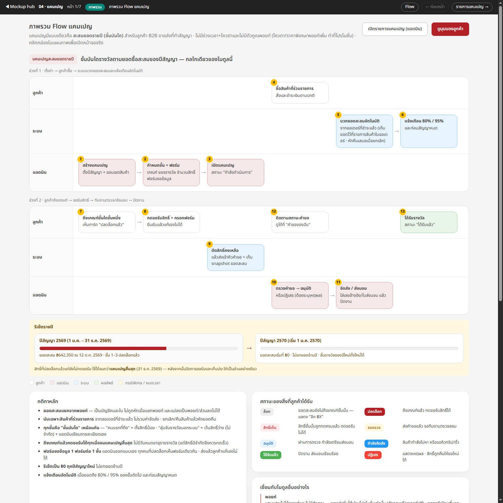


**คำอธิบายแต่ละส่วนในหน้าจอ**

1. สร้างแคมเปญ — ปุ่ม "＋ สร้างแคมเปญ" พาไปฟอร์มสะสมยอดรายปีโดยตรง (แคมเปญมีแบบเดียว ไม่มีให้เลือกประเภท)
2. กำหนดขั้น + ฟอร์ม — เรียงขั้นตามยอดเกณฑ์อัตโนมัติ · แต่ละขั้นมีฟอร์มขอข้อมูลของตัวเองได้ 1 ฟอร์ม · ขั้นที่ไม่มีฟอร์มกดรับได้ทันที (อนุมัติอัตโนมัติ)
3. เปิดแคมเปญ — บันทึกเป็น "ร่าง" ได้ ยังไม่แสดงให้ลูกค้า · เปิดแล้วแก้ยอดเกณฑ์ของขั้นที่มีคนถึงแล้วไม่ได้ (ดูกติกา)
4. ลูกค้าซื้อ — ไม่ต้องทำอะไรเพิ่ม ระบบนับให้เองเฉพาะสินค้าในขอบเขตที่แอดมินตั้ง
5. บวกยอดสะสม — บวกเมื่อสถานะการชำระ = สำเร็จ ไม่รวมค่าส่ง · เก็บยอดที่บวกไว้ที่รายการสินค้าในออเดอร์ (ฟิลด์ยอดสะสมของแคมเปญ) · ยกเลิกออเดอร์ = หักคืนเสมอ ไม่มีตัวเลือก และบันทึกประวัติ
6. แจ้งเตือน — ถึง 80%, 95% ของขั้นถัดไป และก่อนสัญญาหมด N วัน ในเว็บ ส่งครั้งเดียวต่อเหตุการณ์ต่อขั้น
7. ถึงเกณฑ์ — การ์ดขั้นเปลี่ยนเป็น "ปลดล็อกแล้ว" ทันทีหลังชำระเงิน (ไม่ต้องรอรอบคำนวณ)
8. ขอรับสิทธิ์ — เปิดฟอร์มของขั้นนั้น ตรวจ required/รูปแบบก่อนส่ง มีคำเตือนส่งแล้วแก้ไม่ได้
9. ตัดสิทธิ์ — ตัดสิทธิ์คงเหลือทันทีที่ส่งสำเร็จ (กันคนแย่งกัน) และจับ snapshot ยอดสะสม ณ เวลานั้นไว้ให้แอดมินตรวจ
10. ตรวจ/อนุมัติ — ปฏิเสธต้องกรอกเหตุผล แล้วสิทธิ์คืนกลับ ลูกค้าส่งใหม่ได้
11. ส่งมอบ — สินค้า POS ลิงก์ไปรายการจัดส่ง · ของนอก POS ใส่เลขอ้างอิง/แนบใบส่งมอบ (เช่น PNR ตั๋ว)
12. ติดตามสถานะ — ทุกการเปลี่ยนสถานะแจ้งลูกค้าในเว็บ/LINE
13. ได้รับรางวัล — ปิดงานแล้วการ์ดขั้นนั้นเป็น "ได้รับแล้ว" และขอซ้ำไม่ได้

**กติกา / ข้อยกเว้น / สถานะ**

- ยกเลิกออเดอร์ที่เคยนับยอดแล้วทำให้ยอดต่ำกว่าเกณฑ์ที่ลูกค้ากดขอรับไปแล้ว → ระบบไม่ถอนสิทธิ์อัตโนมัติ แต่ขึ้นธงในคำขอให้แอดมินตัดสินใจ
- แคมเปญสิ้นสุด: ปุ่มขอรับสิทธิ์ถูกปิดทุกขั้น คำขอที่ค้างอยู่ยังดำเนินการต่อได้จนปิดงาน
- ลูกค้าที่ไม่มีสัญญาสะสมยอดรายปีไม่เห็นหน้าขั้นบันได

**ข้อที่ต้องตัดสินใจกับลูกค้า**

- ยอดสะสมนับจาก "ยอดสินค้าหลังหักส่วนลดและคูปอง" (ค่าตั้งต้นที่เลือก) หรือก่อนหักส่วนลด?
- ปีสัญญาของแต่ละร้านเริ่ม/จบพร้อมกันทั้งแคมเปญ (ปีปฏิทิน) หรือเริ่มตามวันที่เซ็นสัญญารายร้าน?
- ถ้ายกเลิก/คืนสินค้าหลังขอรับรางวัลไปแล้วจนยอดต่ำกว่าเกณฑ์ ต้องเรียกคืนรางวัลหรือไม่ (ค่าตั้งต้น: ไม่เรียกคืนอัตโนมัติ ให้แอดมินพิจารณา)

#### แอดมิน · รายการแคมเปญ

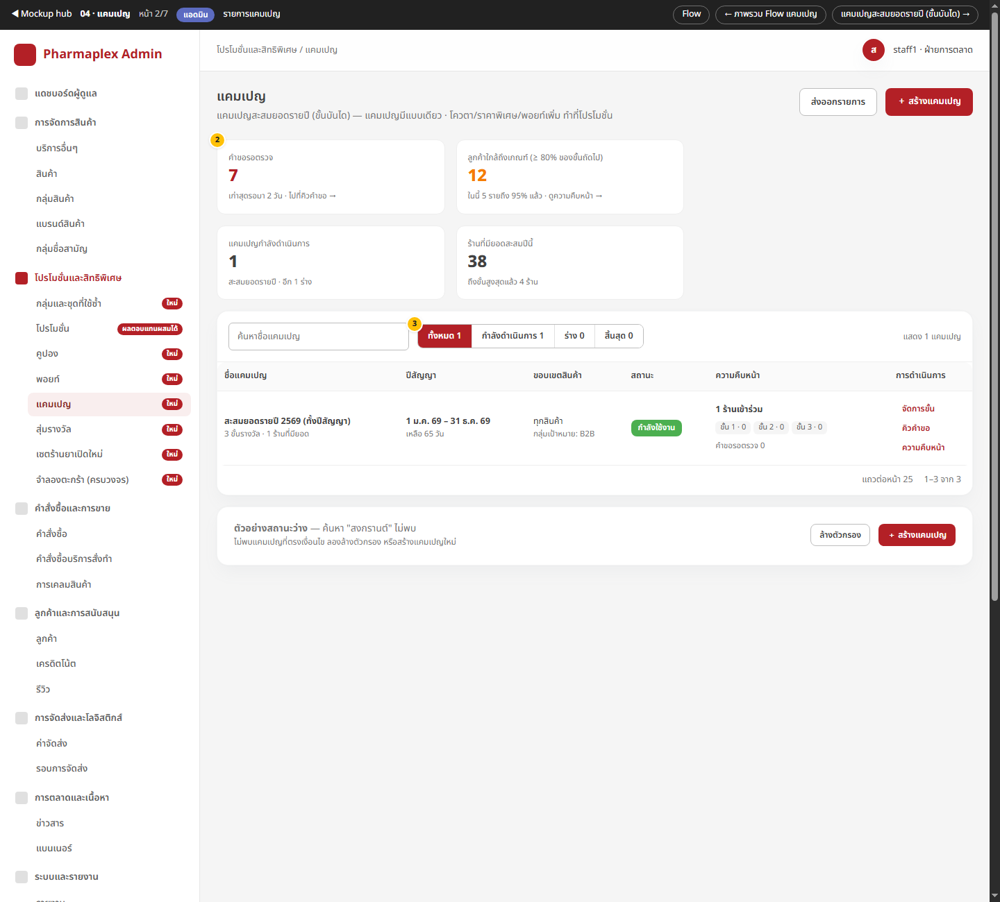

**คำอธิบายแต่ละส่วนในหน้าจอ**

1. ปุ่มสร้างแคมเปญ — พาไปฟอร์มสะสมยอดรายปีโดยตรง ไม่มีให้เลือกประเภท เพราะแคมเปญมีแบบเดียว (โควตา/ราคาพิเศษ/ตัวคูณพอยท์ย้ายไปอยู่ที่โปรโมชั่น)
2. การ์ดสถิติ — "คำขอรอตรวจ" ลิงก์ไปคิวคำขอที่กรองสถานะรอตรวจ · "ใกล้ถึงเกณฑ์" ลิงก์ไปหน้าความคืบหน้าที่กรอง ≥ 80% · ตัวเลขนับรวมทุกแคมเปญที่กำลังดำเนินการ
3. ตัวกรอง — แยกตามสถานะ ค่าเริ่มต้นเรียงแคมเปญที่ "กำลังดำเนินการ" ขึ้นก่อน แล้วร่าง แล้วสิ้นสุด
4. คอลัมน์ความคืบหน้า — จำนวนร้านที่เข้าร่วมและกระจายตามขั้นรางวัล · คำขอรอตรวจ · ใกล้ถึงเกณฑ์

**กติกา / ข้อยกเว้น / สถานะ**

- สถานะ: ร่าง (ลูกค้าไม่เห็น) → กำลังดำเนินการ (เปลี่ยนเองตามวันที่เริ่ม) → สิ้นสุด (เปลี่ยนเองเมื่อพ้นวันสิ้นสุด หรือกด "ปิดก่อนกำหนด")
- แคมเปญที่ สิ้นสุดแล้ว แก้ไขไม่ได้ เหลือเพียง "ดูผลสรุป" และ "ทำสำเนา" · แคมเปญที่กำลังดำเนินการแก้ได้เฉพาะบางช่อง (ดู 02/03)
- ลบได้เฉพาะ "ร่าง" ที่ยังไม่เคยเปิด · แคมเปญที่เคยมียอด/คำขอห้ามลบ
- แคมเปญร่างที่ไม่ผ่านการตรวจ (เช่น ยังไม่กำหนดกลุ่มลูกค้า) แสดงข้อความสีแดงใต้ความคืบหน้า และกด "เปิดใช้" ไม่ได้
- แคมเปญสะสมยอดรายปีเปิดซ้อนกันได้เฉพาะต่างปีสัญญา — ปีสัญญาเดียวกันสร้างซ้ำไม่ได้

**ข้อที่ต้องตัดสินใจกับลูกค้า**

- ยอดสะสมของแต่ละออเดอร์เก็บไว้ที่รายการสินค้าในออเดอร์ — ยกเลิกออเดอร์แล้วหักคืนเสมอ ไม่มีตัวเลือก

#### แอดมิน · แคมเปญสะสมยอดรายปี (ขั้นบันได)

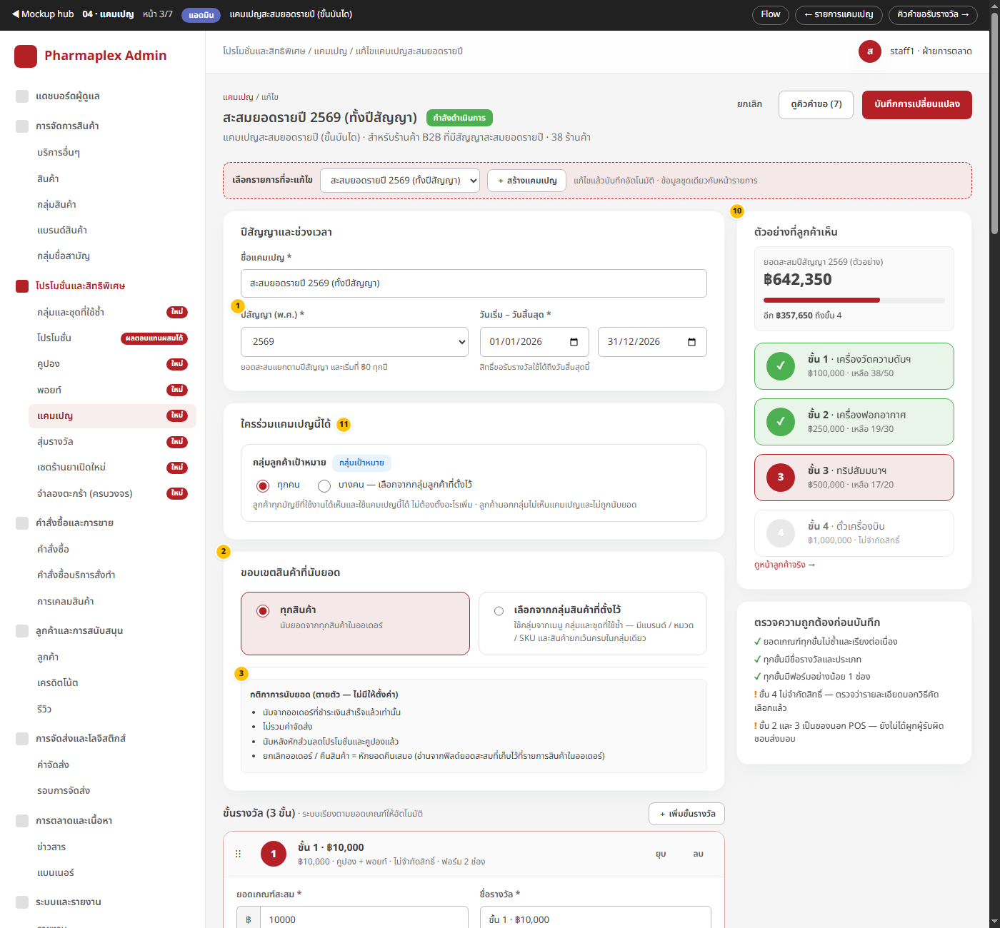

**เพิ่ม/เปลี่ยนในรอบนี้**

- “ประเภทรางวัล” และตัวเลือกชุดของรางวัลของแต่ละขั้น ถูกแทนด้วย component ผลตอบแทนเดียวกับโมดูลอื่น

**คำอธิบายแต่ละส่วนในหน้าจอ**

1. ปีสัญญา + วันเริ่ม/สิ้นสุด — เลือกปี (พ.ศ.) แล้วระบบเติมวันที่ 1 ม.ค. – 31 ธ.ค. ให้ แก้ได้ · ปีสัญญาเดียวกันสร้างแคมเปญซ้ำไม่ได้ · ยอดสะสมของแต่ละปีแยกกัน ไม่ยกข้ามปี
2. ขอบเขตสินค้า — ทุกสินค้า หรือ เลือกจากกลุ่มสินค้าที่ตั้งไว้ (รวม/ยกเว้น) ซึ่งกลุ่มสินค้าหนึ่งกลุ่มมีแบรนด์ หมวด รายสินค้า และสินค้ายกเว้นอยู่แล้ว จึงตัดตัวเลือก “ตามแบรนด์ / ตามหมวด / รายสินค้า” และช่องยกเว้นรายตัวเดิมออก · แสดงจำนวน SKU ที่เข้าขอบเขตสด · เปลี่ยนขอบเขตหลังมีลูกค้าสะสมยอดแล้ว มีผลกับยอดที่นับต่อจากนี้ ไม่คำนวณย้อนหลัง
3. กติกาการนับ — ตายตัว ไม่มีให้ตั้งค่า แสดงเป็นข้อความกำกับ: นับจากออเดอร์ที่ชำระเงินสำเร็จแล้วเท่านั้น · ไม่รวมค่าจัดส่ง · นับหลังหักส่วนลดโปรโมชั่นและคูปองแล้ว · ยกเลิกออเดอร์/คืนสินค้า = หักยอดคืนเสมอ
4. ยอดเกณฑ์สะสม — เป็นยอดรวมสะสมทั้งปี (ไม่ใช่ส่วนต่างจากขั้นก่อน) ต้องไม่ซ้ำกัน · ขั้นที่มีคนถึงแล้วล็อกช่องนี้
5. รางวัลของขั้น เปลี่ยน แทน “ประเภทรางวัล” แบบเลือกอย่างเดียว — ใช้ component ผลตอบแทนเดียวกับทุกโมดูล เพิ่มได้หลายรายการต่อขั้น: ของแถม SKU (เลือกจากสินค้าในระบบ) · พอยท์ · คูปอง · เครดิตเงินคืน · สิทธิ์ลุ้น · ของนอก POS (พิมพ์ข้อความ) · เก็บแยกตามขั้น ติดธง source_module = campaign · แก้ได้จริง ไปลองปลดล็อก/ขอรับที่ สถานะลูกค้าของจำลอง
6. จำนวนสิทธิ์ — เว้นว่าง = ไม่จำกัด · ใส่น้อย = "คนแรกที่ถึง" · ใต้ช่องมีข้อความอธิบายผลต่อลูกค้าเปลี่ยนตามค่าที่กรอก · ลดต่ำกว่าที่ถูกกดไปแล้วไม่ได้
7. ตัวสร้างฟอร์ม — เพิ่มช่องได้ 4 ชนิด (ข้อความ / เบอร์โทร / ตัวเลือก / แนบไฟล์) ตั้งจำเป็น/ไม่จำเป็น และลากเรียงลำดับได้ · ฟอร์มเดียวต่อขั้น ใช้กับทุกคนที่ปลดล็อก · สูงสุด 10 ช่อง · **ถ้าขั้นไหนไม่มีช่องข้อมูลเลย = ลูกค้ากด “รับรางวัล” ได้ทันที** ระบบอนุมัติและส่งรางวัลให้อัตโนมัติ ไม่เข้าคิวตรวจ (เหมาะกับพอยท์ คูปอง เครดิตเงินคืน สิทธิ์ลุ้น) ส่วนรางวัลที่เป็นสิ่งของควรมีฟอร์มที่อยู่จัดส่ง
8. แก้แคมเปญที่เปิดอยู่ — จำกัดสิทธิ์แก้ไขเพื่อไม่ให้ลูกค้าที่ถึงเกณฑ์ไปแล้วเสียสิทธิ์ (ดูกล่องเตือน)
9. การแจ้งเตือน — 80% / 95% ของยอดเกณฑ์ขั้นถัดไป และ N วันก่อนสัญญาหมด · เลือก ในเว็บ / ในเว็บ · ตัวแปรในข้อความใช้ {…} · ลูกค้าที่ปลดล็อกทุกขั้นแล้วไม่ได้รับ 80/95%
10. ตัวอย่างสด — เปลี่ยนค่าทางซ้ายแล้วแผงนี้อัปเดตทันที ใช้ยอดตัวอย่าง ฿642,350 เพื่อให้เห็นทุกสถานะ (ผ่านแล้ว/ขั้นปัจจุบัน/ล็อก)
11. กลุ่มเป้าหมาย + ผลตอบแทน แคมเปญขั้นบันไดใช้ตัวเลือก “ทุกคน / บางคน” เดียวกับทุกหน้า และรางวัลแต่ละขั้นตั้งด้วย component ผลตอบแทนเดียวกับโมดูลอื่น (ผสมได้หลายอย่าง) · ขั้นที่มีลูกค้าถึงแล้วเปลี่ยนรางวัลไม่ได้ ต้องเพิ่มขั้นใหม่

**กติกา / ข้อยกเว้น / สถานะ**

- ทุกขั้นเป็น "ขั้นบันได" รูปแบบเดียวกัน — ไม่มีโหมดพิเศษ "คนแรกที่ถึง" หรือ "จับรางวัล" แยก เป็นเพียงค่าจำนวนสิทธิ์ที่ตั้ง
- ปีสัญญาใหม่: ยอดสะสมของปีก่อนถูกเก็บเป็นประวัติ ไม่รวมในปีใหม่ · คำขอที่ค้างจากปีก่อนยังดำเนินการต่อได้
- ไม่มีวันหมดอายุรายรางวัล — ใช้สิทธิ์ได้จนถึงวันสิ้นสุดแคมเปญ
- ลบขั้นที่ไม่มีใครถึงได้ (ยืนยันก่อนลบ) · ถ้าทุกขั้นถูกลบ ไม่สามารถเปิดแคมเปญได้
- ลูกค้าต้องมีรายชื่อในแคมเปญ (มีสัญญา) จึงเห็นขั้นบันไดและยอดสะสม — จัดการรายชื่อที่หน้าความคืบหน้า

**ข้อที่ต้องตัดสินใจกับลูกค้า**

- ลูกค้าที่ปลดล็อกแล้วแต่ยังไม่กดขอ — ต้องการให้แจ้งเตือนซ้ำก่อนแคมเปญสิ้นสุดหรือไม่ (ค่าตั้งต้น: แจ้งอัตโนมัติ 30 วันและ 7 วันก่อนสิ้นสุด)
- รางวัลประเภทคูปอง/พอยท์ในขั้นบันได — ออกให้ทันทีเมื่อกดขอ (ไม่ผ่านการตรวจ) หรือเข้าคิวให้แอดมินอนุมัติเหมือนรางวัลอื่น (ค่าตั้งต้น: ออกทันที)
- กรณีคืนสินค้าทำให้ยอดต่ำกว่าเกณฑ์หลังขอรับสิทธิ์แล้ว — เรียกคืนรางวัลหรือไม่

#### แอดมิน · คิวคำขอรับรางวัล (ตาราง + popup)

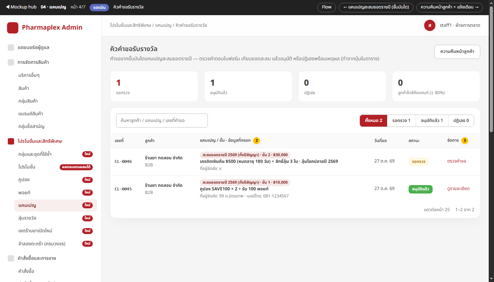

**เพิ่ม/เปลี่ยนในรอบนี้**

- จัดหน้าตามรูปแบบเดียวกับหน้ารายการอื่นของระบบ: การ์ดสรุป + ตารางพร้อมแท็บสถานะ + popup ตรวจคำขอ (เดิมเป็น drawer ที่กดใช้งานไม่ได้)

**คำอธิบายแต่ละส่วนในหน้าจอ**

1. แท็บสถานะ (ทั้งหมด / รอตรวจ / อนุมัติแล้ว / ปฏิเสธ) พร้อมจำนวน และช่องค้นหาลูกค้า/แคมเปญ/เลขที่คำขอ
2. ตาราง: เลขที่ · ลูกค้า · แคมเปญ/ขั้น + รางวัล + ข้อมูลสำคัญที่ลูกค้ากรอก · วันที่ขอ · สถานะ
3. คอลัมน์ “จัดการ”: รอตรวจ → “ตรวจคำขอ” เปิด popup · อนุมัติแล้ว/ปฏิเสธ → “ดูรายละเอียด”
4. popup ตรวจคำขอ: สรุปลูกค้า/ขั้น/รางวัล · ยอดสะสม ณ วันที่ขอ เทียบเกณฑ์ขั้น · คำตอบในฟอร์มทุกช่อง · ประวัติ · ปุ่ม “อนุมัติ” (ส่งรางวัลตาม component ของขั้นนั้น) หรือ “ปฏิเสธ…” (ต้องกรอกเหตุผล สิทธิ์ของขั้นถูกคืน ลูกค้าส่งใหม่ได้)

**กติกา / ข้อยกเว้น / สถานะ**

- สถานะ: รอตรวจ → อนุมัติแล้ว (ส่งรางวัลเข้าบัญชี/คิวรับของของลูกค้า) หรือ ปฏิเสธ (คืนสิทธิ์) · ดำเนินการแล้วแก้ไม่ได้
- คำขอที่ค้างอยู่ยังดำเนินการต่อได้แม้แคมเปญสิ้นสุด · ยกเลิกออเดอร์จนยอดต่ำกว่าเกณฑ์หลังขอรับไปแล้ว: ไม่ถอนสิทธิ์อัตโนมัติ แอดมินตัดสินใจ
- ทุกการกดบันทึกในประวัติของคำขอ (ใคร/เมื่อไร/ทำอะไร)
- การติดตามการส่งมอบหลังอนุมัติ (สถานะกำลังจัดส่ง/เสร็จสิ้น) ทำผ่านรายการจัดส่ง/คิวรับของ ไม่อยู่ในหน้านี้

**ข้อที่ต้องตัดสินใจกับลูกค้า**

- เมื่อปฏิเสธคำขอ ให้คืนสิทธิ์และเปิดให้ส่งใหม่ทุกครั้งหรือไม่ (ค่าตั้งต้น: คืนสิทธิ์)
- ต้องมี SLA ตรวจคำขอ (เช่น 2 วันทำการ) และแจ้งเตือนอัตโนมัติเมื่อค้างเกินกำหนดหรือไม่
- รางวัลนอก POS ที่ต้องทำสัญญา/เอกสารกับบริษัททัวร์ — ใช้ขั้นตอนนอกระบบหรือเพิ่มช่องแนบเอกสารในระบบ

#### แอดมิน · ความคืบหน้าลูกค้า + แจ้งเตือน

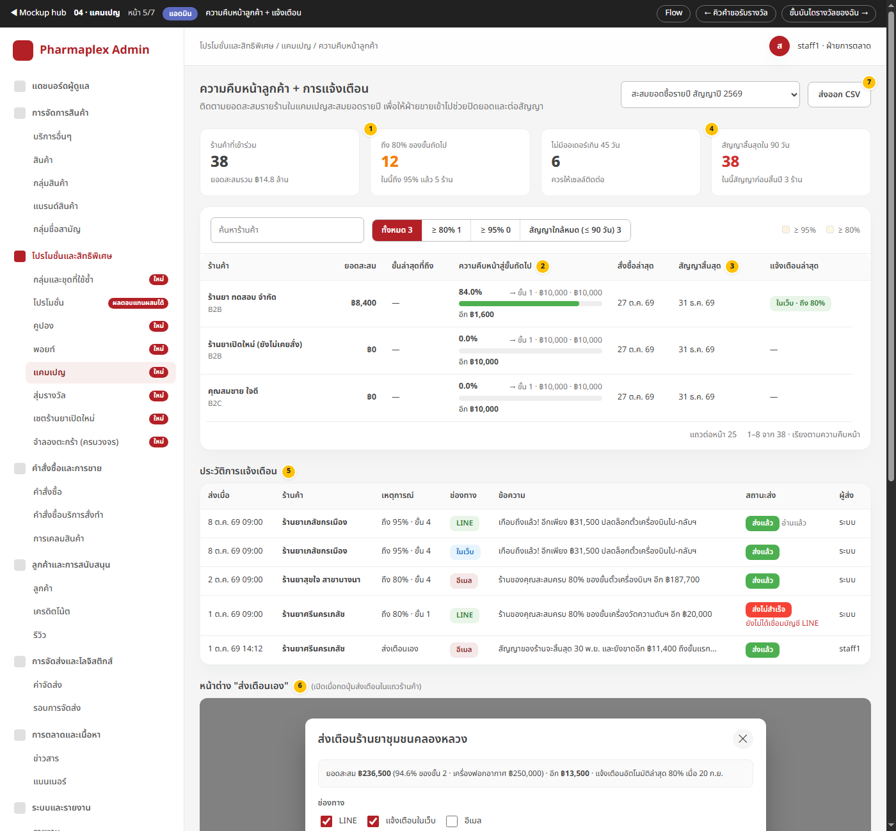

**คำอธิบายแต่ละส่วนในหน้าจอ**

1. การ์ดสรุป — ตัวเลข "ถึง 80%" คลิกกรองตารางเป็นร้านที่ ≥ 80% ได้ · นับเฉพาะร้านที่ยังมีขั้นถัดไปให้ไล่ตาม (ร้านที่ปลดล็อกครบทุกขั้นไม่นับ)
2. ความคืบหน้า — คิด% = ยอดสะสม ÷ ยอดเกณฑ์ของขั้นถัดไป (ไม่ใช่ส่วนต่างระหว่างขั้น) · แถวพื้นส้มอ่อน ≥ 95% / เหลืองอ่อน ≥ 80% · เรียงเริ่มต้นจาก % มากไปน้อย
3. สัญญาสิ้นสุด — แสดงวันที่และจำนวนวันที่เหลือ · ตัวหนาแดงเมื่อเหลือน้อยกว่าที่ตั้งไว้เตือน (30 วัน) หรือสิ้นสุดก่อนสิ้นปีสัญญาของแคมเปญ (ร้านที่เซ็นกลางปี)
4. สัญญาใกล้หมด — กรองร้านที่สัญญาสิ้นสุดใน 90 วัน เพื่อให้เซลล์เข้าไปเจรจาต่อสัญญาปีถัดไป
5. ประวัติแจ้งเตือน — ทุกการส่ง (อัตโนมัติ/ส่งเอง) แยกตามช่องทาง · ส่งไม่สำเร็จเก็บเหตุผล (เช่น ยังไม่เชื่อม LINE) และไม่ retry เกิน 3 ครั้ง
6. ส่งเตือนเอง — แก้ข้อความได้ ส่งซ้ำร้านเดิมได้ไม่เกิน 1 ครั้ง/วัน กันรบกวนลูกค้า · บันทึกชื่อผู้ส่ง
7. ส่งออก CSV — ร้านค้า ยอดสะสม ขั้น % วันสั่งล่าสุด วันสิ้นสุดสัญญา ตามตัวกรองที่เลือก · เฉพาะผู้มีสิทธิ์ดูข้อมูลลูกค้า

**กติกา / ข้อยกเว้น / สถานะ**

- แจ้งเตือนอัตโนมัติส่งครั้งเดียวต่อเหตุการณ์ต่อขั้น — ยอดถูกหักคืนแล้วกลับขึ้นไปอีกครั้งไม่ส่งซ้ำ
- ยอดข้าม 80% และ 95% ในออเดอร์เดียว (กระโดด) → ส่งเฉพาะข้อความ 95% ข้อความเดียว
- ยอดข้ามไปปลดล็อกขั้นถัดไปทันที → ไม่ส่ง 80/95% ของขั้นที่ผ่านไปแล้ว ส่งข้อความ "ปลดล็อกแล้ว" แทน (ระบบ)
- แจ้งเตือนก่อนสัญญาหมดส่งทุกร้านที่ยังไม่ปลดล็อกทุกขั้น ตามจำนวนวันที่ตั้งไว้ใน 03
- ร้านที่ปิดการรับแจ้งเตือนช่องทางใด ระบบข้ามช่องทางนั้นและบันทึกเป็น "ข้าม"

**ข้อที่ต้องตัดสินใจกับลูกค้า**

- ผู้ใช้ฝ่ายขาย (เซลล์) ต้องเห็นเฉพาะร้านที่ตัวเองดูแลหรือเห็นทั้งหมด?
- ควรแจ้งเตือนเมื่อร้านไม่มีออเดอร์เกิน 45 วันหรือไม่ (ตอนนี้เป็นเพียงการเน้นสีในตาราง)

#### ลูกค้า · ขั้นบันไดรางวัลของฉัน

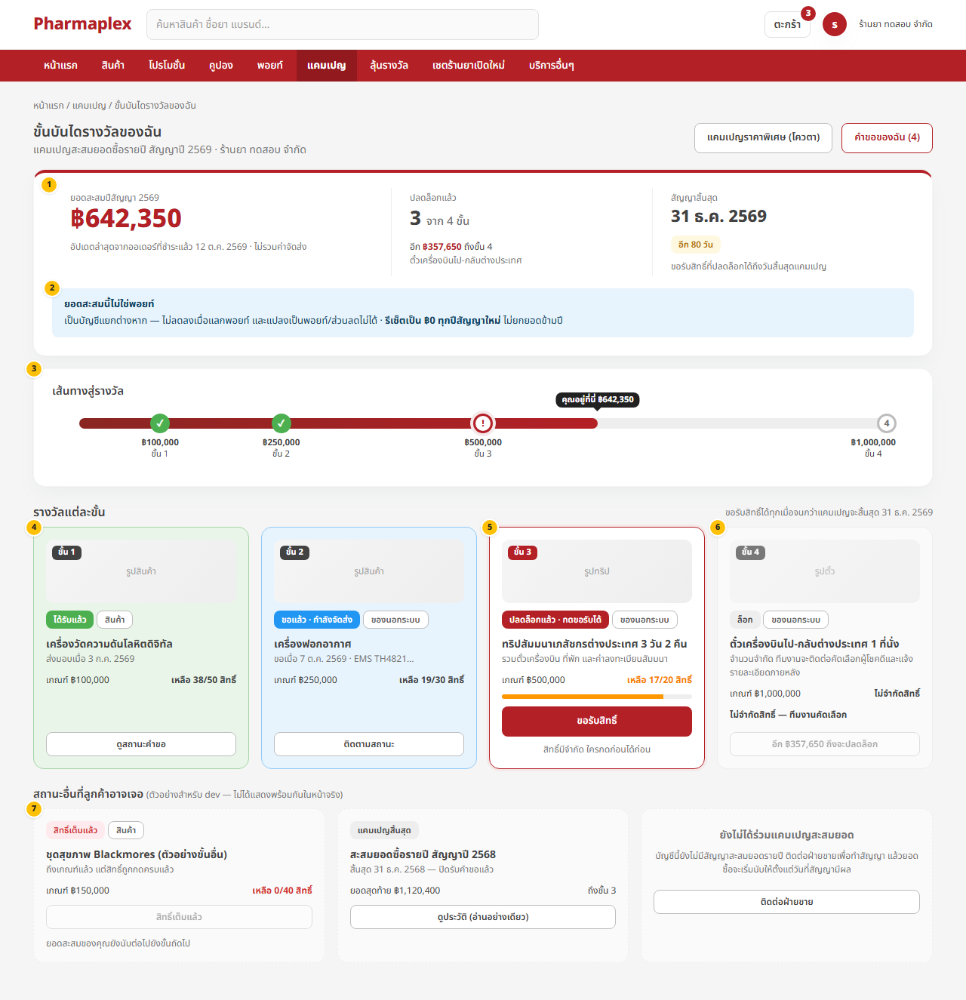

**คำอธิบายแต่ละส่วนในหน้าจอ**

1. การ์ดสรุป — ยอดสะสมของปีสัญญานี้ · จำนวนขั้นที่ปลดล็อก · อีกเท่าไรถึงขั้นถัดไป · วันสิ้นสุดสัญญา (ชิปส้มเมื่อเหลือน้อยกว่าจำนวนวันที่ตั้งเตือน) · ตัวเลขอัปเดตทันทีหลังชำระเงิน
2. ข้อความย้ำ — ต้องเห็นตลอดว่ายอดสะสมไม่ใช่พอยท์ และรีเซ็ตทุกปี เพื่อกันลูกค้าเข้าใจผิดว่าแลกพอยท์แล้วยอดลด
3. เส้นทาง — สเกลตามยอดจริง (ไม่ใช่เว้นระยะเท่ากัน) ป้าย "คุณอยู่ที่นี่" บอกตำแหน่ง · ขั้นที่ผ่านแล้วเป็นเขียว ขั้นที่ปลดล็อกแต่ยังไม่ขอเป็นแดงเน้น
4. การ์ด "ได้รับแล้ว" — ปิดงานแล้ว ปุ่มขอซ้ำหายไป เหลือลิงก์ดูสถานะ · ขอแล้วแต่ยังไม่ปิดงานแสดงสถานะล่าสุดจากคิวคำขอ (รอตรวจ/อนุมัติ/กำลังจัดส่ง)
5. ปลดล็อกกดขอรับได้ — ปุ่มหลักสีแดง · แสดง "เหลือ X/Y สิทธิ์" และแถบเหลือ · สีเหลืองเมื่อสิทธิ์เหลือไม่เกิน 20% · กดแล้วไปฟอร์มของขั้นนี้ (07)
6. ล็อก + ไม่จำกัดสิทธิ์ — ขั้นที่เว้นจำนวนสิทธิ์ว่างแสดง "ไม่จำกัดสิทธิ์ — ทีมงานคัดเลือก" พร้อมรายละเอียดที่แอดมินเขียน · ปุ่มปิดและบอกยอดที่ขาด
7. สิทธิ์เต็ม — ปุ่มกดไม่ได้ แต่ไม่ซ่อนการ์ด เพื่อให้ลูกค้าเข้าใจว่าถึงเกณฑ์แล้วแต่สิทธิ์หมดก่อน (ไม่ใช่ระบบผิดพลาด)

**กติกา / ข้อยกเว้น / สถานะ**

- สถานะการ์ด: ล็อก → ปลดล็อก (กดขอรับได้) → ขอแล้ว (รอตรวจ/อนุมัติ/กำลังจัดส่ง) → ได้รับแล้ว · แยก: สิทธิ์เต็ม, ปฏิเสธ (กลับเป็นปลดล็อกพร้อมเหตุผล)
- ลูกค้าได้ 1 สิทธิ์ต่อ 1 ขั้นต่อปีสัญญา — ขอแล้วขอซ้ำขั้นเดิมไม่ได้ (ถ้าถูกปฏิเสธจึงขอใหม่ได้)
- ถ้ายอดสะสมลดต่ำกว่าเกณฑ์เพราะยกเลิก/คืนสินค้า การ์ดที่ยังไม่ได้ขอกลับเป็น "ล็อก" ทันที
- แคมเปญสิ้นสุด: การ์ดที่ปลดล็อกแล้วแต่ไม่ได้ขอ แสดง "หมดเวลาขอรับสิทธิ์" · ประวัติยังดูได้
- ผู้ใช้ที่ไม่ใช่เจ้าของบัญชี (พนักงานร้าน) ดูได้แต่กดขอรับสิทธิ์ไม่ได้ — ต้องเป็นผู้มีสิทธิ์สั่งซื้อหลัก (ตามสิทธิ์บัญชี B2B เดิม)

**ข้อที่ต้องตัดสินใจกับลูกค้า**

- ต้องการให้ลูกค้าเห็นจำนวนสิทธิ์คงเหลือแบบตัวเลขจริง ("เหลือ 17/20") หรือซ่อนเป็นระดับ (เช่น "ใกล้หมด") เพื่อไม่เปิดเผยจำนวนรางวัล?
- ร้านที่มีหลายสาขา (บัญชีย่อย) ยอดสะสมรวมที่บัญชีหลัก หรือแยกต่อสาขา?

#### ลูกค้า · ฟอร์มรับสิทธิ์ + ประวัติ

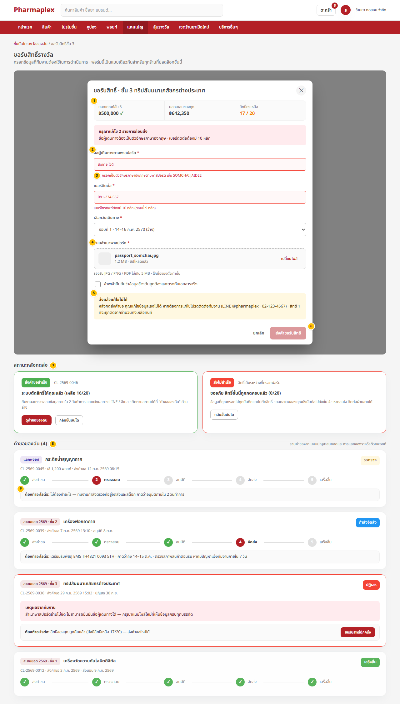

**คำอธิบายแต่ละส่วนในหน้าจอ**

1. สรุปบนหัวฟอร์ม — ยืนยันว่าถึงเกณฑ์จริงและบอกสิทธิ์คงเหลือก่อนกรอก · ถ้าสิทธิ์เหลือน้อยเน้นสีส้ม
2. ช่องกรอก = ฟอร์มที่แอดมินออกแบบ (03) เรียงตามที่ตั้ง ใช้ฟอร์มเดียวกันกับทุกร้านที่ปลดล็อกขั้นนี้ · ช่องจำเป็นมีดอกจันสีแดง · ท้ายฟอร์มระบบเพิ่มช่องติ๊กยืนยันให้เสมอ
3. Validation — ตรวจเมื่อออกจากช่องและตอนกดส่ง ข้อความบอกวิธีแก้พร้อมตัวอย่าง · มีสรุปบนสุด · ไม่ล้างค่าที่กรอก
4. แนบไฟล์ — JPG/PNG/PDF ≤ 5 MB แสดงชื่อไฟล์/ขนาด ขึ้น error ใต้ช่องถ้าชนิดหรือขนาดไม่ผ่าน
5. คำเตือนก่อนส่ง — "ส่งแล้วแก้ไขไม่ได้ ติดต่อทีมงานเท่านั้น" เห็นตลอดเหนือปุ่มส่ง และบอกว่าสิทธิ์จะถูกตัดทันที
6. ปุ่มส่ง — ปิดอยู่จนกว่าจะติ๊กยืนยันและกรอกช่องจำเป็นครบ · กดแล้วปุ่มเป็น loading กันกดซ้ำ
7. ผลหลังกดส่ง — สำเร็จ: แสดงเลขคำขอ + ขั้นตอนต่อไป · สิทธิ์เต็มระหว่างกรอก: ไม่บันทึกอะไรและไม่ตัดสิทธิ์ อธิบายตรงๆ
8. คำขอของฉัน — รวมทุกแหล่ง (แคมเปญ + แลกพอยท์) เรียงใหม่สุดก่อน แต่ละคำขอมี stepper 5 ขั้น
9. "ต้องทำอะไรต่อ" — ข้อความสั้นตามสถานะ: รอตรวจ (ไม่ต้องทำอะไร), กำลังจัดส่ง (เตรียมรับ + เลขพัสดุ), ปฏิเสธ (เหตุผล + ปุ่มขอใหม่), เสร็จสิ้น (ไม่มี)

**กติกา / ข้อยกเว้น / สถานะ**

- ลูกค้าส่งคำขอได้ 1 ครั้งต่อขั้นต่อปีสัญญา ยกเว้นคำขอที่ถูกปฏิเสธ
- ตัดสิทธิ์ตอน "ส่งสำเร็จ" ไม่ใช่ตอนเปิดฟอร์ม — จึงมีกรณีสิทธิ์เต็มระหว่างกรอก (ใช้การตรวจ+ตัดแบบ atomic ฝั่งระบบ)
- ข้อมูลที่กรอกแล้วแก้เองไม่ได้ — ต้องติดต่อทีมงาน ซึ่งแก้ในหน้าคิวคำขอ (04) พร้อมบันทึกประวัติ
- แคมเปญสิ้นสุดระหว่างกรอกฟอร์ม: ส่งไม่สำเร็จ ข้อความ "แคมเปญนี้สิ้นสุดแล้ว"
- รางวัลประเภทคูปอง/พอยท์ ไม่มีฟอร์มและไม่มีสถานะรอตรวจ — ออกเข้ากระเป๋าทันทีและขึ้น "ได้รับแล้ว"

**ข้อที่ต้องตัดสินใจกับลูกค้า**

- ลูกค้าแก้ข้อมูลหลังส่ง (เช่น พิมพ์ชื่อพาสปอร์ตผิด) ต้องผ่านทีมงานเท่านั้นตามสเปก — ต้องการช่องทางขอแก้ไขในหน้านี้ (ส่งข้อความหาทีมงาน) หรือไม่
- ระยะเวลาที่ให้ลูกค้าเห็นว่า "ตรวจภายใน 2 วันทำการ" เป็นคำสัญญาที่ธุรกิจรับได้จริงหรือไม่

#### ลูกค้า · สินค้าแคมเปญ: โควตา + พักโควตา

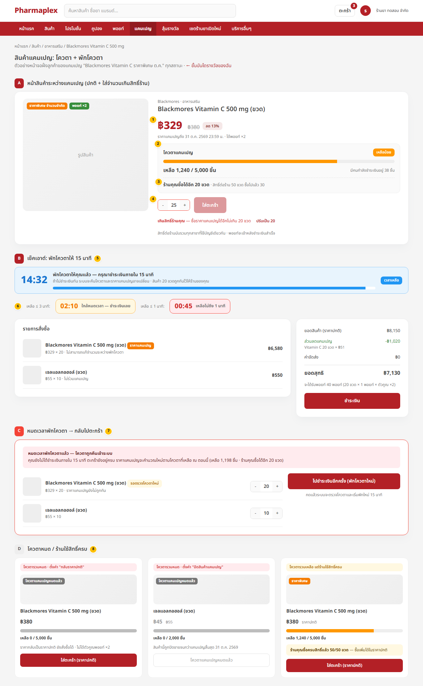

**คำอธิบายแต่ละส่วนในหน้าจอ**

1. ราคาและป้าย — ราคาแคมเปญใหญ่ + ราคาปกติขีดฆ่า + % ลด · ป้ายแคมเปญและตัวคูณพอยท์บนรูป · แสดงเวลาสิ้นสุดแคมเปญ · ลูกค้านอกกลุ่มที่ร่วมแคมเปญเห็นราคาปกติ ไม่เห็นป้าย
2. มิเตอร์โควตารวม — แสดง "เหลือ X / Y ชิ้น" และจำนวนที่กำลังถูกพัก (กระตุ้นให้รีบ แต่ไม่ถูกนับเป็นขายแล้ว) · เหลือ ≤ 20% ชิปเตือน "เหลือน้อย"
3. โควตาต่อร้าน — "ร้านคุณซื้อได้อีก N" คำนวณจากสิทธิ์ − (ชำระแล้ว + กำลังพัก) ของบัญชีลูกค้า · เป็นตัวเลขที่ทับซ้อนกับโควตารวม ใช้ค่าที่น้อยกว่าเป็นเพดาน
4. ตัวเลือกจำนวน — ขึ้น error ทันทีที่เกินเพดาน (min ของสิทธิ์ร้านและโควตารวมคงเหลือ) พร้อมปุ่ม "ปรับเป็น N" · ปุ่มใส่ตะกร้าปิดจนกว่าจะแก้
5. แถบพักโควตา — เริ่มเมื่อเข้าหน้าเช็คเอาต์ แสดงเวลานับถอยหลังและแถบเวลาเหลือ · เวลาอ้างอิงจากเซิร์ฟเวอร์ (ไม่ใช่นาฬิกาเครื่องลูกค้า) · ล็อกการแก้จำนวนสินค้าระหว่างพัก
6. เปลี่ยนสีตามเวลา — ฟ้า (ปกติ) → ส้มเมื่อเหลือ ≤ 3 นาที → แดงเมื่อ ≤ 1 นาที · ข้อความบอกสิ่งที่จะเกิดขึ้นถ้าหมดเวลา
7. หมดเวลา — กลับตะกร้า (ไม่ทิ้งรายการ) ข้อความอธิบายว่าโควตาถูกคืนแล้วและราคาจะคำนวณใหม่ · ปุ่มเดียว "ไปชำระเงินอีกครั้ง" เริ่มพักใหม่ถ้าโควตายังพอ
8. โควตาหมด — ตามที่แอดมินตั้ง: "กลับราคาปกติ" (ซื้อได้ ราคา ฿380 ไม่ได้พอยท์ ×2) หรือ "ปิดสินค้าแคมเปญ" (ปุ่มกดไม่ได้) · ร้านที่ใช้สิทธิ์ครบแต่โควตารวมยังเหลือ ซื้อได้ในราคาปกติ

**กติกา / ข้อยกเว้น / สถานะ**

- สถานะโควตาในหนึ่งออเดอร์: ว่าง → พักอยู่ (15 นาที) → ขายแล้ว (ชำระสำเร็จ) หรือ คืน (หมดเวลา/ยกเลิก)
- ถ้าตอนกด "ชำระเงิน" โควตารวมเหลือน้อยกว่าที่ต้องการ: ระบบไม่พักบางส่วน แต่แจ้ง "เหลือ N ชิ้น ปรับจำนวนก่อน" และกลับตะกร้า
- ลูกค้าเปิดเช็คเอาต์หลายแท็บ — นับเป็นการพักครั้งเดียวต่อบัญชี (พักใหม่แทนที่ของเดิม ไม่พักซ้อน)
- ชำระด้วยโอน/QR ที่ยืนยันช้า: ระหว่างรอผลการชำระ ระบบขยายเวลาพักอัตโนมัติสูงสุด 5 นาที (ตามผลของเกตเวย์)
- ลูกค้าชำระสำเร็จหลังหมดเวลา (เงินเข้าแต่โควตาถูกคืนไปแล้ว): ถ้ายังมีโควตา ออเดอร์ได้ราคาแคมเปญ · ถ้าหมดแล้ว ฝ่ายขายติดต่อลูกค้าเพื่อปรับราคาหรือคืนเงิน (ต้องตัดสินใจ)

**ข้อที่ต้องตัดสินใจกับลูกค้า**

- แสดงจำนวน "กำลังชำระเงินอยู่ 38 ชิ้น" ให้ลูกค้าเห็นหรือไม่ (เพิ่มความเร่งด่วน แต่เปิดเผยพฤติกรรมของร้านอื่น)
- ระยะพักนับจากตอน "เข้าหน้าเช็คเอาต์" (ค่าตั้งต้น) หรือตอน "กดยืนยันชำระ"
- กรณีชำระสำเร็จหลังหมดเวลาแล้วโควตาหมด — ให้ยอมขายตามราคาแคมเปญ (กำไรลด) หรือคืนเงิน?

#### สรุปข้อที่ต้องตัดสินใจกับลูกค้า

- คิดพอยท์ตามอัตรารายสินค้า (ตามสเปก) หรือตามอัตราต่อยอดบิล — สินค้าที่ไม่ได้ตั้งอัตราได้ 0 พอยท์ ไม่มีค่าเริ่มต้น
- แบรนด์กับหมวดตั้งอัตราขัดกัน ให้อันไหนชนะ (ต้นแบบ: แบรนด์ชนะ)
- ยกเลิกออเดอร์หลังแลกพอยท์ไปใช้แล้ว: หักไม่เกินยอดคงเหลือ หรือยอมให้ติดลบ
- เกณฑ์ที่ต้องให้ผู้จัดการอนุมัติเมื่อแอดมินปรับพอยท์ (ต้นแบบ 1,000 ต่อครั้ง และ 5,000 ต่อวัน)
- ปีสัญญาตามปีปฏิทินหรือวันเซ็นของแต่ละร้าน (ยอดสะสมนับหลังหักส่วนลด/คูปอง ตายตัว)
- คืนสินค้าจนยอดต่ำกว่าเกณฑ์หลังรับรางวัลไปแล้ว: ไม่ดึงรางวัลคืนอัตโนมัติ ให้แอดมินตัดสินใจ

---

## 6. การสุ่มรางวัล

### 6.1 คืออะไร

การสุ่มรางวัลคือกิจกรรมที่ลูกค้าได้ "สิทธิ์ลุ้น" จากการซื้อสินค้า แลกพอยท์ หรือรับจากโปรโมชั่น/แคมเปญ แล้วใช้สิทธิ์ลุ้นรางวัล สิทธิ์ลุ้นเป็นหน่วยกลางหน่วยเดียว แยกนับตามกิจกรรม

### 6.2 หนึ่งกิจกรรม = หนึ่งรูปแบบ (A หรือ B)

ตอนสร้างกิจกรรม แอดมิน **เลือกได้รูปแบบเดียว** ไม่มีกิจกรรมที่รวมทั้งสองแบบ หน้าลูกค้าแยกแสดงเป็นสองส่วนชัดเจน

| หัวข้อ | A · ลุ้นทันที | B · จับตามรอบ |
|---|---|---|
| ลูกค้าทำอะไร | ใช้สิทธิ์ 1 ใบ หมุนวงล้อ | นำสิทธิ์ลงกองรางวัล |
| รู้ผลเมื่อไร | ทันที | วันประกาศผลที่ตั้งไว้ (แอดมินกดจับรางวัล) |
| รางวัลตั้งค่าอย่างไร | น้ำหนัก (โอกาสถูก) + จำนวนที่มี | จำนวนผู้โชคดีต่อรางวัล · **1 คนถูกได้ไม่เกิน 1 รางวัลต่อการจับ 1 ครั้ง** (ลงกองกี่ใบก็ตาม) |
| เหมาะกับ | รางวัลเล็ก แจกบ่อย | รางวัลใหญ่ มูลค่าสูง |

ต้องการทั้งสองแบบพร้อมกัน ให้สร้างเป็นสองกิจกรรม รูปแบบเปลี่ยนได้เฉพาะตอนที่ยังไม่มีลูกค้าใช้สิทธิ์

### 6.3 สิทธิ์ลุ้นได้มาอย่างไร

| ทาง | ตั้งค่าที่ไหน |
|---|---|
| ซื้อสินค้า: ทุก ฿X ได้ 1 สิทธิ์ (นับหลังหักส่วนลด ปัดเศษลง) | หน้าตั้งค่ากิจกรรม |
| แลกด้วยพอยท์: N พอยท์ = 1 สิทธิ์ | หน้าตั้งค่ากิจกรรม |
| แจกผ่านโปรโมชั่น / ขั้นแคมเปญ / รายการแลกพอยท์ | ผลตอบแทน “สิทธิ์ลุ้นรางวัล” ของรายการนั้น เลือกกิจกรรม |

สิทธิ์ไม่มีอายุรายใบ หมดเมื่อกิจกรรมสิ้นสุด

### 6.4 การตั้งค่าที่ย่อให้เหลือ 5 ส่วน

รูปแบบ (กิจกรรม A เลือก **ภาพเปิดผล** ได้ 1 แบบ: วงล้อ / กล่องของขวัญ / บัตรขูด + ความเร็วอนิเมชัน ปกติ/เร็ว) → ข้อมูลกิจกรรม (ชื่อ คำอธิบาย ช่วงวัน กลุ่มลูกค้า และวันประกาศผลสำหรับ B) → ทางได้สิทธิ์ → รางวัล → เปิดใช้งาน (เช็คลิสต์ 2 ข้อ: มีรางวัล และมีทางได้สิทธิ์)

ตัดออกจากเวอร์ชันก่อน เพราะตั้งค่ามากและเข้าใจยาก: เพดานสิทธิ์ต่อคน/ต่อวัน, อายุสิทธิ์แยกรายใบ, งบประมาณและตัวคุมต่อวัน, ทางเข้า “โค้ดในกล่อง/ขั้นแคมเปญ” แบบแยกตาราง (ใช้ผลตอบแทน “สิทธิ์ลุ้นรางวัล” แทน), การตั้งโหมดแยกรายรางวัล

### 6.5 ได้รางวัลแล้วไปไหน

รางวัลตั้งด้วยคอมโพเนนต์ผลตอบแทนกลาง: พอยท์ คูปอง เครดิต เข้าบัญชีทันที ส่วนของแถมและของนอก POS เข้าคิวรับของให้ทีมงานส่งมอบ

### 6.6 ความโปร่งใสและการตรวจสอบ

ผลตัดสินที่ฝั่งระบบเสมอ (A: ก่อนภาพเปิดผลเริ่ม · B: ตอนแอดมินกดจับ) ทุกการถูกรางวัลบันทึกให้ตรวจย้อนหลังได้ ส่วนกิจกรรม B มีระบบ “ล็อกกอง → จับ → ตรวจสอบ” ให้ลูกค้าตรวจผลเองได้ ดังนี้

**หลักการ (เหมือนใส่ลูกบอลรายชื่อลงกล่องแล้วปิดผนึก ก่อนเขย่าสุ่ม)**

| ขั้น | ใครทำ | ทำอะไร | ทำไมสำคัญ |
|---|---|---|---|
| ① ล็อกกอง | แอดมินกด “ล็อกกอง & ประกาศรหัส” | ปิดรับสิทธิ์เข้ากอง แล้วคำนวณ **รหัสกอง** = SHA-256 ของรายชื่อกอง (รหัสลูกค้า:จำนวนใบ เรียงตามรหัส) ลูกค้าเห็นรหัสทันที | แก้รายชื่อกองหลังล็อกไม่ได้ — ถ้าแก้แม้ 1 ตัว รหัสจะเปลี่ยน |
| ② จับรางวัล | แอดมินกด “จับรางวัล” | ใช้ **seed** ผสมกับรหัสกอง แล้วคำนวณผู้ชนะทีละรางวัลด้วยสูตรตายตัว: ตำแหน่ง = SHA-256(รหัสกอง\|seed\|k) หารเอาเศษด้วยจำนวนใบที่เหลือ แล้วตัด **ทุกใบของผู้ชนะคนนั้น** ออกจากกอง (1 คนถูกได้ 1 รางวัลต่อการจับ) | seed เดิม + กองเดิม = ผลเดิมทุกครั้ง ไม่มีใครเลือกผู้ชนะด้วยมือ |
| ③ ตรวจสอบ | ใครก็ได้ (ลูกค้า/แอดมิน) กด “ตรวจสอบผล” | ระบบคำนวณซ้ำจากข้อมูลที่ล็อกไว้ แล้วเทียบ 4 ข้อ: รหัสกองตรงกับรายชื่อ · ผลอ้างอิงรหัสกองเดียวกับที่ประกาศ · ล็อกก่อนวันจับ · ได้ผู้โชคดีชุดเดียวกัน | พิสูจน์ว่าผลไม่ถูกแก้ และมีข้อมูลดิบให้ตรวจด้วยเครื่องมืออื่นได้ |

**กติกาผู้ชนะ:** 1 คนถูกได้ไม่เกิน 1 รางวัลต่อการจับ 1 ครั้ง ไม่ว่าจะลงกองกี่ใบ — คนที่ลงหลายใบมีโอกาสถูกมากกว่าอยู่แล้ว จึงไม่ให้ถูกซ้ำหลายรางวัล เมื่อมีคนถูกรางวัลหนึ่ง ระบบตัดทุกใบของคนนั้นออกจากกองก่อนจับรางวัลถัดไป (ถ้าผู้ร่วมน้อยกว่าจำนวนผู้โชคดีรวม รางวัลที่เหลือจะไม่มีผู้ชนะ)

**ลูกค้า (ร้านยา) ตรวจเองยังไง — ใช้ภาษาคน ไม่ต้องรู้ SHA-256 หรือ seed**

ลูกค้ากด “ตรวจสอบว่าผลไม่ถูกแก้” ที่หน้า “จับตามรอบ” (ปุ่มเปิดหลังเปิดดูผลของตัวเองแล้ว) ระบบจะ **จับรางวัลซ้ำให้ดูอีกรอบ** แล้วแจ้งเป็นข้อ ๆ ด้วยคำธรรมดา:

| ข้อที่ลูกค้าเห็น | ความหมายจริง |
|---|---|
| ✓ รายชื่อผู้ร่วมลุ้นไม่ถูกแก้หลังปิดรับ | รหัสกอง (SHA-256) ตรงกับรายชื่อ |
| ✓ สิทธิ์ของคุณอยู่ในกองครบ N ใบ (เฉพาะผู้ลงกอง) | สิทธิ์ของลูกค้าคนนี้อยู่ในรายชื่อที่ล็อก ครบตามที่ลง |
| ✓ การจับใช้รายชื่อชุดเดียวกับที่ประกาศไว้ก่อนจับ | ผลอ้างอิงรหัสกองเดียวกับที่ประกาศ |
| ✓ ปิดรับรายชื่อก่อนวันจับรางวัล | วันล็อกกองอยู่ก่อนวันจับ |
| ✓ ผู้โชคดีทุกคนมาจากสูตร ไม่ได้มาจากการเลือก | คำนวณซ้ำด้วย seed + รายชื่อกอง ได้ผู้โชคดีชุดเดียวกัน |

- ข้อความหัวเรื่อง: “ตรวจแล้ว ผลการจับรางวัลนี้ไม่ถูกแก้ไข” หรือ “พบความไม่ตรงกัน — แจ้งทีมงาน”
- ลูกค้าเห็น **รหัสอ้างอิง** สั้น ๆ (เช่น E535-8E1D) ไว้เก็บเป็นหลักฐานหรืออ้างอิงเมื่อติดต่อทีมงาน ไม่ต้องเห็นรหัสยาว 64 ตัว
- คำอธิบายใช้อุปมา “จับสลากต่อหน้าทุกคน”: ปิดรับรายชื่อเหมือนปิดผนึกกล่อง → จับด้วยสูตรตายตัว → ใครสงสัยกดตรวจ ระบบจับซ้ำให้ดู
- ข้อมูลเชิงเทคนิค (รายชื่อกอง · รหัสกอง · seed · สูตร พร้อมคำศัพท์) ซ่อนไว้ในส่วน “สำหรับผู้ตรวจสอบเชิงเทคนิค” สำหรับฝ่ายไอทีหรือผู้ตรวจสอบภายนอก ลูกค้าทั่วไปไม่ต้องเปิดดู

**ปลอดภัยเพราะ:** ① แก้รายชื่อกองหลังล็อกไม่ได้ ② เลือกผู้ชนะเองไม่ได้ (ผลมาจากสูตร) ③ ตรวจย้อนหลังได้ตลอด

**ข้อจำกัดที่ต้องรู้:** หาก seed มาจากระบบ ลูกค้ายังต้องเชื่อใจว่าระบบไม่เลือก seed ที่เข้าข้างใคร จึงมีตัวเลือกที่สองสำหรับรางวัลใหญ่

**ตั้งค่าเพียงข้อเดียว — “ที่มาของ seed” (ในหน้าตั้งค่ากิจกรรม B)**

| ตัวเลือก | seed มาจาก | เหมาะกับ |
|---|---|---|
| ระบบสุ่มให้เอง (ค่าเริ่มต้น) | ระบบสร้างค่าสุ่มตอนกดจับ ไม่ต้องกรอกอะไร | รางวัลทั่วไป ใช้ง่าย |
| ใช้ค่าสาธารณะ | แอดมินกรอกค่าจากแหล่งภายนอกที่ใครก็ตรวจได้ เช่น เลขรางวัลที่ 1 สลากกินแบ่งรัฐบาล ซึ่งออกมาหลังล็อกกอง จึงเลือกเองไม่ได้ · ลูกค้าเห็นข้อความ “จะใช้ค่าอะไร” ล่วงหน้า | รางวัลใหญ่ ต้องการความน่าเชื่อถือสูงสุด |

หมายเหตุสำหรับระบบจริง: seed แบบ “ระบบสุ่ม” ต้องสร้างและบันทึกฝั่งเซิร์ฟเวอร์ (ใช้ตัวสุ่มระดับความปลอดภัยการเข้ารหัส) พร้อมบันทึก audit log ว่าใครกดจับเมื่อไร ใช้ seed อะไร

### 6.7 หน้าจอและ flow การใช้งาน

#### ภาพรวม · ภาพรวม Flow สุ่มรางวัล

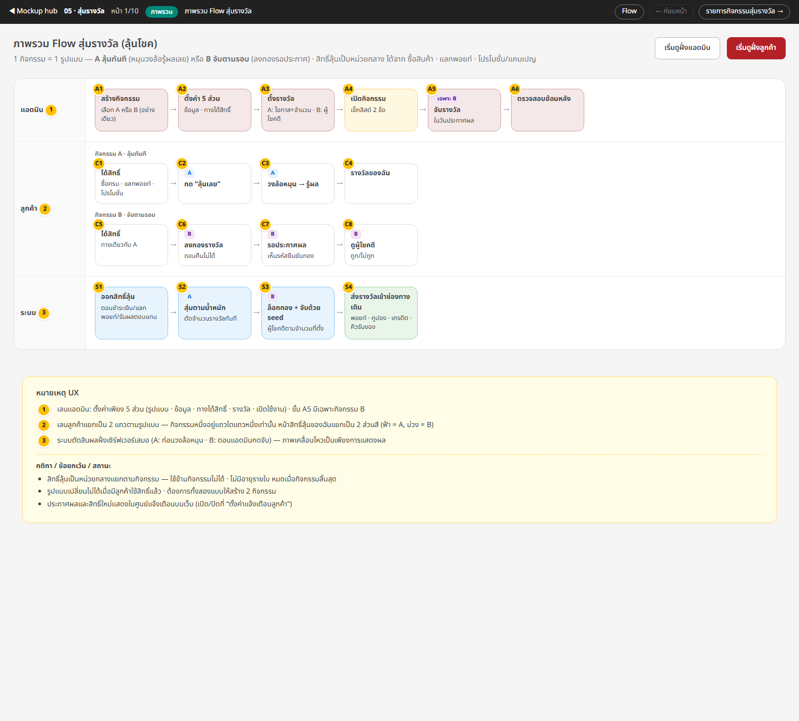

เลนแอดมิน/ลูกค้า/ระบบ ลูกค้าแยกสองแถวตามรูปแบบ A และ B

#### แอดมิน · รายการกิจกรรมสุ่มรางวัล

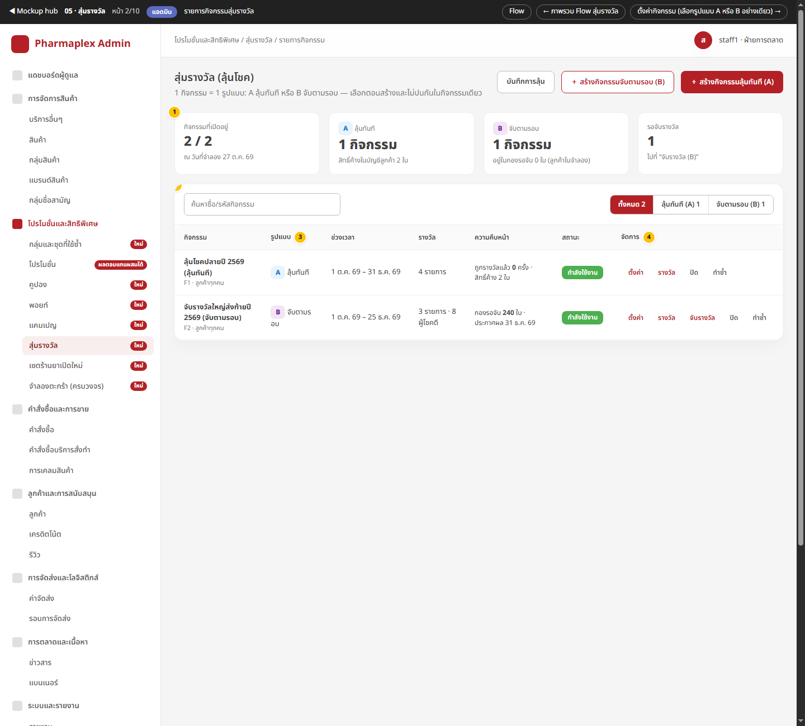

- การ์ดสรุป · แท็บ ทั้งหมด / ลุ้นทันที (A) / จับตามรอบ (B) · ช่องค้นหา
- ปุ่มสร้างแยก 2 ปุ่มตามรูปแบบ · คอลัมน์ “รูปแบบ” เป็น A หรือ B อย่างเดียว
- จัดการ: ตั้งค่า · รางวัล · จับรางวัล (เฉพาะ B) · เปิด/ปิด · ทำซ้ำ

#### แอดมิน · ตั้งค่ากิจกรรม

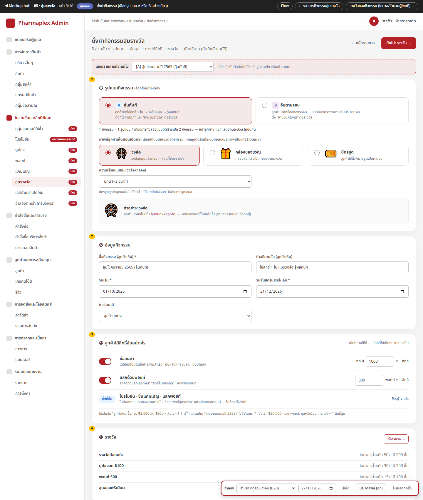

*กิจกรรม B: ตั้ง “ที่มาของ seed” ได้ 2 แบบ (ระบบสุ่มให้เอง / ใช้ค่าสาธารณะ) พร้อมคำอธิบายแบบอ่านง่าย*

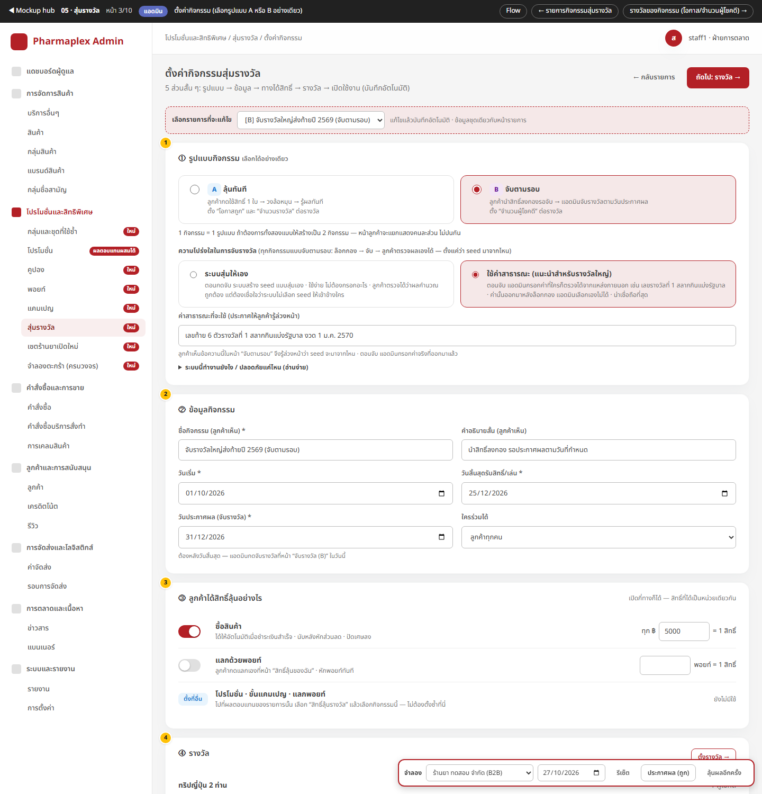

- ① รูปแบบ (เลือกอย่างเดียว) ② ข้อมูล ③ ทางได้สิทธิ์ (ซื้อ ฿X · แลกพอยท์ · แจกผ่านโปรโมชั่น/แคมเปญ) ④ รางวัล ⑤ เปิดใช้งาน
- บันทึกอัตโนมัติ · รูปแบบล็อกเมื่อมีลูกค้าใช้สิทธิ์แล้ว

#### แอดมิน · รางวัลของกิจกรรม

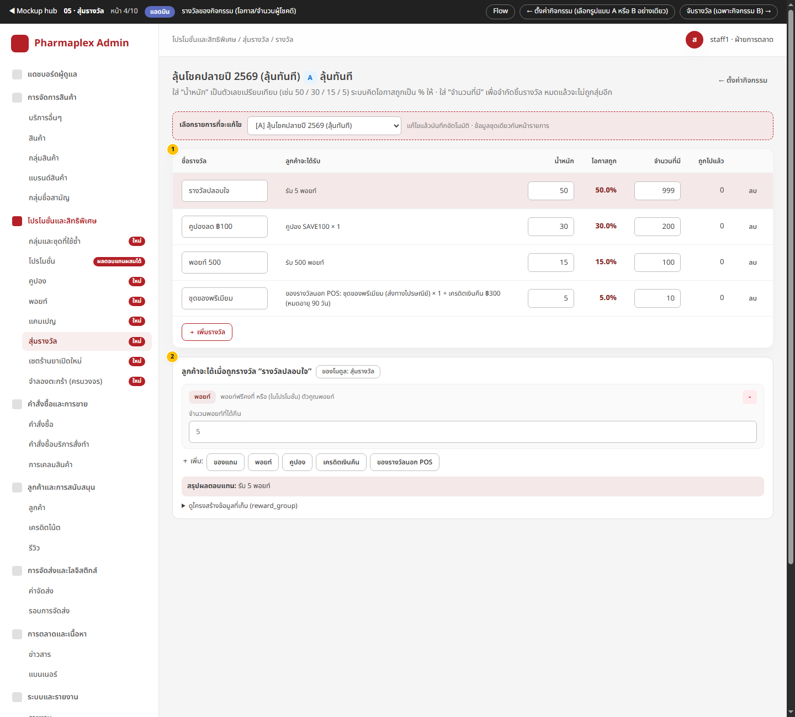

- A: ภาพรางวัล · ชื่อ + คำอธิบาย · ลูกค้าจะได้รับ · น้ำหนัก (ระบบคิด % ให้) · จำนวนที่มี · ถูกไปแล้ว
- B: ภาพรางวัล · ชื่อ + คำอธิบาย · ลูกค้าจะได้รับ · จำนวนผู้โชคดี
- กดแถวเพื่อตั้งผลตอบแทนด้วยคอมโพเนนต์ผลตอบแทนกลาง

**เพิ่ม/เปลี่ยนในรอบนี้**

- **ภาพรางวัล:** คอลัมน์แรกของตาราง กด "＋ เพิ่มภาพ" เลือกไฟล์ JPG/PNG (ระบบย่อให้อัตโนมัติ) · "เปลี่ยนภาพ" / "ลบภาพ" ได้ · ไม่ใส่ก็ได้ (แสดงกรอบ "ไม่มีภาพ")
- **คำอธิบายรางวัล:** ช่องข้อความใต้ชื่อรางวัล ขึ้นบรรทัดใหม่ได้ บันทึกอัตโนมัติ เช่น สเปก เงื่อนไขการรับของ — ลูกค้าเห็นตอนกดดูรายละเอียดรางวัล (ดูหน้า 07 / 08)

#### แอดมิน · จับรางวัล (เฉพาะกิจกรรม B)

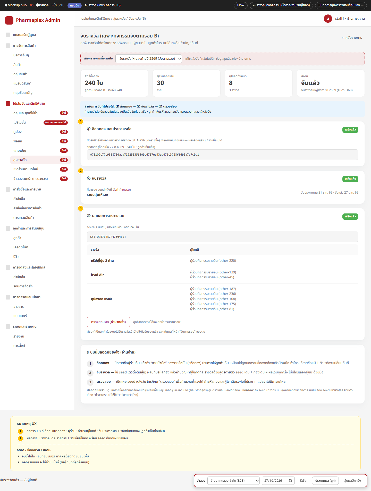

- หน้าแบ่งเป็น 3 ขั้นตามลำดับ: **① ล็อกกอง & ประกาศรหัส** (รหัสกองตัวอย่างจางจนกว่าจะล็อก) → **② จับรางวัล** (แสดงที่มาของ seed ที่ตั้งไว้; ถ้าเลือก “ค่าสาธารณะ” ต้องกรอกค่าก่อนจับ; ปุ่มจับเปิดเมื่อล็อกกองแล้ว ครั้งเดียว) → **③ ผลและการตรวจสอบ** (seed ที่เปิดเผย · ตารางผู้โชคดี · ปุ่ม “ตรวจสอบผล (คำนวณซ้ำ)”) พร้อมการ์ดอธิบาย “ระบบนี้ปลอดภัยยังไง”
- ขนาดกอง · ผู้ร่วม · จำนวนผู้โชคดี · สถานะ (เปิดรับสิทธิ์ / ล็อกกองแล้ว / จับแล้ว)

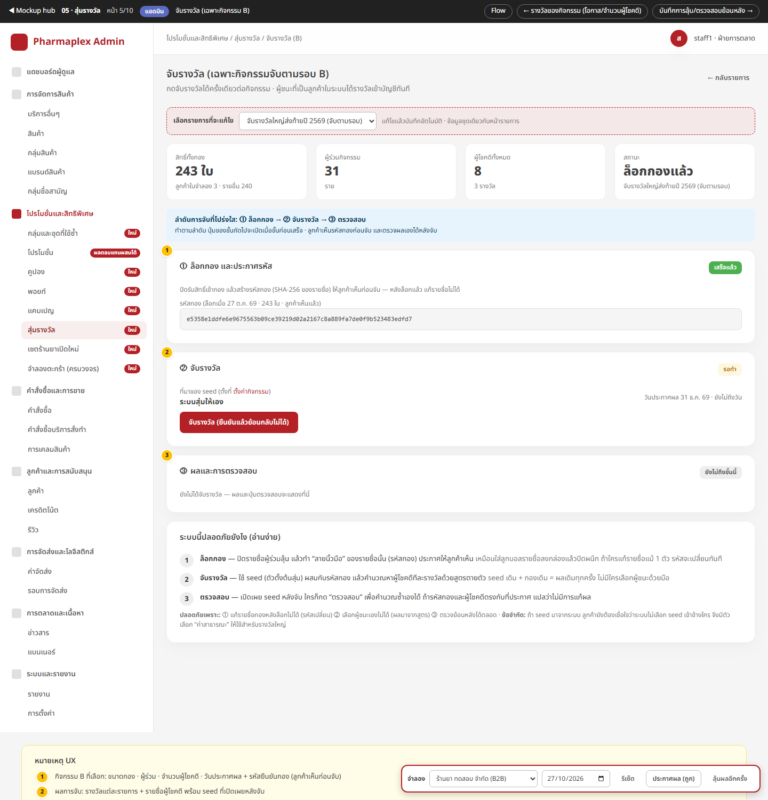

#### แอดมิน · บันทึกการลุ้น

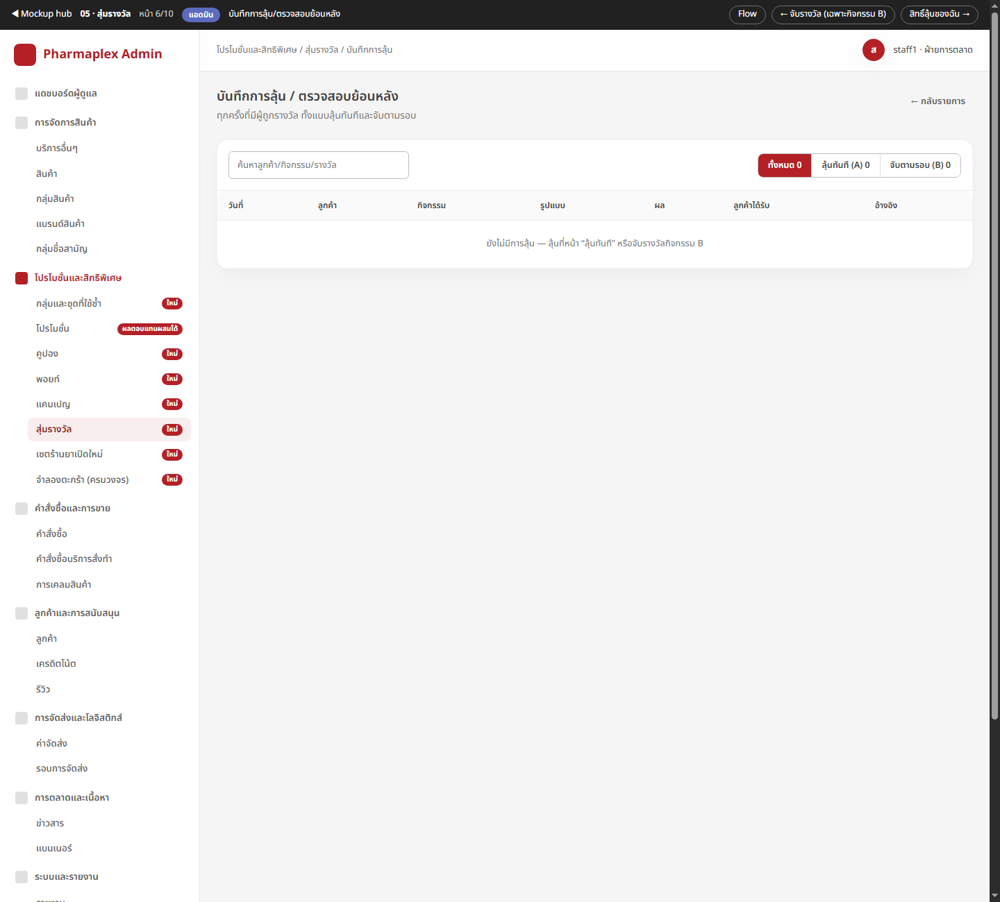

- แท็บ ทั้งหมด / A / B · ค้นหา · อ่านอย่างเดียว

#### ลูกค้า · สิทธิ์ลุ้นของฉัน

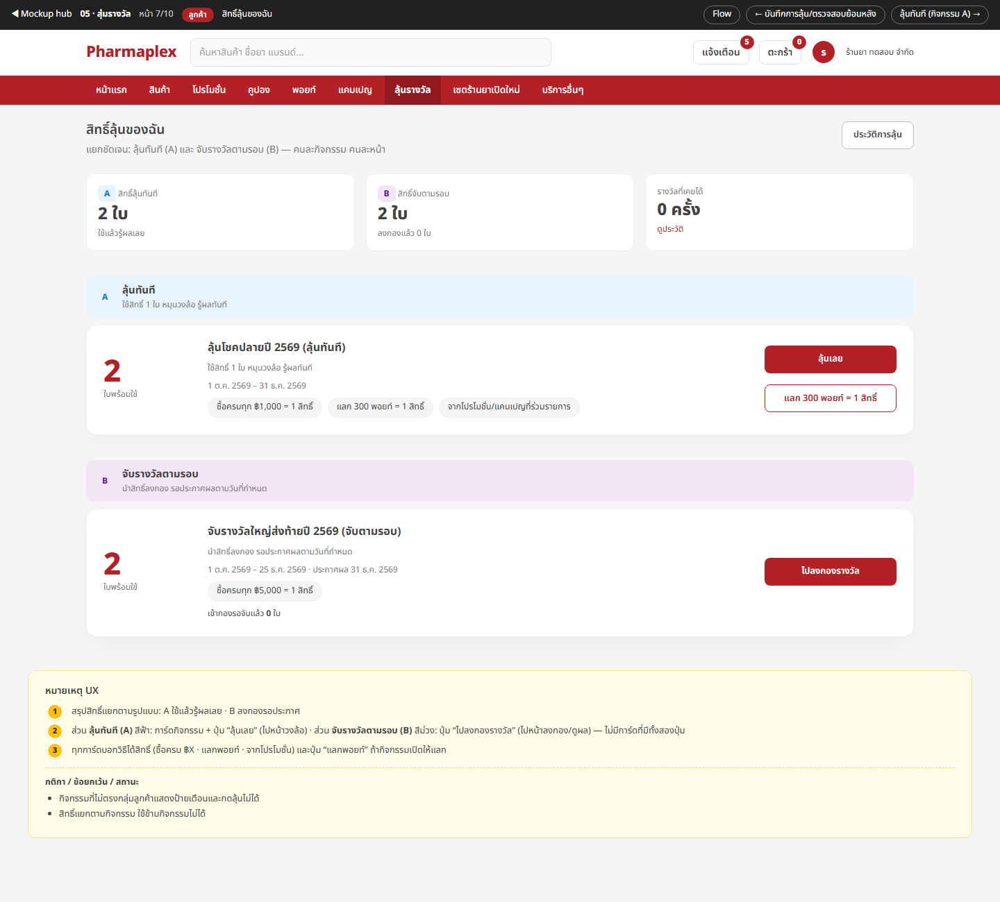

- แยกสองส่วนสี: ลุ้นทันที (A) ปุ่ม “ลุ้นเลย” · จับรางวัลตามรอบ (B) ปุ่ม “ไปลงกองรางวัล” ไม่มีการ์ดที่มีทั้งสองปุ่ม
- แต่ละการ์ดบอกวิธีได้สิทธิ์ และปุ่มแลกพอยท์ถ้ากิจกรรมเปิดให้แลก

#### ลูกค้า · ลุ้นทันที (กิจกรรม A)

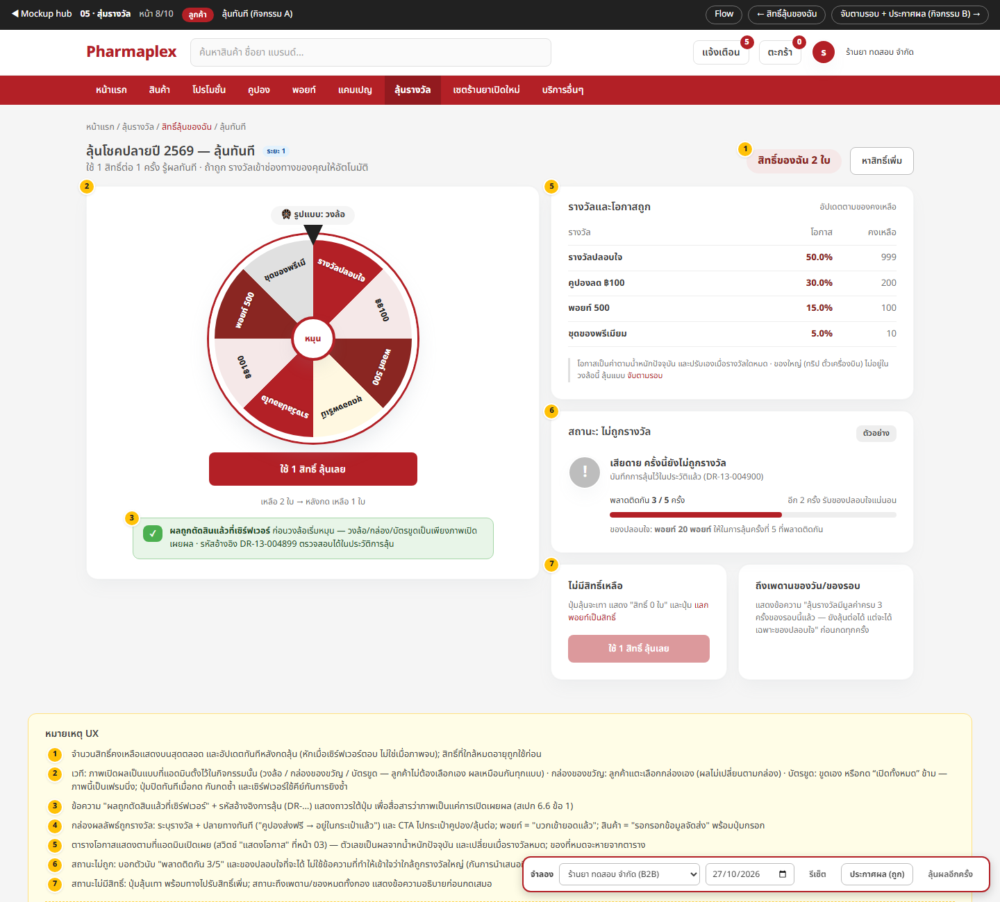

**คำอธิบายแต่ละส่วนในหน้าจอ**

1. จำนวนสิทธิ์คงเหลือแสดงบนสุดตลอด และอัปเดตทันทีหลังกดลุ้น (หักเมื่อเซิร์ฟเวอร์ตอบ ไม่ใช่เมื่อภาพจบ); สิทธิ์ที่ใกล้หมดอายุถูกใช้ก่อน
2. เวที: ภาพเปิดผลเป็นแบบที่แอดมินตั้งไว้ในกิจกรรมนั้น (วงล้อ / กล่องของขวัญ / บัตรขูด — ลูกค้าไม่ต้องเลือกเอง ผลเหมือนกันทุกแบบ) · กล่องของขวัญ: ลูกค้าแตะเลือกกล่องเอง (ผลไม่เปลี่ยนตามกล่อง) · บัตรขูด: ขูดเอง หรือกด “เปิดทั้งหมด” ข้าม — ภาพนี้เป็นเฟรมนิ่ง; ปุ่มปิดทันทีเมื่อกด กันกดซ้ำ และเซิร์ฟเวอร์ใช้คีย์กันการยิงซ้ำ
3. ข้อความ "ผลถูกตัดสินแล้วที่เซิร์ฟเวอร์" + รหัสอ้างอิงการลุ้น (DR-…) แสดงถาวรใต้ปุ่ม เพื่อสื่อสารว่าภาพเป็นแค่การเปิดเผยผล (สเปก 6.6 ข้อ 1)
4. กล่องผลลัพธ์ถูกรางวัล: ระบุรางวัล + ปลายทางทันที ("คูปองส่งฟรี → อยู่ในกระเป๋าแล้ว") และ CTA ไปกระเป๋าคูปอง/ลุ้นต่อ; พอยท์ = "บวกเข้ายอดแล้ว"; สินค้า = "รอกรอกข้อมูลจัดส่ง" พร้อมปุ่มกรอก
5. ตารางโอกาสแสดงตามที่แอดมินเปิดเผย (สวิตช์ "แสดงโอกาส" ที่หน้า 03) — ตัวเลขเป็นผลจากน้ำหนักปัจจุบัน และเปลี่ยนเมื่อรางวัลหมด; ของที่หมดจะหายจากตาราง
6. สถานะไม่ถูก: บอกตัวนับ "พลาดติดกัน 3/5" และของปลอบใจที่จะได้ ไม่ใช้ข้อความที่ทำให้เข้าใจว่าใกล้ถูกรางวัลใหญ่ (กันการนำเสนอที่ชวนเข้าใจผิด)
7. สถานะไม่มีสิทธิ์: ปุ่มลุ้นเทา พร้อมทางไปรับสิทธิ์เพิ่ม; สถานะถึงเพดาน/ของหมดทั้งกอง แสดงข้อความอธิบายก่อนกดเสมอ

**รายละเอียดรางวัล (เพิ่มใหม่):** แถวรางวัลในตารางโอกาสกดได้ (“รายละเอียด ›”) เปิดหน้าต่างรายละเอียดรางวัล — ดูหัวข้อ “หน้าต่างรายละเอียดรางวัล” ในหน้าจับตามรอบด้านล่าง ใช้ชุดเดียวกัน

**กติกา / ข้อยกเว้น / สถานะ**

- เครือข่ายขาดหลังกด: สิทธิ์ถูกหักแล้วถ้าเซิร์ฟเวอร์ตอบ — เมื่อกลับมา หน้าแสดงผลล่าสุดจากประวัติ (ไม่หมุนใหม่)
- รางวัลที่คงเหลือหมดระหว่างกำลังลุ้น: ระบบตัดสินผลจากกองปัจจุบัน ณ เวลาเซิร์ฟเวอร์ ไม่ใช่ตามที่เห็นในหน้า
- เพดานงบต่อวันชน → ผลเป็น "ไม่ถูก/ของปลอบใจ" ตามที่ตั้งไว้ (ดูข้อตัดสินใจหน้า 03) และต้องไม่แสดงรางวัลมูลค่าเป็นผลที่ถูก
- ปุ่มลุ้นหลายครั้ง (x5, x10) ยังไม่มีในระยะ 1 — ทีละครั้งเพื่อให้เห็นผลและตัวนับชัดเจน

**ข้อที่ต้องตัดสินใจกับลูกค้า**

- เปิดเผยโอกาส % ตรงๆ ให้ลูกค้าเห็นหรือไม่ (เสนอ: เปิด เพื่อความโปร่งใส ตามสเปก 6.6)
- ความยาวภาพเคลื่อนไหว: ตั้งได้ ปกติ ~3 วินาที / เร็ว ~1.5 วินาที (บัตรขูดมีปุ่มข้ามเสมอ)
- ปลายทางของรางวัลที่เป็นสินค้า: กรอกข้อมูลจัดส่งทันทีในกล่องผลลัพธ์ หรือไปกรอกทีหลังในหน้ารางวัลของฉัน

#### ลูกค้า · จับตามรอบ + ประกาศผล (กิจกรรม B)

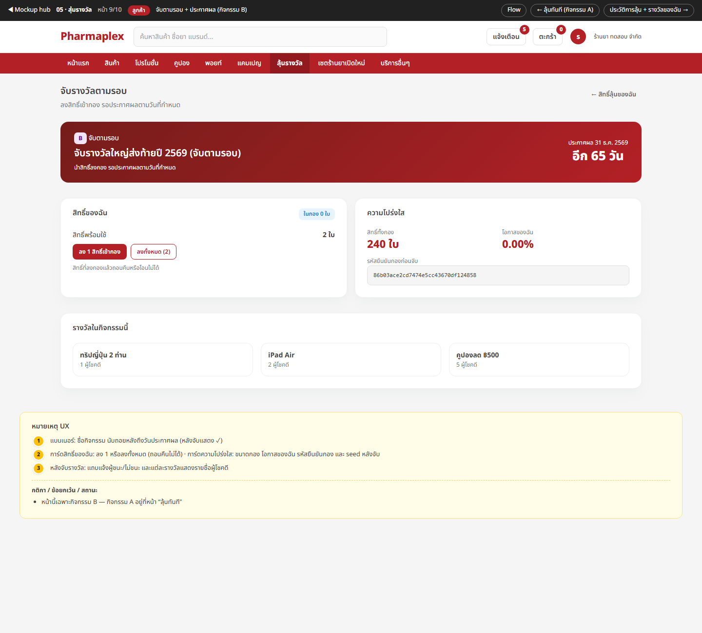

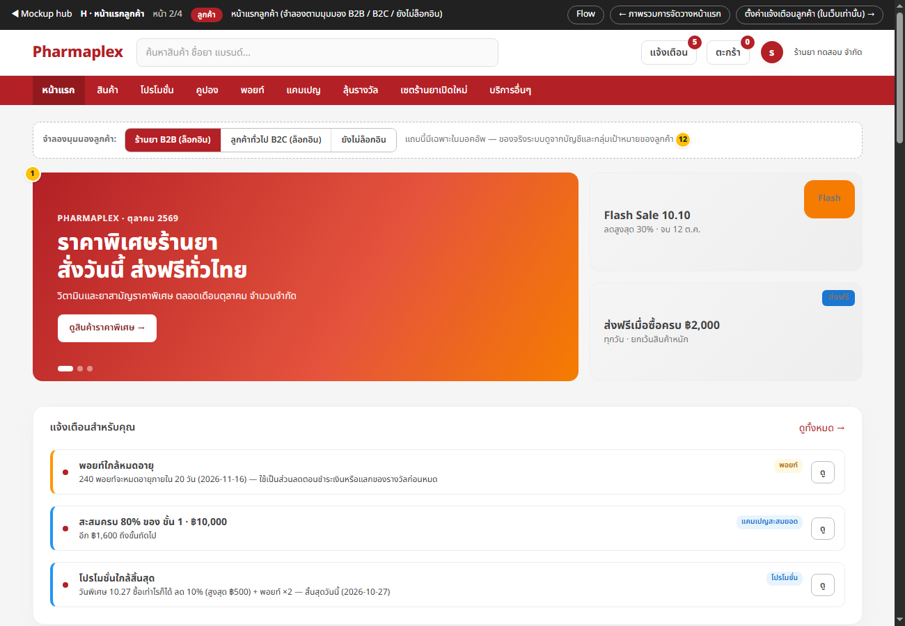

*หน้าต่าง “ประกาศผลแล้ว” ที่เด้งขึ้นเองเมื่อแอดมินจับรางวัล — ลูกค้าเปิดดูผลของตัวเองก่อนเห็นรายชื่อผู้โชคดี*

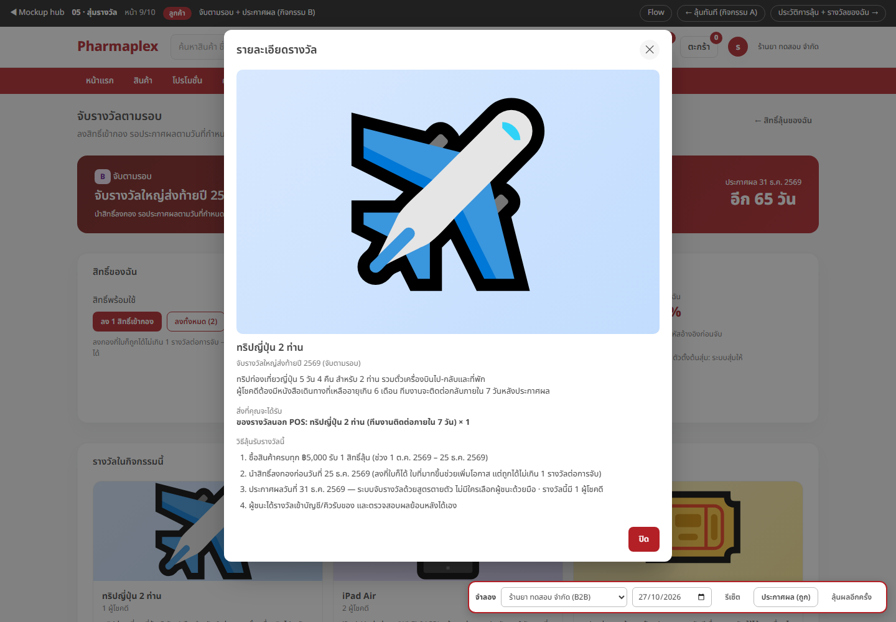

*กดการ์ดรางวัลเพื่อดูภาพ คำอธิบาย สิ่งที่จะได้รับ และวิธีลุ้นรับรางวัลนั้น*

- นับถอยหลังวันประกาศผล · ลงสิทธิ์เข้ากอง (ถอนไม่ได้ และปิดรับเมื่อแอดมินล็อกกอง) · โอกาสของฉัน · หลังจับ: แจ้งถูก/ไม่ถูก + รายชื่อผู้โชคดี
- การ์ด “รางวัลในกิจกรรมนี้” แสดงภาพรางวัล ชื่อ คำอธิบายสั้น 2 บรรทัด และจำนวนผู้โชคดี — **กดการ์ดเพื่อเปิดหน้าต่างรายละเอียดรางวัล**
- การ์ด **“ความโปร่งใส — ตรวจเองได้”** แสดง 3 ขั้น (ล็อกกอง + รหัสกอง · จับรางวัล + ที่มาของ seed · ตรวจสอบ) และปุ่ม “ตรวจสอบผลด้วยตัวเอง” เมื่อเปิดดูผลของตัวเองแล้ว

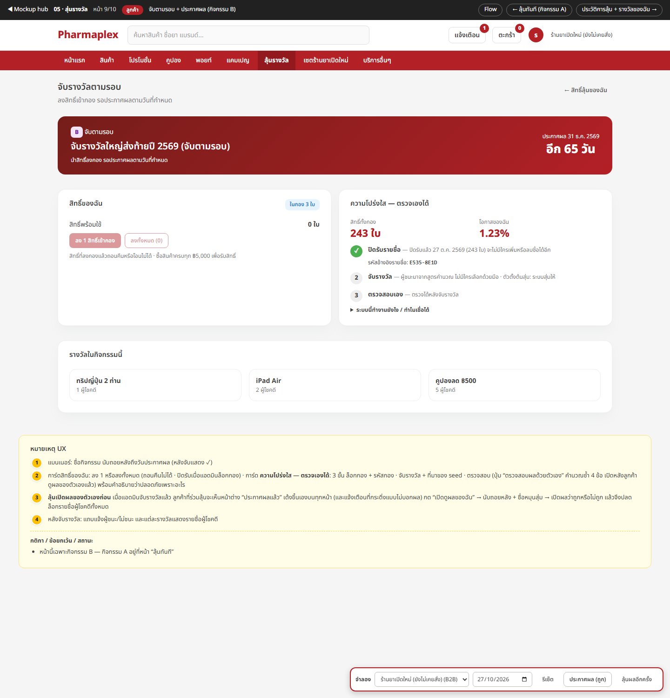

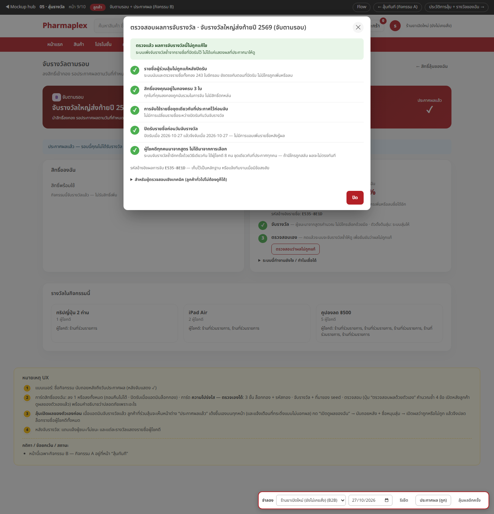
- **หน้าต่างรายละเอียดรางวัล (ลูกค้า · ใหม่):** กดการ์ดรางวัลในหน้าจับตามรอบ หรือกดแถวรางวัลในตารางโอกาสของหน้าลุ้นทันที จะเห็น ภาพรางวัล · ชื่อและกิจกรรม · คำอธิบายที่แอดมินกรอก · “สิ่งที่คุณจะได้รับ” (ของแถม/พอยท์/คูปอง/เครดิต ตามผลตอบแทนที่ตั้งไว้) · **วิธีลุ้นรับรางวัลนี้** ที่ระบบสร้างให้จากกติกากิจกรรม:
  - แบบ B (จับตามรอบ): ซื้อครบทุก ฿X ได้ 1 สิทธิ์ (ช่วงวันที่กิจกรรม) → นำสิทธิ์ลงกองก่อนวันปิดรับ (ลงกี่ใบก็ได้ ใบมากช่วยเพิ่มโอกาส แต่ถูกได้ไม่เกิน 1 รางวัลต่อการจับ) → ประกาศผลตามวันที่กำหนด รางวัลนี้มี N ผู้โชคดี → ผู้ชนะได้รางวัลเข้าบัญชี/คิวรับของ และตรวจสอบผลย้อนหลังได้
  - แบบ A (ลุ้นทันที): ซื้อครบทุก ฿X ได้ 1 สิทธิ์ → กดลุ้นรู้ผลทันที โดยบอกโอกาสถูกรางวัลนี้เป็น % และจำนวนชิ้นที่เหลือ → รางวัลเข้าบัญชี/คิวรับของอัตโนมัติ
- **ลุ้นเปิดผลของตัวเอง:** เมื่อแอดมินจับรางวัลแล้ว ลูกค้าที่ลงสิทธิ์ในกองจะเห็นหน้าต่าง “ประกาศผลแล้ว” เด้งขึ้นเองบนทุกหน้า (กระดิ่งแจ้งเตือนก็ขึ้นแต่ไม่บอกผล) กด “เปิดดูผลของฉัน” → นับถอยหลังพร้อมชื่อหมุนสุ่ม → เปิดผลว่า **ถูกรางวัลอะไร หรือรอบนี้ไม่ถูก** ลูกค้าเห็นผลของตัวเองก่อน แล้วจึงปลดล็อกรายชื่อผู้โชคดีทั้งหมด
- ผู้ที่ไม่ได้ลงสิทธิ์ไม่มีหน้าต่างเด้ง ดูรายชื่อผู้โชคดีได้ที่หน้านี้ตรง ๆ · ปิดหน้าต่างไว้ก่อนได้ ระบบจะเด้งอีกครั้งจนกว่าจะเปิดผล

#### ลูกค้า · ประวัติการลุ้น + รางวัลของฉัน

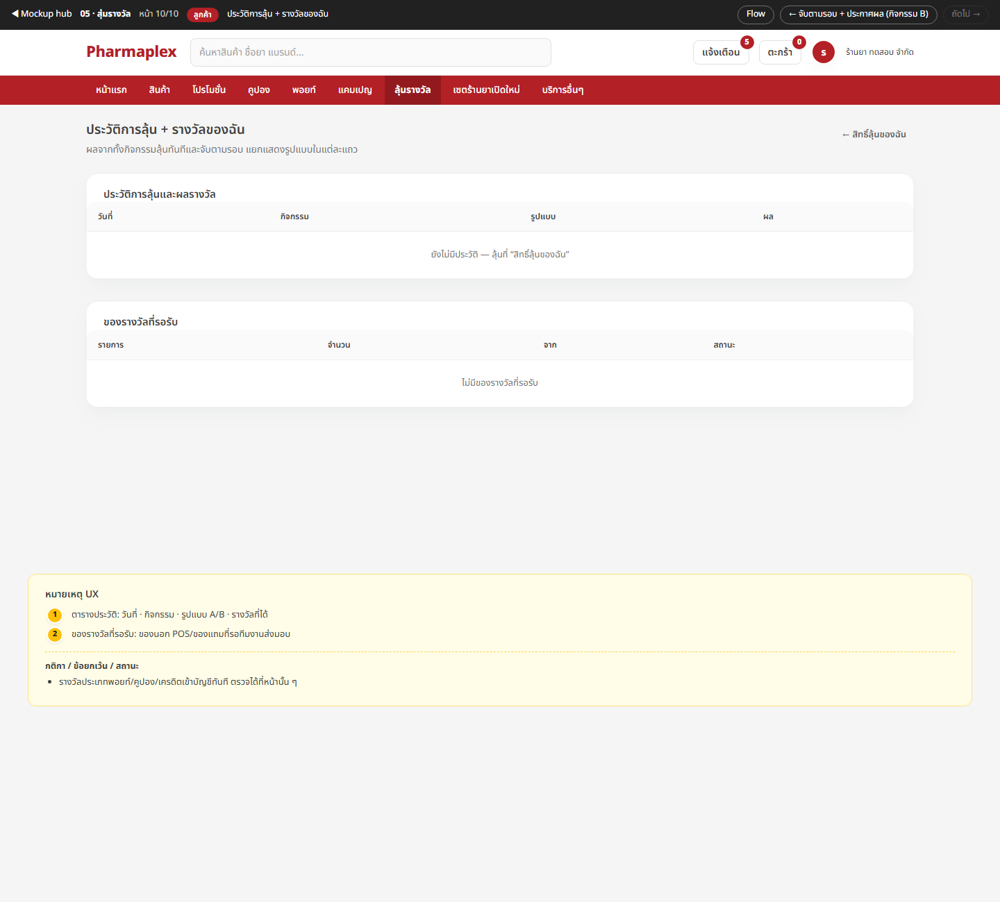

- ประวัติรวมทั้งสองรูปแบบ (ระบุ A/B ในแต่ละแถว) · ของรางวัลที่รอรับ

## 7. เซตร้านยาเปิดใหม่

### 7.1 คืออะไร และใช้เมื่อไหร่

เซตร้านยาเปิดใหม่คือชุดสินค้าเริ่มต้นสำหรับผู้ที่กำลังเปิดร้านยาใหม่ ลูกค้าสามารถเลือกซื้อทั้งเซตและปรับรายการทางเลือกได้ตามความต้องการ ใช้ได้กับเซตขนาดมาตรฐานหรือเซตที่แอดมินกำหนดเพิ่มเอง

ใช้ได้เฉพาะลูกค้าประเภทร้านค้า (B2B) เท่านั้น ไม่เปิดให้ลูกค้าทั่วไป (B2C)

ลูกค้าสั่งซื้อเองผ่านหน้าเว็บได้โดยตรง หรือให้แอดมิน/เซลล์เข้าไปสั่งซื้อแทนในหน้าแอดมินก็ได้ ทั้งสองทางใช้ราคาและเงื่อนไขชุดเดียวกัน

### 7.2 สินค้าบังคับและสินค้าทางเลือก

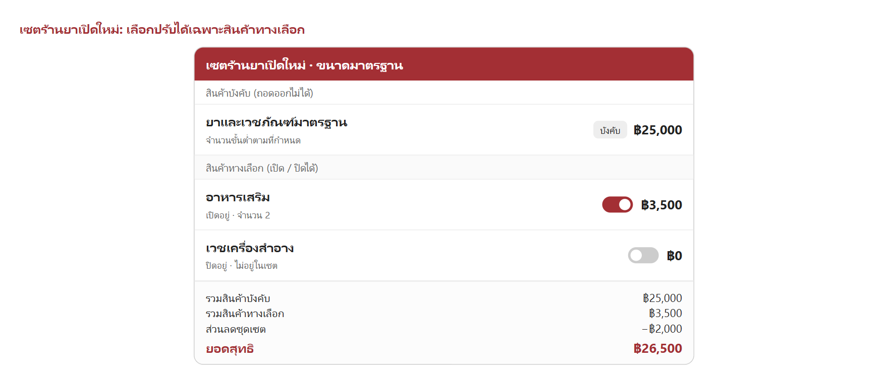

*รูป 7-1 สินค้าบังคับทุกรายการต้องอยู่ในเซต ลูกค้าปิดสินค้าทางเลือกได้ และยอดสุทธิคำนวณใหม่ทันที*

| ประเภท | การถอดออกจากเซต | จำนวนขั้นต่ำ | การแสดงผล |
|---|---|---|---|
| สินค้าบังคับ | ถอดออกไม่ได้ | ต้องครบตามที่กำหนด | ล็อกไว้ พร้อมป้าย "บังคับ" |
| สินค้าทางเลือก | ถอดออกได้ | 0 เมื่อไม่เลือก | สวิตช์เปิด-ปิด |

- **สินค้าบังคับ** คือยาและเวชภัณฑ์มาตรฐานที่จำเป็นต้องมีในร้านตามกฎหมายหรือเป็นแกนหลักของเซต
- **สินค้าทางเลือก** คืออาหารเสริม เวชเครื่องสำอาง หรือสินค้าเสริมอื่น ๆ
- ถ้าสินค้าบังคับในเซตหมดสต็อกระหว่างลูกค้ากำลังสั่งซื้อ ระบบจะบล็อกการสั่งทั้งเซตไว้ก่อน จนกว่าแอดมินจะเติมสต็อก

### 7.3 การคิดราคา

**กติกาที่ตกลงแล้ว:** ส่วนลดชุดเซต **ใช้ร่วมได้** กับโปรโมชั่นรายสินค้า คูปอง พอยท์ และแคมเปญสะสมยอดรายปี

```
ราคาเซตรวม = ผลรวมสินค้าบังคับ + ผลรวมสินค้าทางเลือกที่เลือก − ส่วนลดชุดเซต
```

ตัวอย่าง: สินค้าบังคับ 25,000 บาท + สินค้าทางเลือกที่เลือก 3,500 บาท − ส่วนลดชุดเซต 2,000 บาท = **26,500 บาท**

### 7.4 การตั้งค่าของแอดมิน

| หัวข้อ | รายละเอียด |
|---|---|
| ข้อมูลเซต | ชื่อเซต คำอธิบาย และเปิด/ปิดการขาย |
| สินค้าบังคับ | เลือกสินค้าและตั้งจำนวนขั้นต่ำที่ต้องซื้อ |
| สินค้าทางเลือก | เลือกสินค้าและตั้งจำนวนเริ่มต้นที่แนะนำ |
| ส่วนลดชุดเซต | ตั้งส่วนลดรวมเมื่อซื้อทั้งเซต |
| ลูกค้าที่สั่งซื้อได้ | เฉพาะบัญชีร้านค้า (B2B) เท่านั้น |
| สั่งซื้อแทนลูกค้า | แอดมิน/เซลล์เลือกบัญชีลูกค้าแล้วสั่งซื้อแทนได้จากหน้าแอดมิน |

### 7.5 หน้าจอและ flow การใช้งาน

หน้าจอทั้งหมดของโมดูลนี้เรียงตามลำดับ flow การใช้งาน แต่ละภาพมีเลขกำกับบนจอ และคำอธิบายของแต่ละเลขอยู่ใต้ภาพ ตามด้วยกติกา ข้อยกเว้น และสถานะที่ต้องรองรับ โมดูลนี้เป็นการออกแบบใหม่ทั้งหมด โดยยึดรูปแบบรายการสินค้าบังคับ/ทางเลือกเดียวกับหน้าเซตของแถม

#### ภาพรวม · ภาพรวม Flow เซตร้านยา

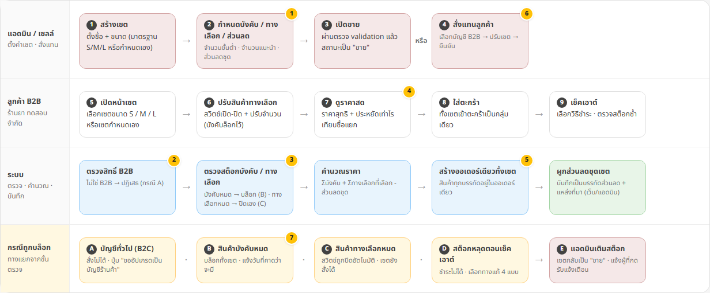

**คำอธิบายแต่ละส่วนในหน้าจอ**

1. กำหนดบังคับ / ทางเลือก / ส่วนลด — แอดมินต้องมีสินค้าบังคับอย่างน้อย 1 รายการ และสินค้าเดียวกันห้ามอยู่ทั้งสองรายการ ถึงจะเปิดขายได้ (รายละเอียดที่หน้า 02)
2. ตรวจสิทธิ์ B2B — ตรวจจากประเภทบัญชีที่ผูกกับผู้ล็อกอิน ทุกครั้งที่เปิดหน้าเซต ใส่ตะกร้า และเช็คเอาต์ (ไม่เชื่อค่าที่ค้างในหน้า)
3. ตรวจสต็อก — แยกผลเป็น 2 แบบ: สินค้าบังคับต่ำกว่าขั้นต่ำ = บล็อกทั้งเซต, สินค้าทางเลือกไม่พอ = ปิดอัตโนมัติและแจ้งลูกค้า
4. ดูราคาสด — ราคาใหม่แสดงทันทีบนฝั่งหน้าจอ และเซิร์ฟเวอร์คำนวณซ้ำด้วยสูตรเดียวกันทุกครั้งที่ใส่ตะกร้า/เช็คเอาต์ (ราคาที่หน้าจอไม่ใช่ราคาที่เชื่อถือได้)
5. ออเดอร์เดียวทั้งเซต — ทุกบรรทัดสินค้ามีป้ายชื่อเซต + ประเภท (บังคับ/ทางเลือก) ติดไว้ ใช้ตอนเคลม/คืนสินค้า/รายงาน
6. สั่งแทนลูกค้า — ผ่านทางเดียวกับลูกค้า ใช้ตรวจสิทธิ์ B2B ตัวเดียวกัน และบันทึกผู้สั่ง (staff) ไว้ในออเดอร์
7. บังคับหมดสต็อก — บล็อกเฉพาะการสั่ง ลูกค้ายังเปิดดูเซตได้ และกด "แจ้งเตือนเมื่อพร้อม" ได้

**กติกา / ข้อยกเว้น / สถานะ**

- สถานะ "สต็อกไม่พอ" ของเซตคำนวณอัตโนมัติจากสินค้าบังคับ — ไม่ใช่สถานะที่แอดมินตั้งเอง; ปิดการขายเป็นอีกสถานะที่แอดมินตั้ง
- เมื่อแอดมินแก้ราคา/จำนวนขั้นต่ำของเซตที่มีอยู่ในตะกร้าลูกค้า ตะกร้าจะคำนวณใหม่ตอนเปิด และแจ้ง "ราคาเซตมีการเปลี่ยนแปลง"
- ออเดอร์ที่สร้างแล้วเก็บราคา ณ เวลาสั่ง ไม่ถูกคำนวณย้อนหลังเมื่อแอดมินแก้เซต

**ข้อที่ต้องตัดสินใจกับลูกค้า**

- ยอดเซตนับเข้าแคมเปญสะสมยอดรายปีและสิทธิ์ลุ้นรางวัลหรือไม่ (เสนอ: นับ)
- ลูกค้าสั่งได้กี่เซตต่อออเดอร์ (เสนอ: 1 เซตต่อออเดอร์ ถ้าต้องการเพิ่มให้สั่งซ้ำ)
- ราคาต่อหน่วยในเซตผูกกับราคาสินค้าปัจจุบัน (ขยับตามเมื่อแก้ราคาสินค้า) หรือล็อกราคาไว้ในเซต (เสนอ: ตามราคาสินค้าปัจจุบัน)

#### แอดมิน · รายการเซตร้านยา

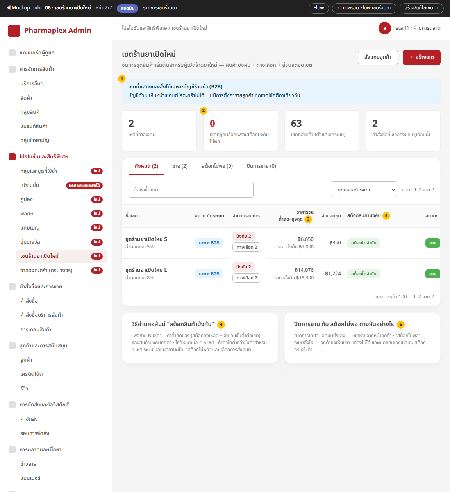

**เพิ่ม/เปลี่ยนในรอบนี้**

- แท็บ ทั้งหมด / ขาย / สต็อกไม่พอ / ปิดการขาย กรองรายการตามสถานะได้จริง ตัวเลขในแท็บนับจากข้อมูลจริง
- ช่อง "ค้นหาชื่อเซต" กรองตามชื่อ และข้อความ "แสดง 1–n จาก N" อัปเดตตามผล (ใช้ร่วมกับแท็บได้)
- ป้ายสถานะในตารางแสดงตามจริง: ขาย (เขียว) · สต็อกไม่พอ (แดง — มีสินค้าบังคับที่สั่งได้น้อยกว่า 1 เซต) · ปิดการขาย (เทา)

**คำอธิบายแต่ละส่วนในหน้าจอ**

1. ข้อความคุมสิทธิ์: ไม่มีตัวเลือก "ผู้สั่งได้" ให้ตั้งในรายการ — B2B เท่านั้นเป็นค่าตายตัวของโมดูลนี้
2. ตัวเลขสีแดงกดแล้วกรองแท็บ "สต็อกไม่พอ" — ไว้ให้แอดมินเห็นปัญหาก่อนลูกค้าชน
3. ราคาต่ำสุด = เฉพาะสินค้าบังคับ − ส่วนลด · สูงสุด = บังคับ + ทางเลือกทั้งหมด − ส่วนลด · ใต้ตัวเลขคือราคาที่ลูกค้าเห็นเป็นค่าเริ่มต้น (ทางเลือกที่แอดมินตั้งเปิดไว้) · ส่วนลดแบบ % แสดงเป็น −5%
4. คอลัมน์สุขภาพสต็อก: ชื่อสินค้าที่เป็นคอขวด + จำนวนเซตที่ขายได้ · แถวสีแดงอ่อน = ถูกบล็อก · มีบรรทัดแยกถ้าสินค้าทางเลือกหมด (ไม่บล็อกเซต)
5. การดำเนินการ: แก้ไข → 02 · ทำซ้ำ = คัดลอกเซตเป็นร่างใหม่ (ปิดขาย) · ปิดการขาย → ยืนยันก่อน · สั่งแทนลูกค้า → 03 (ล็อกกับเซตนั้น) · เซตสต็อกไม่พอสั่งแทนไม่ได้เช่นกัน
6. ปุ่ม "ปิดการขาย" ไม่กระทบออเดอร์เดิม และตะกร้าที่มีเซตนี้อยู่จะแสดง "เซตนี้ปิดการขายแล้ว" ตอนเปิดตะกร้า

**กติกา / ข้อยกเว้น / สถานะ**

- สถานะที่เป็นไปได้: ขาย · ปิด · สต็อกไม่พอ (อัตโนมัติ — ถ้าแอดมินปิดขายอยู่ จะแสดง "ปิด" เป็นหลัก)
- ยอดสั่งแล้ว นับจำนวนเซตในออเดอร์ที่ไม่ถูกยกเลิก รวมที่เซลล์สั่งแทน
- ไม่มีรายการ: แสดง "ยังไม่มีเซต — สร้างเซตแรกของคุณ" พร้อมปุ่ม ＋ สร้างเซต
- ทำซ้ำ: คัดลอกรายการสินค้า จำนวน ส่วนลด แต่ตั้งชื่อต่อท้าย "(สำเนา)" และสถานะ "ปิด" เสมอ

**ข้อที่ต้องตัดสินใจกับลูกค้า**

- เกณฑ์ "ใกล้หมด" (เสนอ ≤ 5 เซต) และต้องแจ้งเตือนแอดมินทางอีเมล/LINE เมื่อใกล้หมดหรือไม่
- เซตขนาดมาตรฐาน S/M/L: มีเพียง 3 ขนาดตายตัว หรือแอดมินเพิ่มขนาดเองได้ (เสนอ: ขนาดมาตรฐาน 3 ขนาด + "กำหนดเอง" ตั้งชื่อได้อิสระ)

#### แอดมิน · สร้าง/แก้ไขเซต

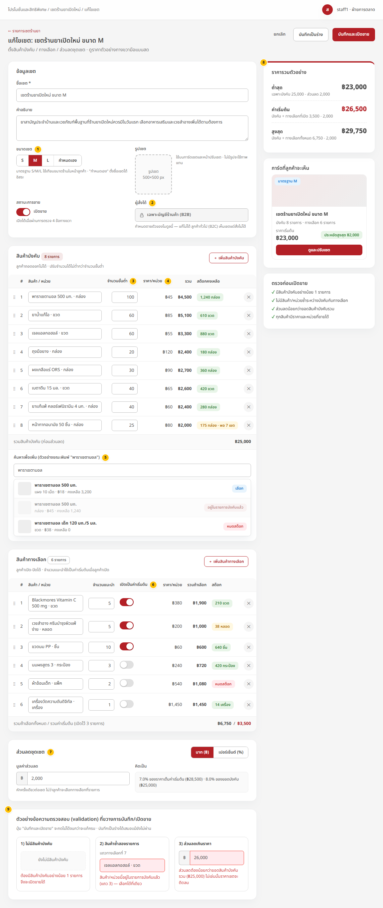

**คำอธิบายแต่ละส่วนในหน้าจอ**

1. ขนาดเซตเป็นแค่ป้ายและลำดับการแสดงในหน้าลูกค้า ไม่ได้กำหนดสินค้าเอง — เปลี่ยนขนาดแล้วรายการสินค้าไม่ถูกแตะ
2. "ผู้สั่งได้" ล็อก = B2B ทุกเซต แสดงเป็นช่องอ่านอย่างเดียวพร้อมไอคอนกุญแจ เพื่อให้แอดมินรู้ว่าไม่ใช่ค่าที่ลืมตั้ง
3. จำนวนขั้นต่ำเป็นจำนวนเต็ม ≥ 1 ต่อหน่วยที่เลือก; ลูกค้าเพิ่มได้ ลดต่ำกว่านี้ไม่ได้; เซลล์สั่งแทนก็ลดต่ำกว่านี้ไม่ได้เช่นกัน
4. ราคา/หน่วยดึงอัตโนมัติจากราคาสินค้าของลูกค้ากลุ่ม B2B (แก้ในเซตไม่ได้ ถ้าจะเปลี่ยนให้แก้ที่สินค้า) · ชิปสต็อกเป็นสีส้มเมื่อพอขายน้อยกว่า 5 เซต
5. ช่องค้นหาสินค้า/หน่วย: ค้นตามชื่อ/รหัส/แบรนด์ (เหมือนหน้าเซตของแถม pmpc) · หน่วยที่อยู่ในอีกรายการแล้วเลือกไม่ได้ และบอกว่าอยู่ที่ไหน · หมดสต็อกเลือกได้แต่เตือน
6. ทางเลือก: "จำนวนแนะนำ" คือค่าเมื่อลูกค้ากดเปิด; "เปิดเป็นค่าเริ่มต้น" คือสถานะแรกเมื่อลูกค้าเปิดหน้าเซต (ลูกค้าสลับได้เสมอ) — จำนวนแนะนำ ≥ 1
7. ส่วนลดชุดเซต แบบบาท = หักคงที่ครั้งเดียว · แบบ % = คิดจากผลรวม (บังคับ + ทางเลือกที่เลือก) ทุกครั้งที่ลูกค้าปรับ · ตรวจต้องน้อยกว่ายอดบังคับ
8. แผงราคา 3 ค่า อัปเดตสดทุกครั้งที่แอดมินแก้ในหน้านี้; การ์ดตัวอย่างคือสิ่งที่หน้า "เลือกเซตร้านยา" แสดง (ราคาเริ่มต้น = ต่ำสุด)
9. ข้อความ validation 3 แบบ แสดงที่ช่องที่ผิด และสรุปเป็นรายการบนปุ่มบันทึก · แถวสีแดงอ่อน = แถวที่ต้องแก้

**เพิ่ม/เปลี่ยนในหน้านี้ (กลุ่มเป้าหมาย / ชุดที่ใช้ซ้ำ)**

- เพิ่ม “จำกัดเพิ่มเติม (ภายในบัญชี B2B)”: ช่อง “ใครใช้สิทธิ์นี้ได้” (ตัวเลือกกลุ่มเป้าหมายเดียวกับทุกหน้า): ทุกคน (ค่าเริ่มต้น) หรือบางคน = เลือกจากกลุ่มลูกค้าที่ตั้งไว้ในเมนู “กลุ่มและชุดที่ใช้ซ้ำ” แบบ รวม/ยกเว้น (ยกเว้นชนะรวม) · แสดงจำนวนผู้เข้าข่ายสด · เลือก “บางคน” ต้องมีกลุ่ม “รวม” ≥ 1 กลุ่มจึงเผยแพร่ได้ · เงื่อนไข B2B ตายตัวยังคงอยู่

**กติกา / ข้อยกเว้น / สถานะ**

- เซตที่มีออเดอร์แล้วแก้ไขได้ — มีผลกับออเดอร์ใหม่เท่านั้น ออเดอร์เดิมเก็บรายการและราคา ณ เวลาสั่ง
- ลบสินค้าออกจากเซตที่ลูกค้าเปิดค้างอยู่: ตะกร้าเดิมจะคำนวณใหม่และแจ้ง "เซตมีการเปลี่ยนแปลง"
- ถ้าเซตเปิดขายอยู่แล้วเหลือสินค้าบังคับ 0 รายการ (ลบหมด) ระบบไม่ให้บันทึก
- เปลี่ยนจากบังคับ ↔ ทางเลือก ทำโดยลบแล้วเพิ่มใหม่ในอีกรายการ (กันสับสนเรื่องจำนวนขั้นต่ำ)

**ข้อที่ต้องตัดสินใจกับลูกค้า**

- ส่วนลดแบบ % คิดจากอะไร (เสนอ: คิดจากผลรวมสินค้าที่ลูกค้าเลือกจริง) และส่วนลดแบบบาทยังหักเต็มจำนวนแม้ลูกค้าเลือกทางเลือกน้อย
- ต้องมีวันเริ่ม–สิ้นสุดของเซตหรือไม่ (เสนอ: ไม่ต้อง ใช้เปิด/ปิดขายด้วยมือ)
- จำนวนสูงสุดต่อสินค้าบังคับ (เช่น ไม่เกิน 2 เท่าของขั้นต่ำ) ต้องมีหรือไม่ (เสนอ: ไม่จำกัด ยกเว้นสต็อก)

#### แอดมิน · แอดมิน/เซลล์สั่งแทนลูกค้า

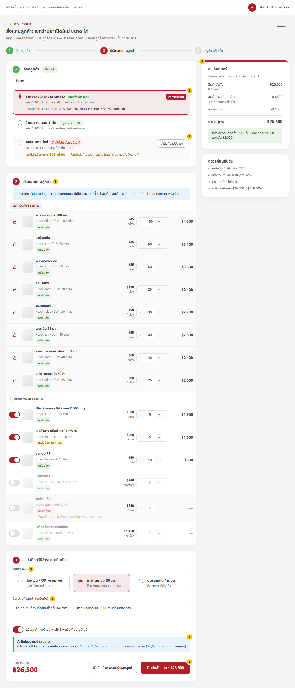

**คำอธิบายแต่ละส่วนในหน้าจอ**

1. ลูกค้า B2C: การ์ดเทาเส้นประ เลือกไม่ได้ พร้อมเหตุผลและปุ่ม "ส่งลิงก์ขออัปเกรด" (ส่งอีเมล/LINE ให้ลูกค้ากดขอเป็นบัญชีร้านค้า) — ไม่มีทางข้ามสิทธิ์
2. ลูกค้า B2B: แสดงเครดิตเทอม/วงเงินคงเหลือ หรือบอกว่าชำระเงินสดอย่างเดียว เพื่อให้เลือกวิธีชำระในขั้น ③ ได้ถูก · ค้นหาตามชื่อร้าน รหัส เบอร์โทร หรือเลขผู้เสียภาษี
3. ตัวปรับเซตเป็นชุดเดียวกับหน้าเว็บ: บังคับล็อก ขั้นต่ำ สวิตช์ทางเลือก · เซลล์ไม่สามารถแก้ราคาหรือส่วนลด ถ้าต้องการราคาพิเศษต้องใช้ช่องทางอื่น
4. แผงสรุปติดขอบขวา คำนวณสดทุกครั้งที่ปรับ · ป้าย "ราคาเดียวกับที่ลูกค้าเห็นบนเว็บ" เพราะใช้สูตร/ราคา/ส่วนลดตัวเดียวกัน
5. วิธีชำระ: ตัวเลือกขึ้นกับสิทธิ์ของลูกค้า (เครดิตเทอมเฉพาะที่มีวงเงิน) · ถ้าวงเงินไม่พอจะกดเครดิตเทอมไม่ได้และบอกยอดที่ขาด
6. ข้อความถึงลูกค้าแสดงในออเดอร์และในการแจ้งเตือน · สวิตช์แจ้งลูกค้าเปิดเป็นค่าเริ่มต้น เพื่อให้ลูกค้ารู้ว่ามีออเดอร์ถูกสร้างในชื่อเขา
7. บันทึก audit อัตโนมัติ แก้ไม่ได้: ผู้สั่ง (staff) แทนลูกค้ารายใด เมื่อไร ช่องทางใด · แสดงในรายละเอียดออเดอร์ฝั่งลูกค้าว่า "สั่งโดยเจ้าหน้าที่ Pharmaplex"
8. ยืนยันแล้วสร้างออเดอร์เดียวทั้งเซต · ก่อนบันทึกระบบตรวจสิทธิ์ B2B และสต็อกซ้ำ ถ้าตก แสดงข้อความแบบเดียวกับ 06 ในหน้านี้

**กติกา / ข้อยกเว้น / สถานะ**

- เซตสถานะ "สต็อกไม่พอ" หรือ "ปิด": ปุ่มสั่งแทนในรายการเซตกดไม่ได้ ถ้าเข้ามาทางลิงก์ตรง ขึ้นแถบแดงและยืนยันไม่ได้
- สิทธิ์ใช้งาน: ต้องมีสิทธิ์ "สั่งซื้อแทนลูกค้า" (Casbin rule ใหม่) — ไม่ใช่ทุกคนในทีมเห็นปุ่มนี้
- แอดมินเห็นข้อมูลลูกค้าเฉพาะที่จำเป็น (วงเงิน/ที่อยู่) ตามสิทธิ์ลูกค้าที่ดูแล
- "บันทึกเป็นร่างตะกร้าของลูกค้า" ใช้เมื่อลูกค้าขอตรวจก่อนจ่าย — ลูกค้าเห็นเซตในตะกร้าตัวเอง

**ข้อที่ต้องตัดสินใจกับลูกค้า**

- เซลล์เห็นเฉพาะลูกค้าที่ตัวเองดูแล หรือเห็นลูกค้า B2B ทุกราย (เสนอ: ตามผู้ดูแลบัญชี แอดมินเห็นทั้งหมด)
- วิธีชำระที่เซลล์เลือกแทนได้: ครบทุกแบบ หรือเฉพาะโอน/เครดิตเทอม (เสนอ: ครบทุกแบบที่ลูกค้ามีสิทธิ์)
- ลูกค้าต้องยืนยันออเดอร์ที่เซลล์สั่งแทนก่อนหรือไม่ (เสนอ: ไม่ต้อง แจ้งเตือนอย่างเดียว ยกเลิกได้ภายในระยะที่ออเดอร์ปกติยกเลิกได้)

#### ลูกค้า · เลือกเซตร้านยา

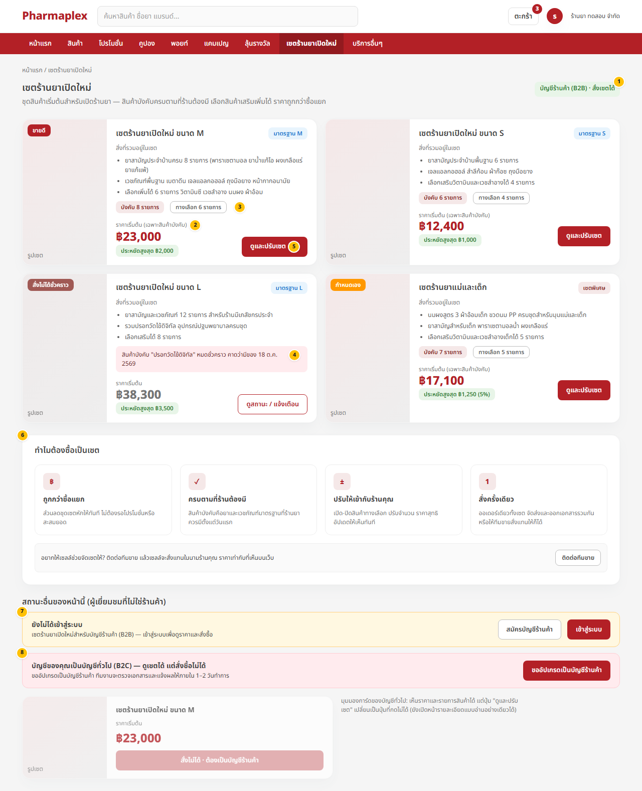

**คำอธิบายแต่ละส่วนในหน้าจอ**

1. ชิปสถานะบัญชีบนหัวหน้า: บอกผู้ใช้ทันทีว่าสั่งได้ (B2B) หรือไม่ ลดการลองกดแล้วโดนปฏิเสธ
2. "ราคาเริ่มต้น" = ราคาต่ำสุดของเซต (เฉพาะสินค้าบังคับ − ส่วนลด) ไม่ใช่ราคาที่ต้องจ่ายจริง — ราคาจริงขึ้นกับทางเลือกที่เลือกในหน้าปรับเซต · ชิป "ประหยัดสูงสุด" = ส่วนลดชุดเซตสูงสุดที่เป็นไปได้
3. จำนวนรายการแยก "บังคับ/ทางเลือก" ตรงกับที่แอดมินตั้ง · เซตเรียงตามลำดับที่แอดมินจัด (ขายดีขึ้นก่อน)
4. เซตที่สินค้าบังคับหมด: ยังแสดงในรายการ แต่เทาลงและเปลี่ยนปุ่มเป็น "ดูสถานะ / แจ้งเตือน" พร้อมวันที่คาดว่ามีของ (ไปหน้า 06) — ไม่ซ่อนเพื่อให้ลูกค้ารู้ว่ากำลังจะกลับมา
5. ปุ่ม "ดูและปรับเซต" พาไปหน้า 05 ซึ่งเป็นที่เดียวที่ใส่ตะกร้าได้ — การ์ดไม่มีปุ่มใส่ตะกร้าตรง เพราะราคาขึ้นกับการปรับ
6. คำอธิบาย "ทำไมต้องซื้อเป็นเซต" เป็นข้อความคงที่ (แก้ได้ในระบบเนื้อหา) · มีทางลัดให้เซลล์สั่งแทน ไม่มีราคาหลังบ้านต่างจากเว็บ
7. ผู้เยี่ยมชมยังไม่ล็อกอิน: เห็นเนื้อหาเซตและรายการสินค้า แต่ราคาแสดงตามนโยบายสินค้าของเว็บ (ถ้าซ่อนราคากับผู้เยี่ยมชม ให้ซ่อนที่นี่ด้วย) พร้อมปุ่มเข้าสู่ระบบ/สมัครบัญชีร้านค้า
8. บัญชีทั่วไป (B2C): แถบแดง + ปุ่ม "ขออัปเกรดเป็นบัญชีร้านค้า" (ไปหน้า 06 กรณีที่ 3) · ปุ่มสั่งบนการ์ดกดไม่ได้

**กติกา / ข้อยกเว้น / สถานะ**

- เซตที่แอดมินปิดการขายไม่แสดงในหน้านี้ · เซต "สต็อกไม่พอ" แสดงแบบเทา
- ไม่มีเซตเปิดขายเลย: แสดง "ยังไม่มีเซตร้านยาเปิดใหม่ในขณะนี้ กรุณาติดต่อทีมขาย"
- ตัวเลข "ประหยัดสูงสุด" ของเซตที่ส่วนลดเป็น % คิดจากราคาสูงสุดของเซต (ทางเลือกครบ)

**ข้อที่ต้องตัดสินใจกับลูกค้า**

- ผู้เยี่ยมชมที่ยังไม่ล็อกอินเห็นราคาเซตหรือไม่ (เสนอ: ตามนโยบายแสดงราคาสินค้าของเว็บเดิม)
- ขั้นตอนขออัปเกรด B2C → B2B ใช้ฟอร์ม/เอกสารเดิมของ pmpc หรือสร้างใหม่ (เสนอ: ใช้ขั้นตอนเดิมถ้ามี)
- รูปเซตและข้อความ "สิ่งที่รวม" ให้แอดมินเขียนเองต่อเซต หรือระบบสร้างจากรายการสินค้าอัตโนมัติ (เสนอ: เขียนเองได้ ถ้าว่างใช้ชื่อสินค้าบังคับ 3 รายการแรก)

#### ลูกค้า · ปรับเซต + ราคาสุทธิสด

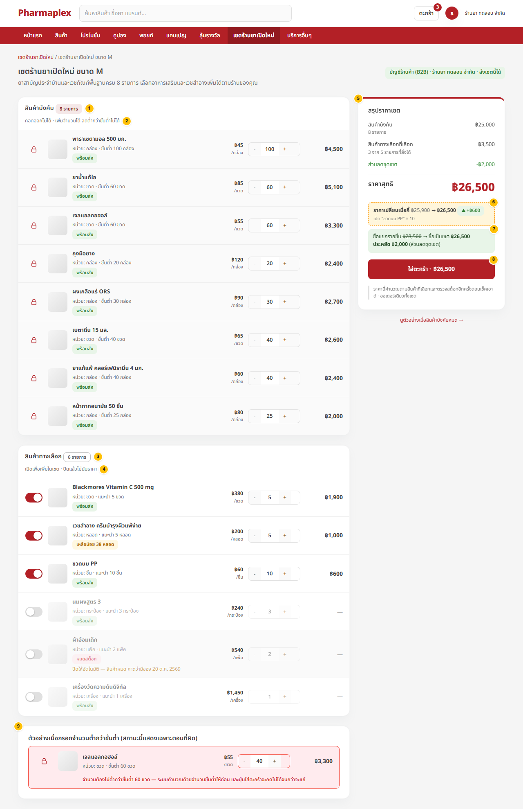

**คำอธิบายแต่ละส่วนในหน้าจอ**

1. สินค้าบังคับ: ไอคอนกุญแจแทนสวิตช์ ไม่มีปุ่มลบ · พื้นหลังเทาอ่อนบอกว่าล็อก · ลำดับเรียงตามที่แอดมินจัด
2. ตัวปรับจำนวน: ปุ่ม − ปิดใช้งานที่จำนวนขั้นต่ำ · พิมพ์ตัวเลขเองได้ · ไม่เกินสต็อกคงเหลือ (ถ้าเกิน ปรับเป็นสต็อกที่มีและแจ้ง)
3. สวิตช์สินค้าทางเลือก: เปิดครั้งแรกใช้ "จำนวนแนะนำ" ของแอดมิน · ปิดแล้วยอดแถวเป็น "—" แต่จำจำนวนที่ปรับไว้ ถ้าเปิดใหม่ได้จำนวนเดิม
4. ป้ายสต็อก: "พร้อมส่ง" / "เหลือน้อย N" (น้อยกว่า 2 เท่าของจำนวนที่เลือก) / "หมดสต็อก" (แถวเทา สวิตช์ล็อก พร้อมวันที่คาดว่ามีของ)
5. แผงราคาติดขอบขวา (sticky): บังคับ + ทางเลือกที่เลือก − ส่วนลดชุด = ราคาสุทธิ คำนวณสดทุกครั้งที่สลับ/ปรับจำนวน ไม่ต้องกด "คำนวณ" · ลองกดสวิตช์และ +/− ในหน้านี้ได้จริง
6. กล่อง "ราคาเปลี่ยนเมื่อกี้": ราคาเดิม → ใหม่ + ส่วนต่าง + สาเหตุ กะพริบเหลืองสั้น ๆ ให้ลูกค้ามั่นใจว่าราคาเปลี่ยนจริง ไม่เด้งเงียบ ๆ
7. "ประหยัด" = ส่วนลดชุดเซต เทียบกับซื้อสินค้าเดียวกันแยกชิ้นที่ราคาปัจจุบัน · ถ้าส่วนลดเป็น % จะเปลี่ยนตามที่เลือก
8. ปุ่มใส่ตะกร้า: ไม่ใช่ B2B → กดไม่ได้ + ป้ายขออัปเกรด · สินค้าบังคับหมด → กดไม่ได้ (06) · ใส่แล้วเซตเป็นกลุ่มเดียวในตะกร้า กดแก้เพื่อกลับมาหน้านี้
9. ข้อความจำนวนต่ำกว่าขั้นต่ำ: ขึ้นสีแดงใต้แถวที่ผิดทันทีที่พิมพ์ · ราคารวมใช้ค่าขั้นต่ำก่อน ไม่ให้ราคาต่ำผิดจริง · ปุ่มใส่ตะกร้ากดไม่ได้จนแก้

**กติกา / ข้อยกเว้น / สถานะ**

- ราคาในหน้านี้คำนวณฝั่งหน้าจอ — เซิร์ฟเวอร์คำนวณซ้ำตอนใส่ตะกร้า/เช็คเอาต์ ถ้าไม่ตรงใช้ค่าของเซิร์ฟเวอร์และแจ้งลูกค้า
- ปิดทางเลือกทั้งหมดได้ — ซื้อเฉพาะสินค้าบังคับ ราคาต่ำสุด ฿23,000 ในเซต M
- สินค้าทางเลือกที่หมดสต็อก: สวิตช์ปิดและกดไม่ได้ ไม่นับราคา (กรณีที่ลูกค้าเลือกไว้ก่อนหมดดูที่ 06)
- เซตล็อกหน่วยสินค้าตามที่แอดมินตั้ง ลูกค้าเปลี่ยนหน่วยไม่ได้

**ข้อที่ต้องตัดสินใจกับลูกค้า**

- ลูกค้าเพิ่มสินค้าอื่นนอกเซตเข้าเซตได้หรือไม่ (เสนอ: ไม่ได้ ให้ใส่ตะกร้าแยก)
- ปรับจำนวนสินค้าทางเลือกเกินจำนวนแนะนำได้หรือไม่ (เสนอ: ได้ ไม่เกินสต็อก)
- ส่วนลดแบบบาทยังได้เต็มเมื่อซื้อเฉพาะสินค้าบังคับหรือไม่ (เสนอ: ได้เต็ม)

#### ลูกค้า · สถานะสินค้าบังคับหมด/ไม่มีสิทธิ์สั่ง

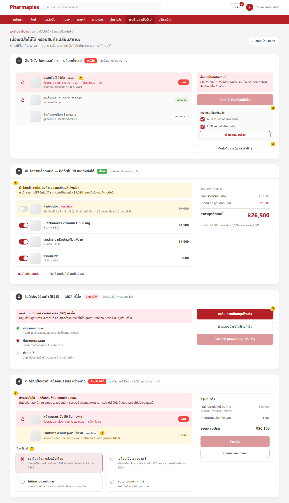

**คำอธิบายแต่ละส่วนในหน้าจอ**

1. บอกสาเหตุให้เจาะจงที่สุด: ชื่อสินค้า จำนวนที่ต้องการ vs คงเหลือ และวันที่คาดว่าจะมี (จากข้อมูลสต็อก/จัดซื้อ) — ไม่ใช้ข้อความกลางว่า "สั่งไม่ได้"
2. "แจ้งเตือนเมื่อพร้อม": ลูกค้าเลือกช่องทาง (อีเมล/LINE/ในเว็บ) · ส่งครั้งเดียวเมื่อเซตกลับเป็น "ขาย" แล้วตัดการสมัครอัตโนมัติ · แสดงสถานะ "สมัครรับแจ้งเตือนแล้ว" แทนปุ่ม
3. ติดต่อทีมขาย: ใช้เซลล์ที่ผูกกับบัญชีลูกค้า (staff1) ถ้าไม่มีให้ใช้ช่องทางกลาง · เซลล์สั่งแทนได้เมื่อเซตพร้อมเท่านั้น
4. ทางเลือกหมดระหว่างที่ลูกค้าเลือกอยู่: แถบเหลืองบอก + สวิตช์ล็อกปิด + แสดงราคาก่อน/หลัง ไม่ปล่อยให้ราคาเปลี่ยนเงียบ ๆ · สั่งเซตได้ต่อ
5. ไม่ใช่ B2B: ปุ่มหลักคือ "ขออัปเกรดเป็นบัญชีร้านค้า" · ปุ่มใส่ตะกร้ากดไม่ได้ · แสดงขั้นตอน 3 ขั้นให้เห็นว่าเสร็จเมื่อไหร่ · ใช้ข้อความเดียวกันนี้เมื่อเซลล์พยายามสั่งแทนบัญชี B2C
6. ตรวจสต็อกซ้ำทุกครั้งตอนกดชำระเงิน (ไม่เชื่อสถานะตอนใส่ตะกร้า) · ไม่ตัดสต็อก ไม่สร้างออเดอร์ ถ้ามีรายการบังคับไม่พอ
7. ทางแก้ 4 แบบ: รอ+แจ้งเตือน (ค่าเริ่มต้น) / เปลี่ยนเป็นเซตอื่นที่พร้อม / ให้เซลล์ช่วย / ลบ — ทุกทางไม่ทำให้เสียข้อมูลการเลือกของลูกค้าจนกว่าจะกดยืนยัน
8. ทางเลือกที่สต็อกไม่พอบางส่วน: ลดจำนวนให้เท่าที่มี (ถ้า ≥ 1) และแจ้งราคาที่ลดลง ไม่ถือเป็นการบล็อกเซต

**กติกา / ข้อยกเว้น / สถานะ**

- บังคับหมด = บล็อกการสั่งทั้งเซตจนแอดมินเติมสต็อก (กติกาจาก spec 7.2) · ทางเลือกหมด = ปิดอัตโนมัติ เซตสั่งได้
- ถ้าลูกค้าชำระเงินเสร็จแล้วค่อยพบว่าสินค้าไม่พอ (เหตุการณ์หายาก): ทีมขายแจ้งลูกค้า ไม่ยกเลิกเอง — ใช้กติกาเดียวกับออเดอร์ปกติ
- หน้านี้เป็นข้อความตัวอย่าง 4 กรณี — ในระบบจริงแต่ละกรณีเป็นแถบ/กล่องข้อความบนหน้า 04, 05 และตะกร้า/เช็คเอาต์ ไม่ใช่หน้าแยก
- ตะกร้าที่ค้างไว้ไม่จองสต็อก — สต็อกถูกตัดตอนสร้างออเดอร์เท่านั้น

**ข้อที่ต้องตัดสินใจกับลูกค้า**

- สินค้าทางเลือกที่สต็อกไม่พอบางส่วน: ลดจำนวนอัตโนมัติ (เสนอ) หรือปิดทั้งรายการ
- เซตที่ถูกบล็อก: ลูกค้ายังปรับและดูราคาได้แบบอ่านอย่างเดียว (เสนอ) หรือปิดทั้งหน้า
- จะแสดง "วันที่คาดว่าจะมีของ" ให้ลูกค้าเห็นหรือไม่ และใครกรอกข้อมูลนี้ (เสนอ: แอดมินกรอกที่สินค้า/เซต)
- ต้องมีตัวเลือก "เปลี่ยนเป็นเซตขนาดอื่น" ในกรณีที่ 4 หรือไม่ (เสนอ: มี เฉพาะเซตที่พร้อมขาย)

#### สรุปข้อที่ต้องตัดสินใจกับลูกค้า

- ส่วนลดแบบเปอร์เซ็นต์คิดจากฐานใด และลูกค้าสั่งได้กี่เซตต่อออเดอร์ (เสนอ 1 เซต)
- ราคาสินค้าในเซตตามราคาปัจจุบัน หรือล็อกราคาไว้ตอนตั้งเซต
- สินค้าทางเลือกที่สต็อกไม่พอบางส่วน: ลดจำนวนให้อัตโนมัติ หรือปิดทั้งรายการ
- ผู้เยี่ยมชมที่ยังไม่ล็อกอินเห็นราคาเซตหรือไม่ และเซลล์เห็นลูกค้าเฉพาะที่ดูแลหรือทุกราย

## 8. แจ้งเตือนลูกค้า

ช่องทางเดียวคือ **แจ้งเตือนในเว็บ** (กระดิ่งบนแถบด้านบน ศูนย์แจ้งเตือน และการ์ดหน้าแรก) ไม่ใช้ LINE และไม่ส่งข้อความออกนอกระบบ แอดมินตั้งค่าที่เดียวสำหรับทุกโมดูล

| เรื่อง | ตั้งค่าได้ |
|---|---|
| พอยท์ใกล้หมดอายุ | เปิด/ปิด · กี่วันก่อนหมด (≤ 7 วันเป็นสีแดง) |
| แคมเปญสะสมยอด | ถึง 80% · ถึง 95% · กี่วันก่อนสิ้นสุด · ปลดล็อกรางวัล |
| สถานะคำขอรับรางวัล | ได้รับคำขอ · อนุมัติ · ปฏิเสธ (พร้อมเหตุผล) |
| คูปองใกล้หมดอายุ | เปิด/ปิด · กี่วัน |
| โปรโมชั่นใกล้สิ้นสุด | เปิด/ปิด · กี่วัน (เฉพาะกลุ่มเป้าหมาย) |
| สุ่มรางวัล | มีสิทธิ์ลุ้นค้าง · ประกาศผลกิจกรรม B (ก่อนเปิดผลแจ้งว่า “เปิดดูว่าคุณได้รางวัลไหม” โดยไม่บอกผล) |

#### แอดมิน · ตั้งค่าแจ้งเตือนลูกค้า

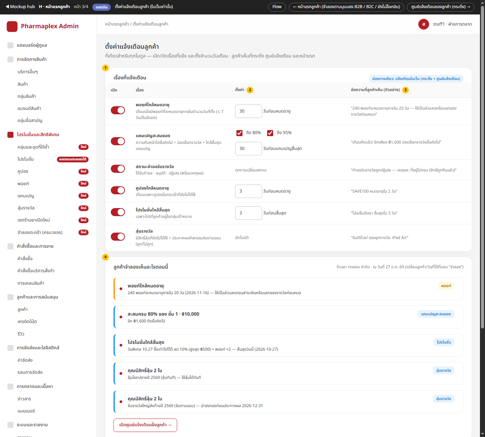

- ตารางเรื่องที่แจ้ง + สวิตช์ + ช่องตั้งจำนวนวัน + ตัวอย่างข้อความ · ส่วน “ลูกค้าจำลองเห็นอะไรตอนนี้” แสดงผลสดจากค่าที่ตั้ง

#### ลูกค้า · ศูนย์แจ้งเตือน

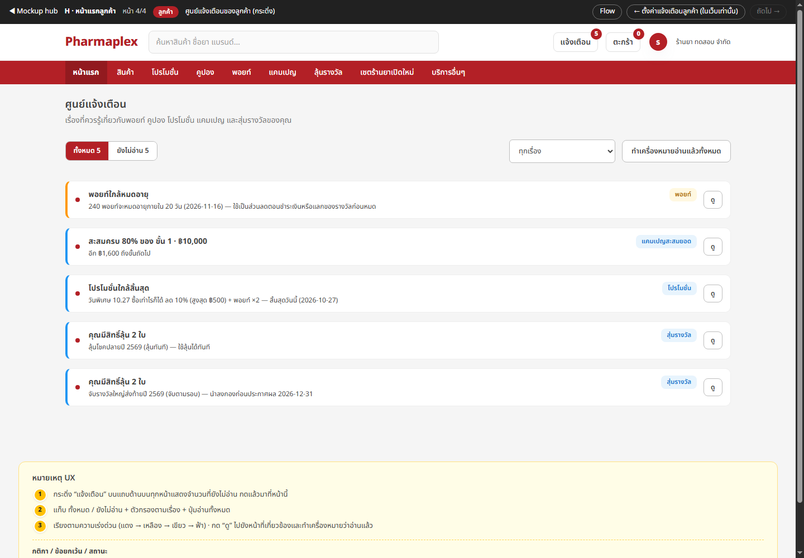

- แท็บ ทั้งหมด / ยังไม่อ่าน · ตัวกรองตามเรื่อง · อ่านทั้งหมด · เรียงตามความเร่งด่วน · กด “ดู” ไปหน้าที่เกี่ยวข้อง
- หน้าแรกลูกค้าแสดงการ์ดแจ้งเตือน 3 รายการล่าสุด

กติกา: แจ้งเตือนคำนวณจากสถานะปัจจุบัน เมื่อเงื่อนไขหายแจ้งเตือนหายเอง · อ่านแล้วจำรายรายการ

